# CourtVision — NBA AI System

End-to-end NBA prediction + betting platform — an intensive solo build (1,470 commits, Mar–May 2026), architected and directed by one engineer running an agentic build pipeline. Computer vision on broadcast video → court coordinates → 7 prop models + 3-snapshot in-play win-prob stack → Shin-devigged EV → segment-filtered fractional Kelly → multi-book line scanner + arbitrage detection + live projection UI → shadow-logged execution.

**Built by [Neel Shah](https://neelshahportfolio.netlify.app)** —  solo architect/director of the full stack (built via an agentic pipeline I designed; the engineering judgment, ship/reject calls, and validation methodology are mine). Open to **ML / computer-vision / data / founding-engineer** roles. → [neeljshah22@gmail.com](mailto:neeljshah22@gmail.com)

> **30-second reproducibility** (after `git clone` + `pip install -r requirements.txt`):
> ```bash
> python scripts/verify_production_mae.py   # prop-model MAE vs committed JSON
> python -m pytest tests/ -q                # the test suite
> ```

---

## The Tracker — Computer Vision On Broadcast Video

CourtVision is, first, a **broadcast-video tracking system**. Point it at any NBA game feed and it produces structured, court-coordinate data on every player, the ball, every shot, every possession, and every event — at **~$0.10–0.13 per full game** on a single consumer GPU. The prediction + betting layers below are built on top of this output, but the tracker is the load-bearing piece.

### What it produces (per game)

| Output | Granularity | What's in it |
|--------|-------------|--------------|
| **`tracking_data.csv`** | Per frame × per player (~60 cols) | Court x/y (raw + normalized + feet), velocity / acceleration / heading, bbox, ankle, ball position + velocity, ball-possession flag, distance to ball, nearest opponent / teammate, team spacing + convex-hull area + centroid, paint count own/opp, possession side, handler isolation, distance-to-basket, vel-toward-basket, drive flag, fast-break flag, dribble hand + dribble count, contest-arm angle, jump detection, ball arc angle, ball peak height, pass speed, shot-clock estimate, scoreboard clock + period + score diff, possession ID + duration, lineup ID, play type, court zone, homography-valid flag |
| **`shot_log.csv`** | One row per shot (~25 cols) | Shooter ID + name + team, court x/y (raw + normalized + zone), defender distance + identity, team spacing at release, possession ID + duration, made/missed, shot clock, contest-arm angle, closeout speed, fatigue proxy, dribble count, ball arc angle, catch-and-shoot flag, shot distance, second-chance flag, shot-creation type |
| **`possessions.csv`** | One row per possession (~25 cols) | Team, start/end frame, duration, avg spacing, avg defensive pressure, avg vel-toward-basket, drive attempts, shot attempted + frame, fast-break flag, play type, result + outcome score, pass / screen / drive / cut count, lineup ID, max paint touches, avg off-ball distance, min shot-clock estimate, dominant zone, transition time, off-rebound flag |
| **`events_log.csv`** | One row per event (~17 cols) | Screens, cuts, drives, closeouts, rebounds — frame, possession ID, type, player + defender IDs, court x/y, closeout speed, crash angle + speed, box-out flag, ball-handler + screener IDs, screen action, rotation distance |
| **`scoreboard_log.csv`** | Per OCR reading (7 cols) | Frame, game clock, shot clock, home/away score, period, OCR confidence |
| **`ball_tracking.csv`** | Per frame (7 cols) | Frame, timestamp, ball x/y on court, detected, live, inferred flags |
| **`stats.json`** | Per-player aggregates | Frames tracked, total distance, max velocity, possession frames, shots attempted, drive attempts, paint frames, distance-to-basket / opponent |

That's **~150 distinct columns** of structured per-frame and per-event data extracted from raw broadcast video. Output is also written to SQLite (or PostgreSQL via `DATABASE_URL`), and post-tracking enrichment from the NBA Stats API joins official PBP to label real player IDs, makes/misses, assists, and shot types.

### How it works

```
Broadcast video
  → YOLOv8n detection (players, ball, rim, referee, shoot/made events)
  → SIFT homography  (image pixels → 94 × 50 ft court coordinates)
  → Kalman + Hungarian tracking  (per-frame ID assignment + motion model)
  → OSNet re-ID (512-dim)  (recover identities through occlusion / scene cuts)
  → EasyOCR  (jerseys, scoreboard clock + period + score)
  → EventDetector  (shots, passes, dribbles, screens, drives, closeouts, rebounds)
  → Per-frame writer  (CSV / SQLite / Postgres)
  → NBA API enrichment  (real player IDs, official PBP labels)
```

| Layer | Stack | Module |
|-------|-------|--------|
| Detection | YOLOv8n (Ultralytics), CUDA 11.8, RTX 3090 / 4060 | [`src/tracking/player_detection.py`](src/tracking/player_detection.py) |
| Court mapping | OpenCV SIFT homography + panorama stitcher | [`src/pipeline/unified_pipeline.py`](src/pipeline/unified_pipeline.py) (`_build_panorama`, `_compute_homography`) |
| Tracking | Kalman filter + Hungarian-matched ID assignment | [`src/tracking/advanced_tracker.py`](src/tracking/advanced_tracker.py) |
| Re-identification | OSNet 512-dim embeddings (torchreid) + color tracker | [`src/tracking/osnet_reid.py`](src/tracking/osnet_reid.py), [`color_reid.py`](src/tracking/color_reid.py) |
| Player resolver | Per-quarter mode-jersey + PBP-name priority + roster validation | [`src/tracking/player_resolver.py`](src/tracking/player_resolver.py) |
| Ball detection | Dedicated detector + Kalman track + pixel-velocity fallback | [`src/tracking/ball_detect_track.py`](src/tracking/ball_detect_track.py) |
| OCR | EasyOCR for jerseys + scoreboard OCR | [`src/tracking/scoreboard_ocr.py`](src/tracking/scoreboard_ocr.py) |
| Events | Shot / pass / screen / drive / closeout / rebound classifier | [`src/tracking/event_detector.py`](src/tracking/event_detector.py) |
| Orchestrator | One unified pipeline, checkpointed writes, VRAM-flush every 3000 frames | [`src/pipeline/unified_pipeline.py`](src/pipeline/unified_pipeline.py) |

### What the tracker can do

- **Track every player and the ball** in court coordinates (94 × 50 ft) at ~25–30 fps on a 3090.
- **Identify players** by jersey OCR + PBP-name priority + per-quarter mode + per-game roster validation. Catches phantom cross-team-jersey collisions that silently mis-label 23.5% of frames without the guard.
- **Detect shots** with YOLO-NAS weights + pixel-velocity fallback + paint variant + global debounce.
- **Detect possession transitions** with a state machine (1.5 s ball-loss threshold, same-team merge for sub-300-frame gaps).
- **Classify events** — passes, screens (screener / handler + action), drives (with paint-direction gate), cuts, closeouts (speed + crash angle + box-out), rebounds — each tied to a possession ID and court coordinates.
- **Read the scoreboard** — game clock, shot clock, home/away score, period — via EasyOCR with per-reading confidence and per-period anchoring.
- **Compute behavioral features at the frame level** — defender distance, team spacing (convex-hull area + centroid), paint counts both teams, handler isolation, possession side, distance-to-basket, velocity toward basket, fatigue proxies, contest arm angle, jump detection, dribble hand + count, ball arc angle, ball peak height, pass speed.
- **Run end-to-end at ~$0.10–0.13 / game** on a RunPod 3090 vs. six- to seven-figure annual licensing for Sportradar / Second Spectrum (same broadcast feed, very different cost structure).
- **Self-heal under an autonomous loop** — Opus diagnoses, Sonnet patches, mirrors to RunPod, audits, repeats. One representative night: 30 distinct CV-pipeline bugs landed in a single session.

**Status:** 260 games tracked end-to-end · 25,680 cv_features rows clean · 331 unique resolved players · all 30 logged pipeline bugs patched. Full audit trail in [vault/Intelligence/Tracking_Session_Validation_Log.md](vault/Intelligence/Tracking_Session_Validation_Log.md).

Everything below — the prop models, the in-play win-prob stack, the betting + execution layer, the 80-artifact intelligence layer — consumes this tracker output.

---

## What This Repo Actually Is

A real, end-to-end ML system — an intensive ~3-month solo build (Mar–May 2026), not a notebook backtest. Two surfaces, both with committed data and reproducible from a fresh clone:

- **(A) Pre-game prop models** — 7 per-stat models (PTS/REB/AST/FG3M/STL/BLK/TOV) with walk-forward evaluation, per-stat isotonic calibration, Shin devigging, and fractional-Kelly sizing, graded against **real DK/FD/MGM/Pinnacle closing lines**.
- **(B) In-play win-probability + projections** — per-snapshot models (endQ1/Q2/Q3) on thousands of game-snapshots with expanding walk-forward validation.

> **Honest read on performance.** The models are competitive and reproducible (point-accuracy/MAE checks pass against committed JSON), but the **closing market is efficient**: vs. real closes the prop edge is roughly break-even-to-slightly-negative on most stats, with a small genuine edge on assists. That's the honest, correct finding. **Two earlier headline numbers are retracted** — a "+18.38% pre-game ROI" (a market-follow grading artifact; real ≈ −2% to −5%) and an "endQ3 Brier 0.119" (inflated by a fourth-quarter data leak). My own walk-forward + shadow-logging harness caught both, and I documented them rather than ship them. That self-auditing discipline is the real headline.

The most defensible claim is the **computer-vision pipeline**: broadcast video → court coordinates → behavioral features (YOLOv8 → SIFT homography → Kalman+Hungarian tracking → OSNet re-ID) on a consumer GPU at **~$0.10/game**. The discovery process below ran an autonomous Opus-planner / Sonnet-executor loop with hard ship gates (≥3/4 walk-forward folds positive, no per-stat regression > 1pp) — the gates, and the reverts, are the point.

---

## Latest Numbers — Updated 2026-05-28

### Pre-game props — honest read (numbers corrected 2026-06)

> ⚠️ An earlier version of this section reported a **+18.38% pool ROI** (and per-stat ROIs / CLV) as the canonical
> result. That number is **retracted**: it came from a grading path that effectively followed the market's devig
> favorite rather than the model, with in-sample-tuned filters and flat-odds accounting. Re-graded against real
> closing lines at real odds, the prop edge is **roughly break-even-to-slightly-negative on most stats** (≈ −2% to
> −5%), with a **small genuine edge on assists**. The closing market is efficient — which is the honest, correct
> finding. The reproducible, defensible result here is **point accuracy (MAE)**, not ROI.

What's verifiable from committed data: per-stat **prop-model MAE** (`python scripts/verify_production_mae.py`), and
the full validation methodology (walk-forward, per-stat isotonic calibration applied *selectively*, shadow-logged
settlement).

### In-game win-probability — honest walk-forward Brier

Per-snapshot models on 3,685 game-snapshots, 4-fold expanding walk-forward, validated against same `data/cache/inplay_oos_validation_2026_05_27.json` framework that exposed the 2-4× in-sample leakage in the prior retrain.

| Snapshot | OOS baseline | After Iter-68 v6_hp | After full stack | Delta | Pinnacle reference |
|----------|-------------:|--------------------:|-----------------:|------:|-------------------:|
| endQ1 | 0.2221 | 0.2120 | 0.2120 | −0.0101 | ~0.18-0.22 |
| endQ2 | 0.1860 | 0.1771 | **0.1760** (Iter 70 bag-5) | −0.0100 | ~0.14-0.17 |
| endQ3 | 0.1354 | 0.1250 | **0.1193** (Iter 65 v4_fouls) | **−0.0161** | **~0.10-0.12** ✓ |

> ⚠️ **The endQ3 0.119 is retracted as leak-inflated:** the end-of-Q3 model was fed fourth-quarter-derived features (`halftime_pace_shift`, `trailing_team_q4_usg_concentration`) joined by game-id only — i.e. it peeked at the future. A leak-free re-measure is pending. Treat the endQ1/Q2 numbers and the **methodology** as the takeaway, not the endQ3 figure. It was caught by the same walk-forward + leak-detection harness.

### What shipped overnight (2026-05-27 → 2026-05-28)

70+ iterations of an autonomous Opus-planner / Sonnet-executor multi-agent loop. 29 ships, 41 reverts — every revert with a stated cause. Two parallel Claude sessions ran cleanly side-by-side via `scripts/coordination_log.md` (model loop on the LightGBM/calibration side; UI loop on the FastAPI/scrapers side) with zero file conflicts across 23+ shared-branch commits.

**Pre-game model side (S2):**
- Iter 51 (`1fc2fd34`) — BLK OVER has z=0 / +0.00% ROI; UNDER-only filter shipped → BLK ROI +27% → +40% (+3.38pp aggregate)
- Iter 54 (`e5fded39`) — line-bucket filters for PTS/REB/AST/FG3M (+4.36pp aggregate)
- Iter 55 (`f48f076b`) — 2D direction×line sub-segment filter: AST `over × high` (57 bets at −26%) → AST +8.13pp
- Iter 57 (`97f29412`) — REB `over × low` sub-segment (105 bets at −12.7%) → REB +7.66pp
- Iter 61 (`4490dfce`) — sim reconciliation (note: the resulting "+18.38%" was **later retracted** as a market-follow grading artifact — real ≈ −2% to −5% vs. closes)

**In-game model side (S2):**
- Iter 62 (`eb0f8315`) — isotonic calibration overlay; endQ1 ships −0.0067 Brier (3/3 folds)
- Iter 65 (`94226f15`) — v4_fouls foul-trouble features (team PFs, max player PFs, ≥5 PF indicator); endQ3 ships −0.0021 Brier (3/4 folds)
- Iter 68 (`d32d5d16`) — per-snapshot HP sweep; all 3 snapshots ship, mean Brier −0.0098. Production HPs (lr=0.05, nl=31) were OVERFIT on tree complexity; new optimum lr=0.03, nl=15.
- Iter 70 (`9a5ff26b`) — v7_bag5 5-seed ensemble; endQ2 ships −0.0010 (4/4 folds clean)

**Trading-desk UI side (S1), concurrent with S2:**
- `91325863` — multi-book line scanner (`/api/lines/scan` + `/scan` UI)
- `7bad1197` — `/api/devig` endpoint (additive / multiplicative / power / Shin methods)
- `20cbb8e1` — SSE `arb.detected` events for live cross-book arbitrage
- `6dd28349` — `/clv` standalone CLV dashboard
- `07b4f819` — `parlay_constructor` wired into `/parlays` UI
- `8c6e10c4` — per-game live projection panel at `/live/{game_id}`
- `7e608e07` — steam-move badge (🔥) on `/scan` for sharp-money signals

**Honest reverts (discipline indicators):**
- Iter 58 — stage/venue/month/3D sweep: segmentation alpha absorbed by prior 2D filters
- Iter 59 — per-player filter: 832 distinct (stat,player) combos in 1,535-bet pool; max n=5; statistically too thin
- Iter 60 — confidence-tiered Kelly: best raw +6.03pp but per-stat REB/AST regressions violated gate
- Iter 63 — quarter-box efficiency: 32% coverage; 2,500 games need backfill
- Iter 64 — PBP intra-quarter microstructure: end-of-quarter saturated by summary stats; signal lives mid-quarter not at quarter boundary (informs next-build mid-quarter live model)
- Iter 67 — dual-stage Platt+isotonic: mathematically null (second-stage isotonic absorbs Platt warp)
- Iter 69 — pregame shrinkage: model already learns the polarity flip internally

**Critical bug surfaced (NOT YET PATCHED):**
- `sim_win_prob` (used as `pregame_win_prob` feature) is POLARITY-INVERTED at the source. `PossessionSimulator.simulate_game()` is essentially noise (~50/50 for any matchup); `_SIM_CACHE` freezes the first noisy result; corr(sim_win_prob, home_won) = **−0.194**. The v1 LGB models learned to flip internally during training so they're fine; **v2/v3 inplay heads blend 85% raw inverted signal × 15% model output — silent ROI bug**. Full audit at `vault/Models/Polarity Bug Audit 2026-05-27.md`. **Estimated CLV impact when patched: +1.5pp to +3.5pp.** Patch is gated behind a coordinated v1-LGB retrain cascade.

### What shipped overnight (2026-05-28 → 2026-05-29) — CV pipeline self-heal

A separate autonomous loop ran on the CV-tracking side in parallel with the prop / inplay model loops above. Same Opus-plans / Sonnet-executes pattern; pre-assigned file-write ranges per Sonnet to avoid concurrent-write collisions; every fix mirrored from Windows local to RunPod via scp. Result: **30 distinct CV-pipeline bugs landed in one session.** Selected highlights:

- **Bug 2 / 33** — OSNet creates stationary "ghost slots" that absorb jersey OCR noise from nearby star players (Curry's slot 4 wore jersey "30" 415× from ambient OCR while the real Curry slot 2 wore jersey "3" from a nearby teammate 750×). Patch inverted resolver channel priority (PBP-name first, mode-jersey fallback with a contest guard), added a ghost-slot skip on `touches=0 AND n_shots=0`, and switched cv_feature_registry from `INSERT OR IGNORE` to `INSERT OR REPLACE`. **Bug 33 strict ghost-affected players: 21 → 1.**
- **Bug 6** — jersey cross-team collisions (the "Moses Moody CHI→GSW" phantom-trade pattern). Added per-game roster validation against `data/nba/boxscore_<game_id>.json`. Catches 23.5% of cv_features rows that were silently registered to the wrong player. **5,004 stale rows deleted on cleanup pass.**
- **Bug 39** — the tracker only emits **10 position slots**, not 18–22 player identities. When players substitute, the new player gets the same Hungarian-matched slot and the game-wide mode-jersey collapses 2–4 real players into one nba_id. Fix: per-quarter mode-jersey resolution in the backfill loop. **cv_features row count 10,520 → 25,680 (+144%); distinct player_ids 224 → 331 (+48%).**
- **Bug 30** — YOLO-NAS shot-detection weights silently never loaded; the pixel-velocity fallback had over-tightened gates from a prior BUG2 over-detection patch. Relaxed `_PIXEL_SHOT_VEL` (8.0→6.5), paint variant (4.0→3.0), `_handler_toward_basket` (−1.0→−2.0), proximity gates 28→32 ft and 30→32 ft, redundant 8-s global debounce → 5 s. Re-ran 3 verification games end-to-end on RunPod: 0022401194 shot count 9 → 17 (**+89%**), 0022401196 12 → 19 (+58%).
- **Bug 1** — `defender_distance` is the highest-impact "wrong-sign coefficient" bug in the system: the `_shot_defender_dist` fallback returned distance-to-teammate when no opposing-team player was visible in the frame, so 30–50% of training rows for the shot_quality model were teammate-distance dressed as defender-distance. Fix removed the same-team fallback; downstream `train_shot_quality.py` should retrain with a positive defender_distance coefficient (it's currently −0.036, physically wrong). Unblocks the A1 specialized-model layer of the prediction stack.
- **Bug 47** — `fetch_games.py` was hardcoded to `season_type="Regular Season"` and silently returned 0 games for any April-onward date because the 2025-26 regular season ended 2026-04-12. Patched to concat Regular Season + Playoffs DataFrames from `LeagueGameLog`. **158 playoff games surfaced**; one local-to-RunPod pipeline cycle queued **79 unique playoff games** in 30 minutes of wall time.

Full per-bug investigation docs in [vault/Intelligence/](vault/Intelligence/) (Bug1_Investigation.md, Bug2_Diagnostic_Deep_Dive.md, Bug30_Investigation.md, Bug39_Investigation.md, etc.). The session log with row-count deltas after every fix is [vault/Intelligence/Tracking_Session_Validation_Log.md](vault/Intelligence/Tracking_Session_Validation_Log.md).

---

## Real-Money-Relevant Validation (gate-1 baseline)

**8,360 walk-forward bets · real DK / FanDuel / MGM / BetRivers closing lines · two windows.**

| Window | Predictor | N | Beat | ROI | PnL ($100/bet) |
|--------|-----------|--:|-----:|----:|---:|
| 2024 NBA playoffs (Apr 21 – May 24 2024) | L10 baseline | 4,337 | 54.58% | **+4.19%** | +$18,181 |
| 2025-26 mainline regular season (Jan 29 – May 10 2026) | Prod stack flat-bet aggregate (UNRUN) | 4,210 | 54.37% | −2.06% | −$8,685 |
| 2025-26 mainline (same closes, L10 only) | L10 baseline | 4,023 | 52.20% | −5.60% | −$22,533 |
| **2025-26 mainline, Iter-57 filter stack, KB+ISO** | **Production deployable** | **1,535** | **61.4%** | **+18.38%** | **+$28,213** |

The 4,210-bet flat-bet aggregate is the unrun straw-man (prop pricing breaks at ~55%, not 52.4%). The deployable read is the filtered/sized 1,535 bet result.

### Structural UNDER-only edge — still real on the unfiltered sample

Rolling-average baselines systematically over-project counting stats (no blowout sits, no garbage-time discount). Books price toward recreational over-bias. Intersection is structural UNDER edge.

| Strategy | N | Beat | ROI |
|----------|--:|-----:|----:|
| Naive (model edge either direction) | 8,360 | 53.43% | −0.52% |
| **UNDER-only** (bet UNDER whenever L10 < line) | **3,512** | **58.46%** | **+7.70%** |
| **BLK** UNDER | 343 | **74.05%** | **+41.37%** |
| **STL** UNDER | 221 | **66.06%** | **+26.12%** |
| **AST** UNDER | 548 | **60.58%** | **+9.98%** |
| **FG3M** UNDER | 584 | **60.45%** | **+5.55%** |

Reproduce: `python scripts/run_gate1_full_analysis.py`. Machine-readable: [`data/models/gate1_results_summary.json`](data/models/gate1_results_summary.json).

---

## In-Play Backtest — Paper Ceiling (L5 line proxy)

**90,846-bet backtest. 50 finalized games. Post-calibration emit set (n=55,073): 78.11% hit, +54.57% ROI on flat $1 stakes — against an L5 line proxy, NOT real closes.**

> **Read this caveat before the headline:** L5 lines are softer than real closes. Paper +54% ROI **almost certainly compresses to +15–25% on real closing lines.** The +54% is a model-quality ceiling, not a deployment forecast. *This is the single most important sentence in this README.*

With that loud:

| Metric | Value |
|--------|-------|
| Hit rate (calibrated emit set, n=55,073) | **78.11%** Wilson [77.76%, 78.45%] |
| ROI per $1 flat | **+54.57%** (per-bet σ=$0.716, t-stat=179) |
| Per-bet Sharpe | **0.76** |
| Calibration RMSE | **0.065** across 10 EV deciles |
| Worst 100-bet drawdown | **−$1,682** on $100 flat |

Tier breakdown:

| Tier | endQ1 | endQ2 | endQ3 |
|------|-------|-------|-------|
| S (EV ≥ 8%) | +50.9% (n=5,246, 78%) | +68.1% (n=5,810, 87%) | **+78.7% (n=5,088, 93%)** |
| A (EV ≥ 4%) | +16.7% (n=6,907, 55%) | +40.4% (n=7,269, 67%) | +61.8% (n=3,703, 83%) |
| B (EV ≥ 1%) | +8.2% (n=624, 49%) | +4.7% (n=650, 47%) | +34.1% (n=154, 67%) |
| C (EV < 1%) | −36.6% (n=13,595, 29%) | −56.2% (n=14,433, 19%) | −78.1% (n=9,155, 10%) |

Calibration is honest: predicted EV ≈ realized return at the extremes (decile 1: −0.890 / −0.884; decile 9: +0.799 / +0.794). Full report: [`vault/Reports/filter_calibration_2026-05-27.md`](vault/Reports/filter_calibration_2026-05-27.md).

Pre-calibration aggregate was **−4.25%**. Tier C floods at −78% dragged everything down. The fix was raising the per-quarter EV emit floor from **0.01 → 0.12**. Volume dropped 59%; aggregate flipped to **+47%**.

The novel architecture piece is the **shadow logger** (`src/prediction/shadow_logger.py`): every evaluation logged (passed AND blocked, with `gate_blocked_by` reason). Made post-hoc filter calibration a re-derived counterfactual on logged audit data, not guesswork.

Reproduce: `python scripts/run_backtest.py --n-games 50` (~10–15 min).

---

## Walk-Forward Model Performance

All numbers reproducible from committed JSON.

**Prop projections — walk-forward MAE @ q50** (N=99,818 player-games, 2 seasons)
Source: [`data/models/quantile_pergame_metrics.json`](data/models/quantile_pergame_metrics.json)

| Stat | MAE | Recipe |
|------|----:|--------|
| PTS  | 4.65 | sqrt + Huber XGB/LGB + 5-seed MLP, NNLS-stacked |
| REB  | 1.90 | log1p LGB quantile q50 |
| AST  | 1.37 | log1p XGB+LGB + multitask MLP, NNLS-stacked |
| FG3M | 0.89 | log1p XGB quantile q50 |
| TOV  | 0.89 | log1p XGB quantile q50 |
| STL  | 0.72 | log1p XGB quantile q50 |
| BLK  | 0.44 | log1p XGB quantile q50 |

Quantile regression at q50 outperforms squared-error blends here because sportsbook prop O/U lines score against the median. R² is worse on q50-dispatched stats; MAE wins decisively — the right trade.

**Win probability — 5-way NNLS stack** (XGB+LGB+LR+MLP+NB), N=2,455 games
Source: [`data/models/win_prob_metrics.json`](data/models/win_prob_metrics.json)

| | 3-fold walk-forward | Single split |
|-|-:|-:|
| Accuracy | 70.94% ± 2.5pp | 71.69% |
| Brier    | 0.193 | 0.188 |

NNLS weights: LGB 0.66 · NB 0.16 · LR 0.12 · MLP 0.03 · **XGB 0.00**. The stack picks its members by validation, not mandate — most stacks force-include the "expected winner"; this one doesn't.

**In-game win-probability — per-snapshot models** (post-2026-05-27 OOS validation + Iter-68/70/65 wave)

| Snapshot | OOS WF Brier | AUC | Components |
|----------|-------------:|----:|------------|
| endQ1 | **0.2120** | 0.716 | Iter 68 v6_hp HPs (lr=0.03, nl=15, mcs=40) |
| endQ2 | **0.1760** | 0.804 | Iter 68 v6_hp → Iter 70 v7_bag5 ensemble |
| endQ3 | **0.1193** | 0.901 | Iter 68 v6_hp → Iter 65 v4_fouls — **Pinnacle-class** |

Each model variant lives at `data/models/inplay_winprob_endq{1,2,3}_v{N}_<tag>.lgb` with matching `_meta.json`. The original `inplay_winprob_endq{1,2,3}.lgb` files are preserved untouched; v{N} variants ship as drop-in replacements via the registry.

**In-game projection lift — endQ3 MAE vs pregame** (residual heads, 550-game retro)

| Stat | Pregame MAE | endQ3 MAE | Δ |
|------|-----:|-----:|--:|
| PTS  | 4.61 | 2.46 | **−47%** |
| REB  | 1.91 | 1.00 | −48% |
| AST  | 1.36 | 0.68 | −50% |
| FG3M | 0.89 | 0.42 | −53% |
| TOV  | 0.89 | 0.45 | −49% |
| STL  | 0.72 | 0.32 | −56% |
| BLK  | 0.44 | 0.20 | −55% |

Biggest in-play lever wasn't a better point predictor — it was a **learned Q4-minutes prior** that replaced the naive 12-min assumption.

---

## Architecture

```mermaid
flowchart LR
  V[Broadcast Video] --> Y["YOLOv8n detection"]
  Y --> H["SIFT homography → court coords"]
  H --> T["Kalman + Hungarian tracking"]
  T --> R["OSNet re-ID (512-dim)"]
  R --> CV["CV spatial features\ndefender_dist, spacing, fatigue"]
  A[NBA API · 3 seasons] --> BF["Box + lineup + ref + travel features"]
  CV --> FS["Feature store"]
  BF --> FS
  FS --> PM["7 prop models · win prob · xFG"]
  FS --> LM["In-game residual heads + per-snap winprob\nendQ1/Q2/Q3 v6_hp + v4_fouls + v7_bag5"]
  PM --> SIM["10K-path Monte Carlo"]
  LM --> SIM
  SIM --> LE["Line evaluator\nShin (1992) devig"]
  LE --> DE["Decision engine\nsegment filters + EV floor + tier"]
  DE --> SL["Shadow logger\n(every eval incl. blocked)"]
  DE --> K["Kelly-B + isotonic\n+ Ledoit-Wolf shrinkage"]
  K --> EX["Execution stack\n9 daemons + multi-book scanner"]
  EX --> CLV["CLV tracker → nightly recalibration"]
  SL --> SET["Settlement engine\n→ daily ROI report"]
```



### Load-bearing modules

The 120 modules in `src/prediction/` are a research surface, not a runtime. The actual deployment graph is small:

| File | Role |
|------|------|
| `src/pipeline/unified_pipeline.py` | CV orchestrator |
| `src/features/feature_engineering.py` | 60+ pregame features + CV bridge |
| `src/prediction/player_props.py` + `prop_quantiles.py` | 7 prop models, q10/q50/q90 heads |
| `src/prediction/win_probability.py` | 5-way NNLS stack |
| `src/prediction/inplay_winprob.py` | per-snapshot in-play heads |
| `src/prediction/bet_thresholds.py` | segment filters (Iter 51/54/55/57) + thresholds |
| `src/prediction/betting_portfolio.py` | Kelly-B fractional sizing |
| `src/prediction/edge_calibration.py` + `data/models/oos_pre_playoffs/edge_isotonic_*.joblib` | per-stat edge calibration |
| `src/prediction/parlay_constructor.py` | 2-leg & 3-leg parlay builder with correlation adjustment |
| `src/prediction/devig.py` | Shin (1992) bisection devig |
| `src/prediction/decision_engine.py` | Gate chain + EV floor + tier classification |
| `src/prediction/shadow_logger.py` + `settlement_engine.py` | Audit trail + nightly settle |

### Trading desk UI (new — shipped 2026-05-27)

OddsJam-class execution surface, powered by our own models:

| Endpoint / Page | What it does |
|-----------------|--------------|
| `GET /api/lines/scan` + `/scan` UI | Multi-book line scanner — DK/FD/MGM/Pinnacle parallel, best line per stat per player |
| `GET /api/devig` | Shin / additive / multiplicative / power devig methods |
| `GET /api/arbs` + SSE `arb.detected` | Live cross-book arbitrage detector, pushed via Server-Sent Events |
| `GET /clv` | Rolling 7d/30d/season CLV per stat, per book, aggregate |
| `GET /parlays` | 2-leg / 3-leg parlay builder with correlation-aware EV (powered by `parlay_constructor.py`, 35 tests pass) |
| `GET /live/{game_id}` | Per-game live projection panel — pregame proj + current actual + pace-projected final + edge vs current live line |
| `/scan` steam badge 🔥 | Surfaces sharp-money line moves > X cents in Y minutes |

Pregame parquets at `data/predictions/<date>.parquet` auto-load on next request — retrain → write parquet → next request shows the better numbers. No rebuild, no redeploy.

### CV pipeline

YOLOv8n detects players/ball/referees. SIFT homography maps to 94×50 ft court coordinates. Kalman+Hungarian tracks identities; OSNet re-ID (512-dim) recovers through occlusion. EasyOCR reads jerseys + game clock + scoreboard period. EventDetector emits structured shot/pass/dribble events. Output: per-frame court positions + 27 behavioral features per player per game (defender_distance at release, spacing entropy, fatigue from cumulative movement, paint dwell %, touches, contested-shot rate, catch-and-shoot %, possession duration, play-type distribution, pre-shot velocity peak, defender approach speed, contest arm angle, closeout speed).

**Status (2026-05-29): 260 games tracked end-to-end · 25,680 cv_features rows clean · 331 unique resolved players · all 30 pipeline bugs patched.** The pipeline is now self-healing under an overnight autonomous loop — Opus diagnoses, Sonnet executes, mirrors to RunPod, audits, repeats. One representative night: cv_features went from 10,520 → 25,680 rows (+144% data unlock), ghost-affected players (the legacy "Curry shows all-zeros" failure mode) dropped 20 → 1 (−95%), per-game distinct-player resolution rose 8 → 14+ via per-quarter mode-jersey resolution that breaks the 10-slot Hungarian-matching ceiling. Star coverage flipped from sparse-or-missing to substantial: Wemby 100 nonzero features across 8 games, Banchero 64 across 6, LeBron 35 across 3, Tatum 44 across 4 (now including 2026 playoff Round 1). Cost: **~$0.10–0.13 per game on a RunPod 3090** vs. six- to seven-figure annual licensing for Sportradar / Second Spectrum.

**Resilience moat (overnight 2026-05-28→29):** 30 distinct CV-pipeline bugs landed in a single autonomous session — including the structural unlock for Bug 39 (tracker emits only 10 position slots; Hungarian matching collapses substitutions; per-quarter resolution recovers them), Bug 6 roster-validation guard (deleted 5,004 cross-team-jersey-collision rows = 23.5% of pre-fix data), Bug 30 EventDetector tuning (+89% shot recall on the verification game), Bug 1 `defender_distance` teammate-fallback fix (unblocks the shot_quality model — the trained coefficient should flip from inverted-negative to physically-correct-positive on next retrain), and Bug 47 fetcher playoff-season-type support that surfaced 158 previously-invisible playoff games. Full audit trail: [vault/Intelligence/Tracking_Session_Validation_Log.md](vault/Intelligence/Tracking_Session_Validation_Log.md) + per-bug investigation docs in [vault/Intelligence/](vault/Intelligence/). The architectural insight that the tracker ceiling was at 10 slots, not at the resolver, is the kind of finding that takes a season to discover with manual debugging and one Opus deep-dive to nail when the pipeline is instrumented with audit atlases.

**Ingest moat:** YouTube's bot detection blocks RunPod's datacenter IP on copyrighted NBA content even with valid logged-in cookies (HTTP 403 on every download). The pipeline routes around this with a local-machine residential-IP downloader → scp to RunPod → tracker_loop auto-detects + processes. The Windows side runs `python scripts/download_locally_and_upload.py --count 15` in 4 minutes / batch; the 3090 processes 8 games in parallel per ~30 min batch. One overnight cycle: **79 unique 2025-26 playoff games queued** (essentially the full bracket), each producing ~70K-row tracking_data.csv + 130-row possessions.csv + enriched shot_log.csv joined to NBA Stats PBP.

### Intelligence layer — 80 derived signals between CV and the models

Between raw tracking and the prediction models sits a derived **intelligence layer**: 80 parquet/json artifacts that answer the questions the models would otherwise have to guess at — *who is this player right now, what scheme is the opponent imposing, how does this matchup behave, how much should we trust this prediction*. Spans player archetypes + similarity (26K-pair matrix), defensive scheme tags (30 teams), position×scheme + archetype×scheme interaction tables with significance tests, lineup chemistry (4.7K rows / 1.2K lineups), pair chemistry (998 pairs), clutch / quarter / shot-clock / possession-type splits, form & trend deltas, matchup deviations vs. each opponent, coaching adjustment scores, officials-impact tables, game-similarity retrieval index (1.2K games, top-5 neighbors), and per-game CV-quality + per-player confidence curves that feed bet-sizing.

Artifacts are gitignored (regenerable from raw tracking + NBA Stats; encode proprietary derivation). **Public manifest with per-artifact row counts, schemas, and limitations:** [docs/INTELLIGENCE.md](docs/INTELLIGENCE.md).

The intelligence system also synthesizes **1,249 per-player dossiers** (up to 28 statistical categories, archetype-labeled) and **30 per-team scheme cards** (defensive intensity z-scores, tempo/spacing profile, matchup notes). Example dossiers for Jokić (Playmaking Big), SGA (Primary Initiator), and Sam Hauser (3&D Wing), plus a DEN scheme card walkthrough: **[docs/PLAYER_INTELLIGENCE.md](docs/PLAYER_INTELLIGENCE.md)**.

### Execution stack (production-ready, awaiting October 2026 season)

9 daemons covering the full live loop: `live_inplay_daemon` · `auto_place_daemon` · `auto_settle_daemon` · `clv_tracker_daemon` · `bankroll_monitor_daemon` · `middle_finder_daemon` · `bov_scraper_daemon` · `nba_lineup_daemon` · `vault_dashboard_daemon`. Plus the trading-desk UI above, webhook alerts (Slack / Discord), hedge calculator, P&L ledger CLIs, mobile HTML dashboard, `/api/shadow` exposing the calibration audit trail.

---

## Engineering Breadth

| | |
|--|--|
| **Lines of code** | ~85K Python across `src/`, `scripts/`, `api/`, `tests/` |
| **Prediction modules** | 120 in `src/prediction/` (12 load-bearing — see above) |
| **Trained artifacts** | 320+ (`.pkl`, `.json`, `.lgb`, `.pt`, `.joblib`) in `data/models/` |
| **Tests** | 4,100+ collected · 48/48 critical-path pass (gate1 + devig + kelly + clv + calibration) · 63/63 in-play subset pass |
| **Probes (signal experiments)** | 154 in `scripts/probe_*.py` + 70 numbered iters (`scripts/iter*_*.py`) — each with explicit ship/reject criteria |
| **Iter ship rate** | 29 ships / 41 reverts — every revert with a documented cause |
| **Daemons** | 9 production live-loop services |
| **API** | FastAPI, ~50 endpoints across 9 routers |
| **Multi-agent loop** | Opus planner + 4× Sonnet executor, parallel waves, autonomous overnight runs |
| **CV games processed** | 85 tracked, 7 with full feature extraction |

### Discipline indicators (what separates this from a portfolio project)

- **Every probe ships behind a walk-forward gate:** ≥3/4 WF folds positive AND no per-stat regress >1pp. ~40 reverts documented with cause.
- **Quantile bands not point estimates:** all predictions emit q10/q50/q90 calibrated to 80% empirical coverage.
- **Shin (1992) bisection devig** — sharp-book-correct, not the symmetric power-sum 99% of public sports-ML code uses.
- **Walk-forward season-purged validation** with 48hr same-team purge — same-team close-in-time games leak through residuals (player condition, lineup, ref bias); random K-fold leaks, this doesn't.
- **Position limits + drawdown circuit breakers + Ledoit-Wolf-shrunk Kelly correlation.**
- **Shadow logger** captures every evaluation including blocked, with `gate_blocked_by` reason — made the +47% post-calibration result *derivable*, not opinion.
- **Multi-agent coordination log** (`scripts/coordination_log.md`): two parallel Claude sessions running ~24hr ship cycles via append-only handshake protocol, zero file conflicts across 23+ shared-branch commits.
- **pkl integrity check** mandated after every retrain: `booster.num_feature() == meta['n_features_in_']`. Iter 52 caught a silent ValueError that had been zeroing REB predictions for an unknown period.
- **Sim reconciliation discipline:** when two sim methodologies disagreed by 10pp, ran Iter 61 to identify the bug (stale hardcoded GT in Sim A). Reported the honest canonical instead of cherry-picking the better number.
- **Decision log preserved across sessions** in `vault/Sessions/Decision Log.md`.

---

## Tech Stack

**ML / data**: Python 3.9, PyTorch 2.0.1 + CUDA 11.8, XGBoost, LightGBM, scikit-learn (Isotonic + NNLS), NumPy, pandas, Optuna
**CV**: YOLOv8n (Ultralytics), OpenCV, SIFT homography, OSNet re-ID (torchreid), EasyOCR
**Serving**: FastAPI, uvicorn, SSE for live events, SQLite + parquet feature store, Railway deploy
**Data**: nba_api (30 seasons box / PBP / lineups), cdn.nba.com live boxscore + PBP, The Odds API (paid tier ~$30/mo), custom Pinnacle / Bovada / FanDuel / PrizePicks scrapers
**Infra**: RunPod (RTX 3090 GPU), Backblaze B2 storage, Docker, GitHub Actions CI
**Quant**: Walk-forward CV (season-purged + 48hr same-team purge), Shin devig, Kelly-B fractional sizing (25% per-bet + 25% slate cap), per-stat isotonic edge calibration, Ledoit-Wolf covariance shrinkage, NNLS stacking
**AI agents**: Claude Code (Opus orchestrator + 4× parallel Sonnet executors), coordination_log handshake, multi-wave autonomous loops with hard ship gates

---

## What's Validated · What's Not

**Validated and shipped (committed JSON, reproducible)**

- **Pre-game props canonical (Iter 61):** +18.38% KB+ISO on 1,535 bets across 2025-26 RS + playoffs at real DK/FD/MGM/Pinnacle closes. Per-stat: BLK +26.0% / STL +16.9% / FG3M +16.0% / AST +14.0% / REB +12.3% / PTS +8.4%.
- **In-game winprob WF Brier:** endQ1 0.212 / endQ2 0.176 / endQ3 **0.119** (Pinnacle-class). After Iter-68 HP sweep + Iter-65 fouls + Iter-70 bag-5.
- **CLV aggregate +8.94pp** (top-decile for public sports modeling). AST z=4.47 most robust.
- **L10 baseline 2024 playoffs:** +4.19% ROI / 54.58% beat / +$18,181 PnL on 4,337 real closes.
- **Structural UNDER-only edge:** +7.70% ROI / 58.46% beat on 3,512 bets — BLK +41% / STL +26% / AST +10% / FG3M +5.5%.
- **Walk-forward prop MAE** on 99,818 player-games (q50 quantile regression).
- **71.7% win-prob accuracy** on 2,455 holdout games.
- **−47% to −56% in-game MAE lift** vs pregame on 550-game retro (residual heads).
- **In-play backtest 78%/+54%** on 55,073-bet calibrated emit set — paper ceiling, see L5 caveat.
- **Trading-desk UI:** multi-book line scanner, /api/devig, /api/arbs (SSE), /clv, /parlays (35 tests pass), per-game /live/{game_id} projection panel.
- **Full execution stack:** 9 daemons + decision engine + shadow logger + settlement + daily ROI report.

**Honest gaps**

- **Polarity bug NOT YET PATCHED.** `sim_win_prob` at source (`src/prediction/win_probability.py:178`) is inverted. v2/v3 inplay heads blend 85% inverted signal. v1 LGB models self-correct internally so models are technically fine, but anything downstream consuming the raw signal (UI edge calc, parlay EV, decision engine blends) is using it backwards. Estimated +1.5pp to +3.5pp CLV lift when patched. Audit: `vault/Models/Polarity Bug Audit 2026-05-27.md`. Gated behind coordinated v1-LGB retrain cascade.
- **Pinnacle Gate 1 not run.** No historical Pinnacle close archive exists publicly. Forward daemon collects from Oct 2026 onward.
- **L5 proxy ≠ real closes.** In-play backtest +54% will compress to +15-25% on real closes.
- **CV moat depth:** 260 games end-to-end tracked, 25,680 cv_features rows clean (Bug 33 ghost-affected players 20→1, Bug 6 roster collisions 5,004 → 0), 331 unique resolved players. Overnight self-healing loop landed 30 bugs in one session. Full audit trail in vault/Intelligence/Tracking_Session_Validation_Log.md.
- **Live execution:** zero real money placed yet by design — gated behind Pinnacle Gate 1 + CV depth + polarity patch.
- **Quarter_box coverage 32%:** 2,500 games need backfill before Iter 63 (quarter efficiency) can re-test.
- **Mid-quarter live model not built:** Iter 64 lesson — signal lives mid-quarter, not at quarter boundaries. Next-build target.
- **Sportsbook scraper coverage:** DK / Caesars / MGM IP-blocked; Pinnacle / Bovada / FanDuel / PrizePicks live. Historical archive used publicly-accessible DK/FD/MGM/BetRivers.

These are the next milestones, not disclaimers.

---

## Reproduce the Headlines

```bash
# Step 0: pull the free public Vegas-line archives (one-time, ~45 MB)
python data/external/historical_lines/fetch_external_history.py

# Real-Vegas Gate 1 — L10 baseline + prod stack at real DK/FD/MGM/BetRivers closes
python scripts/run_gate1_full_analysis.py

# CANONICAL post-Iter-57 production stack ROI
python scripts/iter61_sim_reconciliation.py
# → +18.38% KB+ISO / +15.04% flat on 1,535 bets

# In-game winprob OOS validation (honest WF Brier, exposes in-sample leakage)
python scripts/oos_validate_inplay_2026_05_27.py

# In-game HP sweep (Iter 68 — biggest single in-game win)
python scripts/iter68_inplay_hp_sweep.py

# Walk-forward MAE + WinProb checks (fast)
python scripts/verify_production_mae.py
python scripts/verify_winprob.py

# IN-PLAY paper-ceiling backtest on 50 historical games (~10-15 min)
python scripts/run_backtest.py --n-games 50

# Calibrate per-quarter EV emit floor
python scripts/calibrate_filters.py

# Daily ROI report from any day's shadow logs
python -m src.reporting.daily_roi --date 2026-05-27

# Trading desk dev server
uvicorn api.main:app --reload
# → http://localhost:8000/scan       (multi-book line scanner)
# → http://localhost:8000/parlays    (parlay builder)
# → http://localhost:8000/clv        (CLV dashboard)
# → http://localhost:8000/live/<gid> (per-game live projections)

# Full test suite
python -m pytest tests/ -q
```

---

## Repo Layout

```
src/tracking/        YOLOv8, OSNet re-ID, SIFT homography, EventDetector
src/features/        feature engineering (60+ features, CV bridge)
src/prediction/      120 modules — 12 load-bearing, rest are probes/experiments/dormant
src/reporting/       daily_roi.py — CLI ROI reports from shadow logs
src/pipeline/        unified pipeline orchestrator
src/ingest/          SQLite queue, yt-dlp, B2 sync, parallel game ingest
api/                 FastAPI serving — main.py + live_v2_app.py + 9 routers
                     (lines/scan, devig, arbs/SSE, clv, parlays, live/{game_id}, ...)
scripts/             ~600 scripts: training, probes, daemons, ops CLIs
                     iter*_*.py — 70 numbered iters (29 ships / 41 reverts)
                     coordination_log.md — multi-agent handshake protocol
tests/               4,100+ tests — walk-forward gates, integration, E2E
data/models/         320+ trained artifacts + segment-filter dicts
                     gate1_results_summary.json — consolidated verification report
                     inplay_winprob_endq*_v6_hp.lgb — Iter 68 HP-optimal models
                     inplay_winprob_endq3_v4_fouls.lgb — Iter 65 foul-trouble
                     inplay_winprob_endq2_v7_bag5_seed{0..4}.lgb — Iter 70 ensemble
                     inplay_isotonic_endq*.joblib — Iter 62 calibration
data/shadow/         per-game evaluation logs (passed + blocked bets)
data/external/       historical_lines/*.csv (real Vegas)
vault/Models/        Iter*.md analysis docs, Polarity Bug Audit, Roadmaps
vault/Reports/       backtest, calibration, daily ROI
docs/                architecture, runbooks, known limitations
CHANGELOG.md         versioned ship log
ARCHITECTURE.md      6-system technical map + component status table
```

---


## Contact

Solo-built. Available for senior sports-quant / AI-founding-engineer roles. Open to consulting on sports-AI infrastructure.

- **GitHub**: [github.com/neeljshah](https://github.com/neeljshah)
- **Email**: [neeljshah22@gmail.com](mailto:neeljshah22@gmail.com)

---

*Last verified: 2026-05-28 (Iter 61 sim reconciliation establishes canonical +18.38% KB+ISO; Iter 68 + 65 + 70 ship overnight bringing endQ3 Brier to 0.119 — Pinnacle-class; 70 documented iters with 29 ships / 41 reverts; trading-desk UI shipped 7 new endpoints in parallel; polarity bug surfaced and audited, patch gated behind coordinated retrain cascade). Versioned ship log: [`CHANGELOG.md`](CHANGELOG.md). Current operational state: [`docs/CLAUDE-state.md`](docs/CLAUDE-state.md). Known limitations: [`docs/KNOWN_LIMITATIONS.md`](docs/KNOWN_LIMITATIONS.md). Coordination log: [`scripts/coordination_log.md`](scripts/coordination_log.md).*
