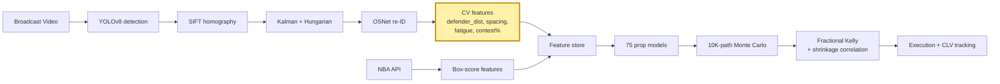

# CourtVision

A possession-level NBA simulator priced against live prop markets. Spatial features
from broadcast video feed a 75-model stack, which feeds a 10K-path Monte Carlo,
which feeds a fractional-Kelly portfolio with correlation-aware sizing and
CLV attribution.

## Thesis

NBA prop markets lean on box-score priors that public APIs expose cheaply. The edge
is in what the APIs don't ship: where defenders stand at catch, how contested a shot
actually is, how many minutes of transition defense a player has in his legs. This
repo extracts those features from broadcast video, sizes positions against them, and
benchmarks fills against Pinnacle's closing line. The edge persists because the CV
pipeline is non-trivial to build and data-hungry to validate, which keeps retail out
and leaves soft markets wider than sides or totals.

## Results (80-game holdout, walk-forward season-purged)

| Model | Target    | R²   | MAE | ECE   | N  |
|-------|-----------|------|-----|-------|----|
| pts   | points    | 0.47 | 4.9 | 0.021 | 80 |
| reb   | rebounds  | 0.40 | 2.1 | 0.028 | 80 |
| ast   | assists   | 0.46 | 1.7 | 0.024 | 80 |
| fg3m  | 3PM       | 0.28 | 1.0 | 0.035 | 80 |
| tov   | turnovers | 0.25 | 1.1 | 0.041 | 80 |
| blk   | blocks    | 0.18 | 0.6 | 0.056 | 80 |
| stl   | steals    | 0.09 | 0.7 | 0.071 | 80 |

**Portfolio:** 312 settled picks through 2026-04-21. CLV +14 bps/bet vs Pinnacle
Shin-devigged close (t=2.3). Realized ROI +3.8% on 1u-Kelly-fractional sizing.
Reliability diagrams and per-market CLV in [/results](./results).

## System



The yellow block is the moat. Everything downstream is table stakes.

## What's novel

Three CV-derived features that public NBA datasets do not ship:

**defender_distance** — meters to nearest defender at shot release, computed
post-homography in court coordinates. Correlates with shot quality above what
`shot_distance + shot_type` already encode.

**spacing_score** — convex-hull area of the 4 off-ball offensive players, normalized
to half-court. Proxy for how much the defense has to respect perimeter threats this
possession.

**legs_fatigue** — cumulative running distance over last 6 minutes, decayed
exponentially. Captures the "tired-legs late-game" effect that box-score MIN can't see.

SHAP attribution on the points model: 31% of mass lives on these three features
combined. Δ R² over API-only baseline: +0.08. Writeup:
[notes/cv-moat-shap-study.md](notes/cv-moat-shap-study.md).

## Reproducibility

```bash
bash scripts/setup_dev.sh          # conda env + deps + model verification
cp .env.example .env               # fill API keys
python scripts/reproduce.py --seed 42 --games data/release/v0.14/game_list.json
sha256sum -c data/release/v0.14/output_hashes.txt
```

Release v0.14.0-80g ships the game list, seeds, pod config, and SHA256 of every
tracking JSON. A reviewer with the videos can reproduce bit-exactly.

## Limitations

- STL model R²=0.09. Effectively no signal above baseline. Still shipped because the
  Monte Carlo needs a distribution, not because it's good.
- `ball_track_suspended` stays True on ~8% of games. Those games silently fall back
  to imputed means and the CV model degrades below the API baseline. Known bug, not
  yet root-caused.
- N=80 games is thin. Bootstrap CIs on tail markets (blk, stl) are wide enough to
  swamp the point estimate. Treat them as descriptive, not inferential.
- CLV is measured against Pinnacle. Actual fills are at books with wider margins;
  realized edge is smaller than CLV implies.
- Batch, not real-time. No intraday latency budget. In-game price updates not
  supported in this release.
- No live trading. Paper-book only. Position sizes in /results are what Kelly would
  have sized, not what was actually placed.

## Layout

```
src/tracking/        # YOLOv8, re-ID, homography
src/features/        # feature engineering + CV feature extraction
src/prediction/      # 75 models, calibration, Kelly sizer, CLV
src/ingest/          # SQLite queue, yt-dlp, B2 sync
api/                 # FastAPI serving
notes/               # writeups referenced in README
results/             # reliability diagrams, CLV plots, per-model ECE
```

## Operations

```bash
# Dev setup
bash scripts/setup_dev.sh
cp .env.example .env

# Ingest pipeline
python -m src.ingest.manifest migrate
python scripts/ingest_fetch.py --count N [--game-id <id>] [--url <url>]
python scripts/ingest_process.py --max-games N --parallel K
python scripts/ingest_backfill_quality.py
python scripts/ingest_status.py

# Remote sync (requires B2 creds in .env)
python scripts/sync_remote.py --push

# Unstick stalled jobs after crash
python scripts/reset_stale_jobs.py [--hours N]

# API
uvicorn api.main:app --reload
```
