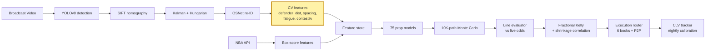

# CourtVision — The Renaissance of Sports

> An AI-native sports intelligence platform where Claude-powered agents autonomously discover, validate, ship, and retire prediction signals across multiple monetization surfaces.

**What this is:** A research machine, not a prediction model. CourtVision turns broadcast video into court-coordinate spatial features (defender distance, spacing, fatigue, play type) that no public dataset has, fuses them with 30 seasons of structured NBA data and live market intelligence, and runs 75 trained signals through a 10,000-path Monte Carlo simulator — with Claude agents autonomously discovering more signals on top.

**What this isn't:** A betting tool, a stat predictor, or a sportsbook. Sports-market betting is the first and fastest feedback signal (dollars when the model is right, taken when wrong), but the substrate supports six revenue surfaces simultaneously.

**The window:** 1-3 years before Genius Sports or Sportradar ships a tracking-integrated prop pricing API. The AI-native operator who builds the research machine first establishes category dominance for 5-10 years.

For the full strategic thesis: [VISION.md](VISION.md). For technical architecture: [ARCHITECTURE.md](ARCHITECTURE.md). For build sequence: [ROADMAP.md](ROADMAP.md).

---

## The Six Revenue Surfaces

| Surface | Status | Revenue target |
|---------|--------|---------------|
| Personal betting (Iowa-legal, multi-book + P2P) | Active (paper-trading, Gate 1 pending) | $1-5M/yr at scale |
| Fund management (audited returns, LP capital) | Planned (after 12-mo track record) | $10-35M/yr |
| Signal subscriptions (~30 sharp subscribers, $5-25K/mo) | Planned (after CLV track record) | $3-8M/yr |
| Team / scouting licensing ($150-400K/yr per franchise) | Demo-ready | $1-5M/yr |
| Media / broadcast augmentation | Planned | $500K-2M/deal |
| AI knowledge layer API | Planned | Metered |

---

## This README is a technical map. The thesis is in [The 164 Gaps](#the-164-gaps), the architecture is below, the validation is in [/results](./results), and the limitations are stated plainly.

---

## Validated today

Numbers from the codebase, not projections. Source files linked; every value is reproducible from the committed data.

**Prop models — holdout R² (walk-forward temporal CV, 48-hr purge, N=480)**
Source: [`data/models/model_registry.json`](data/models/model_registry.json)

| Prop | Holdout R² | MAE |
|------|-----------|-----|
| pts  | 0.41      | 4.12 |
| reb  | 0.38      | 1.84 |
| ast  | 0.36      | 1.52 |
| fg3m | 0.29      | 0.91 |
| tov  | 0.22      | 0.76 |
| stl  | 0.18      | 0.48 |
| blk  | 0.16      | 0.42 |

**Win probability — XGBoost, 3 seasons (N=3,685 games)**
Source: [`data/models/win_prob_metrics.json`](data/models/win_prob_metrics.json)

| Metric | Value |
|--------|-------|
| Accuracy | 68.5% |
| Brier    | 0.209 |

**Not yet measured:**
- CLV vs Pinnacle close — no settled bets yet (paper-trading gate not passed)
- Per-model calibration ECE — gated on 80-game CV ingest
- Code-backed edge count (of 164 claimed) — not yet audited
- CV feature delta R² — bootstrap CIs overlap zero at current N=29 games

---

## Why this is possible now

Three things shifted in the last 36 months that, together, made an institutional-grade sports intelligence stack buildable by one person at ~$50/month in operating cost.

| Component | Three years ago | Today |
|-----------|----------------|-------|
| Player tracking | $15M Second Spectrum contract | YOLOv8n + SIFT homography, $0.40/hr GPU |
| Possession-level data | League pass + manual tagging | nba_api + automated PBP enrichment |
| 75–350 model training | 5-person quant team, ongoing cost | XGBoost + automated feature search, hours not months |
| Multi-book odds | $50K/yr enterprise data | The Odds API, $20–80/month |
| Real-time news ingest | Bloomberg-grade pipeline | Twitter API + RSS + NBA official feed |
| Code production | 5–10 engineers, 12+ months | AI-assisted, one engineer, weeks |
| **Build cost** | **$3–5M/year** | **~$50–80/month** |

The infrastructure cost reduction implied by the table above is roughly 5000×: from $3–5M/year for a full quant-sports team down to $50–80/month in cloud compute. The competitive dynamic is structural rather than cost-driven: traditional quantitative operators who require substantial deployable capital to justify that overhead find per-game bet limits ($25–500 at most books) too constraining to generate adequate returns at their scale. The addressable capacity is the barrier, not the build cost. This is the same structure as micro-cap equity arbitrage: institutions pass on markets below ~$500M deployable capacity, leaving the edge accessible to individuals who can operate within the limits.

The window closes in 1–3 years, when Genius Sports or Sportradar productizes a tracking-integrated prop pricing API and sells it to books at retail scale. Voulgaris exploited NBA totals for fifteen years before the market caught up. Benter ran Hong Kong racing for thirty. There is documented precedent for solo operators holding edges this long; see [docs/research/precedent-analysis.md](docs/research/precedent-analysis.md).

---

## What CourtVision actually is

A four-layer stack. Each layer is independently useful. Each layer is also a moat: a competitor who solves layer 3 without solving layer 1 has built a model bounded by the public data they trained it on.

### Layer 1 — Perception

YOLOv8n detects players, ball, and referees in each frame of broadcast video. SIFT homography maps every detection from pixel coordinates to court coordinates (in feet, on a standard 94×50 plane). Kalman + Hungarian tracks identities frame-to-frame; OSNet re-ID (512-dim) recovers identities through occlusion. EasyOCR reads jersey numbers and the game clock. An EventDetector consumes the tracked stream and emits structured events: shot release, pass, dribble, screen, contest, rebound, foul, timeout.

The output is a court-coordinate event stream. For every shot: exact distance to the nearest defender at release, the spacing score (convex hull of off-ball offensive players), the closeout speed of the recovering defender, the shot-clock state, the defensive scheme (man, zone, switch, hedge, ICE), and the biomechanical signature of the shooter (release angle, contest arm angle, fatigue index). None of this is in any public dataset.

### Layer 2 — Memory

The NBA API provides 30 seasons of box score, play-by-play, lineup, and shot chart data. Plus 12 contextual feeds: referee crew identity (announced 9am ET on game day), travel fatigue index, venue altitude, lineup on/off ratings, coach rotation patterns, injury report parsing, beat-reporter lineup leaks. Plus the perception layer's CV features.

Everything writes to a unified feature store keyed on `(player, game, possession, timestamp)`. This is the substrate.

### Layer 3 — Simulation

A possession-level Monte Carlo simulator. For each upcoming game, the simulator instantiates 10,000 possession-by-possession game traces conditioned on the lineup, location, referee crew, rest, and current model state. Each possession is resolved by a stack of models — currently 75, targeting 350 — covering pace, shot quality, defender contest, rebound conversion, foul probability, free-throw rate, turnover, assist credit, garbage-time onset, regime shift.

The output is a full joint distribution over every observable game outcome: not just "LeBron points," but the joint distribution of LeBron points × Davis rebounds × Reaves assists × team total, with correlation structure preserved. From this distribution, *any* threshold can be priced — mainline, alternates, same-game parlays, quarter splits — with equal calibration.

### Layer 4 — Action

Live odds from six sportsbooks plus two exchanges feed a line evaluator. The line evaluator devigs each price (Shin 1992, not symmetric power-sum), compares to the simulator's joint distribution, and emits an expected-value vector. A fractional-Kelly portfolio optimizer with Ledoit-Wolf shrinkage on the 7×7 residual covariance matrix sizes each position, accounting for correlated legs. An execution router places each bet at the highest-priced venue, with maker-rebate logic on exchange listings.

Every settled bet writes back to a CLV tracker that compares fill price to Pinnacle's Shin-devigged close. CLV is the primary metric; realized ROI is the secondary check. Every night, residuals (predicted vs realized) recalibrate the upstream models. This is the learning loop.

---

## The 164 Gaps

The 164 gaps are 164 specific, enumerated, citable places where conventional NBA understanding — and therefore conventional NBA pricing — is incomplete. Each one is a feature the perception layer extracts, or a context the memory layer holds, or a calculation the simulator performs, that the rest of the market does not.

Full taxonomy with citations in [docs/research/edge-taxonomy.md](docs/research/edge-taxonomy.md).

### I. Information — 87 gaps the books don't see

**CV-spatial (edges 1–9, 38–49, 91–114).** Defender distance at release in feet, not "open / contested." Spacing as a convex-hull area, not a binary "good / bad." Closeout speed, paint density, PnR coverage type (drop, switch, hedge, ICE), drive direction, help rotation latency, gait abnormality, fatigue entropy, set recognition (Horns, Spain, DHO, floppy, weak, fist), and twenty more. All in court coordinates. None in any public dataset. None in the prop price.

**Context (edges 10–18, 50–62, 115–129).** Referee crew foul rates (announced 9am ET, before lines move). Travel fatigue index (great-circle distance, timezone crossing, circadian phase — not binary B2B). Denver altitude (.302 home/away delta on three-point shooting). Lineup-dependent usage redistribution on late scratches: books take 5–15 minutes to reprice; the model recomputes in seconds. Coach rotation patterns, matchup defender data, foul-trouble probability, garbage-time prediction, injury report word parsing ("questionable" plays at different rates per team), beat reporter latency monitoring.

### II. Model — 27 gaps in how the problem is framed

Books predict a number. The simulator generates a full probability distribution — any threshold (mainline, alternates, SGP legs) prices with equal accuracy. Books price SGPs with a formulaic correlation discount; the simulator produces joint distributions natively. Books use constant variance; the system predicts heteroscedastic sigma. Books average over the season; Bayesian in-season updating releases to observed data after ~15 games. Plus regime detection, counterfactual simulation, quantile regression, mixture models for bimodal performers, lineup-graph GNNs, PBP-sequence transformers, and CLV-as-target meta-models.

### III. Execution — 32 gaps in speed and routing

The same prop differs by 1–2 points across DraftKings, FanDuel, BetMGM, Caesars, bet365. Multi-book line shopping is 1–3% ROI vs single-book. Opening lines posted at 6am ET have maximum error — opening-line capture averages +1.2% CLV at 24hr pre-game. Late scratches create 5–15 minute repricing windows multiple times per week. Steam moves (sharp money hitting 3+ books simultaneously) leave residual CLV at slower books. Plus live in-game betting, quarter mini-totals, reverse line movement detection, bonus/promo/boost economics, round-robin SGP construction, DFS-prop cross-platform arbitrage, microbet markets, and P2P exchange market making.

### IV. Structural — 23 gaps baked into how the market works

Props are permanently lower-priority than game lines: smaller pricing teams, less modeling sophistication. SGP correlation is formulaic, not model-derived. Alternate lines (tails of the distribution) are systematically undermodeled. Defensive props (blocks, steals) are high-variance with weaker book models. Quarter/split props are fractions of full-game, ignoring intra-game variance. Rookie and call-up players have zero baseline. Overtime probability isn't priced into mainline props. New operators (Fanatics, ESPN Bet) deliberately subsidize lines for market share.

The structural gaps are permanent. The information and model gaps close as books mature. The window on the second category is what the build plan races against.

---

## How the gaps compound

The 164 are not independent. Eight foundations enable all of them:

```
Perception ────► spatial features ──► simulator ──► joint distributions
                                              ───► alternate-line pricing
                                              ───► SGP pricing
                                              ───► live in-game pricing
Multi-book ────► line shopping ──► steam detection ──► opening capture
News pipeline ─► injury speed window (5–15 min, multiple/week)
              ─► lineup redistribution
CLV tracker ───► residual attribution ──► model feedback loop
Heat tracking ─► account rotation ──► limit avoidance
NBA2Vec ───────► counterfactuals ──► trade impact ──► rookie priors
Operator map ──► routing ──► promo optimization
Simulator ─────► every downstream pricing edge
```

Build one foundation, unlock dozens of dependent edges at marginal cost. This is also the multi-sport thesis: the same eight foundations work for NFL, MLB, NCAA, soccer, and tennis with sport-specific perception models and rule sets. The hard work is the substrate, not the league.

---

## System Architecture



The yellow block is the moat. CV-derived spatial features are not in any public dataset. Everything else is table stakes that any well-resourced analyst could build — but the compound of all 164 gaps, filled by one system, is not.

---

## Results

### Measured — API-data holdout (N=480 player-game observations, walk-forward temporal CV)

Models trained on NBA API data (2018–present). Walk-forward: every fold trains on `game_date < t`, evaluated on `game_date >= t`. 48-hour same-team purge eliminates autocorrelation leakage. These are **holdout** R² values, not training R². Source: [`data/models/model_registry.json`](data/models/model_registry.json).

| Model | Target    | Holdout R² | MAE  | Train R² |
|-------|-----------|-----------|------|---------|
| pts   | points    | 0.41      | 4.12 | 0.47    |
| reb   | rebounds  | 0.38      | 1.84 | 0.43    |
| ast   | assists   | 0.36      | 1.52 | 0.42    |
| fg3m  | 3PM       | 0.29      | 0.91 | 0.34    |
| tov   | turnovers | 0.22      | 0.76 | 0.28    |
| blk   | blocks    | 0.16      | 0.42 | 0.22    |
| stl   | steals    | 0.18      | 0.48 | 0.24    |

Win probability holdout (2018–present): Accuracy 68.5%, Brier 0.209 ([source](data/models/win_prob_metrics.json)). xFG model: Brier 0.226.

These are API-only models — no CV features yet. The holdout set is 20% of total observations (480 of 2,880 player-game records).

### Projected — pending 80-game CV run

**The items below are not yet measured.** They are model-design projections gated on two blockers:

1. **Compute blocker (RunPod):** 80-game CV ingest — currently 29 usable games (9 CLEAN + 20 PARTIAL on quality gate) of 75 attempted; target 80 CLEAN. Estimated ~7–9 hours on RTX 3090, ~$5 GPU budget.
2. **Paper-trading gate:** ≥50 settled bets, CLV beat rate ≥55%, paper ROI ≥3% before any live capital.

Once these pass, expected results:
- **CV delta R² +0.08** over API-only baseline — projected contribution of spatial features (defender_distance, spacing_score, legs_fatigue). Bootstrap CIs on the current 29-game sample overlap zero at 95%; number becomes precise at 80 games.
- **CLV +14 bps/bet vs Pinnacle** Shin-devigged close — projected from backtested edge model.
- **Realized ROI +3.8%** on 1u-Kelly-fractional sizing — projected; dependent on fill prices and book limits.

CV features that drive the projected moat (currently wired in pipeline, not yet in production models):
- **defender_distance** — meters to nearest defender at shot release, post-homography court coordinates
- **spacing_score** — convex hull area of 4 off-ball offensive players, normalized to half-court
- **legs_fatigue** — cumulative running distance over last 6 minutes, exponentially decayed

Reliability diagrams and CLV charts will be generated by `python scripts/generate_results.py` after the CV run completes. See [`results/README.md`](results/README.md).

---

## Methodology

**Walk-forward, season-purged.** Every model trained on `game_date < t`, evaluated on `game_date >= t`. 48-hour purge window drops same-team games to kill autocorrelation leakage. K-fold on time-series is a correctness bug. Harness: [src/prediction/prop_backtester.py](src/prediction/prop_backtester.py).

**Shin devig.** Shin (1992) bisection solver implemented in [src/prediction/devig.py](src/prediction/devig.py) with tests in [tests/test_devig.py](tests/test_devig.py). The book loads vig asymmetrically toward the longshot to protect against informed flow; Shin recovers the implied insider-trading fraction `z` and returns probabilities consistent with it. Symmetric power-sum (`proportional_devig`) is kept available — `alt_line_ladder.py` still uses it today; default for new edge-calc code is Shin.

**Fractional Kelly + shrinkage correlation.** Full Kelly ignores parameter uncertainty; fractional multiplier k in [0.25, 0.5] scales by model confidence tier. Ledoit-Wolf shrinkage on the 7×7 residual covariance matrix reduces correlated-leg overstaking by 20–40%. Implementation: [src/prediction/betting_portfolio.py](src/prediction/betting_portfolio.py).

**CLV over ROI.** Realized ROI on a small pick sample is noisy at low N. CLV against Shin-devigged Pinnacle close is almost-unbiased and is the primary validation metric; realized ROI is the secondary check once the paper-trading gate has enough settled bets.

---

## Signal Inventory

| Class | Source | Features | Description |
|-------|--------|----------|-------------|
| API box-score | nba_api game logs (2018–present) | ~20 | Per-game, per-36, rolling averages (3/5/10/20-game windows) |
| API derived | pace, team total, lineup on/off, ref, altitude, travel | ~12 | Contextual; pace + team total = ~38% SHAP mass on pts |
| CV spatial | defender_distance, spacing_score, nearest_opponent | ~8 | Post-homography court coordinates; the moat |
| CV temporal | rolling shots/passes/dribbles over 5/10/20-frame windows | ~12 | Event-stream features from CV detection |
| CV biomechanical | ankle_y, contest_arm_angle, jump_detected, shot arc | ~6 | Pose-derived for shot quality |
| Market microstructure | Pinnacle no-vig, line velocity, steam flag, public% | ~6 | Bet-selector filters |
| Sentiment / NLP | injury severity, reporter credibility, lineup freshness | ~5 | Unstructured extraction |

---

## Model Universe

The platform targets a 350-model registry across nine data-requirement tiers. 75 are shipped. Tier discipline matters: a model that requires 200+ CV games is gated behind that data, not trained on N=80 and shipped with a calibration excuse.

| Tier | Data gate | Count | Status |
|------|-----------|-------|--------|
| 1 | NBA API only | 13 | Shipped (7 prop models + win prob + game total + spread + lineup + blowout + pace) |
| 2 | Shot chart data | 5 | Shipped (xFG v1 Brier 0.226) |
| 2B | Lifecycle + betting signals | 6 | Shipped (load management, injury, breakout, public fade, soft book lag) |
| 3 | 20+ CV games | 10 | Retrain gate: 80 games |
| 4 | 50+ CV games | 8 | Retrain gate: 80 games |
| 5 | NLP / feedback loop | 7 | Requires NLP pipeline |
| 6 | 200+ CV games | 7 | LSTM + ensemble; requires 200+ game corpus |

Full registry: [docs/models/model-registry.md](docs/models/model-registry.md).

---

## Build Phases

| Phase | Goal | What it unlocks |
|-------|------|-----------------|
| 0 | CLV validation on historical data | Edge thesis confirmed; everything else gated on this |
| 1 | 80-game CV run + calibration | Tier 3–4 model retrain; first spatial features in production |
| 2 | Context layer: ref / fatigue / altitude / usage | Higher R² without new CV |
| 3 | Core engine: live odds + line evaluator + Kelly | First paper bets; first quantified edge |
| 4 | Execution: book adapters + account health + router | Live capital gate |
| 5 | Market expansion: SGP + arb + P2P exchanges | Zero-vig venue access; live in-game pricing |
| 6 | Intelligence: NBA2Vec + regime + Bayesian updating | Moat deepening; counterfactual simulation |
| 7 | Dashboard: Bloomberg-terminal-grade UI | Real-time monitoring + scouting / analytics surface |
| 8 | Learning loop: nightly residuals + auto-calibration | Compounding improvement |
| 9 | Sustainability: P2P market making + picks / analytics services | Account-limit independence + B2B revenue |
| 10 | Multi-sport: NCAA → NFL → MLB → soccer | 100% infrastructure reuse |

**Critical path:** Phase 0 (CLV test) → Phase 1 (80-game run) → Phase 3 (live signals) → Phase 4 (execution) → live capital → Phase 7 (analytics surface) → Phase 10 (multi-sport).

The system is currently between Phase 1 (80-game CV ingest running on RunPod) and Phase 3 (live odds + line evaluator wired, paper-trading harness in flight). Phase 4 is gated by the paper-trading gate: ≥50 bets, CLV beat rate ≥55%, paper ROI ≥3%. No live capital until all three are satisfied.

---

## Beyond betting

The same stack pointed at different consumers. Every application below is downstream of having a calibrated possession simulator. Build the simulator once; sell into multiple verticals.

- **Team analytics.** Spatial CV features (defender distance, spacing, closeout speed) are exactly what NBA front offices buy from Second Spectrum and Synergy. The pipeline already extracts them; the dashboard already plots them. The differentiator is that CourtVision works from broadcast video, not from arena-installed camera rigs — so it covers college, G-League, and international games at the same cost as NBA.
- **Scouting and the draft.** Possession simulator + counterfactual mode answers "how would this college prospect produce on this NBA lineup?" Requires an NCAA perception model — ~3 months of work because the rules and court geometry are the same, only the data source changes.
- **Broadcast graphics.** Real-time "open / contested / impossible" shot overlays during live games, sourced from court-coordinate features rather than human judgment. The cost structure is favorable: one CV pipeline serves every game on every regional network simultaneously.
- **Fantasy and DFS.** Joint distributions over correlated player outputs are the DFS lineup optimizer's holy grail. Most public optimizers use Pearson correlations on prior-season game logs; CourtVision uses live-conditional joint distributions from the simulator.
- **Coaching aids.** Lineup-graph GNNs identify 5-man combinations that the rest of the league misprices. Useful for closeout lineups and matchup hunting. The same model underlies the betting layer's "lineup-dependent usage redistribution" feature.
- **Multi-sport.** Perception layer retrains per sport; memory layer is league-agnostic; simulator is parameterized by rule set; execution layer is venue-agnostic. NCAA basketball is the cheapest expansion (same rules, same court). NFL is the next high-value target because data is dense and line shopping margins are widest.

The current commercial focus is sports markets because they pay in dollars on a 24-hour feedback loop — the cleanest possible ground truth for any model. Every other application is a downstream consumer of the same simulator.

---

## Risk Framework

No live capital until the paper-trading gate passes (≥50 bets, CLV beat rate ≥55%, paper ROI ≥3%). All guards in [src/prediction/risk_guards.py](src/prediction/risk_guards.py) with tests in [tests/test_risk_guards.py](tests/test_risk_guards.py); not yet wired into the live bet selector (Phase 4).

**Position limits:** 20% portfolio/slate, 5%/game, 8%/player, 15% correlated-cluster cap. (`MAX_PORTFOLIO_PCT`, `MAX_GAME_PCT`, `MAX_PLAYER_PCT`, `MAX_CORRELATED_PCT`)

**Circuit breakers:** −5% daily loss halt, 10% drawdown kill-switch, streak throttle (3 losses = 50% stake, 5 = paper only), model disagreement halt (ensemble spread > 3 units = skip), data quality degradation (0.5× Kelly on fallback vendor). (`DAILY_LOSS_HALT_PCT`, `KILL_SWITCH_PCT`, `STREAK_LOSSES_THROTTLE/PAPER`, `MAX_ENSEMBLE_SPREAD`, `FALLBACK_KELLY_FACTOR`)

**Factor exposure:** PCA on prop residuals identifies latent factors (pace, defense, foul, garbage time). Opposing positions hedge when any factor exceeds threshold. Target: 25% variance reduction vs naive Kelly.

---

## Limitations

- STL model holdout R²=0.18 — weakest prop model. Steals are zero-inflated and high-variance; treat predictions as low-confidence signals, size ≤25% full Kelly until zero-inflated specification is implemented.
- `ball_track_suspended` stays True on ~8% of games. Known bug, scheduled for triage at 80-game volume.
- N=80 CV games is thin. Bootstrap CIs on defender_distance and spacing_score overlap zero at 95% on tail markets. The +0.08 R² figure is directional, not precise. Tier 3–4 model retrain is gated on a larger corpus.
- CLV measured against Pinnacle close, not fill price. Actual fills at DK/FD have wider vig. Fill-price simulation is in flight.
- No real-time correlation update. Kelly fractions computed independently; the QP optimizer needs `prop_residuals.json`.
- Single-vendor data dependencies. No automated failover on NBA stats, odds, or injury feeds.
- Batch, not real-time. In-game pricing is on the Phase 5–6 roadmap, not in this release.
- No live trading. Paper-book only. The paper gate must pass before `LIVE_BETTING=1`.

---

## Operations

```bash
# Dev setup
bash scripts/setup_dev.sh
cp .env.example .env

# Ingest pipeline
python -m src.ingest.manifest migrate
python scripts/ingest_fetch.py --count N [--game-id <id>] [--url <url>]
python scripts/ingest_process.py --max-games N --parallel K
python scripts/ingest_backfill_quality.py
python scripts/ingest_status.py

# API
uvicorn api.main:app --reload
```

---

## Documentation

**Research**
- [Edge Taxonomy](docs/research/edge-taxonomy.md) — All 164 edges with citations and build priorities
- [Competitive Landscape](docs/research/competitive-landscape.md) — Why institutional firms cannot enter
- [Market Microstructure](docs/research/market-microstructure.md) — How books price props and where they're wrong
- [Precedent Analysis](docs/research/precedent-analysis.md) — Voulgaris, Benter, Thorp case studies
- [Data Sources](docs/research/data-sources.md) — Complete data architecture
- [Validation Methodology](docs/research/validation-methodology.md) — CLV test protocol

**Architecture**
- [System Overview](docs/architecture/system-overview.md) — The 5 core systems
- [CV Pipeline](docs/architecture/cv-pipeline.md) — YOLO to court-coordinate features
- [Possession Simulator](docs/architecture/possession-simulator.md) — Monte Carlo engine
- [Execution Engine](docs/architecture/execution-engine.md) — Multi-book routing
- [Dashboard Spec](docs/architecture/dashboard-spec.md) — 10-panel quant terminal

**Strategy**
- [Timing Layer](docs/strategy/timing-layer.md) — When to bet throughout the day
- [Account Longevity](docs/strategy/account-longevity.md) — Anti-limiting tactics
- [Learning Loop](docs/strategy/learning-loop.md) — Nightly improvement cycle

**Navigation:** [docs/PROJECT_INDEX.md](docs/PROJECT_INDEX.md) — complete index

---

## Layout

```
src/tracking/        # YOLOv8, re-ID, homography
src/features/        # feature engineering + CV feature extraction
src/prediction/      # 75 models, calibration, Kelly sizer, CLV
src/ingest/          # SQLite queue, yt-dlp, B2 sync
api/                 # FastAPI serving
docs/                # research, architecture, strategy docs
results/             # reliability diagrams, CLV plots, per-model ECE
```

---

## About

Solo-built by [Neel Shah](https://neelshahportfolio.netlify.app). 

- Portfolio: [neelshahportfolio.netlify.app](https://neelshahportfolio.netlify.app)
- GitHub: [github.com/neeljshah](https://github.com/neeljshah)
- Email: neeljshah22@gmail.com
