# CourtVision — NBA AI System

End-to-end NBA prediction + betting platform built by one engineer over 12 months. Computer vision on broadcast video → court coordinates → 7 prop models + win prob + in-play residual heads → Shin-devigged EV → fractional Kelly → shadow-logged execution stack.

**Built by [Neel Shah](https://neelshahportfolio.netlify.app)** — solo NBA quant. Available for senior sports-quant / AI-founding-engineer roles. → [neeljshah22@gmail.com](mailto:neeljshah22@gmail.com)

> **30-second verification** (after `git clone` + `pip install -r requirements.txt`):
> ```bash
> python scripts/verify_winprob.py          # → acc 0.7094, brier 0.193 (matches README within tolerance)
> python scripts/verify_production_mae.py   # → 6/7 prop MAEs within ±0.01 of README claim
> ```
> Both verifiers consume committed JSON (`data/models/win_prob_metrics.json`, `quantile_pergame_metrics.json`). If they disagree with this README, the README is wrong; please open an issue.

---

## What This Repo Actually Is

A real ML system, not a backtest in a notebook. The honest one-paragraph version a senior interviewer should read first:

> Two validation surfaces exist. **(A) Real-money-relevant:** 8,360 walk-forward bets against committed DK / FanDuel / MGM / BetRivers historical closes. The L10 baseline returns **+4.19% ROI on 2024 playoffs (n=4,337)** and the prod stack returns **−2.06% ROI on 2025-26 mainline regular season (n=4,210)** — sharp regular-season markets are tight; soft playoff markets aren't. Slicing by direction, the structural **UNDER edge** (well-known industry effect, here measured cleanly) is **58.5% beat / +7.7% ROI on 3,512 bets**. **(B) Paper / ceiling:** an in-play backtest against an **L5 line proxy** (not real closing lines) shows 78.1% hit / +54.6% ROI on the calibrated emit set of 55,073 bets across 50 games. The L5 proxy ROI almost certainly compresses to **+15–25%** at real Pinnacle closes — that's the load-bearing number to expect, not the +54%. The first true closing-line CLV reading begins October 2026.

The rest of this README sits behind that paragraph.

---

## Real-Money-Relevant Validation (the number that matters)

**8,360 walk-forward bets · real DK / FanDuel / MGM / BetRivers closing lines · two windows.**

| Window | Predictor | N | Beat | ROI | PnL ($100/bet) |
|--------|-----------|--:|-----:|----:|---:|
| 2024 NBA playoffs (Apr 21 – May 24 2024, DK/FD/MGM/BetRivers) | L10 baseline | 4,337 | **54.58%** | **+4.19%** | **+$18,181** |
| 2025-26 mainline regular season (Jan 29 – May 10 2026, DK/FD/MGM) | Prod stack (walk-forward OOF) | 4,210 | 54.37% | −2.06% | −$8,685 |
| 2025-26 mainline (same closes, L10 only) | L10 baseline | 4,023 | 52.20% | −5.60% | −$22,533 |

Prod stack lifts L10 by **+2.17 pp** in beat rate and **+3.54 pp** in aggregate ROI on the same DK/FD/MGM 2025-26 sample. Per-stat at 2025-26 sharp closes: **AST 60.25% / +7.22%** (n=863) and **FG3M 58.37% / +0.34%** (n=860) are real edges; **PTS 49.11% / −8.62%** loses to vig — calibration is the next pin.

### Structural UNDER-only edge (combined 8,360 sample)

Rolling-average baselines systematically over-project counting stats (no blowout sits, no garbage-time discount, no load-management). Books price toward the recreational over-bias. The intersection is a structural UNDER edge.

| Strategy | N | Beat | ROI | PnL ($100/bet) |
|----------|--:|-----:|----:|---:|
| Naive (bet model's edge either direction) | 8,360 | 53.43% | −0.52% | −$4,351 |
| **UNDER-only** (bet UNDER whenever L10 < line) | **3,512** | **58.46%** | **+7.70%** | **+$27,041** |

| Stat | N | Beat | ROI |
|------|--:|-----:|----:|
| **BLK** UNDER | 343 | **74.05%** | **+41.37%** |
| **STL** UNDER | 221 | **66.06%** | **+26.12%** |
| **AST** UNDER | 548 | **60.58%** | **+9.98%** |
| **FG3M** UNDER | 584 | **60.45%** | **+5.55%** |
| REB UNDER | 947 | 53.85% | −0.57% |
| PTS UNDER | 869 | 52.70% | −1.26% |

Scarcity stats (BLK / STL / AST / FG3M) clear cleanly; PTS / REB UNDER is break-even because those markets are tighter. Reproduce:

```bash
python data/external/historical_lines/fetch_external_history.py   # one-time, ~45 MB
python scripts/run_gate1_full_analysis.py                          # naive + UNDER + per-stat + per-book
```

Machine-readable consolidated report: [`data/models/gate1_results_summary.json`](data/models/gate1_results_summary.json). Full multi-cut analysis: [`data/cache/gate1_full_analysis.json`](data/cache/gate1_full_analysis.json).

### Honest coverage gap

These are the **only** NBA player-prop closing-line archives that exist publicly at $0:
- ✅ 2024 NBA playoffs (Apr–May 2024)
- ✅ 2025-26 Jan 29 – May 10 2026

What's **not** in any free archive (would require $30/mo Odds API): full 2024-25 regular season, early 2025-26 (Oct 2025 – Jan 28 2026), 2025 NBA playoffs. The 8,360-bet sample is therefore a **partial-season** validation, not multi-season. Forward scraping (Pinnacle / Bovada / FanDuel daemons live) accumulates real CLV from Oct 2026 onward.

---

## In-Play Backtest (paper ceiling, NOT real-money result)

**90,846-bet backtest. 50 finalized games. Post-calibration emit set (n=55,073): 78.11% hit, +54.57% ROI on flat $1 stakes — against an L5 line proxy, not real closes.**

> Read this caveat before the headline numbers: the in-play backtest uses an **L5 rolling-average line proxy** to settle bets, not real Pinnacle/DK closing lines. L5 lines are softer than real closes. Paper +54% ROI **almost certainly compresses to +15–25% on real closing lines** based on the gap observed on the historical-archive data above. The +54% is a model-quality ceiling, not a deployment forecast. — *This is the single most important sentence in this README.*

With that loud:

| Metric | Value | 95% CI / signal |
|--------|-------|-----------------|
| Hit rate (calibrated emit set, n=55,073) | **78.11%** | Wilson [77.76%, 78.45%] |
| ROI per $1 flat | **+54.57%** | per-bet σ=$0.716, SEM=$0.003, t-stat=179 (sample-size-inflated; trust the Wilson bound) |
| Per-bet Sharpe | **0.76** | single-bet stat, not annualized; institutional bar is ~1.0 |
| Calibration RMSE | **0.065** | across 10 EV deciles |
| Worst 100-bet drawdown | **−$1,682** | on $100/bet flat, chronological |

Tier breakdown:

| Tier | endQ1 | endQ2 | endQ3 |
|------|-------|-------|-------|
| S (EV ≥ 8%) | +50.9% ROI (n=5,246, 78% hit) | +68.1% (n=5,810, 87%) | **+78.7% (n=5,088, 93%)** |
| A (EV ≥ 4%) | +16.7% (n=6,907, 55%) | +40.4% (n=7,269, 67%) | +61.8% (n=3,703, 83%) |
| B (EV ≥ 1%) | +8.2% (n=624, 49%) | +4.7% (n=650, 47%) | +34.1% (n=154, 67%) |
| C (EV < 1%) | −36.6% (n=13,595, 29%) | −56.2% (n=14,433, 19%) | −78.1% (n=9,155, 10%) |

**Calibration is honest.** Predicted-EV deciles map to realized return within ±5%:

| Decile | predicted EV | realized return |
|--------|-------------:|----------------:|
| 1 (worst) | −0.890 | −0.884 |
| 5 | 0.000 | −0.030 |
| 9 (best) | +0.799 | +0.794 |

Predicted EV ≈ realized return at the extremes is the diagnostic that the model isn't lying about its own confidence. Full report: [`vault/Reports/filter_calibration_2026-05-27.md`](vault/Reports/filter_calibration_2026-05-27.md).

### How the calibration was earned (the only part that's novel)

Pre-calibration aggregate ROI was **−4.25%**. Tier C bets (EV < 0.04) flooded the emit set at −78% ROI and dragged everything down. Three filter candidates (`projection_sane`, `min_edge`, `three_book_consensus`) were suspected of over-blocking; the shadow-logger backtest proved they were **correctly** blocking losers (−3.85% and −3.55% on dropped bets). The real fix was raising the per-quarter EV emit floor from **0.01 → 0.12**. Bet volume dropped 59% at endQ3; aggregate ROI flipped to **+47%**.

This is the part of the architecture that's worth a senior interviewer's attention: **a shadow logger that records every evaluation (passed AND blocked, with `gate_blocked_by` reason) made post-hoc filter calibration possible at all.** Without it, "raise the floor from 0.01 to 0.12" would have been guesswork; with it, it was a re-derived counterfactual on logged audit data.

Reproduce: `python scripts/run_backtest.py --n-games 50` (~10–15 min). Calibrate: `python scripts/calibrate_filters.py`.

---

## Walk-Forward Model Performance

All numbers reproducible from committed JSON.

**Prop projections — walk-forward MAE @ q50** (N=99,818 player-games, 2 seasons)
Source: [`data/models/quantile_pergame_metrics.json`](data/models/quantile_pergame_metrics.json)

| Stat | MAE | Recipe |
|------|----:|--------|
| PTS  | 4.65 | sqrt + Huber XGB/LGB + 5-seed MLP, NNLS-stacked |
| REB  | 1.90 | log1p LGB quantile q50 |
| AST  | 1.37 | log1p XGB+LGB + multitask MLP, NNLS-stacked |
| FG3M | 0.89 | log1p XGB quantile q50 |
| TOV  | 0.89 | log1p XGB quantile q50 |
| STL  | 0.72 | log1p XGB quantile q50 |
| BLK  | 0.44 | log1p XGB quantile q50 |

Quantile regression at q50 outperforms squared-error blends here because sportsbook prop O/U lines score against the median, not the mean. (R² gets worse on q50-dispatched stats; MAE wins — that's the right trade.)

**Win probability — 5-way NNLS stack** (XGB+LGB+LR+MLP+NB), N=2,455 games
Source: [`data/models/win_prob_metrics.json`](data/models/win_prob_metrics.json)

| | 3-fold walk-forward | Single split |
|-|-:|-:|
| Accuracy | 70.94% ± 2.5pp | 71.69% |
| Brier    | 0.193 | 0.188 |

Walk-forward NNLS weights: LGB 0.66 · NB 0.16 · LR 0.12 · MLP 0.03 · **XGB 0.00**. NNLS zeroed XGB autonomously on validation — the stack picks its members by gate, not by mandate. Most stacks force-include the "expected winner"; this one doesn't.

**In-game projection lift — endQ3 MAE vs pregame** (550-game retro)

| Stat | Pregame MAE | endQ3 MAE | Δ |
|------|-----:|-----:|--:|
| PTS  | 4.61 | 2.46 | **−47%** |
| REB  | 1.91 | 1.00 | −48% |
| AST  | 1.36 | 0.68 | −50% |
| FG3M | 0.89 | 0.42 | −53% |
| TOV  | 0.89 | 0.45 | −49% |
| STL  | 0.72 | 0.32 | −56% |
| BLK  | 0.44 | 0.20 | −55% |

In-game predictions consume per-quarter snapshots and apply gated residual heads (foul-change, blowout, heat-check shrinkage) on top of the pregame baseline. The biggest single in-play lever wasn't a better point predictor — it was a **learned Q4-minutes prior** (`src/prediction/minute_trajectory.py`, cycle 110) that replaced the naive 12-min assumption with a model.

---

## Architecture

```mermaid
flowchart LR
  V[Broadcast Video] --> Y["YOLOv8n detection"]
  Y --> H["SIFT homography → court coords"]
  H --> T["Kalman + Hungarian tracking"]
  T --> R["OSNet re-ID (512-dim)"]
  R --> CV["CV spatial features\ndefender_dist, spacing, fatigue"]
  A[NBA API · 3 seasons] --> BF["Box + lineup + ref + travel features"]
  CV --> FS["Feature store"]
  BF --> FS
  FS --> PM["7 prop models · win prob · xFG"]
  FS --> LM["In-game residual heads\nendQ1/Q2/Q3"]
  PM --> SIM["10K-path Monte Carlo"]
  LM --> SIM
  SIM --> LE["Line evaluator\nShin (1992) devig"]
  LE --> DE["Decision engine\ngate chain + EV floor + tier"]
  DE --> SL["Shadow logger\n(every eval incl. blocked)"]
  DE --> K["Fractional Kelly\n+ Ledoit-Wolf shrinkage"]
  K --> EX["Execution stack\n9 daemons"]
  EX --> CLV["CLV tracker → nightly recalibration"]
  SL --> SET["Settlement engine\n→ daily ROI report"]
```



### Load-bearing modules (the 8 files that do most of the work)

The 120 modules in `src/prediction/` are a research surface, not a runtime. The actual deployment graph is small:

| File | Role |
|------|------|
| `src/pipeline/unified_pipeline.py` | CV orchestrator (YOLO → SIFT → Kalman → OSNet → events) |
| `src/features/feature_engineering.py` | 60+ pregame features + CV bridge |
| `src/prediction/player_props.py` + `prop_quantiles.py` | 7 prop models, q10/q50/q90 quantile heads |
| `src/prediction/win_probability.py` | 5-way NNLS stack |
| `src/prediction/live_engine.py` | In-play snapshot → projection w/ residual heads |
| `src/prediction/devig.py` | Shin (1992) bisection devig |
| `src/prediction/decision_engine.py` | Gate chain + EV floor + S/A/B tier classification |
| `src/prediction/shadow_logger.py` + `settlement_engine.py` | Every evaluation logged; nightly settle vs cdn.nba.com finals |

Everything else is probes, experiments, or supporting infra.

### CV pipeline

YOLOv8n detects players/ball/referees. SIFT homography maps to court coordinates (94×50 ft). Kalman+Hungarian tracks identities; OSNet re-ID (512-dim) recovers identity through occlusion. EasyOCR reads jerseys + game clock. EventDetector emits structured events.

**Status: 85 tracked games in `data/tracking/`** · 7 with full feature extraction · target 80 CLEAN for the production CV-feature gate. The CV moat — defender_distance / spacing / fatigue extracted from broadcast pixels rather than purchased from Sportradar/Second Spectrum — is the unique differentiator vs other sports-quant builds. Whether the downstream signal pans out depends on hitting the 80-game gate.

### Execution stack (production-ready, awaiting October 2026 season)

9 daemons covering the full live loop: `live_inplay_daemon` · `auto_place_daemon` · `auto_settle_daemon` · `clv_tracker_daemon` · `bankroll_monitor_daemon` · `middle_finder_daemon` · `bov_scraper_daemon` · `nba_lineup_daemon` · `vault_dashboard_daemon`. Plus live prop line ingestion (DK / FanDuel / Pinnacle / Odds-API), webhook alerts (Slack / Discord), hedge calculator, P&L ledger CLIs, mobile HTML dashboard, and an `/api/shadow` endpoint exposing the calibration audit trail to the dashboard.

Current operational issues (not core code): see [`docs/KNOWN_LIMITATIONS.md`](docs/KNOWN_LIMITATIONS.md).

---

## Engineering Breadth

Numbers from the repo, not projections:

| | |
|--|--|
| **Lines of code** | ~80K Python across `src/`, `scripts/`, `api/`, `tests/` |
| **Prediction modules** | 120 in `src/prediction/` (8 load-bearing — see above; the rest are probes / experiments) |
| **Trained artifacts** | 312 (`.pkl`, `.json`, `.lgb`, `.pt`) in `data/models/` |
| **Tests** | 4,100+ collected · 48/48 critical-path pass (`gate1 + devig + kelly + clv + calibration`) · 63/63 in-play subset pass (shadow logger, settlement, snapshot replay, calibration, daily ROI, decision engine gates) |
| **Probes (signal experiments)** | 154 in `scripts/probe_*.py` — each with explicit ship/reject criteria |
| **Probes rejected** with documented WF gate failures | ~20 |
| **Daemons** | 9 production live-loop services |
| **API** | FastAPI, ~50 endpoints across 8 routers (`api/main.py` + `api/live_v2_app.py`) |
| **CV games processed** | 85 tracked, 7 with full feature extraction |

### Discipline indicators (what separates this from a portfolio project)

- Every probe ships behind a walk-forward gate: 4/4 WF folds positive AND production single-split positive AND ≥4/7 stats win. ~20 probes rejected and documented. This is research-desk hygiene, not bettor hygiene.
- All predictions emit **q10/q50/q90** quantile bands — calibrated to 80% empirical coverage. No fake point estimates dressed as confidence.
- **Shin (1992) bisection devig** in `src/prediction/devig.py` — the sharp-book-correct devig, not the symmetric power-sum that 99% of public sports-ML code uses.
- **Walk-forward season-purged validation** with 48hr same-team purge in `src/prediction/prop_backtester.py`. Same-team games close in time leak through residuals (player condition, lineup, ref bias); random K-fold leaks; this doesn't.
- Position limits + drawdown circuit breakers + Ledoit-Wolf-shrunk Kelly correlation in `src/prediction/risk_guards.py`.
- **Shadow logger** captures every evaluated bet incl. blocked, with `gate_blocked_by` reason. That's the audit trail that made the +47% post-calibration result *possible to derive*, not just opinion.
- Decision log preserved across sessions in `vault/Sessions/Decision Log.md`.

---

## Tech Stack

**ML / data**: Python 3.9, PyTorch, XGBoost, LightGBM, scikit-learn, NumPy, pandas, Optuna
**CV**: YOLOv8n (Ultralytics), OpenCV, SIFT homography, OSNet re-ID, EasyOCR
**Serving**: FastAPI, uvicorn, SQLite + parquet feature store, Railway deploy
**Data**: nba_api (30 seasons box / PBP / lineups), cdn.nba.com live boxscore + PBP, The Odds API, custom Pinnacle / Bovada / FanDuel / PrizePicks scrapers
**Infra**: RunPod (RTX 3090 GPU runs), Backblaze B2 storage, Docker, GitHub Actions CI
**Quant**: Walk-forward CV (season-purged), Shin devig, fractional Kelly (25% per-bet + 25% slate cap), Ledoit-Wolf covariance shrinkage, NNLS stacking
**Tools**: Claude Code agents in the loop (CLAUDE.md routes agents to load-bearing files on session start; improve_loop + execute_loop patterns are documented in [`vault/Lessons.md`](vault/Lessons.md))

---

## What's Validated · What's Not

**Validated and shipped**

- **Real-Vegas L10 baseline at 4,337 closes (2024 playoffs, DK/FD/MGM/BetRivers):** +4.19% ROI / 54.58% beat / +$18,181 PnL
- **Real-Vegas prod stack at 4,210 closes (2025-26 mainline, DK/FD/MGM):** −2.06% ROI overall; AST +7.22% and FG3M +0.34% are real edges at sharp closes
- **Combined UNDER-only at 3,512 closes:** +7.70% ROI / 58.46% beat / +$27,041 PnL — BLK +41% / STL +26% / AST +10% / FG3M +5.5%
- **Walk-forward prop MAE** on 99,818 player-games (q50 quantile regression)
- **71.7% win-prob accuracy** on 2,455 holdout games
- **−47% to −56% in-game MAE lift** vs pregame on 550-game retro
- **In-play backtest 78%/+54%** on 55,073-bet calibrated emit set — paper ceiling, see L5 caveat above
- Full execution stack production-ready (9 daemons + decision engine + shadow logger + settlement + daily ROI report)

**Honest gaps**

- **Pinnacle Gate 1 not run.** No historical Pinnacle close archive exists publicly; daemon collects from Oct 2026 onward for the first sharp-book CLV reading. This is the load-bearing future test.
- **L5 proxy ≠ real closes.** The +54% in-play backtest ROI uses an L5 line proxy. Real-money ROI estimate: +15–25%, materially lower.
- **CV moat depth.** 7 games with full feature extraction; target 80 CLEAN. The CV signal is unproven at scale.
- **Live execution.** Zero real money placed yet by design — gated behind Pinnacle Gate 1 + CV depth + production readiness.
- **Sportsbook scraper coverage.** DK / Caesars / MGM are IP-blocked; Pinnacle / Bovada / FanDuel / PrizePicks-only coverage is live. Historical archive used DK/FD/MGM/BetRivers closes that were publicly accessible.
- **Operational fragility.** Several live daemons go red intermittently — see [`docs/KNOWN_LIMITATIONS.md`](docs/KNOWN_LIMITATIONS.md).

These are the next milestones, not disclaimers.

---

## Reproduce the Headlines

```bash
# Step 0: pull the free public Vegas-line archives (one-time, ~45 MB)
python data/external/historical_lines/fetch_external_history.py

# Real-Vegas Gate 1 — historical L10 baseline + prod stack at real DK/FD/MGM/BetRivers closes
python scripts/run_gate1_full_analysis.py
# → naive + UNDER-only + edge-filtered + per-stat + per-book + per-window

# Walk-forward MAE check (~30 sec)
python scripts/verify_production_mae.py

# Win probability check (~10 sec)
python scripts/verify_winprob.py

# THE PAPER CEILING — in-play backtest on 50 historical games (~10–15 min)
python scripts/run_backtest.py --n-games 50
# → vault/Reports/backtest_<date>.md

# Calibrate the per-quarter EV emit floor + ceiling
python scripts/calibrate_filters.py
# → vault/Reports/filter_calibration_<date>.md
# → patches src/prediction/decision_engine.py with new thresholds

# Daily ROI report from any day's shadow logs
python -m src.reporting.daily_roi --date 2026-05-27

# Test suite
python -m pytest tests/ -q

# End-to-end demo (pregame → snapshot → projection → EV → Kelly → settle → CLV)
python scripts/swish_demo.py
```

---

## Repo Layout

```
src/tracking/        YOLOv8, OSNet re-ID, SIFT homography, EventDetector
src/features/        feature engineering (60+ features, CV bridge)
src/prediction/      120 modules — 8 load-bearing (see "Load-bearing modules" above),
                     the rest are probes / experiments / dormant infrastructure
src/reporting/       daily_roi.py — CLI ROI reports from shadow logs
src/pipeline/        unified pipeline orchestrator
src/ingest/          SQLite queue, yt-dlp, B2 sync, parallel game ingest
api/                 FastAPI serving (main.py + live_v2_app.py with /api/shadow)
scripts/             ~600 scripts: training, probes, daemons, ops CLIs
                     (run_backtest.py, calibrate_filters.py, settle_day.py,
                      run_gate1_*.py, verify_*.py)
tests/               4,100+ tests — walk-forward gates, integration, E2E
data/models/         312 trained artifacts (gate1_results_summary.json
                     is the consolidated verification report)
data/shadow/         per-game evaluation logs (passed + blocked bets)
data/external/       historical_lines/playoffs_2024_canonical.csv (real Vegas)
vault/Reports/       backtest, calibration, daily ROI (gitignored; templates committed)
docs/                architecture, runbooks, known limitations
CHANGELOG.md         versioned ship log (0.17.0 = in-play calibrated; 0.16.0 = Gate 1; 0.15.0 = in-play infra)
ARCHITECTURE.md      6-system technical map + component status table
```

---

## What I'd Tell You In The Interview

Pre-empting the obvious questions:

- **Is the +54% ROI real?** No — it's an L5-proxy ceiling. The honest deployment forecast is +15–25%. The number that matters is the October 2026 CLV vs Pinnacle close.
- **What's the moat?** The CV bridge (defender_distance / spacing / fatigue from broadcast pixels) — most competitors buy Sportradar/Second Spectrum tracking. Unproven at scale (7 games full-feature); the 80-game gate decides it.
- **Why no real money yet?** By design. The architecture is ready; the proof isn't. Deploying before the Pinnacle CLV reading would be unbacktested risk.
- **What was the hardest call you made?** Killing endQ3 residual head and learned-Q4-minutes shipping anyway. Cycle 110 had 2/7 stats failing the WF gate; minute_trajectory shipped 7/7. Discipline says ship what passes, document what doesn't.
- **What would the first 30 days look like at your company?** Wire the CV signal layer into whatever in-house prop pricing model exists; deploy the shadow logger pattern (every evaluation logged, including blocked) so post-hoc calibration becomes possible; add walk-forward season-purged CV to the validation suite if it's not already there.
- **What about the AI agents thesis?** The throughput is real — 120 modules + 154 probes + 4,055 tests solo in 12 months wasn't possible pre-2024. But the *insights* (q50 for O/U markets, Shin devig, 48hr purge, learned Q4 minutes) are mine. Agents are the engineering force multiplier; quant taste is what made the choices sharp.

---

## Contact

Solo-built. Available for senior sports-quant / AI-founding-engineer roles. Open to consulting on sports-AI infrastructure.

- **Portfolio**: [neelshahportfolio.netlify.app](https://neelshahportfolio.netlify.app)
- **GitHub**: [github.com/neeljshah](https://github.com/neeljshah)
- **Email**: [neeljshah22@gmail.com](mailto:neeljshah22@gmail.com)

---

*Last verified: 2026-05-27 (63/63 in-play tests green; 55,073-bet calibrated emit set re-derived from settled CSV; Wilson CI + t-stat + Sharpe + calibration RMSE + drawdown all computed fresh). Versioned ship log: [`CHANGELOG.md`](CHANGELOG.md). Current operational state: [`docs/CLAUDE-state.md`](docs/CLAUDE-state.md). Known limitations: [`docs/KNOWN_LIMITATIONS.md`](docs/KNOWN_LIMITATIONS.md).*
