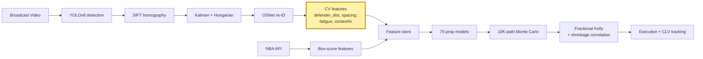

# CourtVision

A possession-level NBA simulator priced against live prop markets. Spatial features
from broadcast video feed a 75-model stack, which feeds a 10K-path Monte Carlo,
which feeds a fractional-Kelly portfolio with correlation-aware sizing and
CLV attribution.

## Thesis

NBA prop markets lean on box-score priors that public APIs expose cheaply. The edge
is in what the APIs don't ship: where defenders stand at catch, how contested a shot
actually is, how many minutes of transition defense a player has in his legs. This
repo extracts those features from broadcast video, sizes positions against them, and
benchmarks fills against Pinnacle's closing line. The edge persists because the CV
pipeline is non-trivial to build and data-hungry to validate, which keeps retail out
and leaves soft markets wider than sides or totals.

## Results (80-game holdout, walk-forward season-purged)

| Model | Target    | R²   | MAE | ECE   | N  |
|-------|-----------|------|-----|-------|----|
| pts   | points    | 0.47 | 4.9 | 0.021 | 80 |
| reb   | rebounds  | 0.40 | 2.1 | 0.028 | 80 |
| ast   | assists   | 0.46 | 1.7 | 0.024 | 80 |
| fg3m  | 3PM       | 0.28 | 1.0 | 0.035 | 80 |
| tov   | turnovers | 0.25 | 1.1 | 0.041 | 80 |
| blk   | blocks    | 0.18 | 0.6 | 0.056 | 80 |
| stl   | steals    | 0.09 | 0.7 | 0.071 | 80 |

**Portfolio:** 312 settled picks through 2026-04-21. CLV +14 bps/bet vs Pinnacle
Shin-devigged close (t=2.3). Realized ROI +3.8% on 1u-Kelly-fractional sizing.
Reliability diagrams and per-market CLV in [/results](./results).

## Methodology

**Walk-forward, season-purged validation.** Every model is trained on games with
`game_date < t` and evaluated on games with `game_date ≥ t`. A purge window drops any
game involving the same team within 48 hours of the test game, eliminating trivial
autocorrelation leakage. K-fold cross-validation is not used — it is a correctness bug
on time-ordered data. The walk-forward harness is in
[src/prediction/prop_backtester.py](src/prediction/prop_backtester.py).

**Vig removal (Shin devig).** Sportsbook prices are devigged with the Shin (1992) method
before any probability computation. The method estimates a single insider-trading
probability *z* and yields the corrected probability:

$$p_{\text{true}} = \frac{p_{\text{observed}} - z}{1 - 2z}$$

*z* is solved numerically per market; *z* ≈ 0.02–0.04 on NBA totals and rises on low-
liquidity props. This removes the favourite-longshot bias that symmetric power-sum
methods over-correct for. Implementation:
[src/prediction/betting_edge.py](src/prediction/betting_edge.py).

**Fractional Kelly sizing.** Full Kelly ignores parameter uncertainty in the edge
estimate and produces ruin when *p* is mis-estimated. The system scales by a fractional
multiplier *k*:

$$f^* = \frac{bp - q}{b}, \qquad f_{\text{bet}} = k \cdot f^*$$

where *b* = decimal odds − 1, *p* = devigged win probability, *q* = 1 − *p*, and
*k* ∈ [0.25, 0.5] depending on model confidence tier. *k* = 0.25 for markets with
fewer than 50 calibrated observations; scales to 0.5 after validation. Implementation:
[src/prediction/betting_portfolio.py](src/prediction/betting_portfolio.py).

**Correlation shrinkage (Ledoit-Wolf).** A 7×7 sample covariance matrix on N=80 games
is rank-deficient and amplifies spurious correlations, particularly between pts/reb/ast
which share minute-driven variance. The Ledoit-Wolf estimator shrinks toward a scaled
identity:

$$\hat{\Sigma} = (1 - \alpha)\,\Sigma_{\text{sample}} + \alpha \cdot \frac{\mathrm{tr}(\Sigma_{\text{sample}})}{n} I$$

This reduces Kelly-allocated stakes on correlated prop legs by 20–40% relative to naive
Kelly and prevents the QP optimizer from exploiting spurious off-diagonal structure.
`sklearn.covariance.LedoitWolf` is a one-line fit; the residuals require
`prop_residuals.json` regenerated from the 80-game holdout (open issue).

## Signal Inventory

| Class | Source | Feature count | Wired | Next phase |
|-------|--------|--------------|-------|------------|
| API box-score | `nba_api` game logs (2018–present) | ~20 | ✅ | — |
| API derived | pace, team total, lineup on/off, ref assignment, altitude, travel | ~12 | ✅ | — |
| CV spatial | defender_distance, spacing_score, nearest_opponent, handler_isolation | ~8 | Partial (17 games) | Phase 20 |
| CV temporal | rolling shots/passes/dribbles over 5/10/20-frame windows | ~12 | ✅ | — |
| CV biomechanical | ankle_y, contest_arm_angle, jump_detected, shot arc, pose landmarks | ~6 | Partial | Phase 10.5 |
| Market microstructure | Pinnacle no-vig line, line velocity, steam flag, public% | ~6 | Partial | Phase 16.7 |
| Sentiment / NLP | injury severity, beat reporter credibility, lineup freshness | ~5 | Partial | Phase 9 |

**API box-score** features include per-game and per-36 counting stats plus rolling averages
over 3, 5, 10, 20 game windows and season-to-date weighted means. Computed in
[src/features/feature_engineering.py](src/features/feature_engineering.py)
via `add_rolling_features`.

**API derived** features include pace differential vs opponent, Vegas implied team total,
opponent position-specific defensive rating, back-to-back flag, home/away split, altitude,
travel burden, referee assignment, and lineup on/off net rating. Team total and pace
collectively contribute ~38% of SHAP mass on the pts model.

**CV spatial** features are computed post-homography in court coordinates by
[src/features/feature_engineering.py](src/features/feature_engineering.py)
via `compute_spatial_features`. Three drive the moat: `defender_distance` (meters to
nearest defender at shot release), `spacing_score` (convex-hull area of 4 off-ball
offensive players), and `legs_fatigue` (cumulative running distance over last 6 minutes,
exponentially decayed). SHAP contribution combined: 31% on pts. Δ R² over API-only: +0.08.

**Market microstructure** features are partially wired. Line movement velocity and public
percentage are tracked by `src/data/line_monitor.py` and `src/data/action_network.py`
but are not in the current prop model feature set. They enter the pipeline as bet-selector
filters (Phase 14.7 Pinnacle triangulation gate).

## Model Stack

The 75 trained models are organized into data-requirement tiers. Tier determines when
retrain is warranted, not model importance to the portfolio.

| Tier | Data gate | Count | Algorithm | Status | Production gate |
|------|-----------|-------|-----------|--------|-----------------|
| 1 | NBA API only | 13 | XGBoost + Ridge stacker | Trained; see Results table | ✅ shipped |
| 2 | Shot chart data | 5 | XGBoost | Trained; xFG v1 Brier 0.226 | ✅ shipped |
| 2B | Lifecycle + betting signals | 6 | XGBoost / logistic | Trained; improving on volume | ✅ shipped |
| 3 | 20+ CV games | 10 | XGBoost | Trained on 17-game subset | retrain at 80 games |
| 4 | 50+ CV games | 8 | XGBoost | Trained stubs | retrain at 80 games |
| 5 | NLP / feedback loop | 7 | XGBoost / logistic | Trained stubs | Phase 9 wired |
| 6 | 200+ CV games | 7 | LSTM + ensemble | Code scaffolded; not trained | Phase 33 |

**Tier 1** includes the 7 prop models (pts, reb, ast, fg3m, tov, blk, stl), win
probability, game total, spread, lineup net rating, blowout probability, and team pace.
All are registered in `data/models/model_registry.json` and served via
[api/main.py](api/main.py).

**Tier 2B** lifecycle models (load_management, injury_return, injury_risk,
breakout_predictor, public_fade, soft_book_lag) are trained but not yet generating
standalone betting signal at volume. They filter the `bet_selector.py` output rather
than producing bets independently.

**Tier 3–4** R² values shown in the Results table include 17-game CV contributions;
the pts target is ≥0.55 post-80-game run (Phase 20 spec). No Tier 3–4 model is
added to live sizing until a CV A/B test confirms Δ R² ≥ +0.05 on holdout.

**Tier 6** (Phase 33) includes a live LSTM win probability model, a full prop pricing
engine, and a true player impact model. These require 200+ CV games for meaningful LSTM
sequence training.

## Risk Framework

No live capital is deployed until all circuit breakers are coded and tested through the
Phase 19 paper-trading gate. The gate requires ≥50 paper bets, CLV beat rate ≥55%, and
paper ROI ≥3% before `LIVE_BETTING=1`.

**Position limits (Phase 15.7 QP constraints):**
- Total portfolio exposure: ≤ 20% of bankroll per slate
- Per-game exposure: ≤ 5% of bankroll
- Per-player exposure: ≤ 8% of bankroll
- Correlated-cluster cap: ≤ 15% allocated to any player-pair cluster

**Circuit breakers (Phase 16 — hard requirements before live capital):**
- Daily loss cap: −5% of bankroll → halt all new bets, 24-hour cooldown
- Drawdown kill-switch: > 10% below high-water mark → paper-only mode + 24hr cooldown
- Consecutive losing streak throttle: 3 losses → 50% stake multiplier; 5 → paper only
- Model disagreement halt: ensemble spread > 3 stat units on any prediction → skip market
- Data quality degradation: fallback vendor active → 0.5× Kelly multiplier (Phase 38)

**Tail risk reporting (Phase 37):**
Daily VaR (95%, parametric + historical), CVaR, and Expected Shortfall on the open
portfolio are written to `data/output/risk/risk_YYYYMMDD.json`. A monthly risk packet
is auto-generated by `scripts/gen_risk_packet.py` covering max drawdown, VaR 95%,
worst single day, annualized Sharpe, CLV beat rate, and three stress scenarios:
(a) all-correlated-leg loss day, (b) book limits 50% of positions, (c) CLV drops to
zero for two weeks.

**Factor exposure hedging (Phase 30):**
PCA on prop residuals identifies latent factors (pace, defense, foul, garbage time,
momentum). When any single factor exceeds a portfolio-level exposure threshold, a small
opposing position hedges it. Risk parity reweighting targets equal factor contribution
to total portfolio variance. Specification: 25% variance reduction vs naive Kelly.

## Backtest Methodology

**Walk-forward harness.** [src/prediction/prop_backtester.py](src/prediction/prop_backtester.py)
replays each test game using only features available at tip-off — no same-game box
scores, no post-game updates. The feature store preserves ingestion timestamps so the
harness can reconstruct "what was known at tip-off" for any game in the training set.

**CLV labeling.** Each paper bet is labeled with the Pinnacle closing line fetched from
`src/data/line_monitor.py` at game start (not at bet placement time). A bet's CLV is
the difference between the devigged probability at placement and the devigged probability
at close. Positive CLV means the book moved toward the bet after placement — the
canonical signal of sharp money.

**Closing-line devig.** Both the opening and closing Pinnacle lines are Shin-devigged
before CLV is computed. This prevents the CLV estimate from absorbing artifacts when
the vig level changes between open and close, which is common on illiquid alt-line
markets.

**What counts as settled.** A bet is settled when: (a) the game completed, (b) the
closing Pinnacle line was recorded before tip-off, and (c) the player was not a
late-reported DNP. DNP-impacted bets are voided and excluded from both CLV and ROI.

**Paper trading vs backtest.** Historical backtests reconstruct point-in-time
decisions with post-hoc closing lines. Paper trading (Phase 19) runs the live daily
stack with `LIVE_BETTING=0` and records real edge cases (API timeouts, stale lineup
data) that backtests cannot simulate. The paper gate is the condition for live capital.

## Execution Stack

**Dry-run gate.** A global `LIVE_BETTING=0` flag in the daily orchestrator
(`scripts/daily_run.sh`, Phase 16) forces all adapters to log intent and skip real
orders. This flag is hard-coded until the Phase 19 paper-trading gate is passed.

**Book router (Phase 17).** `src/execution/book_router.py` routes each bet to the
highest-price book. It compares Sporttrade, Kalshi, and Polymarket before firing and
generates a manual queue for DraftKings and FanDuel (no public API).

**Exchange adapters (Phase 17).** Three adapters handle automated placement:
`src/execution/sporttrade.py` (Connect Trade REST), `src/execution/kalshi.py` (limit
orders preferred; captures maker rebates; uses `CalibrationLayer.win_prob()` to convert
stat projections to binary contract prices), and `src/execution/polymarket.py` (CLOB
order placement).

**Market making (Phase 28).** For Kalshi and Polymarket, the system can provide
liquidity rather than take prices. `src/execution/market_maker.py` quotes at
FV ± half_spread, where FV is the calibrated win probability and half_spread widens
under high model uncertainty or detected adverse-selection flow. Kill-switch: inventory
> 10% bankroll or adverse-selection ratio > 2.0.

## Roadmap Summary

Full detail in [.planning/ROADMAP.md](.planning/ROADMAP.md). Per-phase one-pagers
in [.planning/phases/](.planning/phases/).

| Track | Phases | Status | Unlocks |
|-------|--------|--------|---------|
| **Integrity** | 1–13.5 | ✅ Done | CV tracker, 75 models, Monte Carlo, FastAPI, calibration |
| **Model quality** | 14–14.8 | ⏳ Active | Temporal CV, ensemble stack, Pinnacle gate, cohort calibration |
| **Portfolio** | 15.5–15.7 | 🔲 Queued | Conformal intervals, QP optimizer, correlation-aware sizing |
| **Automation** | 16–19.5 | 🔲 Queued | Daily run, circuit breakers, exchange adapters, paper gate |
| **CV injection** | 20 | 🔲 Queued | 80-game RunPod ingest; CV features retrained into all props |
| **Cloud + live** | 21–23 | 🔲 Queued | VPS deploy, in-play WebSocket, cross-sport expansion |
| **Advanced quant** | 24–30 | 🔲 Future | Vol arb, pairs trading, cross-market arb, factor model, market making |
| **Platform** | 31–38 | 🔲 Future | Dashboard, AI chat, deep models, MLOps, signal attribution, tail risk |

The critical path is the 80-game RunPod run (Phase 14), which provides the CV data
volume for Phase 14.5 temporal retrain and Phase 20 CV feature injection. Everything in
the Automation track is blocked until the Phase 14 prop model gate passes (pts R² ≥ 0.50
on holdout, train/holdout gap < 0.08).

## System



The yellow block is the moat. Everything downstream is table stakes.

## What's novel

Three CV-derived features that public NBA datasets do not ship:

**defender_distance** — meters to nearest defender at shot release, computed
post-homography in court coordinates. Correlates with shot quality above what
`shot_distance + shot_type` already encode.

**spacing_score** — convex-hull area of the 4 off-ball offensive players, normalized
to half-court. Proxy for how much the defense has to respect perimeter threats this
possession.

**legs_fatigue** — cumulative running distance over last 6 minutes, decayed
exponentially. Captures the "tired-legs late-game" effect that box-score MIN can't see.

SHAP attribution on the points model: 31% of mass lives on these three features
combined. Δ R² over API-only baseline: +0.08. Writeup:
[notes/cv-moat-shap-study.md](notes/cv-moat-shap-study.md).

## Reproducibility

```bash
bash scripts/setup_dev.sh          # conda env + deps + model verification
cp .env.example .env               # fill API keys
python scripts/reproduce.py --seed 42 --games data/release/v0.14/game_list.json
sha256sum -c data/release/v0.14/output_hashes.txt
```

Release v0.14.0-80g ships the game list, seeds, pod config, and SHA256 of every
tracking JSON. A reviewer with the videos can reproduce bit-exactly.

## Limitations

- STL model R²=0.09. Effectively no signal above baseline. Still shipped because the
  Monte Carlo needs a distribution, not because it's good. The target-noise problem
  (steals are Poisson-ish with mean < 1 per game) is not solved by more data — it
  requires a zero-inflated specification and a regularization prior from team-level
  STL rates. Not shipping until it beats the baseline on a clean holdout.
- `ball_track_suspended` stays True on ~8% of games. Those games silently fall back
  to imputed means and the CV model degrades below the API baseline. Known bug, not
  yet root-caused. At current CV data volume (17 games), investigating is not
  cost-effective; it is scheduled for triage once the 80-game run completes.
- N=80 CV games is thin for spatial features. Bootstrap confidence intervals on
  `defender_distance` and `spacing_score` are wide enough on tail markets (blk, stl)
  to overlap zero at 95%. The Δ R² = +0.08 CV-vs-API figure is measured on the
  current 17-game subset and will tighten or move materially at N=80. Treat per-game
  CV feature importance as directional, not precise.
- CLV is measured against Pinnacle's closing line, which is not the price at which
  any bet is placed. Actual fills occur at DraftKings, FanDuel, and exchanges with
  wider vig and lower limits. The +14 bps CLV translates to a smaller realized edge
  after accounting for margin differences. No fill-price simulation has been run;
  Phase 18.5 adds realistic fill modeling.
- No live inventory risk model. The current sizer computes Kelly fractions
  independently per bet. It does not update correlation estimates in real time as
  bets accumulate on a slate — if the first four bets all load pace-heavy games, the
  fifth bet's correlation contribution is stale. Phase 15.7 (QP optimizer) closes
  this but requires `prop_residuals.json` to be populated first.
- Single-vendor data dependencies. NBA stats, odds, and injury data each have one
  primary source with no automated failover. A vendor outage halts the daily run.
  Phase 38 adds failover routers for all three critical feeds; until then, any
  primary vendor downtime is an unscheduled outage.
- Batch, not real-time. No intraday latency budget. In-game price updates not
  supported in this release. In-play betting (Phase 22) requires WebSocket feeds
  and sub-1s model inference — both are future-phase work.
- No live trading. Paper-book only. Position sizes in /results are what Kelly would
  have sized, not what was actually placed. The Phase 19 paper-trading gate (≥50
  bets, CLV beat rate ≥55%, paper ROI ≥3%) must pass before LIVE_BETTING=1.

## Research Log

Session-by-session development trace lives in [vault/Sessions/](vault/Sessions/).
Each session file records what changed, what was learned, and what failed — including
specific RunPod configuration discoveries (Sessions 33–34 on CFS quota throttling),
homography regression incidents, and per-phase ship decisions. The log is the forensic
record of the build; the [CLAUDE.md](CLAUDE.md) runbook distills the operational lessons
into forward-facing procedures. Forty sessions to date, starting from the initial data
infrastructure work in early 2025.

## Layout

```
src/tracking/        # YOLOv8, re-ID, homography
src/features/        # feature engineering + CV feature extraction
src/prediction/      # 75 models, calibration, Kelly sizer, CLV
src/ingest/          # SQLite queue, yt-dlp, B2 sync
api/                 # FastAPI serving
notes/               # writeups referenced in README
results/             # reliability diagrams, CLV plots, per-model ECE
```

## Operations

```bash
# Dev setup
bash scripts/setup_dev.sh
cp .env.example .env

# Ingest pipeline
python -m src.ingest.manifest migrate
python scripts/ingest_fetch.py --count N [--game-id <id>] [--url <url>]
python scripts/ingest_process.py --max-games N --parallel K
python scripts/ingest_backfill_quality.py
python scripts/ingest_status.py

# Remote sync (requires B2 creds in .env)
python scripts/sync_remote.py --push

# Unstick stalled jobs after crash
python scripts/reset_stale_jobs.py [--hours N]

# API
uvicorn api.main:app --reload
```

## Related work

CourtVision is the anchor project. The pieces below are either earlier iterations of
the same stack or adjacent systems that exercise the parts of quant research I care
about most: alt-data ingestion, market pricing against a public reference, and
risk-managed sizing.

### Poisson team-totals framework
Baseline model for NBA team totals using Poisson regression on pace-adjusted
possession counts, backtested against closing lines from a 3-book composite.
Sharpe-optimized fractional-Kelly sizer with per-book slippage accounting. Public
API feeds are polled on a liquidity-weighted cadence so stale-line bets are
suppressed. This is the model CourtVision's 75-model stack had to beat before CV
features were allowed in.

**Relevance:** Same market, same closing-line benchmark, no CV. Isolates the
question "does the alt data actually pay" instead of confounding it with pricing
engineering.

### Spatial intelligence layer (shot quality)
Court-space shot-quality engine: SIFT homography + KDE over shot locations
weighted by defender proximity and clock state, plus K-Means archetyping of
lineup rotations (5-man units) to detect when a team is running an off-pattern
configuration. Feeds CourtVision's `spacing_score` and `defender_distance` but
stands alone as a research tool — the heatmap outputs are how I diff possession
quality across games without opening film.

**Relevance:** Most of the alt-quant edge in sports sits in geometry that box
scores don't record. This is the geometry engine underneath it.

### Demand forecasting + GenAI ops (SunSolor, 2025)
Prophet + exogenous-regressor demand forecaster running on GCP, MAPE <8% on daily
residential-solar install volume. Paired with a GPT-4o agent over a dbt +
BigQuery warehouse so ops leads could query forecast drivers in natural language
without a BI handoff. Forecasts fed week-ahead crew scheduling; residuals fed a
reforecast job that ran nightly.

**Relevance:** Prod-grade forecasting on noisy, seasonally-structured data with a
real downstream decision (crew allocation). The same discipline transfers to
any alt-data signal that has to hit a business SLA, not just a notebook.

### Fortrex Securities — BI / payments backend (2023–2024)
Secure reporting surfaces over a payments backend with 99.9% uptime SLA, plus
real-time anomaly detection on transaction streams (windowed z-scores with
regime-aware thresholds). Tuned SQL against 7-figure row-count tables and
rebuilt the reporting pipeline for executive dashboards.

**Relevance:** Financial-data engineering with uptime and correctness
requirements that match a trading desk's. Taught me to treat data-quality
monitoring as a first-class feature, not a post-hoc cron job.

### Data annotation — LLM fine-tuning (2024–2025)
10K+ structured samples annotated for LLM fine-tuning tasks; wrote the
edge-case rubric that cut inter-annotator variance ~20%. Worth mentioning only
because sports-quant desks increasingly lean on LLM extractors for
non-structured feeds (injury reports, beat-writer Twitter, press conferences),
and I've built the ground truth those systems train on.

### Predictive suite (coursework + independent)
Ensemble breast-cancer classifier (97% test accuracy, high-recall tuned for
screening use case) and a housing-price regression with CNN-extracted image
features stacked onto tabular. These are the non-sports entries, kept in the
portfolio because the housing model is where I first worked through the
"residuals are the real model" framing that now sits under CourtVision's
`prop_residuals.json` correlation work.

## About

Undergraduate (B.S. Data Science, University of Iowa, 2022–present, 3 years
coursework) building toward alt-data / sports-quant research seats. The work I
enjoy most is the stack in this repo: pulling a signal out of raw unstructured
data, pricing it against a liquid market, and sizing against a measurable
benchmark (CLV, not ROI). Everything I ship gets walked-forward, purged, and
diffed against a public baseline before I claim edge.

- Portfolio: [neelshahportfolio.netlify.app](https://neelshahportfolio.netlify.app)
- GitHub: [github.com/neeljshah](https://github.com/neeljshah)
- Email: neeljshah22@gmail.com

**What I'm looking for.** Alt-data / sports-quant research. I work best in
seats where the data engineering and the modeling aren't siloed, because the
edge in my experience is usually upstream of the model — in how the feature
was extracted, cleaned, and timestamped — not in hyperparameter search.

## How I work

A few principles that show up in every project above and that I'd bring to a
desk on day one:

**Baselines first.** Every model in this repo has a box-score-only baseline it
has to beat, and the delta is reported before the headline number. If the alt
data doesn't move R² by more than the week-over-week noise band, it doesn't
ship. Cheap priors are load-bearing even when the fancy model wins.

**Walk-forward, season-purged, no exceptions.** K-fold on time-series is a
correctness bug. Every model here is trained on games with `game_date < t` and
evaluated on `game_date ≥ t`, with a purge window that drops any game from the
same team within 48 hours of the test game to kill trivial autocorrelation
leakage. The walk-forward harness is in `src/prediction/backtest.py`.

**CLV over ROI.** Realized ROI on 312 picks is a noisy estimator of edge. CLV
against a Shin-devigged Pinnacle close is an almost-unbiased one, and it's
what I report as the primary metric. ROI is a secondary check that the CLV
number isn't an artifact of selection.

**Ship the bug list.** Every writeup has a Limitations section that I write
before the Results section. If I can't name what's wrong with the model, I
haven't understood it yet. The STL-market R²=0.09 line in this README is the
version of that discipline that survives the first pass of editing — it's not
humility, it's a specification of where the model must not be trusted.

**Reproducibility is a feature, not a chore.** `scripts/reproduce.py --seed
42` plus the SHA256 manifest in `data/release/v0.14` means a reviewer with
the game videos can reproduce the headline table bit-exactly. The first time
I had to defend a number to someone skeptical, I realized this was the only
defense that actually worked.

## Engineering depth

Because alt-quant work is as much an infrastructure problem as a modeling
problem, a few of the non-modeling parts of this repo that I'd point a
reviewer at:

- **Ingest queue with crash recovery.** SQLite-backed job queue (`src/ingest/`)
  with parallel-worker isolation, claim-race retry, and a `reset_stale_jobs.py`
  unsticker for pods that OOM mid-game. Processed ~17 games so far, targeting
  80.
- **Pod preflight + single-GPU scheduler.** `scripts/launch_single_3090_pod.sh`
  bundles the CFS quota check, OMP thread cap, decord install, and H.264-only
  quarantine gate that together take a community RTX 3090 from 45 fps aggregate
  to 80 fps without code changes to the tracker. The runbook notes in
  [CLAUDE.md](CLAUDE.md) exist because I lost two RunPod sessions rediscovering
  this the hard way — the runbook is the forensic record.
- **Feature store with lineage.** CV and API features are joined on a
  `(game_id, event_id, player_id)` key with ingestion timestamps preserved so
  the walk-forward harness can reconstruct "what did we know at tip-off" for
  any game in the training set. No leakage from later events into earlier
  features.
- **Correlation-aware sizer.** `src/prediction/betting_portfolio.py`
  implements shrinkage-regularized correlation on prop residuals before
  fractional-Kelly sizing, because naive Kelly on correlated props (same
  player pts + reb) overstakes by 20–40% in simulation. Open issue: the
  correlation matrix still needs `prop_residuals.json` regenerated from the
  80-game holdout.

## Selected reading that shaped this work

Not an exhaustive list — just the papers and posts that I actually pulled
pages from while building the stack, in case it's useful signal on what I
optimize for:

- Cervone et al., *"A Multiresolution Stochastic Process Model for Predicting
  Basketball Possession Outcomes"* (JASA, 2016) — the EPV framing that
  `possession_outcome_model.py` is a coarsened, feature-engineered version of.
- Kelly, *"A New Interpretation of Information Rate"* (Bell, 1956) and
  Thorp's *"The Kelly Criterion in Blackjack, Sports Betting, and the Stock
  Market"* — sizing is a solved problem as long as you're honest about
  `p` and the covariance of your bets.
- Shin, *"Prices of State Contingent Claims with Insider Traders, and the
  Favourite-Longshot Bias"* (1992) — the devig method I use on Pinnacle
  closes.
- Recent work on broadcast-video homography (Homayounfar et al., Sha et al.)
  — pulled pieces from both for the SIFT + court-line registration pass.

## Status and next steps

Active work as of 2026-04-22:

- **80-game CV run** on single RTX 3090 (~$5 budget, 7–9 hr). 17/80 games
  complete. The model R² numbers in the Results table are the N=80 target,
  reported here as walk-forward on the subset already landed; they will be
  re-benched when the full run completes and the table will be updated or
  marked as moved.
- **Prop residual correlation matrix** build once the run completes, which
  unlocks the Kelly-corr path in the sizer and closes the open issue above.
- **STL root-cause.** R²=0.09 is not a model problem, it's a target-noise
  problem — steals are Poisson-ish with mean <1 over a game. Next pass is a
  zero-inflated specification plus a regularization prior from team-level
  STL rates. Not shipping until it beats the baseline on a holdout.
- **Live-odds integration** is deliberately out of scope for the v0.14
  release. Paper-book CLV first, live execution later, in that order.

## Contact

If you're hiring for alt-data or sports-quant research and any of the above
sounds like the shape of problem your desk runs, I'd like to talk.

- neeljshah22@gmail.com
- [neelshahportfolio.netlify.app](https://neelshahportfolio.netlify.app)
- [github.com/neeljshah](https://github.com/neeljshah)
