# CourtVision — The Renaissance of Sports

> An AI-native sports intelligence platform where Claude agents autonomously discover, validate, ship, and retire prediction signals across multiple monetization surfaces.

**What this is:** A research machine, not a prediction model. CourtVision turns broadcast video into court-coordinate spatial features (defender distance, spacing, fatigue, play type) that no public dataset has, fuses them with 30 seasons of structured NBA data and live market intelligence, and runs 85 trained signals through a 10,000-path Monte Carlo simulator. The engine that *generates and retires* those signals is itself a multi-agent Claude loop — the part this README is built around.

**What this isn't:** A betting tool, a stat predictor, or a sportsbook. Sports-market betting is the first and fastest feedback signal (dollars when the model is right, taken when wrong), but the substrate supports six revenue surfaces simultaneously.

**The window:** 1-3 years before Genius Sports or Sportradar ships a tracking-integrated prop pricing API. The AI-native operator who builds the research machine first establishes category dominance for 5-10 years.

For the full strategic thesis: [VISION.md](VISION.md). For technical architecture: [ARCHITECTURE.md](ARCHITECTURE.md). For build sequence: [ROADMAP.md](ROADMAP.md). To run a prediction in <5 minutes: [PREDICTIONS_QUICKSTART.md](PREDICTIONS_QUICKSTART.md). For the end-to-end demo flow (pregame → snapshot → projection → EV → Kelly → settle → CLV): [docs/SWISH_DEMO.md](docs/SWISH_DEMO.md).

**Current state (2026-05-25):** 85 trained ML artifacts (119 `.pkl`) across ~120 prediction modules. FastAPI serving layer with ~49 endpoints across 7 routers. 2,661 tests pass on RunPod. Walk-forward holdout: 71% game-win accuracy, +20-28% backtested prop ROI at the +0.5 edge threshold across 7 stats (N=19,964 player-games). Gate 1 (CLV vs Pinnacle close) not yet run — top priority.

---

## The Agentic Research System

Most prediction systems are a fixed set of models — hand-tuned once, then left to decay. CourtVision is built the other way around: **the models are disposable; the engine that discovers and retires them is the asset.** That engine is a multi-agent Claude loop.

### Built by Claude agents

CourtVision is developed and maintained by Claude Code agents working alongside one engineer. A committed [`CLAUDE.md`](CLAUDE.md) routes an agent to the right files the moment it opens the repo. A benchmark loop pulls fresh game footage, scores tracking quality against the NBA Stats API, and proposes the next code change. Review agents audit CV quality and model R² between sessions. The repo is a worked example of building an institutional-grade system with an engineering team of one human and Claude — open it in [Claude Code](https://claude.com/claude-code) and it orients itself.

### The flagship build — System 6: autonomous signal discovery

*Architecture specified; this is the headline roadmap item. It operates on Systems 1–5, which are partly live — see [the four-layer stack](#the-four-layer-stack).*

System 6 makes the research itself agentic — a six-role Claude loop that discovers, validates, ships, and retires prediction signals with no human in the critical path:

| Agent | Role |
|-------|------|
| **Orchestrator** | Runs the loop, allocates research budget, logs every decision |
| **Researcher** | Generates signal hypotheses from the knowledge graph, academic literature, and market microstructure |
| **Engineer** | Implements the signal, wires features, writes unit tests |
| **Validator** | Holdout-tests it, computes information ratio (IR), gates promotion at IR ≥ 0.5 |
| **Risk Manager** | Scores correlation impact, Kelly impact, drawdown simulation |
| **Retirement Monitor** | Detects signal decay, triggers deprecation |

Every signal carries a `signal_id`, a birth date, an information ratio, and — eventually — a retirement date. It is a tracked hypothesis from creation to death.

**The methodology is Renaissance Technologies'.** Jim Simons didn't hire traders — he hired researchers and ran a signal factory: ruthless testing, ruthless retirement, no attachment to any model that stopped working. CourtVision targets a signal universe of 500–5,000 over 3–5 years and expects 60–70% of signals to be retired within 18 months. The survivors compound. Claude agents are the research staff — the line item that costs a traditional quant shop $5–15M/year in PhD salaries.

This is the deepest moat. A competitor who copies today's 85 models gets neither the engine that generated them nor the historical signal database — birth dates, IR curves, P&L attribution — that the engine accumulates. Full design: [System 6 in the architecture overview](docs/architecture/system-overview.md).

---

## The 71% Result — Backtested, Not Claimed

Two numbers do the work. Both are reproducible from committed JSON.

**Win probability — 71.7% accuracy / 0.188 Brier** on a held-out single split; **70.94% ± 2.5pp / 0.193 Brier** on a 3-fold walk-forward (the honest number, since walk-forward never lets the model peek at the future). The model is a 5-way NNLS stack (XGB + LGB + LR + MLP + NB) trained on 2 seasons. Source: [`data/models/win_prob_metrics.json`](data/models/win_prob_metrics.json).

**What 71% means in dollars.** A 19,964-game holdout backtest (loop 5, cycle 30 — re-validated cycle 39) bets every player-game where the model's projected median deviates from the L5 prop line by ≥ the edge threshold. Pure single-stat bets at -110 American odds, no parlays:

| Stat | Edge ≥ 0.5 | Hit | ROI | Edge ≥ 1.0 | Hit | ROI |
|------|-----------:|----:|----:|-----------:|----:|----:|
| PTS  | 81.5% of games | 62.8% | **+19.9%** | 63.9% of games | 65.1% | **+24.3%** |
| REB  | 55.0% | 64.8% | **+23.6%** | 25.8% | 69.5% | **+32.7%** |
| AST  | 41.7% | 66.4% | **+26.8%** | 14.4% | 72.2% | **+37.9%** |
| FG3M | 32.4% | 64.9% | **+23.9%** |  8.6% | 77.0% | **+46.9%** |
| TOV  | 33.0% | 67.1% | **+28.1%** |  7.6% | 77.6% | **+48.2%** |
| STL  | 34.9% | 63.7% | **+21.5%** |  8.8% | 76.5% | **+46.1%** |
| BLK  | 27.1% | 66.3% | **+26.5%** |  4.0% | 79.6% | **+52.0%** |

A −110 sportsbook needs **52.4%** to break even. The model clears that on every stat at every threshold. Source: [`data/models/betting_backtest.json`](data/models/betting_backtest.json) and [`data/models/betting_backtest_smart_line.json`](data/models/betting_backtest_smart_line.json) (smart-line variant — L5 × opp_def × home_adj — pays slightly more, same direction).

**Why this isn't a fluke.** (1) Walk-forward, not random holdout — the only honest gate for time-series sports data. (2) MAE is the betting-relevant loss because prop O/U lines score against the median, not the mean — every cycle that improved MAE without improving R² (cycles 26-29, 34) was kept because R² rewards mean-fitting and the book doesn't. (3) The cycle-30 result was reproduced in cycle 38 against a smarter line proxy (L5 × opp_def × home_adj) and **still** wins 26-32% ROI at +0.5 edge, confirming the edge survives even when the comparison line gets harder.

**Potential — what the 71% becomes.** The current numbers are model-quality only, against a proxy line. Three multipliers are scoped and not yet shipped: (a) real sportsbook closing-line value (CLV) measurement against six books, (b) CV `defender_distance` at scale (no other operator has this in their prop model), (c) live in-play repricing on late scratches (books take 5-15 min, the model takes seconds). Honest expectation: the +25% paper ROI compresses to +3-8% CLV against sharp lines, which is the figure that compounds in a real bankroll. See [Roadmap](#roadmap).

---

## What's Built Today

Numbers from the codebase, not projections. Every value below is reproducible from committed data; source files are linked. MAE is the betting-relevant metric (sportsbook prop lines score against the median, not the mean) and is what loop 5 optimised. See [PREDICTIONS_QUICKSTART.md](PREDICTIONS_QUICKSTART.md) for the live CLIs.

**Prop models — per-game, walk-forward, honest holdout (N=99,818 player-games)**
Source: [`data/models/quantile_pergame_metrics.json`](data/models/quantile_pergame_metrics.json), [`data/models/prop_pergame_walk_forward.json`](data/models/prop_pergame_walk_forward.json)

| Prop | MAE  | Production recipe |
|------|------|-------------------|
| pts  | 4.62 | sqrt + Huber XGB/LGB blend + 5-seed MLP, NNLS-stacked |
| reb  | 1.90 | log1p LGB quantile q50 |
| ast  | 1.36 | log1p XGB+LGB + multitask MLP, NNLS-stacked |
| fg3m | 0.89 | log1p XGB quantile q50 |
| tov  | 0.89 | log1p XGB quantile q50 |
| stl  | 0.72 | log1p XGB quantile q50 |
| blk  | 0.44 | log1p XGB quantile q50 (**-16% vs prior best**) |

Cumulative MAE improvement vs the leaked baseline (post-cycle-3 leak fix): PTS −0.50%, REB −0.82%, AST −1.28%, FG3M −2.85%, TOV −1.73%, STL −3.79%, BLK **−16.08%**.

**Win probability — 5-way NNLS stack (XGB+LGB+LR+MLP+NB), 2 seasons**
Source: [`data/models/win_prob_metrics.json`](data/models/win_prob_metrics.json)

| Metric | Walk-forward (3-fold, honest) | Single-split |
|--------|-------------------------------|--------------|
| Accuracy | 0.7094 ± 0.025 | 0.717 |
| Brier    | 0.193 ± 0.008  | 0.188 |

**Quantile intervals + calibration.** Every stat ships q10/q50/q90 heads; `data/models/quantile_calibration.json` scales them per-stat to hit 80% empirical coverage (asymmetric for FG3M/STL/BLK/TOV where q10 floors at 0). Honest intervals → honest Kelly probabilities.

**Also live:** the full CV perception pipeline (29 games processed end-to-end), the fractional-Kelly portfolio sizer, the Shin (1992) devig solver, a FastAPI serving layer, and a complete daily ops chain (loop 5, cycles 42-75) wired end-to-end:

- **Predictions** — `predict_player.py`, `predict_slate.py`, both with `--save` to a shared per-date ledger
- **Injuries** — `fetch_injury_report.py` (NBA PDF) + `fetch_injury_espn.py` (ESPN fallback); 125 live injuries fetched per pull
- **Lineups** — `fetch_lineups.py` (rotowire projected starters with play_pct + injury tags)
- **Lines** — `fetch_dk_props.py` (DraftKings/FanDuel via 3-tier scraper)
- **Bet log + settlement** — `compare_to_lines.py --bet-log` writes recommended bets; `fetch_actuals.py` + `settle_bets.py` compute W/L/P and P&L after games
- **CLV tracking** — `compute_clv.py` measures closing-line-value (sharp% metric)
- **Reporting** — `nightly_report.py` emits Markdown daily summary; `ledger_summary.py` rolls multi-day stats
- **Orchestrator** — `daily_run.py` runs the morning chain (`--auto-lineups --auto-lines --kelly --bankroll N --report`) or the post-game settle (`--settle --report`) in one command
- **Validation** — `verify_production_mae.py` + `verify_winprob.py` exit non-zero on drift vs claims (CI-ready)
- **Backtest** — `synthetic_backtest_validation.py` confirms the cycle-30 claim: **+27.42% mean ROI** at +0.5 edge threshold on the L5-line proxy across 20k holdout games
- **In-play prediction** — `src/prediction/live_engine.py` consumes per-quarter snapshots; pregame residual heads (6/7 stats SHIP, improve_loop R7) + period-specific heads at endQ1/endQ2 + learned Q4 minute trajectory (cycle 110, PTS -0.2312 MAE) drive endQ3 MAE -43% to -55% vs pregame across all 7 stats on a 550-game retro
- **Live quantile bands** — `src/prediction/live_quantile_bands.py` calibrated to 80% empirical coverage for in-play projections
- **Health** — `scripts/health_check.py` is offseason-aware; current state 14 OK / 7 WARN / 1 ERROR (minute_trajectory.lgb still retraining on RunPod)

Three cross-cutting safety rails turn data into prediction quality without touching the model:
- `--injuries` skips OUT/DOUBTFUL players across all three CLIs (cycle 51 + 53)
- `--lineups` skips bench/no-game players (cycle 64)
- `--scale-by-status` scales predictions by lineup classification — questionable ×0.75, bench ×0.30, no-game ×0.00 (cycle 66 + 67)

What's next — CV `defender_distance` at scale, model retrain with the new data context — is scoped in the [Roadmap](#roadmap) and discussed under [What's NOT yet built](PREDICTIONS_QUICKSTART.md#whats-not-yet-built-potential-future-gains).

---

## The Six Revenue Surfaces

| Surface | Status | Revenue target |
|---------|--------|---------------|
| Personal betting (Iowa-legal, multi-book + P2P) | Active (paper-trading, Gate 1 next) | $1-5M/yr at scale |
| Fund management (audited returns, LP capital) | Roadmap (after 12-mo track record) | $10-35M/yr |
| Signal subscriptions (~30 sharp subscribers, $5-25K/mo) | Roadmap (after CLV track record) | $3-8M/yr |
| Team / scouting licensing ($150-400K/yr per franchise) | Demo-ready | $1-5M/yr |
| Media / broadcast augmentation | Roadmap | $500K-2M/deal |
| AI knowledge layer API | Roadmap | Metered |

---

## Why This Is Possible Now

Three things shifted in the last 36 months that, together, made an institutional-grade sports intelligence stack buildable by one person at ~$50/month in operating cost.

| Component | Three years ago | Today |
|-----------|----------------|-------|
| Player tracking | $15M Second Spectrum contract | YOLOv8n + SIFT homography, $0.40/hr GPU |
| Possession-level data | League pass + manual tagging | nba_api + automated PBP enrichment |
| Signal research & model training | 5-person quant team, ongoing cost | XGBoost + automated feature search, hours not months |
| Multi-book odds | $50K/yr enterprise data | The Odds API, $20–80/month |
| Real-time news ingest | Bloomberg-grade pipeline | Twitter API + RSS + NBA official feed |
| Code production | 5–10 engineers, 12+ months | AI-assisted, one engineer, weeks |
| **Build cost** | **$3–5M/year** | **~$50–80/month** |

The infrastructure cost reduction implied by the table above is roughly 5000×: from $3–5M/year for a full quant-sports team down to $50–80/month in cloud compute. The competitive dynamic is structural rather than cost-driven: traditional quantitative operators who require substantial deployable capital to justify that overhead find per-game bet limits ($25–500 at most books) too constraining to generate adequate returns at their scale. The addressable capacity is the barrier, not the build cost. This is the same structure as micro-cap equity arbitrage: institutions pass on markets below ~$500M deployable capacity, leaving the edge accessible to individuals who can operate within the limits.

The window closes in 1–3 years, when Genius Sports or Sportradar productizes a tracking-integrated prop pricing API and sells it to books at retail scale. Voulgaris exploited NBA totals for fifteen years before the market caught up. Benter ran Hong Kong racing for thirty. There is documented precedent for solo operators holding edges this long; see [docs/research/precedent-analysis.md](docs/research/precedent-analysis.md).

---

## The Four-Layer Stack

Each layer is independently useful. Each layer is also a moat: a competitor who solves layer 3 without solving layer 1 has built a model bounded by the public data they trained it on.

### Layer 1 — Perception

**Status: LIVE — 29 games processed**

YOLOv8n detects players, ball, and referees in each frame of broadcast video. SIFT homography maps every detection from pixel coordinates to court coordinates (in feet, on a standard 94×50 plane). Kalman + Hungarian tracks identities frame-to-frame; OSNet re-ID (512-dim) recovers identities through occlusion. EasyOCR reads jersey numbers and the game clock. An EventDetector consumes the tracked stream and emits structured events: shot release, pass, dribble, screen, contest, rebound, foul, timeout.

The output is a court-coordinate event stream. For every shot: exact distance to the nearest defender at release, the spacing score (convex hull of off-ball offensive players), the closeout speed of the recovering defender, the shot-clock state, the defensive scheme (man, zone, switch, hedge, ICE), and the biomechanical signature of the shooter (release angle, contest arm angle, fatigue index). None of this is in any public dataset.

### Layer 2 — Memory

**Status: LIVE — 3 seasons ingested**

The NBA API provides 30 seasons of box score, play-by-play, lineup, and shot chart data. Plus 12 contextual feeds: referee crew identity (announced 9am ET on game day), travel fatigue index, venue altitude, lineup on/off ratings, coach rotation patterns, injury report parsing, beat-reporter lineup leaks. Plus the perception layer's CV features.

Everything writes to a unified feature store keyed on `(player, game, possession, timestamp)`. This is the substrate.

### Layer 3 — Simulation

**Status: LIVE — core engine implemented (~1,800 LOC); calibration + pipeline integration in progress**

A possession-level Monte Carlo simulator. For each upcoming game, the simulator instantiates 10,000 possession-by-possession game traces conditioned on the lineup, location, referee crew, rest, and current model state. Each possession is resolved by a 7-sub-model chain — PlayTypeSelector → ShotSelector → xFGModel → TurnoverFoulModel → ReboundModel → FatigueModel → SubstitutionModel — currently 85 trained signals, expanding toward a signal universe of 500–5000 via the agentic research system. The engine covers pace, shot quality, defender contest, rebound conversion, foul probability, free-throw rate, turnover, assist credit, garbage-time onset, and regime shift.

The output is a full joint distribution over every observable game outcome: not just "LeBron points," but the joint distribution of LeBron points × Davis rebounds × Reaves assists × team total, with correlation structure preserved. From this distribution, *any* threshold can be priced — mainline, alternates, same-game parlays, quarter splits — with equal calibration.

### Layer 4 — Action

**Status: Scaffolded — paper-trading harness in place; live execution gated on the paper proof, by design**

Live odds from six sportsbooks plus two exchanges feed a line evaluator. The line evaluator devigs each price (Shin 1992, not symmetric power-sum), compares to the simulator's joint distribution, and emits an expected-value vector. A fractional-Kelly portfolio optimizer with Ledoit-Wolf shrinkage on the 7×7 residual covariance matrix sizes each position, accounting for correlated legs. An execution router places each bet at the highest-priced venue, with maker-rebate logic on exchange listings.

Every settled bet writes back to a CLV tracker that compares fill price to Pinnacle's Shin-devigged close. CLV is the primary metric; realized ROI is the secondary check. Every night, residuals (predicted vs realized) recalibrate the upstream models. This is the learning loop.

---

## The 164 Gaps

The 164 gaps are 164 specific, enumerated, citable places where conventional NBA understanding — and therefore conventional NBA pricing — is incomplete. Each one is a feature the perception layer extracts, or a context the memory layer holds, or a calculation the simulator performs, that the rest of the market does not.

Each gap is a candidate signal. The agentic research system's job is to validate which ones survive out-of-sample, retire those that decay, and discover gaps 165 and beyond — the path from 85 trained signals toward the 500–5000 signal universe.

Full taxonomy with citations in [docs/research/edge-taxonomy.md](docs/research/edge-taxonomy.md).

### I. Information — 87 gaps the books don't see

**CV-spatial (edges 1–9, 38–49, 91–114).** Defender distance at release in feet, not "open / contested." Spacing as a convex-hull area, not a binary "good / bad." Closeout speed, paint density, PnR coverage type (drop, switch, hedge, ICE), drive direction, help rotation latency, gait abnormality, fatigue entropy, set recognition (Horns, Spain, DHO, floppy, weak, fist), and twenty more. All in court coordinates. None in any public dataset. None in the prop price.

**Context (edges 10–18, 50–62, 115–129).** Referee crew foul rates (announced 9am ET, before lines move). Travel fatigue index (great-circle distance, timezone crossing, circadian phase — not binary B2B). Denver altitude (.302 home/away delta on three-point shooting). Lineup-dependent usage redistribution on late scratches: books take 5–15 minutes to reprice; the model recomputes in seconds. Coach rotation patterns, matchup defender data, foul-trouble probability, garbage-time prediction, injury report word parsing ("questionable" plays at different rates per team), beat reporter latency monitoring.

### II. Model — 27 gaps in how the problem is framed

Books predict a number. The simulator generates a full probability distribution — any threshold (mainline, alternates, SGP legs) prices with equal accuracy. Books price SGPs with a formulaic correlation discount; the simulator produces joint distributions natively. Books use constant variance; the system predicts heteroscedastic sigma. Books average over the season; Bayesian in-season updating releases to observed data after ~15 games. Plus regime detection, counterfactual simulation, quantile regression, mixture models for bimodal performers, lineup-graph GNNs, PBP-sequence transformers, and CLV-as-target meta-models.

### III. Execution — 32 gaps in speed and routing

The same prop differs by 1–2 points across DraftKings, FanDuel, BetMGM, Caesars, bet365. Multi-book line shopping is 1–3% ROI vs single-book. Opening lines posted at 6am ET have maximum error — opening-line capture averages +1.2% CLV at 24hr pre-game. Late scratches create 5–15 minute repricing windows multiple times per week. Steam moves (sharp money hitting 3+ books simultaneously) leave residual CLV at slower books. Plus live in-game betting, quarter mini-totals, reverse line movement detection, bonus/promo/boost economics, round-robin SGP construction, DFS-prop cross-platform arbitrage, microbet markets, and P2P exchange market making.

### IV. Structural — 23 gaps baked into how the market works

Props are permanently lower-priority than game lines: smaller pricing teams, less modeling sophistication. SGP correlation is formulaic, not model-derived. Alternate lines (tails of the distribution) are systematically undermodeled. Defensive props (blocks, steals) are high-variance with weaker book models. Quarter/split props are fractions of full-game, ignoring intra-game variance. Rookie and call-up players have zero baseline. Overtime probability isn't priced into mainline props. New operators (Fanatics, ESPN Bet) deliberately subsidize lines for market share.

The structural gaps are permanent. The information and model gaps close as books mature. The window on the second category is what the build plan races against.

---

## How the gaps compound

The 164 are not independent. Eight foundations enable all of them:

```
Perception ────► spatial features ──► simulator ──► joint distributions
                                              ───► alternate-line pricing
                                              ───► SGP pricing
                                              ───► live in-game pricing
Multi-book ────► line shopping ──► steam detection ──► opening capture
News pipeline ─► injury speed window (5–15 min, multiple/week)
              ─► lineup redistribution
CLV tracker ───► residual attribution ──► model feedback loop
Heat tracking ─► account rotation ──► limit avoidance
NBA2Vec ───────► counterfactuals ──► trade impact ──► rookie priors
Operator map ──► routing ──► promo optimization
Simulator ─────► every downstream pricing edge
```

Build one foundation, unlock dozens of dependent edges at marginal cost. This is also the multi-sport thesis: the same eight foundations work for NFL, MLB, NCAA, soccer, and tennis with sport-specific perception models and rule sets. The hard work is the substrate, not the league.

---

## System Architecture

```mermaid
flowchart LR
  %% LIVE nodes: CV pipeline, feature store, models, Kelly
  %% NEXT nodes: Monte Carlo simulator, line evaluator, execution router
  V[Broadcast Video] --> Y["YOLOv8 detection [LIVE]"]
  Y --> H["SIFT homography [LIVE]"]
  H --> T["Kalman + Hungarian [LIVE]"]
  T --> R["OSNet re-ID [LIVE]"]
  R --> SF["CV features [LIVE]\ndefender_dist, spacing,\nfatigue, contest%"]
  A[NBA API] --> BF["Box-score features [LIVE]"]
  SF --> FS["Feature store [LIVE]"]
  BF --> FS
  FS --> M["85 trained models [LIVE]"]
  M --> MC["10K-path Monte Carlo [LIVE]"]
  MC --> LE["Line evaluator [SCAFFOLDED]\nvs live odds"]
  LE --> K["Fractional Kelly [LIVE]\n+ shrinkage correlation"]
  K --> EX["Execution router [NEXT]\n6 books + P2P"]
  EX --> CLV["CLV tracker [SCAFFOLDED]\nnightly calibration"]

  classDef moat fill:#fff2a8,stroke:#c08400,stroke-width:3px
  class SF moat
```



The yellow block is the moat. CV-derived spatial features are not in any public dataset. Everything else is table stakes that any well-resourced analyst could build — but the compound of all 164 gaps, filled by one system, is not.

---

## Results

### Measured — per-game API holdout (N=99,818 player-game observations, walk-forward temporal CV)

Models trained on NBA API data (2 most-recent seasons after cycle-19 confirmed recency > volume). Walk-forward: every fold trains on `game_date < t`, evaluated on `game_date >= t`. 48-hour same-team purge eliminates autocorrelation leakage. These are **honest holdout** values on the per-game target (one row per player-game, features from prior games only). Source: [`data/models/quantile_pergame_metrics.json`](data/models/quantile_pergame_metrics.json).

| Model | Target    | MAE  | Recipe |
|-------|-----------|------|--------|
| pts   | points    | 4.62 | sqrt+Huber XGB/LGB + 5-seed MLP (NNLS) |
| reb   | rebounds  | 1.90 | LGB quantile q50 (log1p) |
| ast   | assists   | 1.36 | XGB+LGB + multitask MLP (NNLS) |
| fg3m  | 3PM       | 0.89 | XGB quantile q50 (log1p) |
| tov   | turnovers | 0.89 | XGB quantile q50 (log1p) |
| stl   | steals    | 0.72 | XGB quantile q50 (log1p) |
| blk   | blocks    | 0.44 | XGB quantile q50 (log1p) — **−16% vs prior best** |

Win probability honest holdout (2 seasons): Accuracy 0.7094 walk-forward / 0.717 single-split, Brier 0.193 / 0.188 ([source](data/models/win_prob_metrics.json)). xFG model: Brier 0.226.

The single biggest lesson of loop 5: **q50 quantile regression beats squared-error/Huber blends for skewed counts** because sportsbook prop O/U lines score against the median, not the mean. R² gets *worse* for q50 stats but MAE wins decisively — and MAE is the metric that matters for betting. 6 of 7 stats now use q50 as the primary predictor; only AST stays on the multitask-MLP blend (q50 failed prod single-split despite winning 4/4 walk-forward folds).

These are API-only models — no CV features yet. Once the 80-game CV corpus completes, the projected lift is on top of the numbers above.

### Next milestone — the 80-game CV run

The 80-game CV run is the next build. It puts the spatial-feature moat into production models and produces the first CLV readings. Two gates clear the path:

1. **CV corpus.** 29 usable games today (9 CLEAN + 20 PARTIAL on the quality gate) of 75 attempted → target 80 CLEAN. The run is scoped: ~7–9 hours on an RTX 3090, ~$5 GPU budget.
2. **Paper-trading proof.** ≥50 settled bets, CLV beat rate ≥55%, paper ROI ≥3% — the gate that unlocks live capital.

On completion, the targets are:
- **CV delta R² +0.08** over the API-only baseline — the projected contribution of spatial features (defender_distance, spacing_score, legs_fatigue). The estimate sharpens from directional to precise as the corpus reaches 80 games.
- **CLV +14 bps/bet** vs Pinnacle's Shin-devigged close — from the backtested edge model.
- **Realized ROI +3.8%** on 1u fractional-Kelly sizing.

CV features driving the projected moat (wired in the pipeline, entering production models with the run):
- **defender_distance** — meters to nearest defender at shot release, post-homography court coordinates
- **spacing_score** — convex hull area of 4 off-ball offensive players, normalized to half-court
- **legs_fatigue** — cumulative running distance over the last 6 minutes, exponentially decayed

Reliability diagrams and CLV charts generate via `python scripts/generate_results.py` once the run completes. See [`results/README.md`](results/README.md).

---

## Methodology

**Walk-forward, season-purged.** Every model trained on `game_date < t`, evaluated on `game_date >= t`. 48-hour purge window drops same-team games to kill autocorrelation leakage. K-fold on time-series is a correctness bug. Harness: [src/prediction/prop_backtester.py](src/prediction/prop_backtester.py).

**Shin devig.** Shin (1992) bisection solver implemented in [src/prediction/devig.py](src/prediction/devig.py) with tests in [tests/test_devig.py](tests/test_devig.py). The book loads vig asymmetrically toward the longshot to protect against informed flow; Shin recovers the implied insider-trading fraction `z` and returns probabilities consistent with it. Symmetric power-sum (`proportional_devig`) is kept available — `alt_line_ladder.py` still uses it today; default for new edge-calc code is Shin.

**Fractional Kelly + shrinkage correlation.** Full Kelly ignores parameter uncertainty; fractional multiplier k in [0.25, 0.5] scales by model confidence tier. Ledoit-Wolf shrinkage on the 7×7 residual covariance matrix reduces correlated-leg overstaking by 20–40%. Implementation: [src/prediction/betting_portfolio.py](src/prediction/betting_portfolio.py).

**CLV over ROI.** Realized ROI on a small pick sample is noisy at low N. CLV against Shin-devigged Pinnacle close is almost-unbiased and is the primary validation metric; realized ROI is the secondary check once the paper-trading gate has enough settled bets.

---

## Signal Inventory

| Class | Source | Features | Description |
|-------|--------|----------|-------------|
| API box-score | nba_api game logs (2018–present) | ~20 | Per-game, per-36, rolling averages (3/5/10/20-game windows) |
| API derived | pace, team total, lineup on/off, ref, altitude, travel | ~12 | Contextual; pace + team total = ~38% SHAP mass on pts |
| CV spatial | defender_distance, spacing_score, nearest_opponent | ~8 | Post-homography court coordinates; the moat |
| CV temporal | rolling shots/passes/dribbles over 5/10/20-frame windows | ~12 | Event-stream features from CV detection |
| CV biomechanical | ankle_y, contest_arm_angle, jump_detected, shot arc | ~6 | Pose-derived for shot quality |
| Market microstructure | Pinnacle no-vig, line velocity, steam flag, public% | ~6 | Bet-selector filters |
| Sentiment / NLP | injury severity, reporter credibility, lineup freshness | ~5 | Unstructured extraction |

---

## Model Universe

85 signals are trained today. A 350-model catalog is enumerated across nine data-requirement tiers in [docs/models/MODEL_UNIVERSE.md](docs/models/MODEL_UNIVERSE.md) — the hand-planned near/mid-term build. Beyond that catalog, the agentic research system (System 6) discovers and validates signals autonomously, targeting a long-run signal universe of 500–5000. Tier discipline matters: a model that requires 200+ CV games is gated behind that data, not trained on N=80 and shipped with a calibration excuse.

| Tier | Data gate | Count | Status |
|------|-----------|-------|--------|
| 1 | NBA API only | 13 | Shipped (7 prop models + win prob + game total + spread + lineup + blowout + pace) |
| 2 | Shot chart data | 5 | Shipped (xFG v1 Brier 0.226) |
| 2B | Lifecycle + betting signals | 6 | Shipped (load management, injury, breakout, public fade, soft book lag) |
| 3 | 20+ CV games | 10 | Retrain gate: 80 games |
| 4 | 50+ CV games | 8 | Retrain gate: 80 games |
| 5 | NLP / feedback loop | 7 | Requires NLP pipeline |
| 6 | 200+ CV games | 7 | LSTM + ensemble; requires 200+ game corpus |

Full registry: [docs/models/model-registry.md](docs/models/model-registry.md).

---

## Build Phases

| Phase | Goal | What it unlocks |
|-------|------|-----------------|
| 0 | CLV validation on historical data | Edge thesis confirmed; everything else gated on this |
| 1 | 80-game CV run + calibration | Tier 3–4 model retrain; first spatial features in production |
| 2 | Context layer: ref / fatigue / altitude / usage | Higher R² without new CV |
| 3 | Core engine: live odds + line evaluator + Kelly | First paper bets; first quantified edge |
| 4 | Execution: book adapters + account health + router | Live capital gate |
| 5 | Market expansion: SGP + arb + P2P exchanges | Zero-vig venue access; live in-game pricing |
| 6 | Intelligence: NBA2Vec + regime + Bayesian updating | Moat deepening; counterfactual simulation |
| 7 | Dashboard: Bloomberg-terminal-grade UI | Real-time monitoring + scouting / analytics surface |
| 8 | Learning loop: nightly residuals + auto-calibration | Compounding improvement |
| 9 | Sustainability: P2P market making + picks / analytics services | Account-limit independence + B2B revenue |
| 10 | Multi-sport: NCAA → NFL → MLB → soccer | 100% infrastructure reuse |

**Critical path:** Phase 0 (CLV test) → Phase 1 (80-game run) → Phase 3 (live signals) → Phase 4 (execution) → live capital → Phase 7 (analytics surface) → Phase 10 (multi-sport).

CourtVision is at the Phase 0→1 transition. Next up: Gate 1 — the first CLV validation against real closing lines — followed by the 80-game CV ingest (29 of 80 games in). Live odds and the line evaluator are already wired and the paper-trading harness is in flight; live capital waits behind the paper gate by design — ≥50 settled bets, CLV beat rate ≥55%, paper ROI ≥3%.

---

## Beyond betting

The same stack pointed at different consumers. Every application below is downstream of having a calibrated possession simulator. Build the simulator once; sell into multiple verticals.

- **Team analytics.** Spatial CV features (defender distance, spacing, closeout speed) are exactly what NBA front offices buy from Second Spectrum and Synergy. The pipeline already extracts them; the dashboard already plots them. The differentiator is that CourtVision works from broadcast video, not from arena-installed camera rigs — so it covers college, G-League, and international games at the same cost as NBA.
- **Scouting and the draft.** Possession simulator + counterfactual mode answers "how would this college prospect produce on this NBA lineup?" Requires an NCAA perception model — ~3 months of work because the rules and court geometry are the same, only the data source changes.
- **Broadcast graphics.** Real-time "open / contested / impossible" shot overlays during live games, sourced from court-coordinate features rather than human judgment. The cost structure is favorable: one CV pipeline serves every game on every regional network simultaneously.
- **Fantasy and DFS.** Joint distributions over correlated player outputs are the DFS lineup optimizer's holy grail. Most public optimizers use Pearson correlations on prior-season game logs; CourtVision uses live-conditional joint distributions from the simulator.
- **Coaching aids.** Lineup-graph GNNs identify 5-man combinations that the rest of the league misprices. Useful for closeout lineups and matchup hunting. The same model underlies the betting layer's "lineup-dependent usage redistribution" feature.
- **Multi-sport.** Perception layer retrains per sport; memory layer is league-agnostic; simulator is parameterized by rule set; execution layer is venue-agnostic. NCAA basketball is the cheapest expansion (same rules, same court). NFL is the next high-value target because data is dense and line shopping margins are widest.

The current commercial focus is sports markets because they pay in dollars on a 24-hour feedback loop — the cleanest possible ground truth for any model. Every other application is a downstream consumer of the same simulator.

---

## Dashboard & Frontend

A multi-app frontend layer is in progress, built with React + Vite:

| App | Purpose |
|-----|---------|
| `quant-dashboard` | Bloomberg-terminal-grade analytics surface (55 files) |
| `court-vision-landing` | Public-facing project landing page |
| `court-vision-router` | App routing layer |
| `portfolio-site` | Personal portfolio |

The quant dashboard is the Phase 7 build target — real-time monitoring, scouting views, and the analytics surface that feeds the team-licensing revenue stream.

---

## Risk Framework

No live capital until the paper-trading gate passes (≥50 bets, CLV beat rate ≥55%, paper ROI ≥3%). All guards in [src/prediction/risk_guards.py](src/prediction/risk_guards.py) with tests in [tests/test_risk_guards.py](tests/test_risk_guards.py); wiring into the live bet selector is the Phase 4 build.

**Position limits:** 20% portfolio/slate, 5%/game, 8%/player, 15% correlated-cluster cap. (`MAX_PORTFOLIO_PCT`, `MAX_GAME_PCT`, `MAX_PLAYER_PCT`, `MAX_CORRELATED_PCT`)

**Circuit breakers:** −5% daily loss halt, 10% drawdown kill-switch, streak throttle (3 losses = 50% stake, 5 = paper only), model disagreement halt (ensemble spread > 3 units = skip), data quality degradation (0.5× Kelly on fallback vendor). (`DAILY_LOSS_HALT_PCT`, `KILL_SWITCH_PCT`, `STREAK_LOSSES_THROTTLE/PAPER`, `MAX_ENSEMBLE_SPREAD`, `FALLBACK_KELLY_FACTOR`)

**Factor exposure:** PCA on prop residuals identifies latent factors (pace, defense, foul, garbage time). Opposing positions hedge when any factor exceeds threshold. Target: 25% variance reduction vs naive Kelly.

---

## Roadmap

Every system has open edges. CourtVision's are scoped, owned, and on the build queue below — this is the work, not a disclaimer. Each item ships behind a concrete plan and a phase.

| Open edge | The plan to close it | Phase |
|-----------|----------------------|-------|
| **CV corpus depth** — 29 usable games (9 CLEAN + 20 PARTIAL) of 75 attempted; tier 3–4 models need a deeper corpus for tight confidence intervals | 29 → 80-game RunPod run, scoped at ~7–9 GPU-hours / ~$5; tier 3–4 models retrain on completion | 1 |
| **Steals model** — holdout R² 0.18, zero-inflated and high-variance (the weakest prop) | Zero-inflated specification designed; until it ships, STL predictions are sized ≤25% Kelly so a weak signal can't overstake | 1–2 |
| **Fill-price CLV** — measured vs Pinnacle close, not real DK/FD fills | Fill-price simulation layer (in flight) reports CLV net of realistic book vig | 3 |
| **Real-time correlation** — per-bet Kelly today, no joint optimizer | QP optimizer is built and tested; it activates once `prop_residuals.json` lands from the 80-game run | 1 → 3 |
| **Ball-track recovery** — `ball_track_suspended` latches on ~8% of games, zeroing ball-valid frames | Known, reproducible edge case; triaged at 80-game volume where the failure modes cluster | 1 |
| **Data failover** — single-vendor feeds for NBA stats, odds, injuries | Multi-vendor failover with health-scored routing | 4 |
| **Real-time pricing** — batch pipeline, no in-game path | Streaming possession-state pricing for live and quarter markets | 5–6 |
| **Live execution** — no live capital moves yet, by design | Execution unlocks only after the paper-trading gate passes: ≥50 settled bets, CLV beat rate ≥55%, paper ROI ≥3%. The gate is the proof | 4 |

The structural market gaps in [§ The 164 Gaps](#the-164-gaps) are permanent — that's the durable edge. These engineering edges are not: each is a scoped task on the queue above.

---

## Operations

```bash
# Dev setup
bash scripts/setup_dev.sh
cp .env.example .env

# Ingest pipeline
python -m src.ingest.manifest migrate
python scripts/ingest_fetch.py --count N [--game-id <id>] [--url <url>]
python scripts/ingest_process.py --max-games N --parallel K
python scripts/ingest_backfill_quality.py
python scripts/ingest_status.py

# API
uvicorn api.main:app --reload
```

---

## Documentation

**Research**
- [Edge Taxonomy](docs/research/edge-taxonomy.md) — All 164 edges with citations and build priorities
- [Competitive Landscape](docs/research/competitive-landscape.md) — Why institutional firms cannot enter
- [Market Microstructure](docs/research/market-microstructure.md) — How books price props and where they're wrong
- [Precedent Analysis](docs/research/precedent-analysis.md) — Voulgaris, Benter, Thorp case studies
- [Data Sources](docs/research/data-sources.md) — Complete data architecture
- [Validation Methodology](docs/research/validation-methodology.md) — CLV test protocol

**Architecture**
- [System Overview](docs/architecture/system-overview.md) — The 6 core systems
- [CV Pipeline](docs/architecture/cv-pipeline.md) — YOLO to court-coordinate features
- [Possession Simulator](docs/architecture/possession-simulator.md) — Monte Carlo engine
- [Execution Engine](docs/architecture/execution-engine.md) — Multi-book routing
- [Dashboard Spec](docs/architecture/dashboard-spec.md) — 10-panel quant terminal

**Strategy**
- [Timing Layer](docs/strategy/timing-layer.md) — When to bet throughout the day
- [Account Longevity](docs/strategy/account-longevity.md) — Anti-limiting tactics
- [Learning Loop](docs/strategy/learning-loop.md) — Nightly improvement cycle

**Navigation:** [docs/PROJECT_INDEX.md](docs/PROJECT_INDEX.md) — complete index

---

## Layout

```
src/tracking/        # YOLOv8, re-ID, homography
src/features/        # feature engineering + CV feature extraction
src/prediction/      # 85 models, calibration, Kelly sizer, CLV
src/ingest/          # SQLite queue, yt-dlp, B2 sync
api/                 # FastAPI serving
docs/                # research, architecture, strategy docs
results/             # reliability diagrams, CLV plots, per-model ECE
```

---

## About

Solo-built by [Neel Shah](https://neelshahportfolio.netlify.app), with Claude agents as the engineering team.

- Portfolio: [neelshahportfolio.netlify.app](https://neelshahportfolio.netlify.app)
- GitHub: [github.com/neeljshah](https://github.com/neeljshah)
- Email: neeljshah22@gmail.com

---
*Last verified: 2026-05-25 · For session state see [docs/CLAUDE-state.md](docs/CLAUDE-state.md) · For ship log see [CHANGELOG.md](CHANGELOG.md)*
