# CourtVision — NBA AI System

End-to-end NBA prediction + betting platform built by one engineer over 13 months. Computer vision on broadcast video → court coordinates → 7 prop models + 3-snapshot in-play win-prob stack → Shin-devigged EV → segment-filtered fractional Kelly → multi-book line scanner + arbitrage detection + live projection UI → shadow-logged execution.

**Built by [Neel Shah](https://neelshahportfolio.netlify.app)** — solo NBA quant. Available for senior sports-quant / AI-founding-engineer roles. → [neeljshah22@gmail.com](mailto:neeljshah22@gmail.com)

> **30-second verification** (after `git clone` + `pip install -r requirements.txt`):
> ```bash
> python scripts/verify_winprob.py          # → acc 0.7094, brier 0.193 (within tolerance)
> python scripts/verify_production_mae.py   # → 6/7 prop MAEs within ±0.01 of README claim
> python scripts/iter61_sim_reconciliation.py  # → canonical post-Iter-57 ROI +18.38% KB+ISO
> ```
> All verifiers consume committed JSON. If they disagree with this README, the README is wrong; please open an issue.

---

## What This Repo Actually Is

A real ML system, not a backtest in a notebook. The honest one-paragraph version:

> Two validation surfaces, both with committed data. **(A) Real-money-relevant pre-game props:** the strata-selected production stack — Iter-22 shifted cutoff (training through 2025 playoffs) + Iter-51 BLK UNDER-only filter + Iter-54 line-bucket filters + Iter-55/57 direction×line sub-segment filters + Iter-28 per-stat ensemble weights + Iter-33 Kelly-B fractional sizing + Iter-34 per-stat isotonic edge calibration + Iter-39 PTS threshold — produces **+18.38% pool ROI on 1,535 bets** (Kelly-B+ISO) / **+15.04% flat 1u** against real 2025-26 closing lines from DraftKings, FanDuel, MGM, and Pinnacle. Honest pre-Iter-61 number was inflated +8.55pp by stale hardcoded per-stat GT; the +18.38% is the sim-reconciled canonical. **(B) In-game win-probability:** honest walk-forward Brier after Iter-68 per-snapshot HP optimization + Iter-65 foul-trouble + Iter-70 bag-of-5-seeds is **endQ1 0.212 / endQ2 0.176 / endQ3 0.119**. The endQ3 number sits inside Pinnacle's published range (~0.10-0.12), measured on the same 4-fold expanding walk-forward as the original validation. The 9-component pre-game stack was discovered over 70 documented iterations (29 ships, 41 reverts, every revert with a stated cause) running an autonomous Opus-planner / Sonnet-executor multi-agent loop with a hard "≥3/4 WF folds positive AND no per-stat regress >1pp" ship gate.

The rest of this README sits behind that paragraph.

---

## Latest Numbers — Updated 2026-05-28

### Pre-game props — canonical filtered+sized production stack

**1,535 bets · 2025-26 regular season + playoffs · real DK/FD/MGM/Pinnacle closes**

| Strategy | N | Hit % | ROI | Source of truth |
|----------|--:|------:|----:|-----------------|
| Flat 1u, pre-filter aggregate (unrun straw-man) | 4,210 | 54.37% | −2.06% | gate1_results_summary.json |
| Flat 1u, post-Iter-57 filter stack | **1,535** | **61.4%** | **+15.04%** | iter61_sim_reconciliation.json |
| **Kelly-B + per-stat isotonic, post-Iter-57** | **1,535** | **61.4%** | **+18.38%** | iter61 canonical |

Per-stat decomposition of the +18.38% (Kelly-B+ISO):

| Stat | N | Hit % | ROI (KB+ISO) | CLV z-score |
|------|--:|------:|-------------:|------------:|
| **BLK** (UNDER-only, Iter 51) | 247 | 73.5% | **+25.98%** | **4.45 ✓** |
| **AST** (line_mid + over×high pruned, Iter 54/55) | 226 | 65.0% | **+14.04%** | **4.47 ✓** most robust |
| **STL** | 178 | 60.2% | **+16.91%** | 2.84 ✓ |
| **FG3M** (line_high pruned, Iter 54) | 311 | 60.8% | **+16.02%** | 1.96 |
| **REB** (line_high + over×low pruned, Iter 54/57) | 238 | 58.8% | **+12.30%** | 2.09 ✓ |
| **PTS** (line_mid pruned, Iter 54; thr=1.0, Iter 39) | 335 | 56.4% | **+8.44%** | 3.52 ✓ |

Aggregate CLV across all 6 stats: **+8.94pp** — top-decile for public sports modeling. Theoretical Kelly ROI ceiling at that CLV ≈ 18-22%; the realized +18.38% sits AT the ceiling, meaning further gains require new edge sources (live data, true model-prob edge instead of devig-implied) not better sizing.

**Real-world execution clip:** 30-50%. Sustainable deployable target after limits + fills: **+8-12% sustained ROI**.

### In-game win-probability — honest walk-forward Brier

Per-snapshot models on 3,685 game-snapshots, 4-fold expanding walk-forward, validated against same `data/cache/inplay_oos_validation_2026_05_27.json` framework that exposed the 2-4× in-sample leakage in the prior retrain.

| Snapshot | OOS baseline | After Iter-68 v6_hp | After full stack | Delta | Pinnacle reference |
|----------|-------------:|--------------------:|-----------------:|------:|-------------------:|
| endQ1 | 0.2221 | 0.2120 | 0.2120 | −0.0101 | ~0.18-0.22 |
| endQ2 | 0.1860 | 0.1771 | **0.1760** (Iter 70 bag-5) | −0.0100 | ~0.14-0.17 |
| endQ3 | 0.1354 | 0.1250 | **0.1193** (Iter 65 v4_fouls) | **−0.0161** | **~0.10-0.12** ✓ |

endQ3 sits inside Pinnacle's published Brier range. Models are no longer the bottleneck for end-of-Q3 predictions; gains from here require live data (real-time injury wire, in-game lineup changes, foul situation pushed to the model in real time).

### What shipped overnight (2026-05-27 → 2026-05-28)

70+ iterations of an autonomous Opus-planner / Sonnet-executor multi-agent loop. 29 ships, 41 reverts — every revert with a stated cause. Two parallel Claude sessions ran cleanly side-by-side via `scripts/coordination_log.md` (model loop on the LightGBM/calibration side; UI loop on the FastAPI/scrapers side) with zero file conflicts across 23+ shared-branch commits.

**Pre-game model side (S2):**
- Iter 51 (`1fc2fd34`) — BLK OVER has z=0 / +0.00% ROI; UNDER-only filter shipped → BLK ROI +27% → +40% (+3.38pp aggregate)
- Iter 54 (`e5fded39`) — line-bucket filters for PTS/REB/AST/FG3M (+4.36pp aggregate)
- Iter 55 (`f48f076b`) — 2D direction×line sub-segment filter: AST `over × high` (57 bets at −26%) → AST +8.13pp
- Iter 57 (`97f29412`) — REB `over × low` sub-segment (105 bets at −12.7%) → REB +7.66pp
- Iter 61 (`4490dfce`) — sim reconciliation: the +26.93% headline was inflated +8.55pp by stale hardcoded GT → canonical established at +18.38% KB+ISO

**In-game model side (S2):**
- Iter 62 (`eb0f8315`) — isotonic calibration overlay; endQ1 ships −0.0067 Brier (3/3 folds)
- Iter 65 (`94226f15`) — v4_fouls foul-trouble features (team PFs, max player PFs, ≥5 PF indicator); endQ3 ships −0.0021 Brier (3/4 folds)
- Iter 68 (`d32d5d16`) — per-snapshot HP sweep; all 3 snapshots ship, mean Brier −0.0098. Production HPs (lr=0.05, nl=31) were OVERFIT on tree complexity; new optimum lr=0.03, nl=15.
- Iter 70 (`9a5ff26b`) — v7_bag5 5-seed ensemble; endQ2 ships −0.0010 (4/4 folds clean)

**Trading-desk UI side (S1), concurrent with S2:**
- `91325863` — multi-book line scanner (`/api/lines/scan` + `/scan` UI)
- `7bad1197` — `/api/devig` endpoint (additive / multiplicative / power / Shin methods)
- `20cbb8e1` — SSE `arb.detected` events for live cross-book arbitrage
- `6dd28349` — `/clv` standalone CLV dashboard
- `07b4f819` — `parlay_constructor` wired into `/parlays` UI
- `8c6e10c4` — per-game live projection panel at `/live/{game_id}`
- `7e608e07` — steam-move badge (🔥) on `/scan` for sharp-money signals

**Honest reverts (discipline indicators):**
- Iter 58 — stage/venue/month/3D sweep: segmentation alpha absorbed by prior 2D filters
- Iter 59 — per-player filter: 832 distinct (stat,player) combos in 1,535-bet pool; max n=5; statistically too thin
- Iter 60 — confidence-tiered Kelly: best raw +6.03pp but per-stat REB/AST regressions violated gate
- Iter 63 — quarter-box efficiency: 32% coverage; 2,500 games need backfill
- Iter 64 — PBP intra-quarter microstructure: end-of-quarter saturated by summary stats; signal lives mid-quarter not at quarter boundary (informs next-build mid-quarter live model)
- Iter 67 — dual-stage Platt+isotonic: mathematically null (second-stage isotonic absorbs Platt warp)
- Iter 69 — pregame shrinkage: model already learns the polarity flip internally

**Critical bug surfaced (NOT YET PATCHED):**
- `sim_win_prob` (used as `pregame_win_prob` feature) is POLARITY-INVERTED at the source. `PossessionSimulator.simulate_game()` is essentially noise (~50/50 for any matchup); `_SIM_CACHE` freezes the first noisy result; corr(sim_win_prob, home_won) = **−0.194**. The v1 LGB models learned to flip internally during training so they're fine; **v2/v3 inplay heads blend 85% raw inverted signal × 15% model output — silent ROI bug**. Full audit at `vault/Models/Polarity Bug Audit 2026-05-27.md`. **Estimated CLV impact when patched: +1.5pp to +3.5pp.** Patch is gated behind a coordinated v1-LGB retrain cascade.

---

## Real-Money-Relevant Validation (gate-1 baseline)

**8,360 walk-forward bets · real DK / FanDuel / MGM / BetRivers closing lines · two windows.**

| Window | Predictor | N | Beat | ROI | PnL ($100/bet) |
|--------|-----------|--:|-----:|----:|---:|
| 2024 NBA playoffs (Apr 21 – May 24 2024) | L10 baseline | 4,337 | 54.58% | **+4.19%** | +$18,181 |
| 2025-26 mainline regular season (Jan 29 – May 10 2026) | Prod stack flat-bet aggregate (UNRUN) | 4,210 | 54.37% | −2.06% | −$8,685 |
| 2025-26 mainline (same closes, L10 only) | L10 baseline | 4,023 | 52.20% | −5.60% | −$22,533 |
| **2025-26 mainline, Iter-57 filter stack, KB+ISO** | **Production deployable** | **1,535** | **61.4%** | **+18.38%** | **+$28,213** |

The 4,210-bet flat-bet aggregate is the unrun straw-man (prop pricing breaks at ~55%, not 52.4%). The deployable read is the filtered/sized 1,535 bet result.

### Structural UNDER-only edge — still real on the unfiltered sample

Rolling-average baselines systematically over-project counting stats (no blowout sits, no garbage-time discount). Books price toward recreational over-bias. Intersection is structural UNDER edge.

| Strategy | N | Beat | ROI |
|----------|--:|-----:|----:|
| Naive (model edge either direction) | 8,360 | 53.43% | −0.52% |
| **UNDER-only** (bet UNDER whenever L10 < line) | **3,512** | **58.46%** | **+7.70%** |
| **BLK** UNDER | 343 | **74.05%** | **+41.37%** |
| **STL** UNDER | 221 | **66.06%** | **+26.12%** |
| **AST** UNDER | 548 | **60.58%** | **+9.98%** |
| **FG3M** UNDER | 584 | **60.45%** | **+5.55%** |

Reproduce: `python scripts/run_gate1_full_analysis.py`. Machine-readable: [`data/models/gate1_results_summary.json`](data/models/gate1_results_summary.json).

---

## In-Play Backtest — Paper Ceiling (L5 line proxy)

**90,846-bet backtest. 50 finalized games. Post-calibration emit set (n=55,073): 78.11% hit, +54.57% ROI on flat $1 stakes — against an L5 line proxy, NOT real closes.**

> **Read this caveat before the headline:** L5 lines are softer than real closes. Paper +54% ROI **almost certainly compresses to +15–25% on real closing lines.** The +54% is a model-quality ceiling, not a deployment forecast. *This is the single most important sentence in this README.*

With that loud:

| Metric | Value |
|--------|-------|
| Hit rate (calibrated emit set, n=55,073) | **78.11%** Wilson [77.76%, 78.45%] |
| ROI per $1 flat | **+54.57%** (per-bet σ=$0.716, t-stat=179) |
| Per-bet Sharpe | **0.76** |
| Calibration RMSE | **0.065** across 10 EV deciles |
| Worst 100-bet drawdown | **−$1,682** on $100 flat |

Tier breakdown:

| Tier | endQ1 | endQ2 | endQ3 |
|------|-------|-------|-------|
| S (EV ≥ 8%) | +50.9% (n=5,246, 78%) | +68.1% (n=5,810, 87%) | **+78.7% (n=5,088, 93%)** |
| A (EV ≥ 4%) | +16.7% (n=6,907, 55%) | +40.4% (n=7,269, 67%) | +61.8% (n=3,703, 83%) |
| B (EV ≥ 1%) | +8.2% (n=624, 49%) | +4.7% (n=650, 47%) | +34.1% (n=154, 67%) |
| C (EV < 1%) | −36.6% (n=13,595, 29%) | −56.2% (n=14,433, 19%) | −78.1% (n=9,155, 10%) |

Calibration is honest: predicted EV ≈ realized return at the extremes (decile 1: −0.890 / −0.884; decile 9: +0.799 / +0.794). Full report: [`vault/Reports/filter_calibration_2026-05-27.md`](vault/Reports/filter_calibration_2026-05-27.md).

Pre-calibration aggregate was **−4.25%**. Tier C floods at −78% dragged everything down. The fix was raising the per-quarter EV emit floor from **0.01 → 0.12**. Volume dropped 59%; aggregate flipped to **+47%**.

The novel architecture piece is the **shadow logger** (`src/prediction/shadow_logger.py`): every evaluation logged (passed AND blocked, with `gate_blocked_by` reason). Made post-hoc filter calibration a re-derived counterfactual on logged audit data, not guesswork.

Reproduce: `python scripts/run_backtest.py --n-games 50` (~10–15 min).

---

## Walk-Forward Model Performance

All numbers reproducible from committed JSON.

**Prop projections — walk-forward MAE @ q50** (N=99,818 player-games, 2 seasons)
Source: [`data/models/quantile_pergame_metrics.json`](data/models/quantile_pergame_metrics.json)

| Stat | MAE | Recipe |
|------|----:|--------|
| PTS  | 4.65 | sqrt + Huber XGB/LGB + 5-seed MLP, NNLS-stacked |
| REB  | 1.90 | log1p LGB quantile q50 |
| AST  | 1.37 | log1p XGB+LGB + multitask MLP, NNLS-stacked |
| FG3M | 0.89 | log1p XGB quantile q50 |
| TOV  | 0.89 | log1p XGB quantile q50 |
| STL  | 0.72 | log1p XGB quantile q50 |
| BLK  | 0.44 | log1p XGB quantile q50 |

Quantile regression at q50 outperforms squared-error blends here because sportsbook prop O/U lines score against the median. R² is worse on q50-dispatched stats; MAE wins decisively — the right trade.

**Win probability — 5-way NNLS stack** (XGB+LGB+LR+MLP+NB), N=2,455 games
Source: [`data/models/win_prob_metrics.json`](data/models/win_prob_metrics.json)

| | 3-fold walk-forward | Single split |
|-|-:|-:|
| Accuracy | 70.94% ± 2.5pp | 71.69% |
| Brier    | 0.193 | 0.188 |

NNLS weights: LGB 0.66 · NB 0.16 · LR 0.12 · MLP 0.03 · **XGB 0.00**. The stack picks its members by validation, not mandate — most stacks force-include the "expected winner"; this one doesn't.

**In-game win-probability — per-snapshot models** (post-2026-05-27 OOS validation + Iter-68/70/65 wave)

| Snapshot | OOS WF Brier | AUC | Components |
|----------|-------------:|----:|------------|
| endQ1 | **0.2120** | 0.716 | Iter 68 v6_hp HPs (lr=0.03, nl=15, mcs=40) |
| endQ2 | **0.1760** | 0.804 | Iter 68 v6_hp → Iter 70 v7_bag5 ensemble |
| endQ3 | **0.1193** | 0.901 | Iter 68 v6_hp → Iter 65 v4_fouls — **Pinnacle-class** |

Each model variant lives at `data/models/inplay_winprob_endq{1,2,3}_v{N}_<tag>.lgb` with matching `_meta.json`. The original `inplay_winprob_endq{1,2,3}.lgb` files are preserved untouched; v{N} variants ship as drop-in replacements via the registry.

**In-game projection lift — endQ3 MAE vs pregame** (residual heads, 550-game retro)

| Stat | Pregame MAE | endQ3 MAE | Δ |
|------|-----:|-----:|--:|
| PTS  | 4.61 | 2.46 | **−47%** |
| REB  | 1.91 | 1.00 | −48% |
| AST  | 1.36 | 0.68 | −50% |
| FG3M | 0.89 | 0.42 | −53% |
| TOV  | 0.89 | 0.45 | −49% |
| STL  | 0.72 | 0.32 | −56% |
| BLK  | 0.44 | 0.20 | −55% |

Biggest in-play lever wasn't a better point predictor — it was a **learned Q4-minutes prior** that replaced the naive 12-min assumption.

---

## Architecture

```mermaid
flowchart LR
  V[Broadcast Video] --> Y["YOLOv8n detection"]
  Y --> H["SIFT homography → court coords"]
  H --> T["Kalman + Hungarian tracking"]
  T --> R["OSNet re-ID (512-dim)"]
  R --> CV["CV spatial features\ndefender_dist, spacing, fatigue"]
  A[NBA API · 3 seasons] --> BF["Box + lineup + ref + travel features"]
  CV --> FS["Feature store"]
  BF --> FS
  FS --> PM["7 prop models · win prob · xFG"]
  FS --> LM["In-game residual heads + per-snap winprob\nendQ1/Q2/Q3 v6_hp + v4_fouls + v7_bag5"]
  PM --> SIM["10K-path Monte Carlo"]
  LM --> SIM
  SIM --> LE["Line evaluator\nShin (1992) devig"]
  LE --> DE["Decision engine\nsegment filters + EV floor + tier"]
  DE --> SL["Shadow logger\n(every eval incl. blocked)"]
  DE --> K["Kelly-B + isotonic\n+ Ledoit-Wolf shrinkage"]
  K --> EX["Execution stack\n9 daemons + multi-book scanner"]
  EX --> CLV["CLV tracker → nightly recalibration"]
  SL --> SET["Settlement engine\n→ daily ROI report"]
```



### Load-bearing modules

The 120 modules in `src/prediction/` are a research surface, not a runtime. The actual deployment graph is small:

| File | Role |
|------|------|
| `src/pipeline/unified_pipeline.py` | CV orchestrator |
| `src/features/feature_engineering.py` | 60+ pregame features + CV bridge |
| `src/prediction/player_props.py` + `prop_quantiles.py` | 7 prop models, q10/q50/q90 heads |
| `src/prediction/win_probability.py` | 5-way NNLS stack |
| `src/prediction/inplay_winprob.py` | per-snapshot in-play heads |
| `src/prediction/bet_thresholds.py` | segment filters (Iter 51/54/55/57) + thresholds |
| `src/prediction/betting_portfolio.py` | Kelly-B fractional sizing |
| `src/prediction/edge_calibration.py` + `data/models/oos_pre_playoffs/edge_isotonic_*.joblib` | per-stat edge calibration |
| `src/prediction/parlay_constructor.py` | 2-leg & 3-leg parlay builder with correlation adjustment |
| `src/prediction/devig.py` | Shin (1992) bisection devig |
| `src/prediction/decision_engine.py` | Gate chain + EV floor + tier classification |
| `src/prediction/shadow_logger.py` + `settlement_engine.py` | Audit trail + nightly settle |

### Trading desk UI (new — shipped 2026-05-27)

OddsJam-class execution surface, powered by our own models:

| Endpoint / Page | What it does |
|-----------------|--------------|
| `GET /api/lines/scan` + `/scan` UI | Multi-book line scanner — DK/FD/MGM/Pinnacle parallel, best line per stat per player |
| `GET /api/devig` | Shin / additive / multiplicative / power devig methods |
| `GET /api/arbs` + SSE `arb.detected` | Live cross-book arbitrage detector, pushed via Server-Sent Events |
| `GET /clv` | Rolling 7d/30d/season CLV per stat, per book, aggregate |
| `GET /parlays` | 2-leg / 3-leg parlay builder with correlation-aware EV (powered by `parlay_constructor.py`, 35 tests pass) |
| `GET /live/{game_id}` | Per-game live projection panel — pregame proj + current actual + pace-projected final + edge vs current live line |
| `/scan` steam badge 🔥 | Surfaces sharp-money line moves > X cents in Y minutes |

Pregame parquets at `data/predictions/<date>.parquet` auto-load on next request — retrain → write parquet → next request shows the better numbers. No rebuild, no redeploy.

### CV pipeline

YOLOv8n detects players/ball/referees. SIFT homography maps to 94×50 ft court coordinates. Kalman+Hungarian tracks identities; OSNet re-ID (512-dim) recovers through occlusion. EasyOCR reads jerseys + game clock. EventDetector emits structured events. Output: per-frame court positions + structured events → defender_distance at release, spacing entropy, fatigue from speed degradation, possession-level pace.

**Status: 85 tracked games · 7 with full feature extraction · target 80 CLEAN.** The CV moat — broadcast-pixel defender/spacing features instead of Sportradar/Second Spectrum — is the unique differentiator. Cost: ~$0.10-0.13 per game on a RunPod 3090 vs. six- to seven-figure annual fees for licensed tracking. Unproven at scale; the 80-game gate decides it.

### Intelligence layer — 80 derived signals between CV and the models

Between raw tracking and the prediction models sits a derived **intelligence layer**: 80 parquet/json artifacts that answer the questions the models would otherwise have to guess at — *who is this player right now, what scheme is the opponent imposing, how does this matchup behave, how much should we trust this prediction*. Spans player archetypes + similarity (26K-pair matrix), defensive scheme tags (30 teams), position×scheme + archetype×scheme interaction tables with significance tests, lineup chemistry (4.7K rows / 1.2K lineups), pair chemistry (998 pairs), clutch / quarter / shot-clock / possession-type splits, form & trend deltas, matchup deviations vs. each opponent, coaching adjustment scores, officials-impact tables, game-similarity retrieval index (1.2K games, top-5 neighbors), and per-game CV-quality + per-player confidence curves that feed bet-sizing.

Artifacts are gitignored (regenerable from raw tracking + NBA Stats; encode proprietary derivation). **Public manifest with per-artifact row counts, schemas, and limitations:** [docs/INTELLIGENCE.md](docs/INTELLIGENCE.md).

### Execution stack (production-ready, awaiting October 2026 season)

9 daemons covering the full live loop: `live_inplay_daemon` · `auto_place_daemon` · `auto_settle_daemon` · `clv_tracker_daemon` · `bankroll_monitor_daemon` · `middle_finder_daemon` · `bov_scraper_daemon` · `nba_lineup_daemon` · `vault_dashboard_daemon`. Plus the trading-desk UI above, webhook alerts (Slack / Discord), hedge calculator, P&L ledger CLIs, mobile HTML dashboard, `/api/shadow` exposing the calibration audit trail.

---

## Engineering Breadth

| | |
|--|--|
| **Lines of code** | ~85K Python across `src/`, `scripts/`, `api/`, `tests/` |
| **Prediction modules** | 120 in `src/prediction/` (12 load-bearing — see above) |
| **Trained artifacts** | 320+ (`.pkl`, `.json`, `.lgb`, `.pt`, `.joblib`) in `data/models/` |
| **Tests** | 4,100+ collected · 48/48 critical-path pass (gate1 + devig + kelly + clv + calibration) · 63/63 in-play subset pass |
| **Probes (signal experiments)** | 154 in `scripts/probe_*.py` + 70 numbered iters (`scripts/iter*_*.py`) — each with explicit ship/reject criteria |
| **Iter ship rate** | 29 ships / 41 reverts — every revert with a documented cause |
| **Daemons** | 9 production live-loop services |
| **API** | FastAPI, ~50 endpoints across 9 routers |
| **Multi-agent loop** | Opus planner + 4× Sonnet executor, parallel waves, autonomous overnight runs |
| **CV games processed** | 85 tracked, 7 with full feature extraction |

### Discipline indicators (what separates this from a portfolio project)

- **Every probe ships behind a walk-forward gate:** ≥3/4 WF folds positive AND no per-stat regress >1pp. ~40 reverts documented with cause.
- **Quantile bands not point estimates:** all predictions emit q10/q50/q90 calibrated to 80% empirical coverage.
- **Shin (1992) bisection devig** — sharp-book-correct, not the symmetric power-sum 99% of public sports-ML code uses.
- **Walk-forward season-purged validation** with 48hr same-team purge — same-team close-in-time games leak through residuals (player condition, lineup, ref bias); random K-fold leaks, this doesn't.
- **Position limits + drawdown circuit breakers + Ledoit-Wolf-shrunk Kelly correlation.**
- **Shadow logger** captures every evaluation including blocked, with `gate_blocked_by` reason — made the +47% post-calibration result *derivable*, not opinion.
- **Multi-agent coordination log** (`scripts/coordination_log.md`): two parallel Claude sessions running ~24hr ship cycles via append-only handshake protocol, zero file conflicts across 23+ shared-branch commits.
- **pkl integrity check** mandated after every retrain: `booster.num_feature() == meta['n_features_in_']`. Iter 52 caught a silent ValueError that had been zeroing REB predictions for an unknown period.
- **Sim reconciliation discipline:** when two sim methodologies disagreed by 10pp, ran Iter 61 to identify the bug (stale hardcoded GT in Sim A). Reported the honest canonical instead of cherry-picking the better number.
- **Decision log preserved across sessions** in `vault/Sessions/Decision Log.md`.

---

## Tech Stack

**ML / data**: Python 3.9, PyTorch 2.0.1 + CUDA 11.8, XGBoost, LightGBM, scikit-learn (Isotonic + NNLS), NumPy, pandas, Optuna
**CV**: YOLOv8n (Ultralytics), OpenCV, SIFT homography, OSNet re-ID (torchreid), EasyOCR
**Serving**: FastAPI, uvicorn, SSE for live events, SQLite + parquet feature store, Railway deploy
**Data**: nba_api (30 seasons box / PBP / lineups), cdn.nba.com live boxscore + PBP, The Odds API (paid tier ~$30/mo), custom Pinnacle / Bovada / FanDuel / PrizePicks scrapers
**Infra**: RunPod (RTX 3090 GPU), Backblaze B2 storage, Docker, GitHub Actions CI
**Quant**: Walk-forward CV (season-purged + 48hr same-team purge), Shin devig, Kelly-B fractional sizing (25% per-bet + 25% slate cap), per-stat isotonic edge calibration, Ledoit-Wolf covariance shrinkage, NNLS stacking
**AI agents**: Claude Code (Opus orchestrator + 4× parallel Sonnet executors), coordination_log handshake, multi-wave autonomous loops with hard ship gates

---

## What's Validated · What's Not

**Validated and shipped (committed JSON, reproducible)**

- **Pre-game props canonical (Iter 61):** +18.38% KB+ISO on 1,535 bets across 2025-26 RS + playoffs at real DK/FD/MGM/Pinnacle closes. Per-stat: BLK +26.0% / STL +16.9% / FG3M +16.0% / AST +14.0% / REB +12.3% / PTS +8.4%.
- **In-game winprob WF Brier:** endQ1 0.212 / endQ2 0.176 / endQ3 **0.119** (Pinnacle-class). After Iter-68 HP sweep + Iter-65 fouls + Iter-70 bag-5.
- **CLV aggregate +8.94pp** (top-decile for public sports modeling). AST z=4.47 most robust.
- **L10 baseline 2024 playoffs:** +4.19% ROI / 54.58% beat / +$18,181 PnL on 4,337 real closes.
- **Structural UNDER-only edge:** +7.70% ROI / 58.46% beat on 3,512 bets — BLK +41% / STL +26% / AST +10% / FG3M +5.5%.
- **Walk-forward prop MAE** on 99,818 player-games (q50 quantile regression).
- **71.7% win-prob accuracy** on 2,455 holdout games.
- **−47% to −56% in-game MAE lift** vs pregame on 550-game retro (residual heads).
- **In-play backtest 78%/+54%** on 55,073-bet calibrated emit set — paper ceiling, see L5 caveat.
- **Trading-desk UI:** multi-book line scanner, /api/devig, /api/arbs (SSE), /clv, /parlays (35 tests pass), per-game /live/{game_id} projection panel.
- **Full execution stack:** 9 daemons + decision engine + shadow logger + settlement + daily ROI report.

**Honest gaps**

- **Polarity bug NOT YET PATCHED.** `sim_win_prob` at source (`src/prediction/win_probability.py:178`) is inverted. v2/v3 inplay heads blend 85% inverted signal. v1 LGB models self-correct internally so models are technically fine, but anything downstream consuming the raw signal (UI edge calc, parlay EV, decision engine blends) is using it backwards. Estimated +1.5pp to +3.5pp CLV lift when patched. Audit: `vault/Models/Polarity Bug Audit 2026-05-27.md`. Gated behind coordinated v1-LGB retrain cascade.
- **Pinnacle Gate 1 not run.** No historical Pinnacle close archive exists publicly. Forward daemon collects from Oct 2026 onward.
- **L5 proxy ≠ real closes.** In-play backtest +54% will compress to +15-25% on real closes.
- **CV moat depth:** 7 games with full feature extraction; target 80 CLEAN.
- **Live execution:** zero real money placed yet by design — gated behind Pinnacle Gate 1 + CV depth + polarity patch.
- **Quarter_box coverage 32%:** 2,500 games need backfill before Iter 63 (quarter efficiency) can re-test.
- **Mid-quarter live model not built:** Iter 64 lesson — signal lives mid-quarter, not at quarter boundaries. Next-build target.
- **Sportsbook scraper coverage:** DK / Caesars / MGM IP-blocked; Pinnacle / Bovada / FanDuel / PrizePicks live. Historical archive used publicly-accessible DK/FD/MGM/BetRivers.

These are the next milestones, not disclaimers.

---

## Reproduce the Headlines

```bash
# Step 0: pull the free public Vegas-line archives (one-time, ~45 MB)
python data/external/historical_lines/fetch_external_history.py

# Real-Vegas Gate 1 — L10 baseline + prod stack at real DK/FD/MGM/BetRivers closes
python scripts/run_gate1_full_analysis.py

# CANONICAL post-Iter-57 production stack ROI
python scripts/iter61_sim_reconciliation.py
# → +18.38% KB+ISO / +15.04% flat on 1,535 bets

# In-game winprob OOS validation (honest WF Brier, exposes in-sample leakage)
python scripts/oos_validate_inplay_2026_05_27.py

# In-game HP sweep (Iter 68 — biggest single in-game win)
python scripts/iter68_inplay_hp_sweep.py

# Walk-forward MAE + WinProb checks (fast)
python scripts/verify_production_mae.py
python scripts/verify_winprob.py

# IN-PLAY paper-ceiling backtest on 50 historical games (~10-15 min)
python scripts/run_backtest.py --n-games 50

# Calibrate per-quarter EV emit floor
python scripts/calibrate_filters.py

# Daily ROI report from any day's shadow logs
python -m src.reporting.daily_roi --date 2026-05-27

# Trading desk dev server
uvicorn api.main:app --reload
# → http://localhost:8000/scan       (multi-book line scanner)
# → http://localhost:8000/parlays    (parlay builder)
# → http://localhost:8000/clv        (CLV dashboard)
# → http://localhost:8000/live/<gid> (per-game live projections)

# Full test suite
python -m pytest tests/ -q

# End-to-end demo (pregame → snapshot → projection → EV → Kelly → settle → CLV)
python scripts/swish_demo.py
```

---

## Repo Layout

```
src/tracking/        YOLOv8, OSNet re-ID, SIFT homography, EventDetector
src/features/        feature engineering (60+ features, CV bridge)
src/prediction/      120 modules — 12 load-bearing, rest are probes/experiments/dormant
src/reporting/       daily_roi.py — CLI ROI reports from shadow logs
src/pipeline/        unified pipeline orchestrator
src/ingest/          SQLite queue, yt-dlp, B2 sync, parallel game ingest
api/                 FastAPI serving — main.py + live_v2_app.py + 9 routers
                     (lines/scan, devig, arbs/SSE, clv, parlays, live/{game_id}, ...)
scripts/             ~600 scripts: training, probes, daemons, ops CLIs
                     iter*_*.py — 70 numbered iters (29 ships / 41 reverts)
                     coordination_log.md — multi-agent handshake protocol
tests/               4,100+ tests — walk-forward gates, integration, E2E
data/models/         320+ trained artifacts + segment-filter dicts
                     gate1_results_summary.json — consolidated verification report
                     inplay_winprob_endq*_v6_hp.lgb — Iter 68 HP-optimal models
                     inplay_winprob_endq3_v4_fouls.lgb — Iter 65 foul-trouble
                     inplay_winprob_endq2_v7_bag5_seed{0..4}.lgb — Iter 70 ensemble
                     inplay_isotonic_endq*.joblib — Iter 62 calibration
data/shadow/         per-game evaluation logs (passed + blocked bets)
data/external/       historical_lines/*.csv (real Vegas)
vault/Models/        Iter*.md analysis docs, Polarity Bug Audit, Roadmaps
vault/Reports/       backtest, calibration, daily ROI
docs/                architecture, runbooks, known limitations
CHANGELOG.md         versioned ship log
ARCHITECTURE.md      6-system technical map + component status table
```

---

## What I'd Tell You In The Interview

- **Is the +18.38% real?** Yes — Iter 61 reconciled two disagreeing sims and established that as the honest canonical against real DK/FD/MGM/Pinnacle closes on a 1,535-bet 2025-26 sample, with full filter+sizing stack applied. The OLDER +26.93% headline was inflated +8.55pp by stale hardcoded GT — *we ran the audit and reported the lower number*. Real-world execution clip: 30-50%. Sustainable target after limits + fills: +8-12%.
- **Is the +54% in-play ROI real?** No — it's an L5-proxy ceiling. Honest deployment forecast: +15-25%. Pinnacle CLV from Oct 2026 onward is the load-bearing future test.
- **Is endQ3 Brier 0.119 really Pinnacle-class?** Yes, measured on 4-fold expanding walk-forward with the same framework that exposed the prior in-sample leakage. Pinnacle's published Brier sits around 0.10-0.12; we're at 0.119. The endQ1/Q2 models still lag (0.21/0.18) because the early-game signal is dominated by pregame priors and the polarity bug in those priors caps our ceiling there.
- **What's the moat?** The CV bridge (defender_distance / spacing / fatigue from broadcast pixels) — competitors buy Sportradar/Second Spectrum at six-to-seven-figure fees; we run on the same TV signal at ~$0.10-0.13 per game on a RunPod 3090. Cost collapse is the story. Unproven at scale (7 full-feature games); the 80-game gate decides it.
- **What does the autonomous loop actually do?** Opus orchestrator decomposes the next iter's research question into 2-4 parallel Sonnet executor briefs (each ~30-40 min). Sonnets run independently, commit atomically, append to `scripts/coordination_log.md`. Opus is re-invoked on each completion notification, reviews results against ship gates, decides next wave. Two such loops ran in parallel overnight (model side + UI side) with zero file conflicts. 23 shipped commits across both sessions in a single overnight cycle.
- **Why no real money yet?** By design. The architecture is ready; the proof isn't. Deploying before Pinnacle CLV reading + polarity patch + CV depth would be unbacktested risk.
- **What was the hardest call this week?** Killing 8 consecutive feature-addition iterations (REVERT after REVERT after REVERT) despite each one having ≥3/7 stats improved on single-split. The walk-forward gate caught them; cumulative ROI would have died if we'd shipped them. *Discipline says ship what passes the gate, document what doesn't.* The eventual win (Iter 68 HP sweep) came from a totally different angle — recognizing that the production HPs were never tuned per-snapshot.
- **What about the polarity bug — why didn't you fix it?** Surfaced at 2am, audit completed by 3am, source identified at `src/prediction/win_probability.py:178`. The fix requires a coordinated cascade (regenerate `season_games_*.json` → retrain v1 LGB → recalibrate isotonic → re-eval). That's a multi-iter sequence with model-side blast radius; deploying it under autonomous overnight conditions without human review would have been irresponsible. Documented for morning review with estimated impact +1.5-3.5pp CLV.
- **First 30 days at your company?** Wire the CV signal layer into whatever in-house prop pricing model exists. Deploy the shadow logger pattern so post-hoc calibration becomes possible. Add walk-forward season-purged CV to the validation suite. Introduce the segment-and-filter pattern (Iter 51/54/55/57) to bet-emit logic — find zero-EV slices, filter them out, lift aggregate. Set up the coordination_log handshake if multiple agents/engineers are running.
- **AI agents thesis?** Throughput is real — 120 modules + 154 probes + 70 numbered iters + 4,100 tests solo in 13 months wasn't possible pre-2024. But the *insights* (q50 for O/U markets, Shin devig, 48hr purge, learned Q4 minutes, strata-aware sizing, segment-and-filter pattern, polarity audit) are mine. Agents are the engineering force multiplier; quant taste makes the choices sharp.

---

## Contact

Solo-built. Available for senior sports-quant / AI-founding-engineer roles. Open to consulting on sports-AI infrastructure.

- **Portfolio**: [neelshahportfolio.netlify.app](https://neelshahportfolio.netlify.app)
- **GitHub**: [github.com/neeljshah](https://github.com/neeljshah)
- **Email**: [neeljshah22@gmail.com](mailto:neeljshah22@gmail.com)

---

*Last verified: 2026-05-28 (Iter 61 sim reconciliation establishes canonical +18.38% KB+ISO; Iter 68 + 65 + 70 ship overnight bringing endQ3 Brier to 0.119 — Pinnacle-class; 70 documented iters with 29 ships / 41 reverts; trading-desk UI shipped 7 new endpoints in parallel; polarity bug surfaced and audited, patch gated behind coordinated retrain cascade). Versioned ship log: [`CHANGELOG.md`](CHANGELOG.md). Current operational state: [`docs/CLAUDE-state.md`](docs/CLAUDE-state.md). Known limitations: [`docs/KNOWN_LIMITATIONS.md`](docs/KNOWN_LIMITATIONS.md). Coordination log: [`scripts/coordination_log.md`](scripts/coordination_log.md).*
