# CourtVision — NBA AI System

An end-to-end NBA prediction and betting system built by one engineer over 12 months. Computer vision → court coordinates → 120 prediction modules → walk-forward calibrated → live execution stack.

**Built by [Neel Shah](https://neelshahportfolio.netlify.app)** — solo NBA quant, sports-AI engineer. Looking for sports quant / AI founding engineer roles. → [neeljshah22@gmail.com](mailto:neeljshah22@gmail.com)

---

## The Headline

**90,846-bet in-play backtest. 50 finalized games. Calibrated emit set: 78.1% hit rate, +54.6% ROI on flat $1 stakes.**

Hard evidence from `vault/Reports/backtest_2026-05-27.md`:

| Tier | endQ1 | endQ2 | endQ3 |
|------|-------|-------|-------|
| S (EV ≥ 8%) | +50.9% ROI (n=5,246, 78% hit) | +68.1% (n=5,810, 87%) | **+78.7% (n=5,088, 93%)** |
| A (EV ≥ 4%) | +16.7% (n=6,907, 55%) | +40.4% (n=7,269, 67%) | +61.8% (n=3,703, 83%) |
| B (EV ≥ 1%) | +8.2% (n=624, 49%) | +4.7% (n=650, 47%) | +34.1% (n=154, 67%) |
| C (EV < 1%) | −36.6% (n=13,595, 29%) | −56.2% (n=14,433, 19%) | −78.1% (n=9,155, 10%) |

**Model calibration is honest.** Predicted-EV deciles map ±5% to realized return:

| Decile | predicted EV | realized return |
|--------|-------------:|----------------:|
| 1 | −0.890 | −0.884 |
| 5 |  0.000 | −0.030 |
| 9 | +0.799 | +0.794 |

Calibration report: [`vault/Reports/filter_calibration_2026-05-27.md`](vault/Reports/filter_calibration_2026-05-27.md).

### How the calibration was earned

Pre-calibration aggregate ROI was **−4.25%** — Tier C bets (EV < 0.04) flooded the emit set at −78% ROI and dragged everything down. Three "over-blocking" filter candidates (`projection_sane`, `min_edge`, `three_book_consensus`) were tested as the suspect; the backtest proved they were **correctly** blocking losers (−3.85% and −3.55% hypothetical ROI on dropped bets). The real fix was raising the per-quarter EV emit floor from 0.01 → 0.12. Bet volume dropped 59% at endQ3; aggregate ROI flipped to **+47%**.

### Live worked example — SAS @ OKC, 2026-05-26 (OKC 127–114)

What the calibrated engine would have emitted across 8 unique bet opportunities (1 pregame + 7 in-game across endQ1/endQ2/endQ3), settled against the cdn.nba.com final box score:

| When | Bet | Odds | Final | Result |
|---|---|---|---|---|
| Pregame | Keldon Johnson REB O3.5 | +200 | 4 REB | ✅ |
| endQ1 | Stephon Castle REB U5.5 | −149 | 5 REB | ✅ |
| endQ1 | Dylan Harper PTS U9.5 | −111 | 5 PTS | ✅ |
| endQ2 | Cason Wallace REB U3.5 | −135 | 4 REB | ❌ |
| endQ2 | Dylan Harper REB U3.5 | −143 | 6 REB | ❌ |
| endQ3 | Julian Champagnie REB O5.5 | +109 | 8 REB | ✅ |
| endQ3 | Isaiah Hartenstein REB O7.5 | −105 | 15 REB | ✅ |
| endQ3 | SGA REB U3.5 | +131 | 2 REB | ✅ |

**6–2 record. +$4.92 PnL on $8 flat ($1/bet) = +61.5% nightly ROI.** At 25% portfolio-Kelly cap on a $5K bankroll: **+$556 (+11.1%)** in one game. The endQ3 window was perfect (3-of-3).

### Honest caveats — read before believing the number

- **Backtest uses an L5 line proxy, not real Pinnacle closes.** Real-money ROI will be lower. Best estimate: +15–25% rather than +54%. The first true closing-line CLV reading arrives with the Oct 2026 preseason.
- **Single-night variance is brutal.** SAS@OKC went 6-of-8; on identical edge a different night could go 2-of-6 and lose money. Trust the 90K-row aggregate, not the single game.
- **Zero real money has been placed yet.** Gated behind Pinnacle Gate 1 (Oct 2026) and CV depth (80 CLEAN tracked games, currently 7).
- **Tonight's Railway deploy is broken** (post-health rollback loop). The system is correct in source but isn't currently serving live bets — documented in [`vault/Reports/MORNING_HANDOFF_2026-05-27.md`](vault/Reports/MORNING_HANDOFF_2026-05-27.md).

Reproduce the backtest: `python scripts/run_backtest.py --n-games 50`.
Reproduce the calibration: `python scripts/calibrate_filters.py`.

---

## Real-Vegas Baseline (historical reference)

Pre-existing validation at real DK/FanDuel/MGM/BetRivers closes across 8,360 walk-forward bets. The in-play model above is the load-bearing edge — these numbers are the baseline it has to beat.

**Two windows · 8,360 walk-forward bets · real DK/FanDuel/MGM/BetRivers closing lines:**
- **2024 NBA playoffs** (Apr 21 – May 24 2024) — 4,337 bets at DK/FanDuel/MGM/BetRivers closes via `reisneriv/NBA_Player_Props`. L10 baseline: 54.58% beat / +4.19% ROI / +$18,181 PnL.
- **2025-26 Jan 29 – May 10 2026** — 4,210 bets (prod stack) / 4,023 bets (L10) at DK/FanDuel/MGM closes via `benashkar/nba_gambling`. Prod stack OOF: 54.37% beat / −2.06% ROI.

Both archives reproduce from `data/external/historical_lines/fetch_external_history.py`. Consolidated machine-readable report: [`data/models/gate1_results_summary.json`](data/models/gate1_results_summary.json).

### Structural UNDER edge (combined sample)

Slicing the 8,360-bet combined sample by bet direction surfaces a real, persistent edge against rolling-average books:

| Strategy | N | Beat | ROI | PnL ($100/bet) |
|----------|--:|-----:|----:|----:|
| Naive (bet model's edge either direction) | 8,360 | 53.43% | −0.52% | −$4,351 |
| **UNDER-only** (bet UNDER whenever L10 < line) | **3,512** | **58.46%** | **+7.70%** | **+$27,041** |

**Per-stat ROI on UNDER-only:**

| Stat | N | Beat | ROI |
|------|--:|-----:|----:|
| **BLK** | 343  | **74.05%** | **+41.37%** |
| **STL** | 221  | **66.06%** | **+26.12%** |
| **AST** | 548  | **60.58%** | **+9.98%** |
| **FG3M**| 584  | **60.45%** | **+5.55%** |
| REB  | 947  | 53.85% | −0.57% |
| PTS  | 869  | 52.70% | −1.26% |

Why this works: rolling-average baselines over-project counting stats (they don't downweight blowout sits, garbage-time discounts, or load-management). Books price toward the recreational over-bias. The intersection is a structural UNDER edge — well-known in the industry, here measured at real closes. The scarcity stats (BLK / STL / AST / FG3M) clear cleanly; PTS / REB UNDER is break-even because those markets are tighter.

Reproduce: `python scripts/run_gate1_full_analysis.py`. Full multi-cut analysis: [`data/cache/gate1_full_analysis.json`](data/cache/gate1_full_analysis.json).

### Honest coverage gap on closing-line archives

Only NBA player-prop closing-line archives that exist in public repos at $0 cost:
- ✅ 2024 NBA playoffs (Apr–May 2024)
- ✅ 2025-26 Jan 29 – May 10 2026

Not in any free archive (require Odds API at $30/mo):
- 2024-25 full regular season
- 2025-26 first half (Oct 2025 – Jan 28 2026)
- 2025 NBA playoffs

The 8,360-bet sample is therefore a **partial-season** validation, not multi-season. Forward scraping via the Pinnacle / Bovada / FanDuel daemons accumulates real CLV from Oct 2026 onward.

---

## Walk-Forward Model Performance

All numbers reproducible from committed JSON.

**Prop projections — walk-forward MAE @ q50** (N=99,818 player-games, 2 seasons)
Source: [`data/models/quantile_pergame_metrics.json`](data/models/quantile_pergame_metrics.json)

| Stat | MAE | Recipe |
|------|----:|--------|
| PTS  | 4.65 | sqrt + Huber XGB/LGB + 5-seed MLP, NNLS-stacked |
| REB  | 1.90 | log1p LGB quantile q50 |
| AST  | 1.37 | log1p XGB+LGB + multitask MLP, NNLS-stacked |
| FG3M | 0.89 | log1p XGB quantile q50 |
| TOV  | 0.89 | log1p XGB quantile q50 |
| STL  | 0.72 | log1p XGB quantile q50 |
| BLK  | 0.44 | log1p XGB quantile q50 |

Quantile regression at q50 outperforms squared-error blends here because sportsbook O/U lines score against the median, not the mean.

**Win probability — 5-way NNLS stack** (XGB+LGB+LR+MLP+NB), N=2,455 games
Source: [`data/models/win_prob_metrics.json`](data/models/win_prob_metrics.json)

| | 3-fold walk-forward | Single split |
|-|-:|-:|
| Accuracy | 70.94% ± 2.5pp | 71.69% |
| Brier    | 0.193 | 0.188 |

NNLS zeroed XGB autonomously on validation — the stack picks its members empirically, not by mandate.

**In-game projection lift — endQ3 MAE vs pregame** (550-game retro)

| Stat | Pregame MAE | endQ3 MAE | Δ |
|------|-----:|-----:|--:|
| PTS  | 4.61 | 2.46 | **−47%** |
| REB  | 1.91 | 1.00 | −48% |
| AST  | 1.36 | 0.68 | −50% |
| FG3M | 0.89 | 0.42 | −53% |
| TOV  | 0.89 | 0.45 | −49% |
| STL  | 0.72 | 0.32 | −56% |
| BLK  | 0.44 | 0.20 | −55% |

In-game predictions consume per-quarter snapshots and apply gated residual heads (foul-change, blowout, heat-check shrinkage) on top of the pregame baseline. Code: [`src/prediction/live_engine.py`](src/prediction/live_engine.py).

---

## Architecture

```mermaid
flowchart LR
  V[Broadcast Video] --> Y["YOLOv8n detection"]
  Y --> H["SIFT homography → court coords"]
  H --> T["Kalman + Hungarian tracking"]
  T --> R["OSNet re-ID (512-dim)"]
  R --> CV["CV spatial features\ndefender_dist, spacing, fatigue"]
  A[NBA API · 3 seasons] --> BF["Box + lineup + ref + travel features"]
  CV --> FS["Feature store"]
  BF --> FS
  FS --> PM["7 prop models · win prob · xFG"]
  FS --> LM["In-game models\nendQ1/Q2/Q3 ensembles"]
  PM --> SIM["10K-path Monte Carlo"]
  LM --> SIM
  SIM --> LE["Line evaluator\nShin (1992) devig"]
  LE --> DE["Decision engine\ngate chain + EV floor + tier"]
  DE --> SL["Shadow logger\n(every evaluation incl. blocked)"]
  DE --> K["Fractional Kelly\n+ correlation shrinkage"]
  K --> EX["Execution stack\n9 daemons (live, hedge, settle, CLV, alerts)"]
  EX --> CLV["CLV tracker → nightly recalibration"]
  SL --> SET["Settlement engine\n→ daily ROI report"]
```



### Computer vision pipeline

YOLOv8n detects players / ball / referees per frame. SIFT homography maps detections from broadcast pixels to court coordinates (94×50 ft). Kalman + Hungarian tracks identities; OSNet re-ID (512-dim embeddings) recovers identity through occlusion. EasyOCR reads jerseys and game clock. EventDetector emits structured events: shot release, pass, contest, rebound, foul.

**Status: 85 tracked games** in `data/tracking/`. Target 80 CLEAN for the production CV-feature gate. Reproducible with `python scripts/batch_season.py`.

### Prediction + decision stack

**120 prediction modules** in `src/prediction/`. 312 trained model artifacts in `data/models/`. Key components:

- **7 prop models** — quantile heads (q10/q50/q90) with empirical 80% coverage calibration
- **Win probability** — 5-way NNLS stack, autonomous member selection on validation
- **In-game ensembles** — separate boosters at endQ1, endQ2, endQ3 with v2 LGB+LR NNLS blend + pregame anchor
- **Gated residual heads** — foul-change, blowout, heat-check shrinkage dispatched on live conditions
- **Decision engine** — gate chain (projection_sane, min_edge, three_book_consensus) + per-quarter EV emit floor (calibrated 2026-05-27) + S/A/B tier classification
- **Shadow logger** — every evaluated bet (passed + blocked) is logged with `gate_blocked_by` reason. This is the audit trail that produced the calibration evidence above. CSVs at `data/shadow/<game_id>_<date>.csv`
- **Settlement engine** — joins shadow logs against cdn.nba.com finals to compute realized ROI nightly
- **Daily ROI report** — `python -m src.reporting.daily_roi --date YYYY-MM-DD` produces `vault/Reports/daily_roi_<date>.md`

### Execution stack (production-ready, awaiting October 2026 season)

9 daemons covering the full live loop:

| Daemon | Purpose |
|--------|---------|
| `live_inplay_daemon` | Real-time in-game projection + edge calculation |
| `auto_place_daemon` | Bet placement with risk-guard wrapping |
| `auto_settle_daemon` | Post-game W/L/P resolution + P&L |
| `clv_tracker_daemon` | CLV vs closing line per bet |
| `bankroll_monitor_daemon` | Kelly resizing as bankroll evolves |
| `middle_finder_daemon` | Cross-book middle / arb detection |
| `bov_scraper_daemon` · `nba_lineup_daemon` · `vault_dashboard_daemon` | Data feeds, lineups, telemetry |

Plus: live prop line ingestion (DK / FanDuel / Pinnacle / Odds-API), webhook alerts (Slack / Discord), hedge calculator, P&L ledger CLIs, mobile HTML dashboard, `/api/shadow` endpoint surfacing the calibration audit trail to the dashboard.

---

## Engineering Breadth

Numbers from the repo, not projections:

| | |
|--|--|
| **Lines of code** | ~80K Python across `src/`, `scripts/`, `api/`, `tests/` |
| **Prediction modules** | 120 in `src/prediction/` |
| **Trained artifacts** | 312 (`.pkl`, `.json`, `.lgb`, `.pt`) in `data/models/` |
| **Tests** | 4,100+ collected · in-play validation subset: 63/63 pass (shadow logger, settlement, snapshot replay, calibration, daily ROI, decision engine gates) |
| **Probes (signal experiments)** | 154 in `scripts/probe_*.py` — each a hypothesis with explicit ship/reject criteria |
| **Daemons** | 9 production live-loop services |
| **API** | FastAPI serving, ~50 endpoints across 8 routers (`api/main.py` + `api/live_v2_app.py`) |
| **CV games processed** | 85 tracked, 7 with full feature extraction |
| **Probes rejected with documented WF gate failures** | ~20 (see [`docs/CLAUDE-state.md`](docs/CLAUDE-state.md)) |

**Discipline indicators:**
- Every probe ships behind a walk-forward gate. If a model wins on single-split but fails 2/4 WF folds → rejected. Documented.
- All predictions emit q10/q50/q90 — no fake point estimates dressed as confidence
- Shin (1992) bisection devig in `src/prediction/devig.py` (sharp-book-correct, not symmetric power-sum)
- Position limits + circuit breakers + Kelly-correlation shrinkage in `src/prediction/risk_guards.py`
- Walk-forward season-purged validation (48hr same-team purge) in `src/prediction/prop_backtester.py`
- **Shadow logger captures every evaluated bet incl. blocked** — the audit trail that enables retroactive filter calibration, not just opinions
- Decision log preserved across sessions in `vault/Sessions/Decision Log.md`

---

## Tech Stack

**ML / data**: Python 3.9, PyTorch, XGBoost, LightGBM, scikit-learn, NumPy, pandas, Optuna
**CV**: YOLOv8n (Ultralytics), OpenCV, SIFT homography, OSNet re-ID, EasyOCR
**Serving**: FastAPI, uvicorn, SQLite + parquet feature store, Railway deploy
**Data**: nba_api (30 seasons box / PBP / lineups), cdn.nba.com live boxscore + PBP, The Odds API, custom Pinnacle / DK / FanDuel / PrizePicks / Bovada scrapers
**Infra**: RunPod (RTX 3090 GPU runs), Backblaze B2 storage, Docker, GitHub Actions CI
**Quant**: Walk-forward CV (season-purged), Shin devig, fractional Kelly (25% per-bet + 25% slate cap), Ledoit-Wolf covariance shrinkage, NNLS stacking
**Tools**: Claude Code agents in the loop (CLAUDE.md routes agents to the right files on session start)

---

## What's Validated · What's Not

**Validated and shipped**
- **In-play emit set: 78.1% hit, +54.6% ROI on 90,846 backtest bets** (calibrated 2026-05-27). Tier S at endQ3: 93% hit, +78.7% ROI on 5,088 bets. Calibration deciles 1→9 monotonic.
- Walk-forward prop MAE on 99,818 player-games (q50 quantile regression)
- 71.7% win prob accuracy on 2,455 holdout games
- −47% to −56% in-game MAE lift vs pregame on 550-game retro
- Real-Vegas baseline at 8,360 closes: UNDER-only strategy delivers 58.46% beat / +7.70% ROI / +$27K PnL on scarcity stats
- Full execution stack production-ready (9 daemons + decision engine + shadow logger + settlement + daily ROI report)

**Honest gaps**
- **Pinnacle Gate 1** — no historical Pinnacle close archive exists; daemon runs October 2026 for first real sharp-book CLV reading
- **L5 proxy ≠ real closes** — the +54% backtest ROI uses an L5 line proxy. Real-money ROI estimate: +15–25%, materially lower
- **CV moat depth** — 7 games with full feature extraction; target 80 CLEAN for tier-3/4 model retrain
- **Live execution** — zero real money placed yet by design; gated behind Pinnacle Gate 1 and CV depth
- **DK / Caesars / MGM scrapers IP-blocked** — Pinnacle / Bovada / FanDuel / PrizePicks-only coverage live; the 8,360-bet historical archive used DK/FD/MGM/BetRivers closes that were public-archive accessible
- **Railway deploy currently rolling back** post-health-check (platform issue, not code) — see [`vault/Reports/MORNING_HANDOFF_2026-05-27.md`](vault/Reports/MORNING_HANDOFF_2026-05-27.md)

These are the next milestones, not disclaimers.

---

## Reproduce the Headlines

```bash
# Step 0: pull the free public Vegas-line archives (one-time, ~45 MB)
python data/external/historical_lines/fetch_external_history.py

# THE HEADLINE — in-play backtest on 50 historical games (~10-15 min)
python scripts/run_backtest.py --n-games 50
# → vault/Reports/backtest_<date>.md

# Calibrate the per-quarter EV emit floor + ceiling
python scripts/calibrate_filters.py
# → vault/Reports/filter_calibration_<date>.md
# → patches src/prediction/decision_engine.py with new thresholds

# Daily ROI report from any day's shadow logs
python -m src.reporting.daily_roi --date 2026-05-27

# Walk-forward MAE check
python scripts/verify_production_mae.py

# Win probability check
python scripts/verify_winprob.py

# Real-Vegas Gate 1 — historical L10 baseline at real closes
python scripts/run_gate1_full_analysis.py

# Test suite
python -m pytest tests/ -q

# End-to-end demo (pregame → snapshot → projection → EV → Kelly → settle → CLV)
python scripts/swish_demo.py
```

---

## Repo Layout

```
src/tracking/        YOLOv8, OSNet re-ID, SIFT homography, EventDetector
src/features/        feature engineering (60+ features, CV bridge)
src/prediction/      120 modules — 7 prop models, win prob, in-game stack,
                     decision engine, shadow logger, settlement, snapshot replay,
                     calibration, Kelly + devig, CLV, risk guards
src/reporting/       daily_roi.py — CLI ROI reports from shadow logs
src/pipeline/        unified pipeline orchestrator
src/ingest/          SQLite queue, yt-dlp, B2 sync, parallel processing
api/                 FastAPI serving (main.py + live_v2_app.py with /api/shadow)
scripts/             ~600 scripts: training, probes, daemons, ops CLIs,
                     run_backtest.py, calibrate_filters.py, settle_day.py
tests/               4,100+ tests — walk-forward gates, integration, E2E
data/models/         312 trained artifacts
data/shadow/         per-game evaluation logs (passed + blocked bets)
data/external/       historical_lines/playoffs_2024_canonical.csv (real Vegas)
vault/Reports/       backtest, calibration, daily ROI, morning handoff
docs/                architecture, research, strategy
```

---

## Contact

Solo-built. Looking for senior sports quant or AI founding engineer roles. Open to consulting on sports-AI infrastructure.

- **Portfolio**: [neelshahportfolio.netlify.app](https://neelshahportfolio.netlify.app)
- **GitHub**: [github.com/neeljshah](https://github.com/neeljshah)
- **Email**: [neeljshah22@gmail.com](mailto:neeljshah22@gmail.com)

---

*Last verified: 2026-05-27. State, current open issues, and ship log: [`docs/CLAUDE-state.md`](docs/CLAUDE-state.md), [`CHANGELOG.md`](CHANGELOG.md). Latest validation: [`vault/Reports/MORNING_HANDOFF_2026-05-27.md`](vault/Reports/MORNING_HANDOFF_2026-05-27.md).*
