# CourtVision

**Vertical Intelligence for NBA decision markets.**

---

## Investment Thesis

CourtVision builds a proprietary intelligence layer on top of NBA broadcast video by extracting spatial telemetry that does not exist in conventional public datasets.  
This system is engineered as a quantitative infrastructure asset: from raw video to calibrated probability distributions to capital allocation decisions.

---

## The Spatial Advantage

Most public models price events from box score and play-by-play abstractions. CourtVision reconstructs **sub-foot coordinate telemetry** directly from broadcast video (player/ball location, spacing geometry, contest context, fatigue proxies), producing information that typically costs professional teams six figures annually through private data vendors.

This telemetry becomes a first-class feature domain for prediction, simulation, and edge detection.

| Signal Class | Extracted From | Strategic Value |
|---|---|---|
| Defender proximity | Court-mapped CV tracking | Shot quality and contest adjustment |
| Team spacing geometry | Convex hull + movement topology | Possession efficiency and drive/3PT dynamics |
| Fatigue and pace decay | Temporal motion vectors | Late-game projection resilience |
| Off-ball behavior | Re-ID + event sequence | Hidden usage and rebound opportunity edge |

---

## Technical Pillars

## 1) CV Pipeline

`SIFT` homography + `YOLOv8` detection + Kalman/Hungarian tracking + `OSNet` re-identification.

- Converts broadcast pixels into court-space coordinates.
- Maintains identity continuity through occlusion and camera shifts.
- Produces structured tracking artifacts for downstream modeling.

## 2) Data Refinery

TTL-aware caching and enrichment across **25+ NBA and market data sources**.

- NBA stats and advanced context
- Injury, referee, line movement, and betting inputs
- Feature reliability safeguards and refresh discipline

## 3) 90-Model Ensemble

Recursive model stack from baseline context to behavioral CV intelligence.

- Context and schedule models
- Player state and game-state models
- CV-enhanced behavioral and matchup layers
- Portfolio and edge-evaluation layer

## 4) Monte Carlo Engine

**10,000 possession-level simulations** to estimate full distributions rather than point guesses.

- Outcome bands and tail risk characterization
- Prop and game-market probability surfaces
- Distribution-aware decision support

---

## Quant Framework

Expected value for a position:

\[
EV = p \cdot \text{payout} - (1-p)\cdot \text{stake}
\]

Kelly sizing (fractional implementation in practice):

\[
f^* = \frac{bp - q}{b}, \quad q = 1-p
\]

Where \(p\) is estimated win probability, \(b\) is net odds, and \(f^*\) is optimal bankroll fraction under model assumptions.

---

## Commercial Strategy ("Empire Plan")

| Track | Mechanism | Strategic Intent |
|---|---|---|
| Personal Betting | Distribution-driven position sizing | Validate edge and execution discipline |
| Fund Management | Systematic model portfolio | Scale capital under formal risk controls |
| Data Licensing | Spatial signal products | Monetize proprietary telemetry layer |
| SaaS Platform | API-first intelligence delivery | Recurring, high-margin enterprise distribution |

---

## Roadmap

```mermaid
graph LR
    A[Broadcast Video] --> B[CV Pipeline<br/>SIFT + YOLOv8 + OSNet]
    B --> C[Tracking Artifacts<br/>coordinates/events/features]
    C --> D[Data Refinery<br/>25+ sources + TTL cache]
    D --> E[7-Tier Ensemble<br/>90 models]
    E --> F[Monte Carlo Engine<br/>10,000 possession sims]
    F --> G[Edge & Portfolio Layer<br/>EV + Kelly]
    G --> H[API + Product Surfaces]
    H --> I[Jarvis AI Chat Interface]
```

---

## Tech Stack

| Layer | Components |
|---|---|
| Vision | YOLOv8, OpenCV, EasyOCR, OSNet |
| ML | PyTorch, XGBoost, LightGBM, scikit-learn |
| Data | pandas, nba_api, PostgreSQL, Redis |
| Serving | FastAPI, Uvicorn, Celery |
| Infra | Python 3.9, CUDA 11.8, Docker |

---

## Collaboration & Investment

CourtVision is being developed as a proprietary quantitative intelligence platform.  
We are open to high-conviction conversations around:

- Strategic collaboration on model quality and deployment hardening
- Applied research partnerships in sports intelligence and simulation
- Investor relationships aligned with long-horizon data moat creation

For collaboration inquiries, use GitHub contact channels associated with this repository owner.

---

## License & Usage

This repository is proprietary and provided as a portfolio demonstration only.

- License: **All Rights Reserved**
- Public reuse: not permitted
- Commercial use: not permitted
- Redistribution or derivative works: not permitted without explicit written permission
