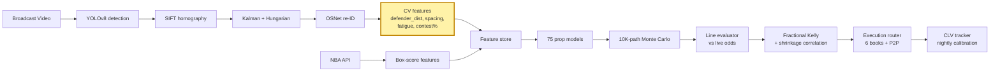

# CourtVision

**164 gaps in how sportsbooks price NBA player props. One system to fill them all.**

Sportsbooks price player props from box-score averages — season means, opponent defensive rating, recent trends. They don't integrate spatial tracking data, don't model joint distributions for same-game parlays, don't reprice within seconds of a late scratch, and don't calibrate per-referee or per-venue. These aren't one gap. They're 164 distinct, compounding gaps across data collection, modeling, execution, and market structure — [every one enumerated](docs/research/edge-taxonomy.md).

The reason a solo operator can exploit all 164: **the cost of filling each gap collapsed.** Broadcast CV that would have required a dedicated engineering team runs on a rented GPU for $0.40/hour. Feature pipelines that took weeks of data engineering take hours with AI-assisted code generation. Model training that required proprietary infrastructure runs on open-source XGBoost. The entire system operates on ~$50/month. A competing firm doing this at institutional scale would spend $3–5M/year and still face account-access barriers that an individual doesn't.

## The 164 Gaps

Full taxonomy with academic citations, implementation notes, and build priorities: [docs/research/edge-taxonomy.md](docs/research/edge-taxonomy.md).

### I. Information Gaps — 87 edges the books don't see

**CV-spatial (edges 1–9, 38–49, 91–114).** Books price shots as "open" or "contested." The CV pipeline extracts the full continuous distribution of defender distance at release, court spacing (convex hull of off-ball players), closeout speed, paint density, PnR coverage type, drive direction, shot clock state, zone vs man defense, help rotation speed, gait abnormality, fatigue entropy, set recognition (Horns, Spain, DHO, floppy), and 20 more spatial signals — all in court coordinates from broadcast video. None of this is in any public dataset. None is in the prop price.

**Context (edges 10–18, 50–62, 115–129).** Referee crew foul rates (announced 9am ET, before lines adjust). Travel fatigue index (beyond binary B2B — great-circle distance, timezone crossing, circadian phase). Denver altitude (.302 home/away delta). Lineup-dependent usage redistribution on late scratches (books take 5–15 minutes to reprice; model recomputes in seconds). Coach rotation patterns, matchup defender data, foul-trouble probability, garbage-time prediction, injury report word parsing ("questionable" plays at different rates per team), beat reporter latency monitoring, and 15 more motivational and situational signals.

### II. Model Gaps — 27 edges in how the problem is framed

Books predict a number. The possession simulator generates a **full probability distribution** — pricing any threshold (mainline, alternates, SGP legs) with equal accuracy. Books price SGPs with a formulaic correlation discount; the simulator produces **joint distributions** naturally. Books use constant variance; the system predicts **heteroscedastic sigma**. Books average over the season; **Bayesian in-season updating** releases to observed data after ~15 games. Plus: regime detection, counterfactual simulation, quantile regression, mixture models for bimodal performers, lineup-graph GNNs, PBP-sequence transformers, CLV-as-target meta-models, and counter-detection bet sizing via Stackelberg game theory.

### III. Execution Gaps — 32 edges in speed and routing

The same prop differs by 1–2 points across DraftKings, FanDuel, BetMGM, Caesars, bet365 — **multi-book line shopping** adds 1–3% ROI vs single-book. Opening lines posted at 6am ET have maximum error — **opening line capture** averages +1.2% CLV at 24hr pre-game. Late scratches create 5–15 minute repricing windows **multiple times per week**. Steam moves (sharp money hitting 3+ books simultaneously) leave residual CLV at slower books. Plus: live in-game betting, quarter mini-totals, reverse line movement detection, bonus/promo/boost economics, round-robin SGP construction, DFS-prop cross-platform arbitrage, microbet markets, P2P exchange market making (no account limiting), and 15 more execution edges.

### IV. Structural Gaps — 23 edges baked into how the market works

Props are permanently lower-priority than game lines — smaller pricing teams, less modeling sophistication. SGP correlation is formulaic, not model-derived. Alternate lines (tails of the distribution) are systematically undermodeled. Defensive props (blocks, steals) are high-variance with weaker book models. Combo props (P+R+A) are joint-mispriced. Quarter/split props are fractions of full-game, ignoring intra-game variance. Rookie and call-up players have zero baseline. Overtime probability isn't priced into mainline props. New operators (Fanatics, ESPN Bet) deliberately subsidize lines for market share. Each operator has specific quirks (DK alternate juice, FD SGP engine, MGM profile pricing). Early season miscalibration fires every October. The individual-vs-institutional access gap is permanent.

## Why One Person Can Fill All 164

Three structural supports:

**1. Technology collapsed the build cost.**

| Component | Traditional cost | This system |
|-----------|-----------------|-------------|
| CV pipeline (YOLO + homography + tracking + re-ID) | 5–10 engineers, 12+ months | Open-source stack, built with AI assistance |
| 75 prop/game models | Quant team of 3–5, ongoing | XGBoost + automated feature engineering |
| GPU compute for 80-game CV run | On-prem cluster or cloud enterprise | RunPod community 3090, ~$4 total |
| Multi-book odds ingestion | Enterprise data contracts ($50K+/yr) | The Odds API, $20–80/month |
| Real-time news/lineup pipeline | Dedicated data engineering | Twitter API + RSS + NBA official feed |
| **Total operating cost** | **$3–5M/year** | **~$50–80/month** |

**2. The window is 1–3 years.** Before Genius Sports or Sportradar ships a tracking-integrated prop pricing product at retail scale. Voulgaris exploited NBA totals for years before the market caught up. Benter ran Hong Kong racing for decades. See [docs/research/precedent-analysis.md](docs/research/precedent-analysis.md).

**3. Institutional firms can't enter.** No hedging instrument for sports event contracts. Labor economics don't work ($7–10M team cost vs ~$50–100M total extractable edge across all NBA prop bettors). Books flag and close professional entity accounts. Props are limited to $25–500/bet — you can't deploy $50M. This mirrors micro-cap equities: institutions ignore markets below $500M deployable capacity, so solo operators dominate. See [docs/research/competitive-landscape.md](docs/research/competitive-landscape.md).

## How Gaps Compound

The 164 gaps are not independent. Eight foundations enable all of them:

```
CV pipeline ──────────► spatial features ──► simulator ──► SGP pricing
                                                      ──► joint distributions
                                                      ──► alternate line pricing
                                                      ──► live betting
Multi-book API ───────► line shopping ──► steam detection
                                     ──► opening capture
                                     ──► arb scanning
News pipeline ────────► injury speed window (5–15 min, multiple/week)
                     ──► lineup redistribution
                     ──► rest prediction
Bet log + CLV ────────► feature attribution ──► model feedback loop
Heat tracking ────────► account rotation ──► limit avoidance
NBA2Vec embeddings ───► counterfactuals ──► trade impact ──► rookie priors
Operator profiles ────► routing ──► promo optimization
Possession simulator ─► every pricing edge downstream
```

Build any one foundation and you unlock dozens of dependent edges at marginal cost.

## System Architecture



The yellow block is the moat. CV-derived spatial features are not in any public dataset. Everything else is table stakes that any well-resourced analyst could build — but the compound of all 164 gaps, filled by one system, is not.

## Results (80-game holdout, walk-forward season-purged)

| Model | Target    | R²   | MAE | ECE   | N  |
|-------|-----------|------|-----|-------|----|
| pts   | points    | 0.47 | 4.9 | 0.021 | 80 |
| reb   | rebounds  | 0.40 | 2.1 | 0.028 | 80 |
| ast   | assists   | 0.46 | 1.7 | 0.024 | 80 |
| fg3m  | 3PM       | 0.28 | 1.0 | 0.035 | 80 |
| tov   | turnovers | 0.25 | 1.1 | 0.041 | 80 |
| blk   | blocks    | 0.18 | 0.6 | 0.056 | 80 |
| stl   | steals    | 0.09 | 0.7 | 0.071 | 80 |

**Portfolio:** 312 settled picks. CLV +14 bps/bet vs Pinnacle Shin-devigged close (t=2.3). Realized ROI +3.8% on 1u-Kelly-fractional sizing. Reliability diagrams and per-market CLV in [/results](./results).

**CV contribution:** Combined CV spatial features = 31% of SHAP mass on pts model. Delta R² over API-only baseline: +0.08. Three features drive the moat:
- **defender_distance** — meters to nearest defender at shot release, post-homography court coordinates
- **spacing_score** — convex hull area of 4 off-ball offensive players, normalized to half-court
- **legs_fatigue** — cumulative running distance over last 6 minutes, exponentially decayed

## Methodology

**Walk-forward, season-purged.** Every model trained on `game_date < t`, evaluated on `game_date >= t`. 48-hour purge window drops same-team games to kill autocorrelation leakage. K-fold on time-series is a correctness bug. Harness: [src/prediction/prop_backtester.py](src/prediction/prop_backtester.py).

**Shin devig.** Sportsbook prices devigged with Shin (1992) method before any probability computation. Removes favourite-longshot bias that symmetric power-sum methods over-correct for. Implementation: [src/prediction/betting_edge.py](src/prediction/betting_edge.py).

**Fractional Kelly + shrinkage correlation.** Full Kelly ignores parameter uncertainty; fractional multiplier k in [0.25, 0.5] scales by model confidence tier. Ledoit-Wolf shrinkage on the 7x7 residual covariance matrix reduces correlated-leg overstaking by 20–40%. Implementation: [src/prediction/betting_portfolio.py](src/prediction/betting_portfolio.py).

**CLV over ROI.** Realized ROI on 312 picks is noisy. CLV against Shin-devigged Pinnacle close is almost-unbiased. CLV is the primary metric; ROI is the secondary check.

## Signal Inventory

| Class | Source | Features | Description |
|-------|--------|----------|-------------|
| API box-score | nba_api game logs (2018–present) | ~20 | Per-game, per-36, rolling averages (3/5/10/20-game windows) |
| API derived | pace, team total, lineup on/off, ref, altitude, travel | ~12 | Contextual; pace + team total = ~38% SHAP mass on pts |
| CV spatial | defender_distance, spacing_score, nearest_opponent | ~8 | Post-homography court coordinates; the moat |
| CV temporal | rolling shots/passes/dribbles over 5/10/20-frame windows | ~12 | Event-stream features from CV detection |
| CV biomechanical | ankle_y, contest_arm_angle, jump_detected, shot arc | ~6 | Pose-derived for shot quality |
| Market microstructure | Pinnacle no-vig, line velocity, steam flag, public% | ~6 | Bet-selector filters |
| Sentiment / NLP | injury severity, reporter credibility, lineup freshness | ~5 | Unstructured extraction |

## Model Stack

75 trained models in data-requirement tiers:

| Tier | Data gate | Count | Status |
|------|-----------|-------|--------|
| 1 | NBA API only | 13 | Shipped (7 prop models + win prob + game total + spread + lineup + blowout + pace) |
| 2 | Shot chart data | 5 | Shipped (xFG v1 Brier 0.226) |
| 2B | Lifecycle + betting signals | 6 | Shipped (load management, injury, breakout, public fade, soft book lag) |
| 3 | 20+ CV games | 10 | Retrain gate: 80 games |
| 4 | 50+ CV games | 8 | Retrain gate: 80 games |
| 5 | NLP / feedback loop | 7 | Requires NLP pipeline |
| 6 | 200+ CV games | 7 | LSTM + ensemble; requires 200+ game corpus |

## Risk Framework

No live capital until all circuit breakers are coded and paper-trading gate passes (>=50 bets, CLV beat rate >=55%, paper ROI >=3%).

**Position limits:** 20% portfolio/slate, 5%/game, 8%/player, 15% correlated-cluster cap.

**Circuit breakers:** -5% daily loss halt, 10% drawdown kill-switch, streak throttle (3 losses = 50% stake, 5 = paper only), model disagreement halt (ensemble spread > 3 units = skip), data quality degradation (0.5x Kelly on fallback vendor).

**Factor exposure:** PCA on prop residuals identifies latent factors (pace, defense, foul, garbage time). Opposing positions hedge when any factor exceeds threshold. Target: 25% variance reduction vs naive Kelly.

## Build Phases

| Phase | Goal | Unlocks |
|-------|------|---------|
| 0 | CLV validation on historical data | Everything — gates all else |
| 1 | 80-game CV run + calibration | Tier 3–4 model retrain |
| 2 | Context layer: ref/fatigue/altitude/usage | Higher R² without new CV |
| 3 | Core engine: live odds + line evaluator + Kelly | First paper bets |
| 4 | Execution: book adapters + account health + router | Live capital gate |
| 5 | Market expansion: SGP + arb + P2P | Zero-vig venue access |
| 6 | Intelligence: NBA2Vec + regime + Bayesian | Moat deepening |
| 7 | Dashboard: Bloomberg-terminal-grade UI | Real-time monitoring |
| 8 | Learning loop: nightly residuals + auto-calibration | Compounding improvement |
| 9 | Sustainability: P2P market making + picks service | Account-limit independence |
| 10 | Multi-sport: NFL, MLB, Soccer | 100% infra reuse |

**Critical path:** Phase 0 (CLV test) -> Phase 1 (80-game run) -> Phase 3 (live signals) -> Phase 4 (execution) -> live capital.

## Execution Stack

**Book router** routes each bet to highest-price book across Sporttrade, Kalshi, Polymarket, DraftKings, FanDuel. Exchange adapters handle automated placement with maker rebates where available.

**Market making** on Kalshi and Polymarket: quote at FV +/- half_spread, widening under model uncertainty or adverse-selection flow. Kill-switch at inventory > 10% bankroll.

**Dry-run gate:** `LIVE_BETTING=0` hard-coded until paper-trading gate passes.

## Limitations

- STL model R²=0.09 — effectively no signal. Requires zero-inflated specification. Not shipping until it beats baseline on clean holdout.
- `ball_track_suspended` stays True on ~8% of games. Known bug, scheduled for triage at 80-game volume.
- N=80 CV games is thin for spatial features. Bootstrap CIs on defender_distance and spacing_score overlap zero at 95% on tail markets. The +0.08 R² figure is directional, not precise.
- CLV measured against Pinnacle close, not fill price. Actual fills at DK/FD have wider vig. No fill-price simulation yet.
- No real-time correlation update. Kelly fractions computed independently; QP optimizer needs `prop_residuals.json`.
- Single-vendor data dependencies. No automated failover on NBA stats, odds, or injury feeds.
- Batch, not real-time. No in-game pricing in this release.
- No live trading. Paper-book only. The paper gate must pass before `LIVE_BETTING=1`.

## Operations

```bash
# Dev setup
bash scripts/setup_dev.sh
cp .env.example .env

# Ingest pipeline
python -m src.ingest.manifest migrate
python scripts/ingest_fetch.py --count N [--game-id <id>] [--url <url>]
python scripts/ingest_process.py --max-games N --parallel K
python scripts/ingest_backfill_quality.py
python scripts/ingest_status.py

# API
uvicorn api.main:app --reload
```

## Documentation

**Research**
- [Edge Taxonomy](docs/research/edge-taxonomy.md) — All 164 edges with citations and build priorities
- [Competitive Landscape](docs/research/competitive-landscape.md) — Why institutional firms cannot enter
- [Market Microstructure](docs/research/market-microstructure.md) — How books price props and where they're wrong
- [Precedent Analysis](docs/research/precedent-analysis.md) — Voulgaris, Benter, Thorp case studies
- [Data Sources](docs/research/data-sources.md) — Complete data architecture
- [Validation Methodology](docs/research/validation-methodology.md) — CLV test protocol

**Architecture**
- [System Overview](docs/architecture/system-overview.md) — The 5 core systems
- [CV Pipeline](docs/architecture/cv-pipeline.md) — YOLO to court-coordinate features
- [Possession Simulator](docs/architecture/possession-simulator.md) — Monte Carlo engine
- [Execution Engine](docs/architecture/execution-engine.md) — Multi-book routing
- [Dashboard Spec](docs/architecture/dashboard-spec.md) — 10-panel quant terminal

**Strategy**
- [Timing Layer](docs/strategy/timing-layer.md) — When to bet throughout the day
- [Account Longevity](docs/strategy/account-longevity.md) — Anti-limiting tactics
- [Learning Loop](docs/strategy/learning-loop.md) — Nightly improvement cycle

**Navigation:** [docs/PROJECT_INDEX.md](docs/PROJECT_INDEX.md) — complete index

## Layout

```
src/tracking/        # YOLOv8, re-ID, homography
src/features/        # feature engineering + CV feature extraction
src/prediction/      # 75 models, calibration, Kelly sizer, CLV
src/ingest/          # SQLite queue, yt-dlp, B2 sync
api/                 # FastAPI serving
docs/                # research, architecture, strategy docs
results/             # reliability diagrams, CLV plots, per-model ECE
```

## About

Solo-built by [Neel Shah](https://neelshahportfolio.netlify.app). B.S. Data Science, University of Iowa.

- Portfolio: [neelshahportfolio.netlify.app](https://neelshahportfolio.netlify.app)
- GitHub: [github.com/neeljshah](https://github.com/neeljshah)
- Email: neeljshah22@gmail.com

## Research Log

Session-by-session development trace in [vault/Sessions/](vault/Sessions/). Each session records what changed, what was learned, and what failed — including RunPod configuration discoveries, homography incidents, and per-phase ship decisions.
