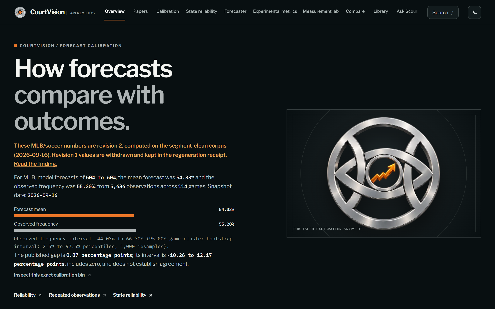
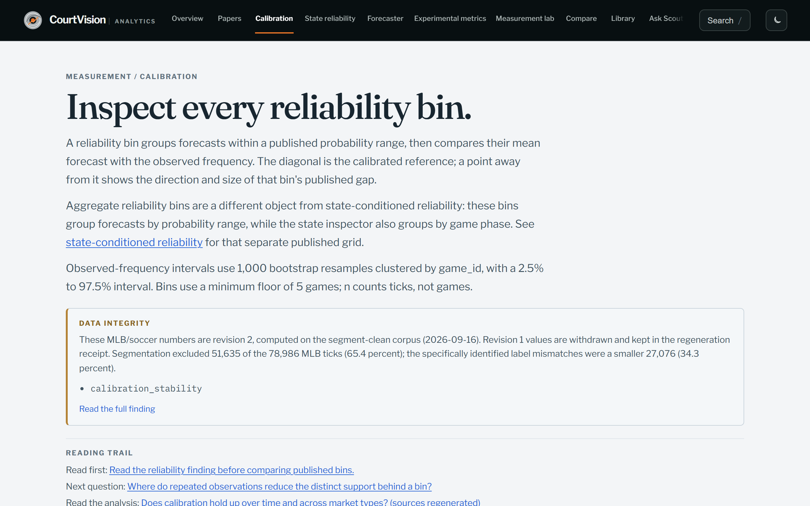
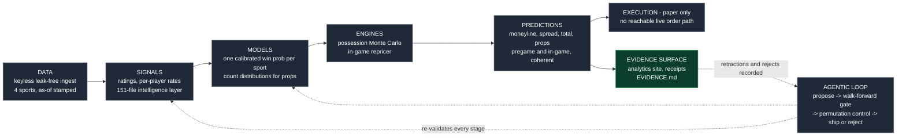

# CourtVision

**Calibrated multi-sport forecasting, audited in public -- with the rejects and retractions left in.**

### [Open the live analytics site -> neeljshah.github.io/court-vision/analytics](https://neeljshah.github.io/court-vision/analytics/)

**Reading this as a trading desk or quant team?** Start with the one-page
[desk brief](docs/QUANT_BRIEF.md): pricing quality against the devigged close and the live market,
what exists and what it is evidence of, and what is not shown.

[](https://github.com/neeljshah/court-vision/actions/workflows/deploy-demo.yml)
[](https://github.com/neeljshah/court-vision/actions/workflows/webapp-qa.yml)
[](https://github.com/neeljshah/court-vision/actions/workflows/proof.yml)

[](https://neeljshah.github.io/court-vision/analytics/)

CourtVision is an NBA-origin forecasting and decision-research system covering NBA, MLB, soccer
and tennis. Its central result is deliberately unglamorous: **against real closing lines the
market is efficient.** The pregame model matches the Shin-devigged close within noise; conditioning
on the realized game state sharpens the forecast against a static prior, and the live market has
that state too. Everything here is a calibration result. Nothing here is a betting-edge claim.

## Results at a glance

Every row links to its proof in **[EVIDENCE.md](EVIDENCE.md)** (claim -> number -> verdict ->
artifact -> reproduce command).

| Question | What the record says | Verdict |
|---|---|---|
| Does the pregame model beat the closing line? | NBA held-out Brier 0.1735 vs 0.1666 for the devigged close (n=743, CI includes 0); same picture across six corpora | matches or trails the close -- never beats it |
| Does in-game state help? | vs a static pregame prior: NBA Brier 0.209 to 0.159, MLB 0.241 to 0.126 | sharper than static |
| Does it beat the live market? | NBA end-Q1: market sharper (n=1,592). Later checkpoints: underpowered. Kalshi paired ticks (2026-09-14): model behind | no -- and the page says so |
| How many discovered signals shipped? | 0 of 60 candidate classes; 513 recorded reject / defer verdicts | the gate rejects, by design |
| What got retracted? | six headline figures, each root-caused to a leak or a grading artifact by the project's own harnesses | [the retraction record](docs/evidence/retraction-story.md) |
| Player-prop accuracy | PTS MAE 4.83, REB 1.92, AST 1.39 on a 20,354-row chronological holdout | accuracy only |

The strongest signal in this repository is not a metric. It is that the same person who built
the system also built the instruments that caught his own overclaims, and published the result.

## How far it goes

One person directing an agentic build pipeline, 6,800+ commits since March 2026. Counts below are read
from committed artifacts or the audited [evidence packet](docs/JOB_EVIDENCE_PACKET.md); the layer-by-layer
map is **[docs/CAPABILITIES.md](docs/CAPABILITIES.md)**.

| Layer | Scale |
|---|---|
| Sports covered by one kernel + per-sport adapters | NBA, MLB, soccer, tennis |
| Analytics site (public, static, CI-gated) | 29 research papers, 77 measurement modules, 18 findings, 10 interactive inspectors, 1,549 entity cards, 1,653 searchable records |
| Intelligence layer between raw data and models | 151 files; a 291,625-pair player-vs-player matchup matrix; 1,249 player dossiers across 28 categories |
| Signal discovery under a gate built to refute | 60 candidate signal classes, 0 shipped; 513 recorded reject / defer verdicts; 197 hypothesis-ledger rows with every NULL kept ([the ledgers are public](domains/)) |
| Fact-claims corpus | 103,048 generated claims, 101,864 re-verified from their declared source and formula |
| Simulation | possession-level Monte Carlo where the negative teammate correlation emerges from a shared scoring pie instead of a hand-tuned matrix |
| Engine (private repository) | about 99 API endpoints across 12 routers, 9 long-running daemons under a watchdog, a 430-module codebase, about 7,400 tests |
| Execution | paper only, behind [six pre-registered go-live gates](docs/GO_LIVE_GATES.md); the order lifecycle has no reachable live path |

## What is on the site

[](https://neeljshah.github.io/court-vision/analytics/calibration/)

- **[Calibration](https://neeljshah.github.io/court-vision/analytics/calibration/)** -- every reliability bin with a game-cluster bootstrap interval.
- **[Papers](https://neeljshah.github.io/court-vision/analytics/papers/)** -- research write-ups whose evidence paths are machine-checked against the published artifacts before deploy.
- **Inspectors** -- state reliability, residual anatomy, blowout timing, pitch sequencing, score decomposition, cross-sport comparability.
- **Experimental metrics, the measurement lab, Compare, the entity library (1,549 cards), and Ask Scout** -- every answer cites its artifact and `as_of` date, or returns `NO_DATA`.
- **[The retraction finding](https://neeljshah.github.io/court-vision/analytics/findings/retraction/)** -- what was claimed, what was wrong, how it was caught.

The site is a static export built from [`webapp/`](webapp/) on every push; published JSON is
scrubbed and receipt-checked in CI before it ships. Page-by-page map, data lineage and the CI gates:
**[docs/ANALYTICS_SITE.md](docs/ANALYTICS_SITE.md)**.

## Verify it yourself (no private data, about 5 minutes)

```bash
git clone --depth 1 https://github.com/neeljshah/court-vision.git
cd court-vision
pip install "numpy>=1.24" "pandas>=2.0" "matplotlib>=3.8"
python scripts/platformkit/analytics_showcase/check_all.py
```

Each showcase module re-verifies its own committed artifact; **0 FAIL is the bar**. Details and
scope limits: [REPRODUCE.md](REPRODUCE.md). Generated receipts, one row per measurement:
[RECEIPTS.md](RECEIPTS.md).

## How it is built



Green is what this repository holds; grey runs in the private engine. The full capability map, layer by
layer with scale numbers, status and a public place to verify each one, is
**[docs/CAPABILITIES.md](docs/CAPABILITIES.md)**.

One calibrated win probability per sport anchors the moneyline, spread, total and the in-game
reprice, so the markets are coherent reads off one engine rather than independent models that can
disagree. A sport-blind [`kernel/`](kernel/) holds the validated machinery; each sport is an
adapter. Candidate signals are proposed automatically and must survive walk-forward folds, a
null-shuffle permutation control, ablation against the full model, and a multiple-comparisons
correction before they ship. Most do not.

The code that enforces this is readable here: the walk-forward harness, leak guard, calibration
and deflated-metric modules in [`scripts/platformkit/eval_gate/`](scripts/platformkit/eval_gate/),
and the conformance and golden-set kit in [`kernel/testing/`](kernel/testing/).

Longer reads: [ARCHITECTURE.md](ARCHITECTURE.md) -
[the full system tour](docs/SYSTEM_TOUR.md) -
[how the honesty gates work](docs/HONESTY_SYSTEM.md) -
[how the agentic build pipeline works](docs/BUILT_WITH_CLAUDE.md) -
[the MCP answer-engine interface](docs/MCP_QUICKSTART.md)

## Repository map

| Path | What is there |
|---|---|
| [EVIDENCE.md](EVIDENCE.md) | the claim-by-claim evidence index -- start here |
| [docs/JOB_EVIDENCE_PACKET.md](docs/JOB_EVIDENCE_PACKET.md) | the adversarially audited account, including the do-not-claim list |
| [docs/evidence/](docs/evidence/) | per-claim pages, calibration artifacts, in-game and props gate results, written memos |
| [webapp/](webapp/) | the analytics site (Next.js static export) and its published data |
| [scripts/platformkit/analytics_showcase/](scripts/platformkit/analytics_showcase/) | the generators and committed artifacts behind the site |
| [scripts/platformkit/eval_gate/](scripts/platformkit/eval_gate/) | walk-forward, leak guard, calibration, multiplicity correction |
| [kernel/](kernel/) | sport-blind validated machinery |
| [docs/INDEX.md](docs/INDEX.md) | the full documentation map |

This repository is the public evidence surface. The production engine, sport adapters, API,
operational tooling, bulk raw corpora, model artifacts and ledgers are kept in a private repository;
reviewers can request read access. What is public is chosen by one reviewed allowlist
([scripts/hooks/public_allowlist.txt](scripts/hooks/public_allowlist.txt)) that the push guard enforces.

## What this is not

- Not a betting-edge or ROI product. No dollar figure on this repository is a result.
- Not third-party reproduced. `check_all.py` is self-serve *artifacts evaluated -- functional*;
  the private corpora behind recorded rows are not in a fresh clone.
- Not copyleft-clean: the computer-vision lineage depends on Ultralytics YOLO (AGPL-3.0). The
  repository's own code is proprietary and published for evaluation ([LICENSE](LICENSE)).

## Related public repos

Single-concept repos distilled from this platform, each runnable on its own: [shin-devig](https://github.com/neeljshah/shin-devig) (four de-vig methods incl. Shin 1992), [calibration-gate](https://github.com/neeljshah/calibration-gate) (Brier decomposition, ECE, recalibration, two-corpus acceptance), [walkforward-guard](https://github.com/neeljshah/walkforward-guard) (leak-proof time-series CV; the demo plants two leaks and catches both), [prereg-cards](https://github.com/neeljshah/prereg-cards) (pre-registration workflow), [sdv-calibration-audit](https://github.com/neeljshah/sdv-calibration-audit) (a calibration audit of a published sports-model probability column).

## Contact

Built solo by Neel Shah, directing an agentic build pipeline. Open to quant research, ML
engineering and founding-engineer roles, and to conversations about the system itself.

- Start with [docs/JOB_EVIDENCE_PACKET.md](docs/JOB_EVIDENCE_PACKET.md)
- Resume: [docs/assets/NeelShahResume.pdf](docs/assets/NeelShahResume.pdf)
- Portfolio: [neelshahportfolio.netlify.app](https://neelshahportfolio.netlify.app)
- Email: [neeljshah22@gmail.com](mailto:neeljshah22@gmail.com)

---

*All numbers are calibration and sharpness measures (Brier, CRPS, MAE, ECE). Retracted figures
appear only in explicit retraction context in [docs/JOB_EVIDENCE_PACKET.md](docs/JOB_EVIDENCE_PACKET.md)
and [docs/KNOWN_LIMITATIONS.md](docs/KNOWN_LIMITATIONS.md), never here.*
