# CourtVision — NBA AI System

An end-to-end NBA prediction and betting system built by one engineer over 12 months. Computer vision → court coordinates → 120 prediction modules → walk-forward calibrated → live execution stack.

**Built by [Neel Shah](https://neelshahportfolio.netlify.app)** — solo NBA quant, sports-AI engineer. Looking for sports quant / AI founding engineer roles. → [neeljshah22@gmail.com](mailto:neeljshah22@gmail.com)

---

## Real-Vegas Validation

**Two seasons. Two predictors. ~8,500 walk-forward bets against real DK/FanDuel/MGM/BetRivers closing lines.**

### 2024 NBA Playoffs (L10 baseline predictor)
Lines: DK/FanDuel/MGM/BetRivers via reisneriv/NBA_Player_Props archive.
Sample: 4,337 resolved bets, Apr 21 – May 24 2024.

| Metric | Value | Gate |
|--------|------:|:-----|
| Beat rate | **54.58%** | ≥55% (off by 0.4pp) |
| ROI | **+4.19%** | ≥3% — **PASS** |
| P&L | **+$18,182** on $433,700 staked | |

Per-stat: BLK +12.4% · REB +5.7% · FG3M +5.3% · STL +1.8% · PTS +1.0% · AST −0.5%.
Reproduce: `python scripts/run_gate1_playoffs2024.py`.

### 2025-26 Regular Season (PROD-STACK walk-forward OOF predictor)
Lines: DK/FanDuel/MGM via benashkar/nba_gambling archive (47 daily snapshots).
Sample: 4,210 resolved bets, Jan 28 – Apr 12 2026. Predictions from `data/cache/pregame_oof.parquet` — production model stack output, no leakage.

| Metric | Value | Gate |
|--------|------:|:-----|
| Beat rate | **54.37%** | ≥55% (off by 0.6pp) |
| ROI | **−2.06%** | ≥3% — **FAIL** at the aggregate |
| Per-book beat | BetMGM 55.8% · FanDuel 54.0% · DK 53.3% | |

But the **stat split shows where edge is real vs not**:

| Stat | N | Beat | ROI |
|------|--:|-----:|----:|
| **AST**  | 863 | **60.25%** | **+7.22%** |
| **FG3M** | 860 | **58.37%** | +0.34% |
| REB  | 1,133 | 53.13% | −3.12% |
| PTS  | 1,354 | 49.11% | −8.62% |

Reproduce: `python scripts/run_gate1_2025_26_prod.py`.

### What both results say together
- **AST and FG3M show consistent edge** — 60%/58% beat rate vs sharp regular-season closing lines is genuine signal, not noise.
- **PTS and REB at DK/FanDuel/MGM regular-season closes lose to the vig.** This is honest information about where the prod stack needs calibration work — and exactly the kind of stratified result a serious quant pipeline should surface, not hide.
- The **playoff result generalized → regular-season result tighter** — books refine PTS/REB lines aggressively over a full season; less time for inefficiencies to compound on AST/FG3M derivatives.
- This is a **lower bound on what's possible**. The prod stack already beats L10 by ~2.2pp in beat rate / ~3.5pp in ROI on the 2025-26 data. Calibration work in flight (per-stat bias correction, Pinnacle CLV daemon for Oct 2026) is the next pin.

Real DK/FanDuel/MGM closing lines and outcomes committed to repo at `data/external/historical_lines/` — every number above is fully reproducible from a fresh clone.

---

## Walk-Forward Model Performance

All numbers reproducible from committed JSON.

**Prop projections — walk-forward MAE @ q50 (N=99,818 player-games, 2 seasons)**
Source: [`data/models/quantile_pergame_metrics.json`](data/models/quantile_pergame_metrics.json)

| Stat | MAE | Recipe |
|------|----:|--------|
| PTS  | 4.65 | sqrt + Huber XGB/LGB + 5-seed MLP, NNLS-stacked |
| REB  | 1.90 | log1p LGB quantile q50 |
| AST  | 1.37 | log1p XGB+LGB + multitask MLP, NNLS-stacked |
| FG3M | 0.89 | log1p XGB quantile q50 |
| TOV  | 0.89 | log1p XGB quantile q50 |
| STL  | 0.72 | log1p XGB quantile q50 |
| BLK  | 0.44 | log1p XGB quantile q50 |

Q-regression at q50 outperforms squared-error blends here because sportsbook prop O/U lines score against the median, not the mean.

**Win probability — 5-way NNLS stack (XGB+LGB+LR+MLP+NB), N=2,455 games**
Source: [`data/models/win_prob_metrics.json`](data/models/win_prob_metrics.json)

| | 3-fold walk-forward | Single split |
|-|-:|-:|
| Accuracy | 70.94% ± 2.5pp | 71.69% |
| Brier    | 0.193 | 0.188 |

Walk-forward weights: LGB 0.66 · Naive Bayes 0.16 · LR 0.12 · MLP 0.03 · XGB 0.00. NNLS zeroed XGB autonomously — the stack picks its members on validation, not by mandate.

**In-game projections — endQ3 MAE vs pregame baseline (550-game retro)**

| Stat | Pregame MAE | endQ3 MAE | Δ |
|------|-----:|-----:|--:|
| PTS  | 4.61 | 2.46 | **−47%** |
| REB  | 1.91 | 1.00 | −48% |
| AST  | 1.36 | 0.68 | −50% |
| FG3M | 0.89 | 0.42 | −53% |
| TOV  | 0.89 | 0.45 | −49% |
| STL  | 0.72 | 0.32 | −56% |
| BLK  | 0.44 | 0.20 | −55% |

In-game predictions consume per-quarter snapshots and apply gated residual heads (foul-change, blowout, heat-check shrinkage) on top of the pregame baseline. Code: [`src/prediction/live_engine.py`](src/prediction/live_engine.py).

---

## Architecture

```mermaid
flowchart LR
  V[Broadcast Video] --> Y["YOLOv8n detection"]
  Y --> H["SIFT homography → court coords"]
  H --> T["Kalman + Hungarian tracking"]
  T --> R["OSNet re-ID (512-dim)"]
  R --> CV["CV spatial features\ndefender_dist, spacing, fatigue"]
  A[NBA API · 3 seasons] --> BF["Box + lineup + ref + travel features"]
  CV --> FS["Feature store"]
  BF --> FS
  FS --> PM["7 prop models · win prob · xFG"]
  FS --> LM["In-game models\nendQ1/Q2/Q3 ensembles"]
  PM --> SIM["10K-path Monte Carlo"]
  LM --> SIM
  SIM --> LE["Line evaluator\nShin (1992) devig"]
  LE --> K["Fractional Kelly\n+ correlation shrinkage"]
  K --> EX["Execution stack\n9 daemons (live, hedge, settle, CLV, alerts)"]
  EX --> CLV["CLV tracker → nightly recalibration"]
```



### Computer vision pipeline

YOLOv8n detects players / ball / referees per frame. SIFT homography maps detections from broadcast pixels to court coordinates (94×50 ft). Kalman + Hungarian tracks identities; OSNet re-ID (512-dim embeddings) recovers identity through occlusion. EasyOCR reads jerseys and game clock. EventDetector emits structured events: shot release, pass, contest, rebound, foul.

**Status: 85 tracked games** in `data/tracking/`. Target 80 CLEAN for the production CV-feature gate. Reproducible with `python scripts/batch_season.py`.

### Prediction stack

**120 prediction modules** in `src/prediction/`. 312 trained model artifacts in `data/models/`. Key components:

- **7 prop models** — quantile heads (q10/q50/q90) with empirical 80% coverage calibration
- **Win probability** — 5-way NNLS stack, autonomous member selection on validation
- **In-game ensembles** — separate boosters at endQ1, endQ2, endQ3 with v2 LGB+LR NNLS blend + pregame anchor
- **Gated residual heads** — foul-change, blowout, heat-check shrinkage dispatched on live conditions
- **Calibration layer** — quantile bands recalibrated per stat to 80% empirical coverage

### Execution stack (production-ready, awaiting October 2026 season)

9 daemons covering the full live loop:

| Daemon | Purpose |
|--------|---------|
| `live_inplay_daemon` | Real-time in-game projection + edge calculation |
| `auto_place_daemon` | Bet placement with risk-guard wrapping |
| `auto_settle_daemon` | Post-game W/L/P resolution + P&L |
| `clv_tracker_daemon` | CLV vs closing line per bet |
| `bankroll_monitor_daemon` | Kelly resizing as bankroll evolves |
| `middle_finder_daemon` | Cross-book middle / arb detection |
| `bov_scraper_daemon` · `nba_lineup_daemon` · `vault_dashboard_daemon` | Data feeds, lineups, telemetry |

Plus: live prop line ingestion (DK / FanDuel / Pinnacle / Odds-API), webhook alerts (Slack / Discord), hedge calculator, P&L ledger CLIs, mobile HTML dashboard.

---

## Engineering Breadth

Numbers from the repo, not projections:

| | |
|--|--|
| **Lines of code** | ~80K Python across `src/`, `scripts/`, `api/`, `tests/` |
| **Prediction modules** | 120 in `src/prediction/` |
| **Trained artifacts** | 312 (`.pkl`, `.json`, `.lgb`, `.pt`) in `data/models/` |
| **Tests** | 3,878 collected, full walk-forward gates |
| **Probes (signal experiments)** | 154 in `scripts/probe_*.py` — each a hypothesis with explicit ship/reject criteria |
| **Daemons** | 9 production live-loop services |
| **API** | FastAPI serving, 10+ endpoints (`api/main.py`) |
| **CV games processed** | 85 tracked, 7 with full feature extraction |
| **Probes rejected with documented WF gate failures** | ~20 (see [`docs/CLAUDE-state.md`](docs/CLAUDE-state.md) lines 101-102) |

**Discipline indicators:**
- Every probe ships behind a walk-forward gate. If a model wins on single-split but fails 2/4 WF folds → rejected. Documented.
- All predictions emit q10/q50/q90 — no fake point estimates dressed as confidence
- Shin (1992) bisection devig in `src/prediction/devig.py` (sharp-book-correct, not symmetric power-sum)
- Position limits + circuit breakers + Kelly-correlation shrinkage in `src/prediction/risk_guards.py`
- Walk-forward season-purged validation (48hr same-team purge) in `src/prediction/prop_backtester.py`
- Decision log preserved across sessions in `vault/Sessions/Decision Log.md`

---

## Tech Stack

**ML / data**: Python 3.9, PyTorch, XGBoost, LightGBM, scikit-learn, NumPy, pandas, Optuna
**CV**: YOLOv8n (Ultralytics), OpenCV, SIFT homography, OSNet re-ID, EasyOCR
**Serving**: FastAPI, uvicorn, SQLite + parquet feature store
**Data**: nba_api (30 seasons box / PBP / lineups), The Odds API, custom Pinnacle / DK / FanDuel / PrizePicks scrapers
**Infra**: RunPod (RTX 3090 GPU runs), Backblaze B2 storage, Docker, GitHub Actions CI
**Quant**: Walk-forward CV (season-purged), Shin devig, fractional Kelly, Ledoit-Wolf covariance shrinkage, NNLS stacking
**Tools**: Claude Code agents in the loop (CLAUDE.md routes agents to the right files on session start)

---

## What's Validated · What's Not

**Validated and shipped**
- Walk-forward prop MAE on 99,818 player-games (q50 quantile regression)
- 71.7% win prob accuracy on 2,455 holdout games
- −47% to −56% in-game MAE lift vs pregame on 550-game retro
- **Real-Vegas Gate 1 across two seasons (~8,500 bets)**: +4.19% ROI on 2024 playoffs (L10 baseline); 54.4% beat rate with strong AST (+7.2%) + FG3M (+0.3%) edges on 2025-26 regular season (prod stack walk-forward OOF)
- Full execution stack production-ready (9 daemons, tested, awaiting season)

**Honest gaps**
- **Pinnacle Gate 1** — no historical Pinnacle close archive exists; daemon runs October 2026 for first real sharp-book CLV reading
- **CV moat depth** — 7 games with full feature extraction; target 80 CLEAN for tier-3/4 model retrain
- **Live execution** — zero real money placed yet by design; gated behind Pinnacle Gate 1 and CV depth
- **Underprediction bias** — all 7 prop models predict slightly below closing line; calibration layer scaffolded, not yet trained

These are the next milestones, not disclaimers.

---

## Reproduce the Headlines

```bash
# Step 0: pull the free public Vegas-line archives (one-time, ~45 MB)
python data/external/historical_lines/fetch_external_history.py

# Walk-forward MAE check
python scripts/verify_production_mae.py

# Win probability check
python scripts/verify_winprob.py

# Real Vegas Gate 1 — 2024 NBA playoffs (L10 baseline, DK/FD/MGM/BetRivers)
python scripts/run_gate1_playoffs2024.py

# Real Vegas Gate 1 — 2025-26 regular season (PROD STACK, DK/FD/MGM)
python scripts/run_gate1_2025_26_prod.py

# L10 baseline variant on 2025-26 (for comparison vs prod stack)
python scripts/run_gate1_2025_26.py

# Test suite (3,878 collected)
python -m pytest tests/ -q

# End-to-end demo (pregame → snapshot → projection → EV → Kelly → settle → CLV)
python scripts/swish_demo.py
```

---

## Repo Layout

```
src/tracking/        YOLOv8, OSNet re-ID, SIFT homography, EventDetector
src/features/        feature engineering (60+ features, CV bridge)
src/prediction/      120 modules — 7 prop models, win prob, in-game stack,
                     calibration, Kelly + devig, CLV, risk guards
src/pipeline/        unified pipeline orchestrator
src/ingest/          SQLite queue, yt-dlp, B2 sync, parallel processing
api/                 FastAPI serving layer
scripts/             ~600 scripts: training, probes, daemons, ops CLIs
tests/               3,878 tests — walk-forward gates, integration, E2E
data/models/         312 trained artifacts
data/external/       historical_lines/playoffs_2024_canonical.csv (real Vegas)
docs/                architecture, research, strategy
```

---

## Contact

Solo-built. Looking for senior sports quant or AI founding engineer roles. Open to consulting on sports-AI infrastructure.

- **Portfolio**: [neelshahportfolio.netlify.app](https://neelshahportfolio.netlify.app)
- **GitHub**: [github.com/neeljshah](https://github.com/neeljshah)
- **Email**: [neeljshah22@gmail.com](mailto:neeljshah22@gmail.com)

---

*Last verified: 2026-05-26. State, current open issues, and ship log: [`docs/CLAUDE-state.md`](docs/CLAUDE-state.md), [`CHANGELOG.md`](CHANGELOG.md).*
