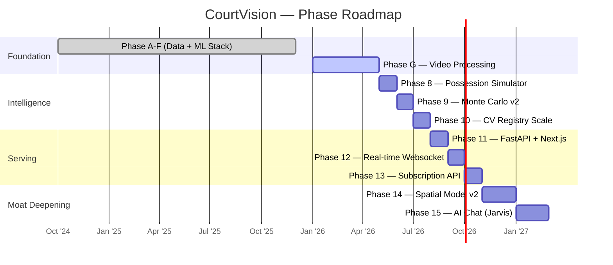

# CourtVision

> **Vertical Intelligence for the NBA betting market.**
> Spatial telemetry extracted from broadcast video — the same data class that costs professional teams $100K/year, rebuilt from first principles.


---

## The Moat

Every public model — and most quant shops — runs on box scores. Points, rebounds, assists. Numbers that are published 30 seconds after they happen and priced into the market within minutes.

CourtVision extracts what box scores don't contain:

| Signal | Source | Why It Matters |
|--------|--------|----------------|
| **Defender Distance** | CV homography → court coordinates | Contested vs. open shot quality, not available from stats |
| **Team Spacing** | Convex hull of 5-man unit, frame-by-frame | Predicts drive frequency, kick-out 3PA rate |
| **Fatigue Index** | Movement velocity decay over 4th-quarter possessions | Late-game prop accuracy delta vs. early market |
| **Pick-and-Roll Coverage** | Play-type classifier on tracking output | Matchup-specific scoring rate adjustments |
| **Off-Ball Positioning** | OSNet re-ID + court mapping | Offensive rebounding probability, second-chance likelihood |

This data is computed directly from broadcast H.264 video using a fully local GPU pipeline. No third-party data license required. No latency dependency.

---

## Architecture: Four Power Centers

### 1. CV Pipeline
`src/tracking/` · `src/pipeline/unified_pipeline.py`

The core telemetry extraction engine. Processes broadcast NBA video end-to-end.

```
H.264 Video
    └─ decord NVDEC decode          (GPU, ~20 fps/worker)
        └─ YOLOv8n detection        (advanced_tracker.py)
            └─ SIFT homography      (court_detector.py → rectify_court.py)
                └─ Kalman + Hungarian tracking  (advanced_tracker.py)
                    └─ OSNet Re-ID 512-dim       (osnet_reid.py)
                        └─ TeamColorTracker HSV  (color_reid.py)
                            └─ EasyOCR jersey #  (jersey_ocr.py)
                                └─ EventDetector (event_detector.py)
                                    └─ JSON tracking output → features
```

**Current throughput:** ~80 fps aggregate (4-worker, RTX 4090 cloud / RTX 4060 local)

### 2. Data Refinery
`src/data/` · `src/ingest/` · `src/fusion/`

24 scrapers with TTL caching build a multi-source game context layer fused with CV output.

**Sources include:** NBA Stats API, Basketball Reference, Pinnacle odds, Action Network, injury reports, beat reporter monitor, play-by-play, shot charts, referee tendencies, rest/travel, lineup data, and line movement.

**Fusion layer** (`src/fusion/`) resolves entity identity across sources, reconciles stat conflicts, and blends CV spatial priors with box-score features before model input.

### 3. 90-Model Ensemble
`src/prediction/`

A recursive 6-tier model stack covering every bet type.

```
Tier 1 — Context Models
    rest_day_model · back_to_back_model · travel_impact_model
    altitude_model · home_away_model · schedule_context

Tier 2 — Player State
    dnp_predictor · load_management · injury_risk
    hot_cold_streak_detector · usage_surge_detector · breakout_predictor

Tier 3 — Game Dynamics
    game_possessions_model · shot_clock_pressure_model
    garbage_time_detector · foul_trouble_predictor · regime_detector

Tier 4 — Spatial Adjustments  ← CourtVision moat layer
    contested_shot_predictor · defensive_matchup_classifier
    shot_quality · space_control · pick_and_roll · drive_analysis

Tier 5 — Prop Models (XGBoost + LightGBM stack)
    player_props.py → prop_model_stack.py
    pts R²=0.47 · reb R²=0.40 · ast R²=0.46 · fg3m R²=0.28

Tier 6 — Portfolio
    betting_portfolio.py (Kelly sizing + CLV tracking)
    parlay_optimizer · alt_line_ev_model · conformal_props
```

### 4. Monte Carlo Simulator
`src/simulation/`

10,000 possession-level game simulations per slate, seeded with CV spatial telemetry.

```python
# game_simulator.py → possession_simulator.py
# Each sim: lineup × fatigue × matchup × spacing state
# Output: win prob distribution, prop percentile bands, EV vs. closing line
```

Predictions are calibrated via `prediction_calibrator.py`, tracked via `prediction_tracker.py`, and auto-retrained after outcome recording (`auto_retrain.py`, `outcome_recorder.py`).

---

## The Empire Plan — Revenue Streams

| Stream | Mechanism |
|--------|-----------|
| **Personal Bankroll** | Kelly-sized edges from the portfolio engine, personal float |
| **Fund Management** | Systematic quant fund; institutional-grade drawdown controls |
| **Data Licensing** | CV spatial features licensed per-game to teams / media cos |
| **API Subscriptions** | SaaS tier: `/predict`, `/props`, `/edge` endpoints (FastAPI) |
| **Signal Feeds** | Real-time websocket edge alerts (`src/websocket/realtime_service.py`) |
| **Analytics Consulting** | Bespoke spatial analysis for front offices |
| **AI Chat (Jarvis)** | Natural-language betting assistant (`src/analytics/chat.py`) |

---

## Roadmap



**Current:** Phase G — processing 59 full-game 2025-26 videos through the GPU pipeline. 17/59 complete. Target: 20 A/B-grade CV games with spatial features feeding the model stack.

---

## Performance

| Metric | Value |
|--------|-------|
| GPU (local) | RTX 4060 8GB, CUDA 11.8 |
| GPU (cloud) | RunPod RTX 4090, 4-worker parallel |
| Throughput (local) | ~5.7 fps single-worker |
| Throughput (cloud) | ~80 fps aggregate (4× NVDEC decode) |
| CV Registry | 24 player-game records across 6 games |
| Prop models | 7 targets, XGBoost + LightGBM ensemble |
| Test suite | 960 passing, 93 skipped |
| Season gamelogs | 569/569 ingested (2024-25) |

---

## Stack

```
Vision       YOLOv8n · SIFT · Kalman-Hungarian · OSNet 512-dim · EasyOCR
ML           XGBoost · LightGBM · scikit-learn · PyTorch (re-ID training)
Data         PostgreSQL 14+ · SQLAlchemy · requests · BeautifulSoup
API          FastAPI · Uvicorn · Pydantic · WebSockets
Infra        conda (basketball_ai) · CUDA 11.8 · RunPod (cloud burst)
```

---

## Quick Start

```bash
conda activate basketball_ai

# Run the CV pipeline on a game clip (headless, GPU required)
python scripts/run_clip.py --game 0022400430 --no-show

# Batch process Phase G queue (RunPod recommended)
python scripts/run_phase_g.py --parallel 4

# Generate props predictions for today's slate
python -m src.prediction.player_props

# Run test suite
python -m pytest tests/ -q
```

---

## Project Layout

```
src/
├── tracking/        # CV pipeline — YOLO, homography, re-ID, OCR, events
├── pipeline/        # Orchestration, feature assembly, model registry
├── data/            # 24 scrapers, TTL cache, DB layer
├── ingest/          # Structured ingest modules (injuries, lineups, odds)
├── fusion/          # Entity resolution, stat reconciliation, spatial priors
├── features/        # 60+ engineered features + CV bridge
├── prediction/      # 90-model ensemble, prop stack, portfolio, simulator
├── simulation/      # Monte Carlo game + possession simulators
├── analytics/       # Spatial analytics, edge detection, CLV, chat
└── websocket/       # Real-time alert service
api/main.py          # FastAPI — 10 endpoints
database/schema.sql  # PostgreSQL schema (JSONB, generated columns)
scripts/             # Batch runners, cloud launchers
```

---

*CourtVision is a private research system. Not financial advice.*
