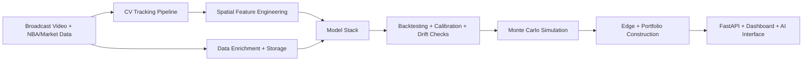

# CourtVision

**A full-stack NBA intelligence engine: computer vision + market data + ML + simulation.**

---

## Why This Project Matters

Most NBA prediction systems rely on the same public stats and converge to similar outputs.  
CourtVision is built to generate differentiated signal by reconstructing court-space behavior directly from broadcast video.

The objective is a defensible intelligence platform that can:

- model games and props as probability distributions (not single-point guesses),
- exploit structural inefficiencies in line pricing,
- and continuously improve as more games are processed.

---

## Why This Wins (One-Screen Summary)

**What exists now**
- Working CV tracking stack, feature pipeline, model orchestration, API and batch infrastructure.

**What is differentiated**
- Proprietary spatial telemetry from broadcast video (defender pressure, spacing, movement context), fused with structured NBA and market data.

**Why the prediction engine can outperform**
- Better inputs (CV signal), better structure (specialized model layers), better controls (leakage/calibration/drift gates), better execution (distribution-aware risk sizing).

**How progress is governed**
- Explicit failure gates, audit artifacts, and release criteria in `PLAN.md` and `.planning/ROADMAP.md`.

**Commercial path**
- Internal alpha engine -> fund-grade risk system -> API/data product for external users.

---

## Vision Lock (12-Month Focus)

CourtVision has one primary mission right now:

**Build the most reliable NBA game + player-prop prediction engine in the market, measured by reproducible out-of-sample performance and execution quality.**

Everything else in this repo supports that objective.

### What success looks like

- predictions are leakage-safe, calibrated, and drift-monitored,
- CV-derived features show measurable holdout lift,
- execution quality (CLV and risk controls) is stable over meaningful sample size,
- every public claim is backed by reproducible artifacts.

### What is explicitly out of scope until this is proven

- multi-sport expansion,
- broad UI redesign work,
- platform commercialization beyond prediction validation milestones.

---

## The Core Moat

CourtVision extracts proprietary spatial features that are difficult to replicate cheaply:

- defender distance and closeout pressure,
- team spacing and off-ball geometry,
- movement-derived fatigue and pace decay proxies,
- lineup-level behavior patterns from tracking continuity.

These CV-derived signals are fused with NBA/API/context/market data to power the prediction pipeline.

---

## End-to-End System

### 1) CV Tracking Pipeline

Key components include `YOLOv8`, homography rectification, Kalman/Hungarian tracking, OCR-assisted identity recovery, and `OSNet` re-identification.

Output:
- court-mapped player and ball trajectories,
- event primitives (shots, possessions, transitions),
- quality metadata for downstream gating.

### 2) Data Layer

CourtVision combines video-derived telemetry with structured context:

- NBA box, shot, lineup, and schedule context,
- injuries, referee context, and market lines,
- PostgreSQL-backed schema for reproducible model training.

### 3) Prediction Pipeline

The target architecture is a multi-layer ensemble (up to 90 models) spanning:

- game outcomes and win probability,
- player props across core stat markets,
- matchup/context/risk adjustment models,
- meta-model and calibration stack for reliability.

### 4) Simulation + Execution

CourtVision is built for distributional decision-making:

- possession/game simulation with Monte Carlo sampling,
- edge scoring against market prices,
- risk-aware sizing and portfolio controls (fractional Kelly + correlation discipline).

---

## Current Status

CourtVision is an advanced in-progress system, not a finished product.

Built today:
- working CV pipeline and tracking artifacts,
- broad feature engineering and model orchestration framework,
- API + batch infrastructure,
- active roadmap and failure-gate planning for world-class rigor.

In progress:
- scaling high-quality CV game coverage,
- strict leakage-proof backtesting and calibration gating,
- stronger correlation/risk controls for production-grade portfolio deployment.

See `PLAN.md` and `.planning/ROADMAP.md` for governance gates and execution details.

---

## What Makes The Prediction Pipeline Strong

The prediction pipeline is designed to compound edge through structure:

1. **Better raw signal** from CV-derived spatial context.
2. **Better model architecture** through layered specialization and meta-adjustment.
3. **Better validation discipline** through leakage controls, drift checks, and calibration gates.
4. **Better decision layer** through distribution-aware simulation and risk-constrained execution.

This is the key claim of CourtVision: not one model, but a compounding system where signal quality, model quality, and execution quality improve together.

---

## Repository Map

- `src/tracking/` - tracking, homography, re-ID, event detection
- `src/features/` - feature construction and transformations
- `src/prediction/` - model modules, props stack, portfolio logic
- `src/pipeline/` - orchestration, registries, retrain/validation flow
- `src/simulation/` - possession and game simulation
- `api/` - FastAPI serving layer
- `database/` - PostgreSQL schema and migrations
- `.planning/` - phased execution roadmap
- `PLAN.md` - canonical world-class operating plan

## Execution System

- `PLAN.md` - strategic priorities, failure gates, and 14-day sprint queue
- `docs/architecture.md` - full technical architecture and data flow
- `docs/scoreboard.md` - weekly KPI and sprint tracking sheet
- `docs/label_strategy.md` - GitHub issue labeling and triage rules
- `docs/WORLD_CLASS_CASE.md` - strategic narrative for category-leading potential
- `docs/AUTO_BETTING_AND_DASHBOARD_PLAN.md` - integrated live execution and frontend latency plan
- `.github/ISSUE_TEMPLATE/` - standardized issue templates for bugs, features, experiments, and gates

---

## Tech Stack

| Layer | Primary Tools |
|---|---|
| Vision | YOLOv8, OpenCV, EasyOCR, OSNet |
| ML | PyTorch, XGBoost, LightGBM, scikit-learn |
| Data | pandas, nba_api, PostgreSQL, Redis |
| API | FastAPI, Uvicorn |
| Runtime | Python 3.9, CUDA 11.8 |

---

## Collaboration

CourtVision is a proprietary quantitative R&D platform.  
Collaboration and investor conversations are welcome for:

- model quality and validation hardening,
- system architecture and production reliability,
- strategic commercialization of NBA intelligence products.

---

## License

All rights reserved.  
No reuse, redistribution, or commercial use without explicit written permission.
