# The Card Atlas -- a browsable gallery of descriptive entity cards

> **Navigate:** [Up: full doc map](INDEX.md) - [Home](../README.md) - [Analytics catalog](ANALYTICS_CATALOG.md) - [Evidence packet](JOB_EVIDENCE_PACKET.md)

**1,549 cards across 7 packs**, one PNG per entity, each rendered from a parquet already on
disk, gated by a **declared floor**, and stamped `DESCRIPTIVE_ONLY`. No card carries a
projection, an edge, or a dollar figure -- a card is a picture of what the data says about one
player, team, pitch, or game-state bucket, with the sample floor that let it render printed on
its face. This is the layer that makes the corpus *legible*: not the most decorated dashboard,
the **most auditable** one -- every number traces to a manifest entry, and every manifest entry
traces to a factory module you can re-run.

> Honesty rail (binding across this page): all numbers are descriptive box-score / rate /
> calibration readouts, **never a dollar edge**. Where a calibration card shows the market ahead
> of the model, that is stated plainly. The single truth-source for any figure is
> [docs/JOB_EVIDENCE_PACKET.md](JOB_EVIDENCE_PACKET.md).

---

## The seven packs (counts verbatim from the manifests)

Each count below is copied straight from the `n_entries` field of its manifest, and equals the
PNG count in its card directory. The 1,549 total is disk-verified against
`docs/img/atlas/**/*.png`.

| Pack | Cards | Entity | Card dir | Manifest | Data as-of |
|---|---:|---|---|---|---|
| NBA players | **482** | one qualified player | `docs/img/atlas/nba/` | `analytics_showcase/out/atlas_nba_manifest.json` | 3 seasons 2023-24 .. 2025-26 |
| NBA teams | **30** | all 30 franchises | `docs/img/atlas/nba_teams/` | `.../atlas_nba_teams_manifest.json` | 2026-04-12 |
| MLB pitching | **61** | 19 pitch types + 30 staffs + 12 counts | `docs/img/atlas/mlb_pitch/` | `.../atlas_mlb_pitch_manifest.json` | 2025-09-28 |
| MLB batters | **485** | one qualified batter | `docs/img/atlas/mlb_batters/` | `.../atlas_mlb_batters_manifest.json` | 2025-09-28 |
| Calibration | **26** | game-time checkpoint / prob-band | `docs/img/atlas/calibration/` | `.../atlas_calibration_manifest.json` | 2026-07-23 |
| Tennis (ATP) | **278** | one ATP singles player | `docs/img/atlas/tennis/` | `.../atlas_tennis_manifest.json` | 2026-07-19 corpus |
| Soccer clubs | **187** | one club | `docs/img/atlas/soccer/` | `.../atlas_soccer_manifest.json` | 2026-07-18 corpus |

**Total: 1,549 cards, 7 manifests, built by 6 factory modules.**

---

## How a card is generated

Every pack shares one factory, `scripts/platformkit/analytics_showcase/atlas_factory.py`, which
supplies `card_figure` (the multi-panel matplotlib renderer), `write_manifest`, `slugify`, and
`card_path`. A per-sport builder does four things and nothing more:

1. **Read** a parquet already on disk (no new ingest, no network).
2. **Apply a declared floor** -- a minimum-sample rule fixed in advance, *not* tuned to today's
   data. An entity (or a single metric) below its floor is dropped or shown `n/a`; it is never
   fabricated.
3. **Compute descriptive `key_numbers`** -- counting stats, rates, percentiles, calibration
   error. Nothing is a prediction.
4. **Render one PNG** (dpi-guarded to stay small -- NBA-player cards average ~23 KB, hard-capped
   at 60 KB) and **append a manifest entry** of the shared shape:

```
{ "entity": ..., "card_path": ..., "key_numbers": {...}, "floors": "<declared floor text>", "as_of": ... }
```

Each manifest header carries `"descriptive_only": true` and an `n_entries` count. The floor text
travels *with every entry* so a card can never be read without its sample caveat.

---

## NBA players -- 482 cards

Floor: **career total minutes >= 800** (yields 482 of 807 players). Two panels per card:
per-36 points / rebounds / assists by season (line), and career shooting splits FG% / 3P% / FT%
(bars). Box-score rates only -- **not** BPM / EPM / RAPM, and no projection. Source:
`data/domains/basketball_nba/player_boxscores.parquet` (77,744 rows, 807 players, 3 seasons).

**Nikola Jokic**
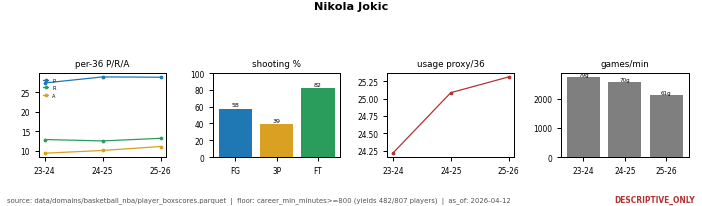
*210 games, 7429.0 min; per-36 28.4 / 12.8 / 10.1 pts/reb/ast; 57.6 / 38.9 / 81.8 FG/3P/FT%.*

**Stephen Curry**
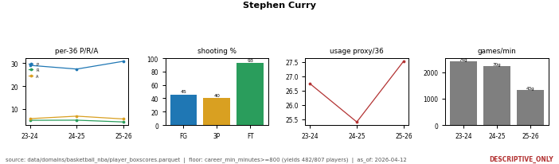
*187 games, 6002.9 min; per-36 28.9 / 4.8 / 6.0; 45.3 / 40.0 / 92.7 FG/3P/FT%.*

**Tyrese Haliburton**
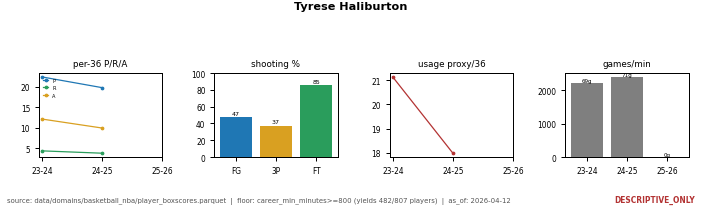
*140 games, 4617.6 min; per-36 21.1 / 4.1 / 11.0; 47.4 / 37.4 / 85.3 FG/3P/FT%.*

> Caveat carried on every card: diacritic-split player ids fragment a few rows (an upstream join
> quirk, unfixed); the box-only value index built from the same parquet is `DESCRIPTIVE_ONLY`,
> not a branded advanced metric.

---

## NBA teams -- 30 cards

Floor: **all 30 teams included** (each has >=200 team-games across the 3 seasons; no exclusion
floor needed). Three panels: points/gm composition (stacked 2P / 3P / FT), a box-score pace
proxy per game, and the five heaviest-minutes players' PRA/36.

**Denver Nuggets (DEN)**
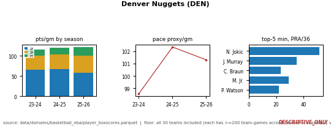
*242 games; 121.4 pts/gm (latest season); pace proxy 101.3; top contributor Nikola Jokic, PRA/36 51.2.*

**Boston Celtics (BOS)**
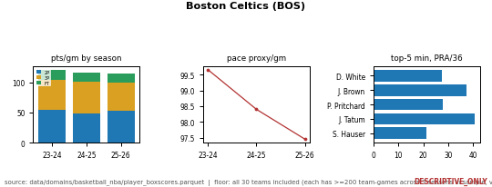
*246 games; 114.9 pts/gm; pace proxy 97.5; top contributor Derrick White, PRA/36 27.4.*

**Oklahoma City Thunder (OKC)**
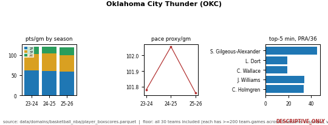
*245 games; 119.0 pts/gm; pace proxy 101.8; top contributor Shai Gilgeous-Alexander, PRA/36 45.4.*

> The pace figure is a single-side box-score estimate (`FGA - OREB + TOV + 0.44*FTA`), sanity-checked
> into the 97-106 range -- it is a proxy, **not** tracked possessions.

---

## MLB pitching -- 61 cards

2025 Statcast (as_of 2025-09-28). The 61 cards split three ways: **19 pitch types** + **30
pitching staffs** + **12 count states** (0-0 through 3-2). Floor: all 19 pitch-type codes and all
30 real franchises included, no exclusion (the smallest type, n=7, is shown for completeness, not
comparison). Panels: velocity percentiles (p10 / p50 / p90), count-state usage, and a ball /
strike / in-play outcome mix.

**Four-seam fastball (FF)**
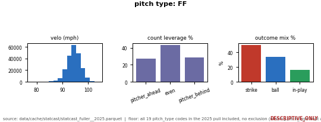
*220,235 pitches (31.78% of all pitches); velo p10/p50/p90 91.3 / 94.5 / 97.7 mph; outcome mix strike 49.6% / ball 34.0% / in-play 16.4%.*

**Slider (SL)**
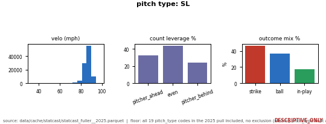
*99,357 pitches (14.34%); velo 82.7 / 86.4 / 89.7 mph; outcome mix strike 46.4% / ball 36.5% / in-play 17.1%.*

**Atlanta Braves pitching staff (ATL)**
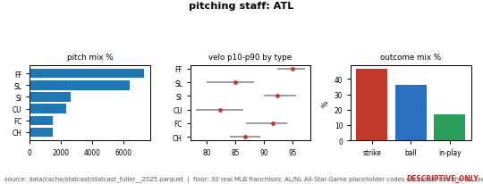
*23,350 pitches across 12 pitch types; top pitch FF at 31.3%; outcome mix strike 46.6% / ball 36.4% / in-play 17.0%.*

> This pull has no per-pitch swing/miss column (`type` merges called/swinging/foul into one strike
> bucket), so the ball/strike/in-play **outcome mix substitutes for whiff rate**. "Team" is the
> *pitching* side (defense), derived from `inning_topbot`.

---

## MLB batters -- 485 cards

2025 Statcast (as_of 2025-09-28). Floor: **pitches faced in 2025 >= 300** (yields 485 of 671
batters). Panels: velocity of pitches seen (percentiles), pitch-type-seen mix, rulebook-zone
rate, and exit velocity / estimated wOBA on contact.

**Aaron Judge**
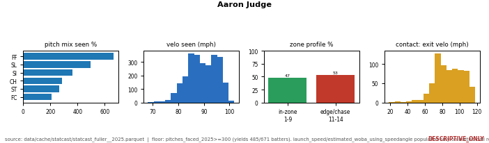

**Shohei Ohtani**
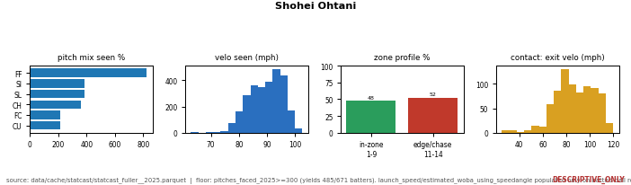

**Andrew McCutchen**
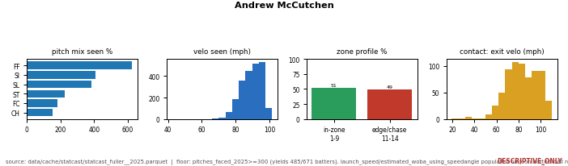
*2233 pitches faced (bats R); top type seen FF 28.0%; velo seen 81.3 / 90.0 / 96.3 mph; 51.4% in the rulebook zone; 693 batted balls, avg exit velo 83.2, exit-velo p90 102.5, avg estimated wOBA on contact 0.333.*

> The contact-panel n is *batted balls*, not pitches faced. This pull has no launch-angle or
> swing/miss column, so there is no barrel profile or whiff rate -- the same gap noted for the
> pitching pack. Every card's exact numbers live in its manifest entry.

---

## Calibration -- 26 cards

Built 2026-07-23 from the in-game checkpoint corpora (MLB moneyline + international soccer). Floor:
**n >= 30 rows per card** (declared, not tuned). Two card types: `time_checkpoint` cards plot the
model's ECE against the devigged market's ECE at each game-time slice; `prob_band` cards plot the
realized mean outcome inside a probability band, split by time bucket. This pack is where the
honesty rail bites hardest -- **the market is ahead of the model at most checkpoints, and the cards
show it.**

**MLB inning 1**
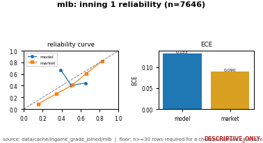
*n=7646; model ECE 0.1329 vs market ECE 0.0903 -- market better.*

**MLB inning 5**
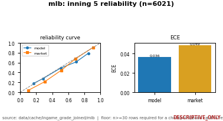
*n=6021; model ECE 0.0363 vs market ECE 0.0486 -- model better here.*

**International soccer, minute 0-15**
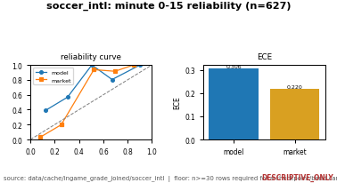
*n=627; model ECE 0.3065 vs market ECE 0.2204 -- market better.*

> These are ECE (calibration-error) readouts, not accuracy or profit. Showing the buckets where
> the market wins is the point: it is a backlog map, not an edge claim.

---

## Tennis (ATP) -- 278 cards

Sackmann ATP corpus (as_of 2026-07-19). One card per ATP singles player. Ten possible metrics:
hard / clay / grass win-rate (career and recent form), clay-minus-hard surface skew, and grass
adaptation. Per-metric floors (hard/clay/grass win-rate need n>=30; clay-minus-hard needs
n>=25 on each surface; grass adaptation needs n>=15). A metric below its floor prints `n/a` and
the card status reads `partial (k/10)` -- the pack is **ATP only** in this build.

**Rafael Nadal**
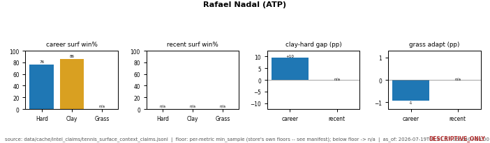
*Career hard win-rate 0.7611, clay 0.8564; clay-minus-hard +0.0953; grass adaptation -0.0094 (grass win-rate below floor, shown n/a). Status: partial (4/10).*

**Roger Federer**
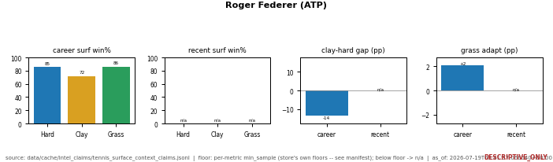
*Career hard 0.8543, clay 0.7179, grass 0.8592; clay-minus-hard -0.1363; grass adaptation +0.021. Status: partial (5/10).*

**Novak Djokovic**
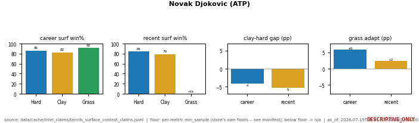

**Carlos Alcaraz**
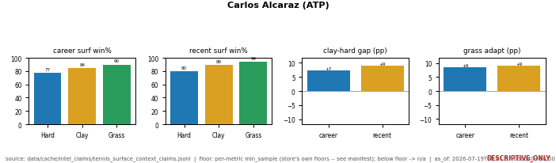

> `n/a` is a first-class value here: a card is honest about which surfaces a player has enough
> matches on, rather than back-filling a thin-sample rate.

---

## Soccer clubs -- 187 cards

football-data club corpus (as_of 2026-07-18). One card per club. Panels: points-per-game
(overall / home / away), goals for / against / difference over the last 10, win-rate, and
clean-sheet rate (last-10 / season / home / away). Floor: each rate needs its own trailing count
(`n_prior >= 10`, season clean-sheet needs `n_prior_season >= 5`); the window is trailing-10 as of
the corpus end -- **not** live current form.

**Arsenal**
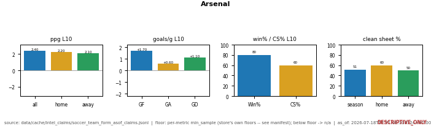
*ppg L10 2.4 (home 2.2 / away 2.1); GF 1.7, GA 0.6, GD +1.1; win-rate 0.8; clean-sheet L10 0.6, season 0.5135.*

**Barcelona**
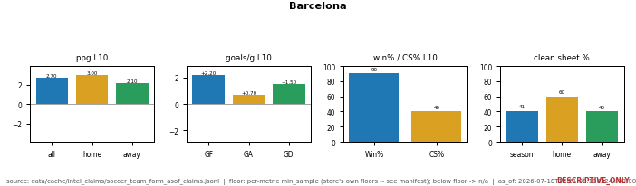
*ppg L10 2.7 (home 3.0 / away 2.1); GF 2.2, GA 0.7, GD +1.5; win-rate 0.9; clean-sheet L10 0.4, season 0.4054.*

**Bayern Munich**
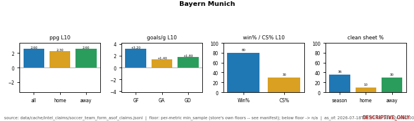
*ppg L10 2.6 (home 2.3 / away 2.6); GF 3.2, GA 1.4, GD +1.8; win-rate 0.8; clean-sheet L10 0.3, season 0.3636.*

> A metric a club does not clear shows `n/a`, never a fabricated value.

---

## How to browse

- **By eye:** open the card directory for a pack (`docs/img/atlas/<pack>/`) and scroll the PNGs.
  MLB pitching is further foldered into `by_type/`, `by_team/`, and count-state cards.
- **By data:** open the pack's manifest under `scripts/platformkit/analytics_showcase/out/`.
  Every entry gives the `entity`, its `card_path`, the descriptive `key_numbers`, the declared
  `floors` text, and `as_of`. The manifest is the source of truth for any number on a card.
- **By question:** ask the MCP answer engine (below).

---

## How the MCP serves cards -- the `atlas_card` resolver

The cards are wired into the fail-closed answer engine as one resolver,
`scripts/platformkit/answers/atlas_resolver.py`, registered under the category **`atlas_card`** in
`resolver_registry.py`. Route questions through `resolver_registry.resolve()` (category-agnostic);
the classifier hands atlas-shaped queries to this resolver.

**Query shapes:** `card for <entity>` or `show <entity> atlas` (e.g. `card for Nikola Jokic`,
`show Arsenal atlas`). The entity is name-normalized (accents, case, and punctuation stripped) and
matched **verbatim against the `entity` field** of every built manifest -- a literal match, never a
fuzzy guess against `key_numbers` or an aliased name.

**Fail-closed by construction:**

- no manifests built in the clone -> `no_data` ("run an atlas builder first");
- entity matches nothing -> `no_data` ("refusing, not guessing");
- one normalized name matched by 2+ manifests (a cross-sport collision) -> `ambiguous`, returning
  the candidate list; narrow with `sport_filter=`, which is opt-in only and never defaulted.

**On a hit** the envelope is descriptive and self-labelling:

```
{
  "status": "ok",
  "category": "atlas_card",
  "sport": "nba",
  "source_artifact": "scripts/platformkit/analytics_showcase/out/atlas_nba_manifest.json",
  "as_of": "...",
  "entity": "Nikola Jokic",
  "card_path": ".../docs/img/atlas/nba/nikola_jokic.png",
  "key_numbers": { ... },
  "floors": "career_min_minutes>=800 (yields 482/807 players)",
  "descriptive_only": true,
  "edge_claimed": false
}
```

`descriptive_only: true` and `edge_claimed: false` are emitted on every hit -- the resolver cannot
return a card without also returning the floor that gated it and the disclaimer that it is not an
edge.

---

## Reproduce

From the repo root (Python 3.10 local / 3.12 on the pod), each builder reads its parquet, writes
its PNGs, and rewrites its manifest. Runs are idempotent.

```
python -m scripts.platformkit.analytics_showcase.nba_player_atlas     # -> atlas_nba_manifest.json        (482)
python -m scripts.platformkit.analytics_showcase.nba_team_atlas       # -> atlas_nba_teams_manifest.json   (30)
python -m scripts.platformkit.analytics_showcase.mlb_pitch_atlas      # -> atlas_mlb_pitch_manifest.json   (61)
python -m scripts.platformkit.analytics_showcase.mlb_batter_atlas     # -> atlas_mlb_batters_manifest.json (485)
python -m scripts.platformkit.analytics_showcase.calibration_atlas    # -> atlas_calibration_manifest.json (26)
python -m scripts.platformkit.analytics_showcase.tennis_soccer_atlas  # -> atlas_tennis_manifest.json (278) + atlas_soccer_manifest.json (187)
```

Each module prints a JSON summary of what it wrote. The NBA builders expose `--check` to assert
manifest count == on-disk PNG count; the calibration and tennis/soccer builders run the same
parity check in their summary. Across all six the manifests total 1,549 entries, matching the
1,549 PNGs under `docs/img/atlas/**/`.

---
<!-- nav-footer -->
**Navigate:** [Up: full doc map](INDEX.md) - [Home](../README.md) - [Analytics catalog](ANALYTICS_CATALOG.md) - [Glossary](GLOSSARY.md) - [Evidence packet](JOB_EVIDENCE_PACKET.md)
