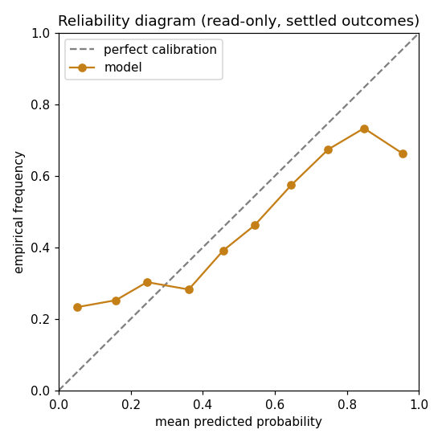

# Reliability diagram + Murphy Brier decomposition -- the calibration-analysis tool, worked on the *pre-conditioning baseline*

> **READ-ONLY calibration artifact + methodology demo.** Computed over already-settled (predicted probability, binary outcome) pairs. No model is trained, loaded, or re-predicted here; this only re-scores outcomes that are already final. `edge_claimed = False` -- this is forecaster calibration, not a dollar/ROI/edge claim. A live book sees the same in-game state, so no beat-the-market test applies.

> **What this diagram is (read this first).** The rows below are the **STATIC pre-conditioning in-game signal** -- the *baseline*, not the shipped forecaster. Its binned Brier (~0.237) sits right at the static MLB baseline (0.241) that [INGAME_PROOF.md](INGAME_PROOF.md) reports, and it is deliberately shown here **uncalibrated on purpose**: the whole point of the in-game conditioning step is to correct exactly this miscalibration, moving MLB Brier 0.241 -> 0.126 (calibration only). So a large gap here is the problem being solved, not a defect in the shipped output. This page exists to demonstrate the reliability/decomposition **tooling** (`scripts/platformkit/calibration_diagram.py`) and to make the baseline's shape legible; read it alongside INGAME_PROOF for the conditional (post-fix) result.

**Data it ran on:** local MLB in-game settlement join (`data/cache/ingame_grade_joined/mlb/*.jsonl`, gitignored -- absent from a fresh clone), each row = static model_prob vs realized outcome, `edge_claimed=False`. No committed per-observation win-prob walk-forward arrays exist yet (`results/winprob_walk_forward_results.json` holds only 3-fold summary scalars), so this worked example runs on the real settled baseline corpus; the tool retargets to any `(p, y)` jsonl via `--input` the moment conditional per-obs arrays are committed.

**N = 78,986 observations** across 227 settled game files; base rate (outcome mean) = 0.4563.

---

## Reliability table (10 equal-width bins)

| bin | n | mean predicted p | empirical freq | gap (p - freq) |
|---|---:|---:|---:|---:|
| [0.0, 0.1) | 5,127 | 0.0512 | 0.2331 | -0.1819 |
| [0.1, 0.2) | 4,495 | 0.1588 | 0.2525 | -0.0937 |
| [0.2, 0.3) | 4,708 | 0.2453 | 0.3031 | -0.0578 |
| [0.3, 0.4) | 7,071 | 0.3611 | 0.2826 | +0.0785 |
| [0.4, 0.5) | 14,736 | 0.4568 | 0.3916 | +0.0653 |
| [0.5, 0.6) | 17,652 | 0.5436 | 0.4619 | +0.0818 |
| [0.6, 0.7) | 9,214 | 0.6456 | 0.5745 | +0.0711 |
| [0.7, 0.8) | 5,364 | 0.7480 | 0.6743 | +0.0737 |
| [0.8, 0.9) | 5,866 | 0.8473 | 0.7335 | +0.1138 |
| [0.9, 1.0) | 4,753 | 0.9541 | 0.6632 | +0.2909 |

- **ECE** (n-weighted mean |gap|) = **0.0973**
- **MCE** (worst-bin |gap|) = **0.2909**

*(Reminder: this is the pre-conditioning baseline. High ECE/MCE here is the miscalibration the in-game conditioning step corrects -- see [INGAME_PROOF.md](INGAME_PROOF.md) for the post-conditioning MLB Brier 0.241 -> 0.126.)*

## ASCII reliability chart

```
  bin        pred|emp    0                                   1
  [0.0,0.1)   0.05|0.23  |  P      E                               |
  [0.1,0.2)   0.16|0.25  |      P   E                              |
  [0.2,0.3)   0.25|0.30  |          P E                            |
  [0.3,0.4)   0.36|0.28  |           E  P                          |
  [0.4,0.5)   0.46|0.39  |                E P                      |
  [0.5,0.6)   0.54|0.46  |                  E   P                  |
  [0.6,0.7)   0.65|0.57  |                       E  P              |
  [0.7,0.8)   0.75|0.67  |                           E  P          |
  [0.8,0.9)   0.85|0.73  |                             E    P      |
  [0.9,1.0)   0.95|0.66  |                           E          P  |
  (P=predicted  E=empirical  X=coincide;  horizontal P-E distance = calibration gap)
```



## Murphy 3-component Brier decomposition

Brier = **Reliability - Resolution + Uncertainty** (Murphy 1973). Lower reliability is better (calibration error); higher resolution is better (discrimination); uncertainty is the irreducible base-rate term.

| component | value | meaning |
|---|---:|---|
| Reliability (REL) | 0.012701 | calibration error -- lower better |
| Resolution (RES)  | 0.023628 | discrimination -- higher better |
| Uncertainty (UNC) | 0.248092 | base-rate variance (irreducible) |

**Identity check (exact):**
```
REL - RES + UNC = 0.012701 - 0.023628 + 0.248092
                = 0.237166   (Brier of the binned forecast)
raw Brier         = 0.237684
binning gap       = +0.000518  (raw - binned; discretization only)
```
The three components sum to the binned Brier exactly (verified to 1e-9 in the self-check); the raw continuous Brier differs only by the small binning-discretization gap shown above.

---
*Generated by `scripts/platformkit/calibration_diagram.py --self-check` then default build. No dollar/edge/ROI figure appears here; calibration only.*
