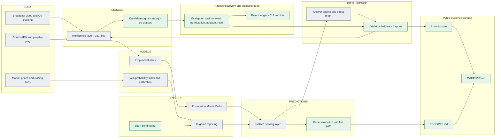

# What the full system does

CourtVision is an end-to-end sports forecasting system: broadcast video and sports APIs feed a
derived intelligence layer, which feeds a prop and win-probability model stack, a possession-level
Monte Carlo simulator and an in-game repricing engine, all wrapped in an agentic discovery loop that
proposes candidate signals and a leak-free gate that mostly rejects them. This page maps the
**whole** system, including the parts that now live in a private repository -- the public repo holds
the evidence surface only, so a visitor can no longer browse the engine. **Nothing here is a claim of
a dollar edge, ROI, or profit; none is claimed anywhere in this project** -- the product is a
calibrated predictor and the documented central result is that the market is efficient. Every number
below is transcribed from a cited artifact: the row-by-row index is
[../EVIDENCE.md](../EVIDENCE.md), the audited truth source for any figure is
[JOB_EVIDENCE_PACKET.md](JOB_EVIDENCE_PACKET.md), and the published reader is the live site at
https://neeljshah.github.io/court-vision/analytics/.

---

## The system in one diagram

Green boxes are readable in the public repository or on the live site; grey boxes are the private
engine, to which reviewers can request read access.

---

## Capability map

Status: **LIVE** on the site - **PAPER** - **RESEARCH** (recorded artifact) - **PAUSED** - **PRIVATE** (source private, evidence public).

### Computer vision

| Capability | Scale / measured result | Status | Verify publicly |
|---|---|---|---|
| Broadcast video to court coordinates on one consumer RTX 4060 | tracker slots resolved to real NBA identities: 17,254 `cv_features` rows / 241 games / 252 distinct player ids | PAUSED | [JOB_EVIDENCE_PACKET.md](JOB_EVIDENCE_PACKET.md) section 2A |
| Tracking math from primitives | 6D constant-velocity Kalman filter plus Hungarian assignment over a blended IoU and appearance cost, greedy fallback | PAUSED / PRIVATE | [JOB_EVIDENCE_PACKET.md](JOB_EVIDENCE_PACKET.md) section 2A, [CV_TRACKING.md](CV_TRACKING.md) |
| OSNet-x0.25 re-ID reimplemented in PyTorch | ships ImageNet-pretrained weights, not fine-tuned; the production appearance model is an HSV histogram | PAUSED / PRIVATE | [JOB_EVIDENCE_PACKET.md](JOB_EVIDENCE_PACKET.md) section 4 |
| Tracking-output quality, measured rather than assumed | about one detection in five sits on a player's feet; 0.181 sit on overlay furniture; both figures rater-robust across two independent model raters; the broader "on a player at all" rate failed the rater check and is withdrawn. One clip, one camera shot | PAUSED | [JOB_EVIDENCE_PACKET.md](JOB_EVIDENCE_PACKET.md) section 4 |
| Court calibration generalisation | hand-seeded per clip: NCAA 0/300, amateur 0 usable across 5 sources, soccer 0/1,195. Registration validity is the measured wall, not detection; sub-pixel reprojection residual is not evidence a map is valid | PAUSED | [JOB_EVIDENCE_PACKET.md](JOB_EVIDENCE_PACKET.md) section 4 |
| CV features reaching the models | every CV feature SHAP importance 0.0 in production prop models | PAUSED | [KNOWN_LIMITATIONS.md](KNOWN_LIMITATIONS.md) |
| Prior-season tracking aggregates added to the prop model | pts / reb / ast all `CEILING_ZERO` across three seasons | REJECT | [q06_gate_b_tracking_ablation_summary.json](evidence/props/q06_gate_b_tracking_ablation_summary.json) |

Tracking is paused as of 2026-09-17 pending new hardware. It was always a training-time teacher,
never a runtime dependency, so nothing on the live site depends on it.

### Data and intelligence layer

| Capability | Scale / measured result | Status | Verify publicly |
|---|---|---|---|
| Derived intelligence layer between raw data and models | 151 artifact files, counted on disk, dated 2026-06-02 | PRIVATE corpus, public manifest | [INTELLIGENCE.md](INTELLIGENCE.md) |
| Player-vs-player matchup matrix | 291,625 pairs built from 2,214 raw per-game tracking files across three seasons | PRIVATE | [JOB_EVIDENCE_PACKET.md](JOB_EVIDENCE_PACKET.md) section 2F |
| Idempotent single-writer knowledge graph | 690 nodes: 660 player plus 30 team notes | PRIVATE | [INTELLIGENCE.md](INTELLIGENCE.md) |
| Per-player dossiers | 1,249 dossiers across 28 statistical categories, archetype-labeled | PRIVATE | [PLAYER_INTELLIGENCE.md](PLAYER_INTELLIGENCE.md) |
| Fact-claims corpus, generated vs re-verified split | 103,048 generated claims; 101,864 recompute from their declared source file and formula. Provenance, not predictive accuracy | LIVE | [claims_corpus_meta.json](../scripts/platformkit/analytics_showcase/out/claims_corpus_meta.json) |
| Leak-safe as-of feature builders | strict expanding-window `shift(1)` joins with schedule-confound downgrade; each artifact's metadata states "descriptive not causal" | PRIVATE | [INTELLIGENCE.md](INTELLIGENCE.md) |

### Models and calibration

| Capability | Scale / measured result | Status | Verify publicly |
|---|---|---|---|
| NBA player-prop accuracy, production chronological holdout | MAE: PTS 4.83, REB 1.92, AST 1.39, FG3M 0.89, STL 0.71, BLK 0.44, TOV 0.89 on 20,354 player-game rows | RESEARCH | [EVIDENCE.md](../EVIDENCE.md) section A |
| Win-probability stack, 5-way NNLS | 0.709 accuracy / 0.193 Brier, 3-fold walk-forward, n=1,473 | LIVE | [winprob_walk_forward_results.json](../results/winprob_walk_forward_results.json) |
| NBA pregame win probability against the Shin-devigged close | Brier 0.1735 model vs 0.1666 close, gap +0.0069, 95% CI [-0.0036, +0.0175], n=743 -- `TRAILS_CLOSE`, CI includes 0 | RESEARCH | [EVIDENCE.md](../EVIDENCE.md) section A |
| Cross-corpus pregame calibration | matches the devigged close within noise on team-strength markets across six independent corpora; totals and ATP trail by a freshness gap | RESEARCH | [MARKET_EFFICIENCY_PROOF.md](MARKET_EFFICIENCY_PROOF.md), [cross-corpus-replication.md](evidence/cross-corpus-replication.md) |
| Shin 1992 de-vig implemented from scratch, plus three other methods | numerically stable bisection solver, production-wired | PRIVATE | [JOB_EVIDENCE_PACKET.md](JOB_EVIDENCE_PACKET.md) section 2C |
| Per-regime recalibration with leak-free keys | after-ECE nba 0.022205, mlb 0.009672, soccer 0.009192, tennis 0.016928 -- supersedes an earlier screen whose key was fitted on the scored rows | RESEARCH | [JOB_EVIDENCE_PACKET.md](JOB_EVIDENCE_PACKET.md) section 3 |
| Reliability curves and Murphy decomposition, four sports | all bins with bootstrap intervals, model vs market | LIVE | [live: calibration](https://neeljshah.github.io/court-vision/analytics/calibration/), [calibration-decomposition.md](evidence/calibration-decomposition.md) |
| Multi-corpus calibration acceptance gate | a calibration ships only if it beats raw on at least two independent out-of-sample corpora | PRIVATE | [JOB_EVIDENCE_PACKET.md](JOB_EVIDENCE_PACKET.md) section 2C |
| Playoff PBP replay validation | win-probability Brier 0.34-0.40 in-series, worse than a coin flip -- an honest negative, kept | RESEARCH | [JOB_EVIDENCE_PACKET.md](JOB_EVIDENCE_PACKET.md) section 3 |

### Simulation and in-game repricing

| Capability | Scale / measured result | Status | Verify publicly |
|---|---|---|---|
| Player-level possession Monte Carlo, with same-game pricing off its joint samples | teammate correlation about -0.10 emerges from a shared scoring pie sampled off real stint minutes, with no hand-tuned correlation matrix, correcting a prior simulator's +0.65; joint structure checked by a `validate_joint_calibration` harness | PRIVATE | [JOB_EVIDENCE_PACKET.md](JOB_EVIDENCE_PACKET.md) section 2F |
| In-game conditioning against a static pregame prior | NBA Brier 0.209 to 0.159; MLB 0.241 to 0.126 -- sharpness against a static prior, not against the market | RESEARCH | [INGAME_PROOF.md](INGAME_PROOF.md), [ingame-conditioning.md](evidence/ingame-conditioning.md) |
| The same models against the contemporaneous market price, paired ticks | MLB Brier 0.2377 vs 0.2067, delta +0.0310 [0.0170, 0.0454], 227 games; soccer 0.2279 vs 0.1427, 51 games -- `BEHIND`, the market reference is closer | RESEARCH | [GATE_A0_2026-09-14.md](evidence/ingame/GATE_A0_2026-09-14.md) |
| NBA in-game checkpoints vs market | end Q1 0.2006 vs 0.1922, delta -0.0084 [-0.0161, -0.0008], n=1,592 `MARKET_SHARPER_PROVISIONAL`; halftime, end Q3 and Q4-under-5:00 all have CIs including 0 | LIVE | [RECEIPTS.md](../RECEIPTS.md) |
| MLB in-game total runs vs market | end of innings 6 / 7 / 8, CRPS deltas 0.6392 / 0.7327 / 1.4201, CIs exclude 0, n=49-55 `MODEL_SHARPER_PROVISIONAL` | LIVE | [RECEIPTS.md](../RECEIPTS.md) |
| Cross-sport simulator state-cell heatmap | per-state-bucket CRPS vs market plus a ranked worst-bucket list, four sports | RESEARCH | [build_heatmap.py](../scripts/platformkit/benchmarks/sim_heatmap/build_heatmap.py) |

### Signal discovery and validation gates

| Capability | Scale / measured result | Status | Verify publicly |
|---|---|---|---|
| Candidate signal catalog through the leak-free gate | 60 catalog classes -- NBA 16 / soccer 15 / tennis 15 / MLB 14 -- **0 shipped** | REJECT | [spa_catalog_report.txt](../scripts/platformkit/eval_gate/spa_catalog_report.txt) |
| Retrospective multiplicity correction | every documented REJECT preserved after correction at `n_trials = 85`; no survivor inferred | REJECT | [retro_correction_report.txt](../scripts/platformkit/eval_gate/retro_correction_report.txt) |
| Reject ledger as an honesty exhibit | 513 recorded REJECT / DEFER verdicts across NBA and MLB candidates, each with its reason and source | RESEARCH | [reject_ledger.py](../scripts/platformkit/reject_ledger.py) |
| Four-sport hypothesis ledgers, every verdict including nulls | 197 combined rows recorded as of 2026-07-10: 89 confirmed, 74 honest nulls, 34 not-testable or other. The committed ledgers keep growing under the live loop | RESEARCH | [validation_ledger.jsonl](../domains/basketball_nba/knowledge/validation_ledger.jsonl) |
| Interaction factory composing confirmed mechanisms into two-way candidates | 146 rows adjudicated: 70 NULL, 47 NOT_TESTABLE, 12 provisional survivors, 6 failed replication, 5 replication-blocked, 4 killed, 2 REPLICATED | RESEARCH | [JOB_EVIDENCE_PACKET.md](JOB_EVIDENCE_PACKET.md) section 2G |
| Ship-gate mechanics | expanding walk-forward where every fold must improve, null-shuffle permutation control at z >= 3, ablation against the full model, Benjamini-Hochberg FDR | PRIVATE engine, public gate modules | [eval_gate/](../scripts/platformkit/eval_gate/) |
| Leak instruments | per-fold `max_train_date < min_test_date` assertion, truncation-invariance property test, staged-path leak guard | LIVE test | [leak-instruments.md](evidence/leak-instruments.md), [test_no_leak_paths_staged.py](../tests/platform/test_no_leak_paths_staged.py) |
| Registry signals, honestly scoped | 86 rows, `coverage_pct` null on all 86, no market-relative verdict attached to any of them | RESEARCH, untested | [JOB_EVIDENCE_PACKET.md](JOB_EVIDENCE_PACKET.md) section 4 |
| Self-audit of the knowledge ledger | 135 of 321 rows were exact-content duplicates from a missing guard at the shared writer, cascading into 94 of 296 effect-graph edges; writer fixed and a one-time squash 321 to 186 run with per-sport backups | RESEARCH | [JOB_EVIDENCE_PACKET.md](JOB_EVIDENCE_PACKET.md) section 2G |

### Answer engine

| Capability | Scale / measured result | Status | Verify publicly |
|---|---|---|---|
| Deterministic resolver registry with an anti-folklore answer contract | every supported question type maps to exactly one source and an unregistered one is refused rather than improvised; every answer carries verdict, sample size, p-value, source artifact and as-of date, and edge, ROI or retracted-number phrasing is refused outright | PRIVATE | [AI_CONSUMER_CONTRACT.md](AI_CONSUMER_CONTRACT.md) |
| Effect graph assembled from zero new claims | 555 nodes / 296 edges across NBA, MLB, soccer and tennis -- every edge a verbatim row copied from an already-adjudicated ledger, no new statistics computed | PRIVATE | [JOB_EVIDENCE_PACKET.md](JOB_EVIDENCE_PACKET.md) section 2G |
| Public counterpart: search over the published corpus | 1,653 indexed records -- 1,549 entity, 77 module, 18 finding, 9 page | LIVE | [live: Ask](https://neeljshah.github.io/court-vision/analytics/ask/), [search_records.json](../webapp/public/data/showcase/search_records.json) |

### Execution -- paper only

| Capability | Scale / measured result | Status | Verify publicly |
|---|---|---|---|
| Full order lifecycle with the live path deliberately unreachable | submit, ack, partial, fill, cancel/replace, settle behind three independent gates including an undocumented env flag and a terminal hard refusal | PAPER | [executor/lifecycle.py](../scripts/platformkit/execution/executor/lifecycle.py) |
| Pre-registered thresholds | every constant carries its registration date, source measurement and sample size; a threshold moved after seeing its own result is treated as curve-fitting | PAPER | [thresholds.py](../scripts/platformkit/execution/thresholds.py) |
| Venue fee model that fails closed | raises on a unit error rather than returning a zero fee, and names what it could not verify | PAPER | [venue_fees.py](../scripts/platformkit/execution/venue_fees.py) |
| Circuit breaker on the median, not the flattering fat-tailed mean | pre-registered 2026-07-15 | PAPER | [circuit_breaker.py](../scripts/platformkit/execution/circuit_breaker.py) |
| Paper maker that fills only on a through-trade, with fee-netted markout | markout at 30 s / 120 s / 300 s; no markout series collected yet | PAPER | [paper_maker.py](../scripts/platformkit/execution/paper_maker.py), [markout.py](../scripts/platformkit/execution/markout.py) |
| The paper audit publishes its own nulls | every logged paper position is `executed=False`; realized closing-line value is null wherever no independent close feed exists | PAPER | [execution-honesty.md](evidence/execution-honesty.md) |
| A check-then-append race closed and proven | shared ledger lock plus `append_row_if_new`, proven by a test racing two real OS processes | PAPER | [test_clv_ledger_io.py](../scripts/platformkit/test_clv_ledger_io.py) |
| Entry-timing study | 900 to 1,645 drift events per market across NBA and MLB moneyline, spread and total: no pre-close entry horizon improves on the contemporaneous price, so the policy is `last_pregame_tick` everywhere | RESEARCH, honest null | [JOB_EVIDENCE_PACKET.md](JOB_EVIDENCE_PACKET.md) section 2G |

### Serving and operations

| Capability | Scale / measured result | Status | Verify publicly |
|---|---|---|---|
| FastAPI serving layer | ~99 distinct method/path routes across 12 routers, 2 WebSockets, 16 tag groups -- counted at runtime by booting the app, not by counting decorators | PRIVATE | [JOB_EVIDENCE_PACKET.md](JOB_EVIDENCE_PACKET.md) section 2B |
| Long-running daemon fleet | 9 daemons, 371-868 LOC each, under a watchdog and registry supervisor | PRIVATE | [JOB_EVIDENCE_PACKET.md](JOB_EVIDENCE_PACKET.md) section 2B |
| Codebase scale with explicit research-vs-runtime separation | 430 Python modules in `src/`; about 130 of them a research surface with only about 12 load-bearing in the live deployment graph | PRIVATE | [JOB_EVIDENCE_PACKET.md](JOB_EVIDENCE_PACKET.md) section 2B |
| Test suite | ~7,400 tests across ~580 files, about 97-98 percent passing locally with a documented tail. **Not** claimed as all green | PRIVATE | [JOB_EVIDENCE_PACKET.md](JOB_EVIDENCE_PACKET.md) section 4 |
| Dual-backend persistence | PostgreSQL-first with a transparent SQLite fallback that auto-translates PG SQL, 12 core tables, idempotent migration runner | PRIVATE | [JOB_EVIDENCE_PACKET.md](JOB_EVIDENCE_PACKET.md) section 2B |
| One-command liveness harness that does not paper over problems | a live run returned `OVERALL: RED` -- 1 of 45 heartbeats red, 8 census-drift entries, 6 autonomy jobs pending restart -- and reported all of it | PRIVATE | [JOB_EVIDENCE_PACKET.md](JOB_EVIDENCE_PACKET.md) section 2G |
| Sport-blind kernel, published as an engineering sample | 34 committed modules: typed config, validation proof metrics, a domain conformance kit, sim framework and decision seams | PUBLIC | [kernel/](../kernel/), [PLATFORM.md](PLATFORM.md) |

### Agentic build pipeline

| Capability | Scale / measured result | Status | Verify publicly |
|---|---|---|---|
| Build volume and authorship, stated honestly | 5,504 commits, Mar-Sep 2026. The large majority are agent-authored under direction; the still-derivable trailer figure is 1,333 of 5,504 = 24.2 percent carrying a `Co-Authored-By: Claude` trailer | PUBLIC record | [JOB_EVIDENCE_PACKET.md](JOB_EVIDENCE_PACKET.md) section 4 |
| Multi-agent orchestration playbook | model-tier routing, parallel branch-isolated execution, protected-file guardrails, atomic crash-safe state, self-stocking queue | PRIVATE | [JOB_EVIDENCE_PACKET.md](JOB_EVIDENCE_PACKET.md) section 2E |
| Self-shadowing and self-proposal, the two previously-missing autonomy stages | forward-settles the loop's own provisional verdicts against real outcomes; proposes and gates new candidates on a schedule with no LLM call | PRIVATE | [JOB_EVIDENCE_PACKET.md](JOB_EVIDENCE_PACKET.md) section 2G |
| Failsafe sentinels that watch the watchers | disk pressure, exception bursts, stalled heartbeats, and hash-based tamper-evidence on the invariant-enforcing code itself | PRIVATE | [JOB_EVIDENCE_PACKET.md](JOB_EVIDENCE_PACKET.md) section 2G |
| Honesty gate in CI | a build fails when edge language or one of the six retracted figures appears in shipped HTML outside explicit retraction framing | LIVE | [webapp-qa.yml](../.github/workflows/webapp-qa.yml), [HONESTY_SYSTEM.md](HONESTY_SYSTEM.md) |
| The public/private boundary enforced in code | a pre-push guard refuses a push to the public remote whose tip tree holds any non-allowlisted path | LIVE | [public_allowlist.txt](../scripts/hooks/public_allowlist.txt) |

### Analytics site

| Capability | Scale / measured result | Status | Verify publicly |
|---|---|---|---|
| Static export, no backend and no runtime fetch outside committed JSON | a page-count tripwire fails the build below 3,200 exported HTML pages | LIVE | [webapp-qa.yml](../.github/workflows/webapp-qa.yml) |
| Showcase modules, paired human insight, and the entity atlas | 77 modules in the site manifest; 102 committed showcase JSON files; 241 insight files paired 1:1 with a module id; 1,549 entity cards | LIVE | [site_manifest.json](../webapp/public/data/showcase/site_manifest.json) |
| Research papers, evidence-checked at build time | 29 authored papers; a paper citing an artifact that does not exist fails the deploy | LIVE | [papers/](../webapp/public/data/papers/), [check-paper-evidence.mjs](../webapp/scripts/check-paper-evidence.mjs) |
| Module self-checks on the committed artifacts | 110 entries in the committed report: 96 PASS, 14 NO_CHECK, 0 FAIL, as of 2026-09-17 | LIVE | [check_all_report.json](../scripts/platformkit/analytics_showcase/out/check_all_report.json) |
| Claim history -- every forward claim with verdict and date, nulls included | an honest null is recorded as a success, not omitted | LIVE | [live: research loop](https://neeljshah.github.io/court-vision/analytics/the-loop/) |
| Retraction page | six withdrawn headline figures, each with its measurement defect, withdrawal date and replacement where one exists | LIVE | [live: retraction](https://neeljshah.github.io/court-vision/analytics/findings/retraction/) |
| Publish-time gates | eleven named gates from artifact shape validation to the honesty grep, listed with what each one blocks | LIVE | [ANALYTICS_SITE.md](ANALYTICS_SITE.md) section 4 |

---

## How far it goes -- three worked examples

### a. One number, traced from corpus to live page

The reliability curves on the calibration page are not typed by hand anywhere in the chain. A
generator module, `calibration_stability.py`, reads the real corpus and writes one JSON file tagged
with `as_of` and `edge_claimed=False`. `validate_webapp_artifacts.py` shape-validates it so a blind
TypeScript cast cannot silently mis-render a drifted shape; `stage_webapp_assets.py` copies it into
`webapp/public/data/showcase/` and rewrites any leaked absolute path to repo-relative. At build time
the page's server loader reads that committed file straight off disk -- nothing is recomputed or
re-summarized between the file and the page. On the way out, `verify-public-json.mjs` rejects any
non-finite number and the honesty gate greps the exported HTML. Full lineage:
[ANALYTICS_SITE.md](ANALYTICS_SITE.md); result:
[live: calibration](https://neeljshah.github.io/court-vision/analytics/calibration/).

### b. One signal's life, ending in REJECT

`basketball_nba:EloXRestDiffSignal` is a candidate interaction of Elo mismatch with rest
differential -- the kind of feature that looks obviously reasonable. It entered the catalog, was
screened against the devigged close rather than a naive baseline, and went through the gate:
expanding walk-forward where every fold must improve, a null-shuffle permutation control, an
ablation against the full model, and a Benjamini-Hochberg correction. Raw verdict REJECT; corrected
verdict REJECT, at `n_trials = 85`. It is one of 60 catalog classes, and **0 of the 60 shipped**;
alongside them the reject ledger holds 513 recorded REJECT or DEFER verdicts. The per-signal table,
with the correction applied, is public in
[retro_correction_report.txt](../scripts/platformkit/eval_gate/retro_correction_report.txt).

### c. One error the system caught on itself

The corpus behind the project's own headline in-game numbers was wrong. Each stored tick file was
assumed to hold one game; a fail-closed checker,
[check_ingame_join_integrity.py](../scripts/platformkit/check_ingame_join_integrity.py), found that
126 of 227 MLB files actually mixed more than one real game, plus ticks outside the game date and
frozen-quote files, and exited 1 on the project's own corpus. The corpus was re-segmented at
monotonicity breaks -- MLB 227 files to 178 kept and 49 quarantined, 78,986 ticks to 27,351; soccer
51 files to 27 kept, 9,003 ticks to 4,265 -- with any file whose tick path could not be attributed
quarantined whole rather than guessed at, and the original corpus never modified in place. Thirteen
exposed artifacts were rebuilt and republished as **revision 2**, each carrying a `supersedes` block
and a per-artifact before/after table, measured 2026-09-16. The verdict did not move in the
flattering direction: the market reference is still closer. Receipt:
[mlb-ingame-regeneration.json](../webapp/public/data/audits/mlb-ingame-regeneration.json), rendered
at [live: data-integrity finding](https://neeljshah.github.io/court-vision/analytics/findings/ingame-join-integrity/).

---

## What is deliberately not here

- **No live trading.** CourtVision has never placed a real order and the order-lifecycle code has no
  reachable live path. Six gates are pre-registered ahead of their own measurement window in
  [GO_LIVE_GATES.md](GO_LIVE_GATES.md); as of 2026-09-17 G6 has not started and zero weeks are
  collected. The expected year-end outcome is "G6 not met, N weeks collected", and publishing that
  verdict on schedule is the deliverable.
- **No edge claim.** Nothing on this page, the site, or in any artifact cited here asserts a dollar
  edge, ROI or profit. Six earlier headline figures were withdrawn as measurement artifacts, named
  with their defects in [JOB_EVIDENCE_PACKET.md](JOB_EVIDENCE_PACKET.md) section 4; the CI honesty
  gate fails a build that reprints them outside retraction framing.
- **Tracking is paused** as of 2026-09-17 pending new hardware. The measured wall is registration
  validity -- calibration is hand-seeded per clip and does not generalise -- not detection, and CV
  features carry SHAP 0.0 into the production prop models today.
- **The engine is private.** `src/`, `api/`, `domains/` beyond the four committed ledgers, most of
  `scripts/` and `tests/`, and all of `data/` live in a private repository; reviewers can request
  read access, and a path cited here that is not in this tree resolves there at tag
  `pre-minimize-2026-09-17`. What may exist publicly is machine-enforced by
  [public_allowlist.txt](../scripts/hooks/public_allowlist.txt).
- **Not copyleft-clean.** The computer-vision lineage depends on Ultralytics YOLO, which is AGPL-3.0,
  so any redistribution or network-service deployment of a derivative that links it carries AGPL-3.0
  obligations -- see [LICENSE](../LICENSE). Saying so is cheaper than being caught by it.

---

**Navigate:** [README](../README.md) - [Evidence index](../EVIDENCE.md) - [Analytics site guide](ANALYTICS_SITE.md) - [Doc map](INDEX.md)
