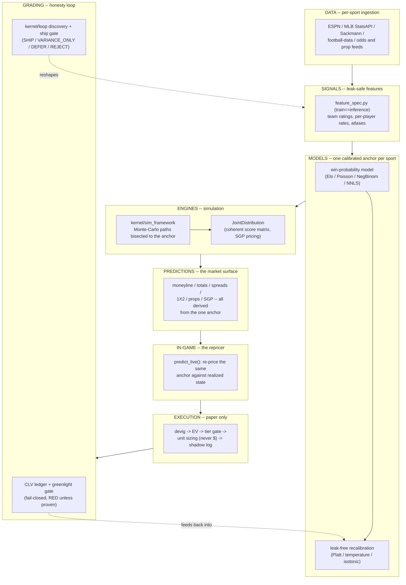
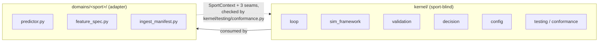

# System Overview

*Reference document -- the architecture in one picture, then each piece explained.*

> **Supersedes the earlier "6 Core Systems" framing of this file**, which described a
> single-sport, dollar-denominated betting product with an agentic research layer marked
> "planned." Both are now real and different from that description: the platform is
> multi-sport (`kernel/` + `domains/<sport>/`, four sports shipped), the self-improving loop is
> built and running (not planned), and every sizing/execution number in this codebase is a
> **unit**, never a dollar amount -- see [`../../.claude/rules/no-edge-claims.md`](../../.claude/rules/no-edge-claims.md)
> and [`../JOB_EVIDENCE_PACKET.md`](../JOB_EVIDENCE_PACKET.md) for why.

---

## The one-sentence architecture

A sport-blind **kernel** (walk-forward validation, calibration, Monte-Carlo simulation, the
discovery loop, devig/sizing math) is shared by thin per-sport **domain adapters** (NBA, MLB,
soccer, tennis, ...), each of which emits one calibrated win-probability that anchors every
market it prices; predictions flow through a paper-only execution/grading layer that proves or
retracts every claim with closing-line value, never asserts one.

---

## Layer by layer

| Layer | What it does | Owning code |
|---|---|---|
| **DATA** | Keyless, as-of-stamped ingestion per sport; every corpus tagged with a leak class (`LEAK_PRE_GAME` / `LEAK_IN_GAME` / `LEAK_POST_GAME` / `LEAK_REFERENCE`) and a freshness SLA | `domains/<sport>/ingest_*.py`, `scripts/platformkit/ingest_manifest_core.py` |
| **SIGNALS** | A frozen `FeatureSpec` per domain declares the base feature matrix as an ordered tuple; one function (`build_base_matrix`) derives it identically at train and inference | `domains/<sport>/feature_spec.py`, `scripts/platformkit/feature_spec_core.py` |
| **MODELS** | A raw rating model (Elo / Poisson / NegBinom / NNLS, sport-specific) is mapped through a leak-free recalibrator to ONE calibrated win-probability -- the anchor | `domains/<sport>/predictor.py`, `domains/<sport>/ratings.py` / `elo*.py` |
| **ENGINES (simulation)** | The Monte-Carlo path framework is bisected so its win-marginal equals the anchor; totals, margins, and props fall out of the same simulated paths, so nothing can disagree with the moneyline | `kernel/sim_framework/` (target-state), per-adapter engines today (`domains/<sport>/`, `src/sim/`) |
| **PREDICTIONS (markets)** | `to_jd()` returns one `JointDistribution` covering the whole market surface for that sport; `predict()` / `predict_live()` are the two public entry points every domain exposes | `domains/<sport>/predictor.py`, `scripts/platformkit/predict_matchup.py` (unified CLI) |
| **EXECUTION** | Devig (Shin 1992) -> EV in probability space -> tier gate (A/B/C by EV magnitude, below-floor = no bet) -> unit sizing (flat + capped fractional Kelly, **never dollars**) -> append-only shadow/paper log | `scripts/platformkit/execution/`, `scripts/platformkit/paper/`, `scripts/platformkit/prop_paper*.py` |
| **GRADING** | Every paper position is settled and joined to its closing snapshot; CLV is the only money-adjacent yardstick, and a fail-closed **greenlight gate** blocks any "channel is working" claim until pre-registered criteria pass on out-of-sample halves | `scripts/platformkit/clv_ledger*.py`, `scripts/platformkit/grade_paper*.py`, `scripts/platformkit/eval_gate/`, `scripts/platformkit/econ/` |
| **SELF-IMPROVE** | A discovery loop mines model residuals and enumerates feature transforms; every candidate signal passes a multi-criterion ship gate (walk-forward, null-shuffle, ablation, calibration, CLV, multiple-comparisons-corrected) before it can ship -- most correctly REJECT | `kernel/loop/` (target-state), `src/loop/` + `scripts/platformkit/autoloop/` today, ledger at `scripts/platformkit/reject_ledger.py` |

---

## The kernel / domain split

The layers above are implemented twice: once, sport-blind, in `kernel/`; and once per sport, as
a thin adapter in `domains/<sport>/`. This is the core architectural decision of the platform --
full rationale, the three frozen "seams" a new sport must implement, and the fail-closed parity
matrix that keeps every sport honest are documented in **[../PLATFORM.md](../PLATFORM.md)** and,
at the module level, in **[../kernel/README.md](../kernel/README.md)**.

Four adapters are shipped today: `basketball_nba`, `mlb`, `soccer`, `tennis` (plus a census-only
`soccer_intl`, and `wnba` / `baseball_kbo` / `baseball_npb` / `cross_sport_market` in varying
stages of build-out -- see [../domains/README.md](../domains/README.md)). Adding a sport means
writing the adapter; `kernel/` does not change.

> **Honest status note.** Several `kernel/` subtrees named in the diagram above (`loop`,
> `sim_framework`, `decision`) are today **reserved namespaces** -- the working logic still lives
> per-adapter and in `scripts/platformkit/`. See
> [../kernel/README.md](../kernel/README.md#implementation-status) for the exact
> implemented-vs-stub table rather than assuming the diagram reflects shipped code.

---

## What replaced the old "5 systems + planned System 6" framing

| Old name | Current equivalent |
|---|---|
| System 1 -- Possession Simulator | per-sport transition/possession logic in `domains/<sport>/` + `src/sim/` (target: `kernel/sim_framework/`) |
| System 2 -- Line Evaluator | The devig + EV step inside `scripts/platformkit/execution/` and `scripts/platformkit/prop_edge*.py` |
| System 3 -- Correlation Engine | `JointDistribution` (per-adapter `to_jd()`), `scripts/platformkit/sgp_pricer.py` |
| System 4 -- Kelly Sizer | The unit-sizing step in `scripts/platformkit/execution/` -- **units, never dollars** |
| System 5 -- Execution Router | `scripts/platformkit/execution/` (paper-only; see [execution-engine.md](execution-engine.md)) |
| System 6 -- Agentic Research (planned) | **Built and running**: `src/loop/` + `scripts/platformkit/autoloop/` (cross-sport scheduler) |

---

*See [../models/README.md](../models/README.md) for the model/calibration layer, and
[../models/possession-simulators.md](../models/possession-simulators.md) for the cross-sport
simulation engines. See [execution-engine.md](execution-engine.md) for routing detail. See
[../kernel/README.md](../kernel/README.md) for the sport-blind machinery and
[../PLATFORM.md](../PLATFORM.md) for the full adapter contract and build-program status.*

---
<!-- nav-footer -->
**Navigate:** [Up: full doc map](../INDEX.md) - [Home](../../README.md) - [Glossary](../GLOSSARY.md)
