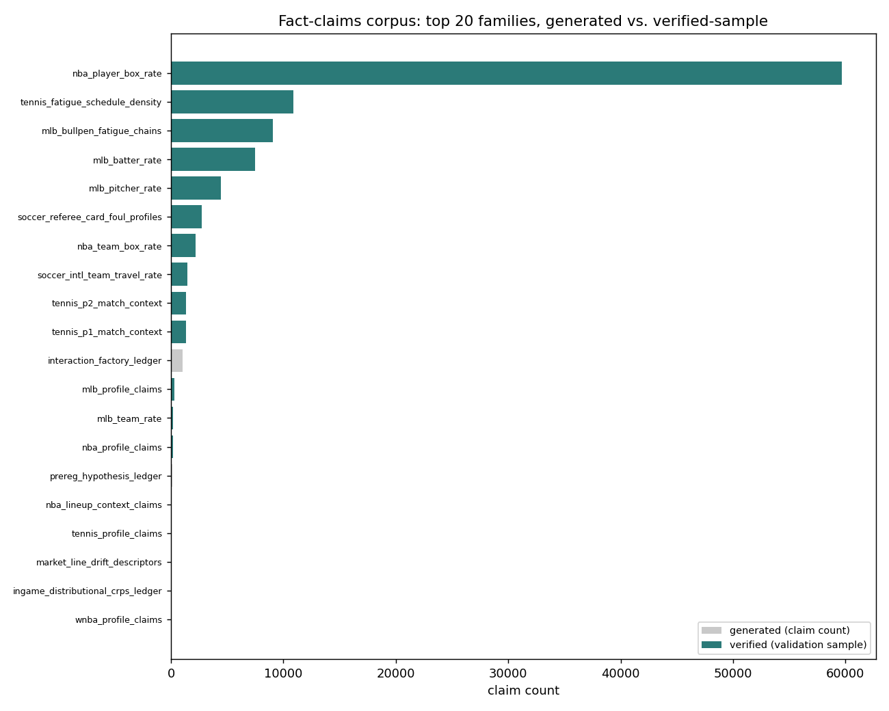
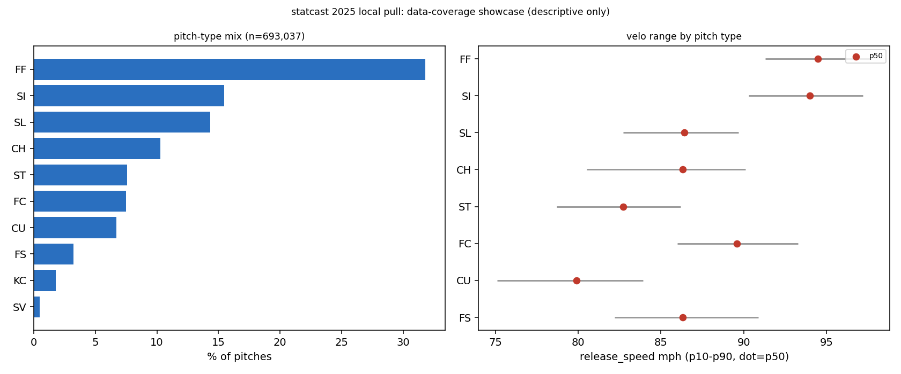
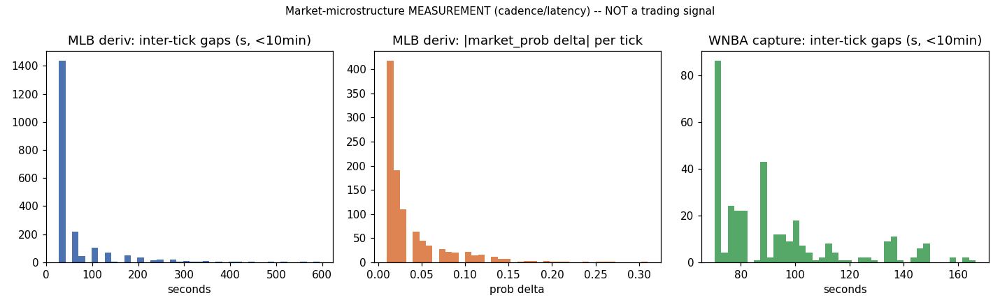

# A Deeply Analytical System -- The Recorded-Analytics Inventory

> Every number below is copied verbatim from a JSON artifact written by a showcase module
> that ran once against local data on disk, or from an existing catalog entry. Nothing here
> is re-derived from memory. The single truth-source for any figure is
> [docs/JOB_EVIDENCE_PACKET.md](../JOB_EVIDENCE_PACKET.md). The product is a **calibrated**
> predictor, not an edge product -- an honest REJECT or null is a success, and where a live
> market matches or beats us that is stated plainly.

---

## The claim

"Deeply analytical" is easy to assert and hard to prove. So this page does not assert it --
it inventories it. There are **23 self-contained analytics modules** under
`scripts/platformkit/analytics_showcase/`, each of which runs once, reads real artifacts,
writes a provenance-stamped JSON to `out/`, and renders a chart to `docs/img/`. Every one is
catalogued with its artifact path and its honest caveat in
[docs/ANALYTICS_CATALOG.md](../ANALYTICS_CATALOG.md). Below are four that speak to depth
directly: the scale of the claims corpus, the raw pitch-level base the MLB metrics sit on, a
market-microstructure measurement, and the answer engine's own coverage record. Each one is
built so you can re-run it and get the same number. That is the only superlative this page
will make: this is the **most transparent version you can audit** -- not the best in the
world, the one whose every number you can trace to a file yourself.

---

## 1. Claims-corpus scale -- generated vs. validated, kept separate on purpose

Source: `scripts/platformkit/analytics_showcase/out/claims_corpus_meta.json`, run 2026-07-22
over `data/cache/intel_claims/`.

- **103 claim families**, **103,048 generated claims** total.
- **99 of 103** families carry a `*_validation.json` sidecar; **4** have none.
- **101,865** claims fell inside a validation sample (**98.85%** of generated volume), of
  which **101,864 verified**, **0 mismatched**, **1 unverifiable**.
- Sport split by claim volume: NBA 62,227 (31 families), MLB 21,519 (18), tennis 13,709 (16),
  soccer 4,275 (15), unlabeled cross-sport ledgers 1,236 (13), WNBA 57 (6), cross_sport 12
  (1), NPB/KBO 10 (2), baseball_intl 3 (1).
- Freshness: newest family file 2026-07-19T14:33 UTC (3 days stale as of the run), oldest
  2026-07-05.

The honest part is the wording. That 98.85% is **sidecar sample coverage** -- a per-family
self-check performed at generation time -- **not** an independent full-corpus re-audit, and
the JSON says exactly that: *"verified counts are sidecar SAMPLE counts, not full-corpus
audits; 'generated' claims outnumber 'verified' claims by design."* Generated volume and
validated volume are reported as two different numbers precisely so "verified" can never be
misread as "every claim independently re-checked." This is corpus bookkeeping, not a new
proof -- and it is labelled as bookkeeping.

## 2. The Statcast base -- what the MLB metrics actually sit on

Source: `scripts/platformkit/analytics_showcase/out/statcast_showcase.json`, a single
column-selective pass over `data/cache/statcast/statcast_fuller__2025.parquet`.

- **693,037 pitches**, **19 pitch types**. Top mix: FF 31.78%, SI 15.46%, SL 14.34%,
  CH 10.28%, ST 7.60%.
- Velocity p10/p50/p90 by pitch type, e.g. FF 91.3 / 94.5 / 97.7 mph, SL 82.7 / 86.4 /
  89.7 mph, CU 75.1 / 79.9 / 83.9 mph.
- Framing-ingredient column completeness (`plate_x`, `plate_z`, `sz_top`, `sz_bot`, `zone`,
  `type`, `fielder_2`, `balls`, `strikes`): **99.6-100%** non-null.

This is a pure data-coverage showcase -- pitch mix, velo spread, and column completeness for
the framing metric's inputs. It makes **no** predictive or edge claim. It cites the existing
catcher-framing receipt (`data/cache/predictive_validity/mlb_framing__borderline_called_strike_rate_asof.json`
-- rho 0.418 vs 0.272 baseline, 8 folds, 7 sign-holding) as **context only**, without
recomputing it, and it preserves that receipt's own corpus caveat: the framing receipt was
built on `savant_full__2023/2024.parquet` because `statcast_fuller` lacks a `description`
column. Depth here means the pitch-level base is real and the columns the model needs are
present -- shown, not claimed.

## 3. Tick microstructure -- a measurement that tells you how thin the data is

Source: `scripts/platformkit/analytics_showcase/out/tick_microstructure.json`, over the
rescued `data/pod_backup_2026_07_20/` captures.

- MLB Kalshi total-market quote cadence: median inter-tick gap **35s**, mean 80s, p90 170s
  (n=2,092 gaps, 21 quote tracks, 2,113 rows).
- MLB price-move size: median `|delta market_prob|` **0.02**, p90 0.09.
- MLB model-vs-market divergence: median **0.116**, p90 0.225 -- explicitly a
  **calibration-gap measurement, not an edge**.
- WNBA capture cadence: median **88s** between snapshots; Kalshi overround median 0.01,
  p90 0.03.

The label in the JSON is blunt: *"market-microstructure MEASUREMENT (latency/cadence) -- NOT
a trading signal."* And the honest caveat is stated up front: this backup has **no raw
high-frequency tick stream and no NBA coverage** -- it is two derived captures from what looks
like a single day. So this is a measurement of what cadence and spread look like in this
rescued snapshot, not a robust multi-day corpus statistic. Reporting the thinness of the data
alongside the numbers is the point.

## 4. QA coverage -- a fail-closed answer engine measured on its own bank

Source: `scripts/platformkit/analytics_showcase/out/qa_coverage_stats.json`, over
`data/cache/analytics_verify/qa_bank_report.json` (as_of 2026-07-19) and
`coverage_stress_report.json` (as_of 2026-07-18). No re-run of the engine.

- QA regression bank: **87 / 87 pass**, fail-closed -- a correct `no_data` / `not_supported`
  / `ambiguous` counts as a PASS, not a failure.
- Coverage-stress bank: **honest coverage 36.62%** (316 of 863 answerable-expected questions
  resolved `ok`) across **1,307** total stress rows.
- Full status split across all rows: ok 399, no_data 560, not_supported 42, ambiguous 181,
  **refused 125**, error 0.
- Per-sport `ok`-rate on answerable questions ranges from soccer (41 of 216) to tennis
  (89 of 213).
- Of the refusals, **125 rows are `edge_language`** questions -- **0% answered, 100% refused,
  by design** for edge/ROI-shaped prompts.

The headline is deliberately conservative: coverage counts only questions the bank *expected*
to be answerable (`n_expects_answer_true_ok / n_expects_answer_true`), and excludes rows where
the correct behavior is a refusal. The majority of the gap to 100% is **deliberate** --
missing corpora (`no_data`), unsupported sport-category combinations (`not_supported`), and
intentional edge-language rejection (`refused`) -- not silent wrong answers, of which there
are zero errors. A system whose honest coverage number is 37% *because it refuses the other
63% on purpose* is more trustworthy than one that answers everything.

---

## Why this matters

Depth in a forecasting system is usually asserted through a headline metric. This system
inventories it instead: 23 recorded analytics, a six-figure claims corpus with generated and
validated volumes reported as separate numbers, a 693,037-pitch base under the MLB metrics, a
microstructure measurement that discloses its own thinness, and an answer engine whose
coverage number is honest *because* it refuses on purpose. Every one is a JSON file you can
open and a module you can re-run. The full index with per-analytic caveats is
[docs/ANALYTICS_CATALOG.md](../ANALYTICS_CATALOG.md). None of these four is a new proof, and
each says so in its own output. The transferable thing is not any single number -- it is that
the whole inventory is built to be audited row by row, each label written so a reader cannot
come away with a rosier number than the file supports.

---
<!-- nav-footer -->
**Navigate:** [Up: full doc map](../INDEX.md) - [Home](../../README.md) - [Glossary](../GLOSSARY.md)
