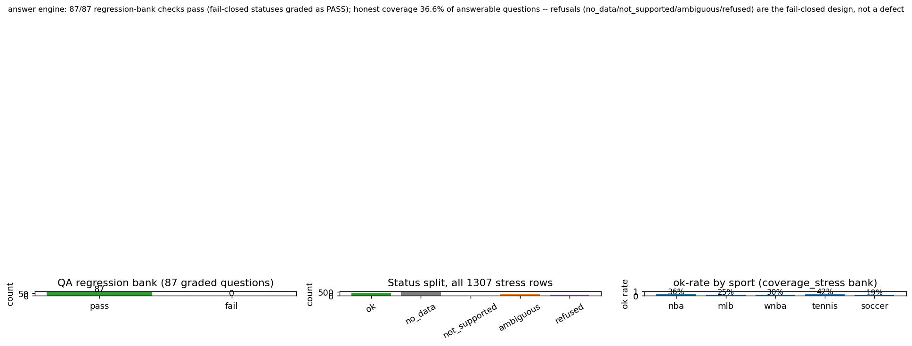

# The Fail-Closed Answer Engine -- one deterministic resolver per question, refusal by default

> Every sports question about this repo routes through one oracle, not the model's memory.
> The answer comes back as a typed envelope with a status the caller must honor verbatim, a
> source artifact, and an as-of date -- or it comes back as an honest refusal. The single
> truth-source for any figure below is [docs/JOB_EVIDENCE_PACKET.md](../JOB_EVIDENCE_PACKET.md);
> the numbers here are traced to the committed artifact that produced them. For three live
> exchanges through this engine over MCP, see [docs/evidence/mcp-live-demo.md](mcp-live-demo.md).

---

## The claim

Every question that can be asked of this system's data is answered by exactly one
deterministic resolver, chosen by rule -- never improvised by a language model. Three failure
modes are first-class outcomes, not bugs:

- A question type with **no registered resolver** returns `not_supported`. The engine does not
  invent a handler.
- A question whose backing **artifact is absent** (a fresh clone with no `data/`, a stale
  store past its freshness bound) returns `no_data`. The engine does not fill the gap from
  training data.
- A question phrased in **edge / ROI / retracted-number language** is `refused` at the door,
  pointing the caller at `.claude/rules/no-edge-claims.md`.

Coverage is then measured against the full question space and published *including the
refusals*. The design goal is not "answer everything" -- it is that a connected LLM
**cannot fabricate a number**, and the honest gaps are visible and counted.

## How it works

`resolver_registry.classify(query)` maps a query to exactly one category (`player_stat`,
`rating_attribute`, `concept_rating`, `prediction_winprob`, `calibration_number`,
`mechanism_effect`, `edge_language`, the descriptive-intel categories, and so on).
`resolver_registry.resolve(query, sport)` then dispatches to that category's single resolver,
each with a **declared** source artifact, computation rule, and units, and returns a typed
envelope: `status` (`ok` / `no_data` / `not_supported` / `refused` / `ambiguous`), the value,
`n`, `p`, `source_artifact`, `as_of`, and `edge_claimed: false`.

Two properties make this more than a router. First, `effect_graph.py` assembles the whole
"what affects what" graph purely from rows already adjudicated in each sport's
`validation_ledger.jsonl` -- **zero new statistics are computed**, so the graph cannot say
anything the gates have not already proven or disproven. Second, `contract_client.py` *is* the
[AI Consumer Contract](../AI_CONSUMER_CONTRACT.md) made executable: it classifies, resolves,
and formats with **no model call at all**, and the `test_answer_consistency_*` suite proves a
direct resolver call and the contract client return byte-identical numbers for the same
question. Mechanism answers are additionally capped as LOCAL, single-corpus findings by the
envelope's own `framing` field -- confirmed effects are never inflated into a market or
dollar claim.

## Receipts

| Guarantee | Proof artifact (committed) | The receipt |
|---|---|---|
| One deterministic resolver per question; unregistered types refuse | `scripts/platformkit/answers/resolver_registry.py`; contract in `docs/AI_CONSUMER_CONTRACT.md` | `RESOLVERS` maps each category to one source; `classify()` picks it; anything unregistered -> `not_supported` (JOB_EVIDENCE_PACKET section G) |
| Effect graph composed from zero new claims | `scripts/platformkit/answers/effect_graph.py` | 555 nodes / 296 edges across NBA/MLB/soccer/tennis, every edge a verbatim already-adjudicated ledger row (JOB_EVIDENCE_PACKET section G) |
| Anti-folklore: every mechanism answer cites its own local test | `scripts/platformkit/answers/contract_client.py` | `"does b2b_rest_penalty hold up" --sport nba` -> `CONFIRMED_LOCAL effect=-1.73 n=4732 p=0.0056`, source `domains/basketball_nba/knowledge/validation_ledger.jsonl`; framed LOCAL, not causal/edge |
| The contract is executable, not aspirational | `scripts/platformkit/answers/contract_client.py` + `test_answer_consistency_{nba,mlb,soccer,tennis,intel}.py` | Direct resolver call and no-model contract client return identical numbers for the same question |
| Fail-closed regression bank stays green | `qa_runner.py` / `qa_bank.py`; `analytics_showcase/out/qa_coverage_stats.json` | 87 / 87 checks pass (tier FULL, as_of 2026-07-19); a correct `no_data` / `not_supported` / `ambiguous` is graded PASS |
| Edge language is always refused | `coverage_stress.py`; same artifact | `edge_language` category: n=125, ok=0, **125 / 125 refused** (ok_rate 0.0) |
| Coverage measured and published honestly | `analytics_showcase/out/qa_coverage_stats.json`; `docs/img/qa_coverage_stats.png` | 316 / 863 answerable questions resolve `ok` = **36.6%** (as_of 2026-07-18); refusals published, not hidden |



*Figure: the honest coverage headline. Across a 1,307-row stress bank the status mix is 399
`ok`, 560 `no_data`, 42 `not_supported`, 181 `ambiguous`, 125 `refused`, 0 `error`. The 36.6%
rate counts only `expects_answer=true` rows -- a correct refusal on a question the system
should not answer is a design PASS, not counted against coverage. The `edge_language` and bare
`prediction_winprob` categories resolve at 0% by design. Data:
[`scripts/platformkit/analytics_showcase/out/qa_coverage_stats.json`](../../scripts/platformkit/analytics_showcase/out/qa_coverage_stats.json).*

## Reproduce

```
# The executable contract -- one question, no model call, full envelope
python -m scripts.platformkit.answers.contract_client "does b2b_rest_penalty hold up" --sport nba

# Fail-closed regression bank (correct refusals count as PASS)
python -m scripts.platformkit.answers.qa_runner            # FULL tier
python -m scripts.platformkit.answers.qa_runner --tier SMOKE

# Honest coverage stress over the whole question bank
python -m scripts.platformkit.answers.coverage_stress

# Roll the two reports up into the committed published summary
python -m scripts.platformkit.analytics_showcase.qa_coverage_stats
```

`qa_coverage_stats.json` is the published snapshot (with its own `as_of` dates); the two
runners regenerate the underlying reports live. On a fresh clone the private corpora are
absent, so the intel resolvers fail closed to `no_data` -- the same behavior the coverage
number already accounts for. Re-running against the current bank (which keeps growing under
the live loop) will move the raw counts; the committed artifact is the dated snapshot.

## Why this matters

Fail-closed answer engines are the problem AI-engineering teams are actively fighting right
now. The default retrieval-augmented pattern is "the model paraphrases some documents and
hopes" -- and hopes badly, because nothing stops it rounding a number up, borrowing a stale
figure, or asserting a plausible claim the data never supported. This is the harder version:
every question resolves to one declared source, every number carries its own provenance and
sample size, and the three honest failure modes (`not_supported`, `no_data`, `refused`) are
enforced by the server contract, not a prompt the model can talk itself out of. The
`contract_client` returning identical numbers with no model call proves the guarantee lives in
the engine, not the model. The transferable engineering is not that the answers are good -- it
is that a dishonest answer is structurally unavailable, and the coverage gap is measured and
published rather than papered over.

---
<!-- nav-footer -->
**Navigate:** [Up: full doc map](../INDEX.md) - [Home](../../README.md) - [Glossary](../GLOSSARY.md)
