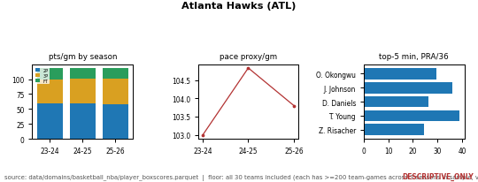
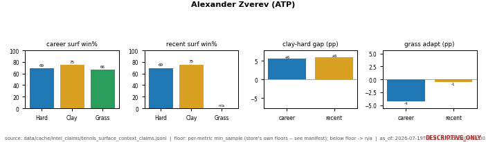

# Entity Atlas -- Per-Entity Analytics Coverage at Scale, Every Count Auditable

> Every number below is copied verbatim from a JSON manifest written by an atlas module
> that ran once against local data on disk, and every card count was independently
> cross-checked against the PNG files on disk. Nothing here is re-derived from memory. The
> single truth-source for any figure is [docs/JOB_EVIDENCE_PACKET.md](../JOB_EVIDENCE_PACKET.md).
> The product is a **calibrated** predictor, not an edge product -- these cards are
> **descriptive** records, they carry no projection, no win-probability, and no edge/ROI claim.

---

## The claim

The atlas family renders **one small analytics card per entity**, at scale, across every
sport this system holds -- and every card is traceable to a manifest count you can re-derive.
Six builder modules wrote **seven manifests** holding **1,549 cards** total: **1,523 per-entity
cards** across six sport/entity-type manifests, plus **26** calibration-checkpoint cards built
on the same machinery. Each count below is the manifest's own `n_entries` field, reported
verbatim, and each was cross-checked against the rendered PNGs on disk -- **all seven match
exactly**.

The only superlative on this page is the one the whole design earns: not the best entity
analytics in the world -- **the most auditable**. Every card names its inclusion floor on its
own face, every count is a JSON field you can open, and the whole family is served through the
same fail-closed answer engine as every other resolver, so an entity we never built returns an
honest `no_data`, never a guess.

### What it is (and is *not*)

Each card is a 1-row strip of 2-4 mini-panels rendered from **recorded** data -- box scores,
Statcast pitch logs, results history -- reshaped into a compact, provenance-stamped picture.
Every card carries a red **`DESCRIPTIVE_ONLY`** badge and a `source | floor | as_of` footer
stamped by the factory; every manifest header sets `descriptive_only: true`; the resolver
returns `edge_claimed: false` on every hit. There is **no** forecast on these cards. They show
what an entity has done, gated by a declared minimum-sample floor, and nothing more. Edge- or
ROI-shaped questions are refused upstream by the same answer engine, by design.

---

## Coverage at a glance (counts verbatim, floors declared)

Example cards -- the factory badge, panels, and `source | floor | as_of` footer are visible on each:





**Example key_numbers (verbatim from the manifests):**
- Nikola Jokic (`nba`): 210 games, 7429.0 min, per-36 **28.4 / 12.8 / 10.1** pts/reb/ast, **57.6 / 38.9 / 81.8** FG/3P/FT%.
- Atlanta Hawks / ATL (`nba_teams`): 3 seasons, 239 games, **117.9** ppg latest season, **103.8** pace-proxy latest season, top contributor Onyeka Okongwu **29.7** PRA/36 over 5630.6 min.
- Alexander Zverev (ATP) (`tennis`): career surface win-rate **0.6906** hard / **0.7466** clay / **0.6618** grass; clay-minus-hard **+0.056**; grass-adapt **-0.043**.

| Manifest (`analytics_showcase/out/`) | Entity unit | Cards (`n_entries`, verbatim) | Declared inclusion floor (verbatim threshold) |
|---|---|---|---|
| `atlas_nba_manifest.json` | NBA player | **482** | `career_min_minutes >= 800` (yields 482/807 players) |
| `atlas_nba_teams_manifest.json` | NBA team | **30** | all 30 teams (each >= 200 team-games across 3 seasons); no exclusion floor |
| `atlas_mlb_batters_manifest.json` | MLB batter | **485** | `pitches_faced_2025 >= 300` (yields 485/671 batters) |
| `atlas_mlb_pitch_manifest.json` | MLB pitch-population (19 pitch-type + 30 team + 12 count) | **61** | all 19 pitch-type codes included; smallest n=7 (SC) shown for completeness, not comparison |
| `atlas_soccer_manifest.json` | soccer club | **187** | per-metric `n_prior >= 10` (trailing-10 as-of); below-floor shows `n/a`, never fabricated |
| `atlas_tennis_manifest.json` | tennis player (ATP/WTA) | **278** | per-surface `n >= 30` (hard/clay/grass), career + recent independently; below-floor `n/a` |
| `atlas_calibration_manifest.json` | calibration checkpoint/band (non-entity) | **26** | `n >= 30` rows per checkpoint/band to render (declared, not tuned to today's data) |
| **Total** | | **1,549** (1,523 per-entity + 26 calibration) | disk-PNG count matches every row exactly |

Disk cross-check, per directory under `docs/img/atlas/`: nba **482**, nba_teams **30**,
mlb_batters **485**, mlb_pitch **61**, soccer **187**, tennis **278**, calibration **26** --
each equal to its manifest `n_entries`, no drift. The `mlb_pitch` and `calibration` manifests
are population-grain, not per-entity, and are labelled as such; they share the same factory,
manifest schema, and resolver, so they are listed here honestly rather than folded into the
per-entity headline.

Honest gaps, carried on the cards' own floor strings: the MLB pulls have **no swing/miss or
launch-angle column**, so batter contact panels count batted balls (not pitches faced) and no
whiff/barrel profile is built; the pitch-population `type` field merges called/swinging/foul
into one bucket, so an outcome mix (ball/strike/in-play) substitutes for a true whiff rate.
These are stated on the artifact, not hidden.

---

## Served fail-closed through the same answer engine

The cards are queryable through the one resolver registry every other category routes through
(`resolver_registry.resolve()`), so a question about an entity gets the same fail-closed
treatment as any other -- there is no special path.

`atlas_resolver.py` registers category **`atlas_card`**. It matches query shapes
`card for <entity>` and `show <entity> atlas`, normalizes the name (NFKD accent-strip, case,
whitespace), and matches the manifest `entity` field **verbatim** across every built
`atlas_*_manifest.json`, re-reading the manifests fresh on every call (never cached, because
builders rewrite them out-of-process). Its status contract:

- **no manifests built** -> `no_data` (`"no atlas manifests built in this clone -- run an atlas_*.py builder first"`).
- **no entity match** -> `no_data` (`"refusing, not guessing"`) -- it never invents a card against `key_numbers` or an aliased name.
- **normalized name shared by 2+ manifests** -> `ambiguous`, returning the candidate list and asking the caller to narrow with `sport_filter=` (opt-in only, never the caller's default sport, which would silently drop a real cross-sport match).
- **exactly one match** -> `ok`, returning `entity`, `card_path`, `key_numbers`, `floors`, and `as_of` **verbatim** from the manifest, with `descriptive_only: true` and `edge_claimed: false`.

This is the standard AI-consumer contract: quote the numbers exactly, cite `source_artifact` +
`as_of`, and refuse rather than guess.

---

## Receipts

All builder modules and the factory live under `scripts/platformkit/analytics_showcase/`; the
resolver and its test live under the answer-engine tree. Every file ran / passed on 2026-07-23.

| Receipt | Path | Role |
|---|---|---|
| Factory | `analytics_showcase/atlas_factory.py` | shared 2-4-panel card renderer + manifest writer; stamps the `DESCRIPTIVE_ONLY` badge and `source \| floor \| as_of` footer on every card; dpi <= 90, <= 45KB target / <= 60KB hard guard (one dpi-retry then assert-fail); `write_manifest` validates the `{entity, card_path, key_numbers, floors, as_of}` shape and writes ASCII JSON **verbatim -- does not compute, round, or inflate any number**; ships a `--check` self-test |
| Builder | `analytics_showcase/nba_player_atlas.py` | 482 NBA-player cards -> `atlas_nba_manifest.json` |
| Builder | `analytics_showcase/nba_team_atlas.py` | 30 NBA-team cards -> `atlas_nba_teams_manifest.json` |
| Builder | `analytics_showcase/mlb_batter_atlas.py` | 485 MLB-batter cards -> `atlas_mlb_batters_manifest.json` |
| Builder | `analytics_showcase/mlb_pitch_atlas.py` | 61 MLB pitch-population cards -> `atlas_mlb_pitch_manifest.json` |
| Builder | `analytics_showcase/tennis_soccer_atlas.py` | 187 soccer-club + 278 tennis-player cards (one module, two manifests) |
| Builder | `analytics_showcase/calibration_atlas.py` | 26 calibration checkpoint/band cards -> `atlas_calibration_manifest.json` |
| Manifests | `analytics_showcase/out/atlas_*_manifest.json` | 7 manifests; header `{sport, generated_at, descriptive_only: true, n_entries, entries[]}`; each entry `{entity, card_path, key_numbers, floors, as_of}` |
| Resolver (answer-engine-served) | `scripts/platformkit/answers/atlas_resolver.py` | category `atlas_card`, registered in `resolver_registry.py`; name-normalized verbatim `entity` match across all manifests; fail-closed `no_data` / `ambiguous` / `ok` |
| Test | `tests/platformkit/answers/test_atlas_resolver.py` | 8 cases: classifier routing, both parse shapes, no-manifests + no-match fail-closed ("never invented"), verbatim-fields on `ok`, name normalization (case/accent/whitespace), ambiguous-then-`sport_filter`-narrows, registry dispatch end-to-end |

Cards render to `docs/img/atlas/<sport>/<slug(entity)>.png`.

---

## Reproduce

```
# factory self-check (renders a synthetic card, round-trips a manifest, asserts the size guard)
python -m scripts.platformkit.analytics_showcase.atlas_factory --check

# rebuild each atlas (each reads local data, writes out/atlas_<sport>_manifest.json + PNGs)
python scripts/platformkit/analytics_showcase/nba_player_atlas.py
python scripts/platformkit/analytics_showcase/nba_team_atlas.py
python scripts/platformkit/analytics_showcase/mlb_batter_atlas.py
python scripts/platformkit/analytics_showcase/mlb_pitch_atlas.py
python scripts/platformkit/analytics_showcase/tennis_soccer_atlas.py
python scripts/platformkit/analytics_showcase/calibration_atlas.py

# resolver + registry-dispatch tests (fail-closed contract)
python -m pytest tests/platformkit/answers/test_atlas_resolver.py -q

# query one card through the answer engine (e.g. via the MCP `ask` tool)
#   "card for Nikola Jokic"      -> ok, key_numbers + floors verbatim
#   "card for Some Player Nobody" -> no_data, "refusing, not guessing"
```

Each `n_entries` is re-derivable by counting `entries[]` in the manifest, and each manifest
count is re-checkable against the PNG files under `docs/img/atlas/<sport>/`.

---

## Why this matters

Breadth in an analytics system is usually asserted with a round headline number. This family
proves it instead: **1,549 cards** across seven manifests, each count a JSON field you can open
and a PNG you can count, cross-checked to match on disk, every card carrying its own inclusion
floor and a `DESCRIPTIVE_ONLY` badge on its face. "At scale" here does not mean a big number to
impress -- it means the coverage is wide *and* every unit of it is individually auditable, down
to the entity, the floor that let it in, and the manifest line that records it. The transferable
thing is not the count. It is that a system can render analytics for 1,523 entities and still
refuse -- `no_data`, "refusing, not guessing" -- the moment you ask about one it never built.
The truth-source for every figure is [docs/JOB_EVIDENCE_PACKET.md](../JOB_EVIDENCE_PACKET.md).

---
<!-- nav-footer -->
**Navigate:** [Up: full doc map](../INDEX.md) - [Home](../../README.md) - [Glossary](../GLOSSARY.md)
