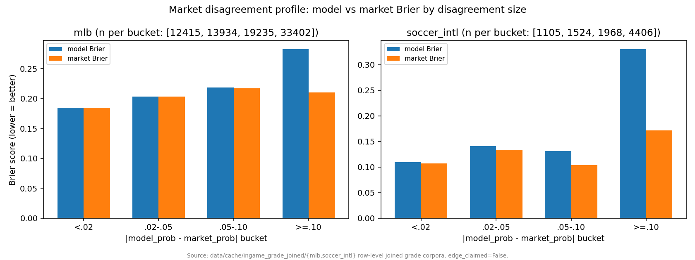
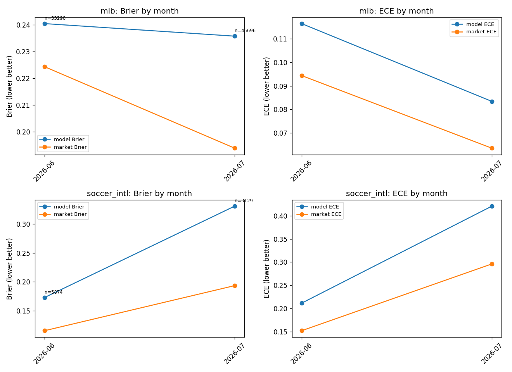

# When the market out-forecasts us -- measured, bucketed, and published

> A calibrated forecaster earns trust by publishing where it *loses*, not just where it wins.
> This page does exactly that: it measures when the market out-forecasts our model, bucketed
> by how far apart the two disagree, and tracks that gap over calendar time. Every number
> below is quoted verbatim from committed JSON. The single truth-source for any figure is
> [docs/JOB_EVIDENCE_PACKET.md](../JOB_EVIDENCE_PACKET.md). No dollar/ROI/edge is claimed
> anywhere -- both analytics carry `edge_claimed: false`.

---

## The claim

We do not hide the cases where the market beats us. We instrument them. Two published
analytics answer two honest questions:

1. **When our model disagrees with the market, who is usually right?**
2. **Is that relationship stable over calendar time, or drifting?**

The answer to both, stated plainly, is a market-efficiency confirmation: at the largest
disagreements the market is usually right, and across every available month the market's
Brier and ECE beat the model's. That is the correct result for an efficient market, and the
credibility signal is that we measure and publish it rather than quoting only the buckets
where we happen to look good.

---

## 1. Who is right when we disagree? (market_disagreement_profile)

Every graded in-game row is bucketed by `|model_prob - market_prob|` into four bands
(`<.02`, `.02-.05`, `.05-.10`, `>=.10`). Per bucket we report the row count, the model's
Brier, the market's Brier, and `model_closer_rate` -- the fraction of rows where the model's
absolute error beat the market's (ties excluded).

The pattern is monotonic: the further our model strays from the market, the more often the
market turns out right, and the wider the market's Brier advantage.

**MLB** (`data/cache/ingame_grade_joined/mlb/*.jsonl`):

| Disagreement bucket | n | model Brier | market Brier | model_closer_rate |
|---|---|---|---|---|
| `<.02`    | 12,415 | 0.184598 | 0.184498 | 0.4494 |
| `.02-.05` | 13,934 | 0.203230 | 0.203408 | 0.4592 |
| `.05-.10` | 19,235 | 0.218726 | 0.217043 | 0.4085 |
| `>=.10`   | 33,402 | 0.282705 | 0.210258 | 0.3773 |

**soccer_intl** (`data/cache/ingame_grade_joined/soccer_intl/*.jsonl`):

| Disagreement bucket | n | model Brier | market Brier | model_closer_rate |
|---|---|---|---|---|
| `<.02`    | 1,105 | 0.109427 | 0.106941 | 0.3403 |
| `.02-.05` | 1,524 | 0.141101 | 0.133776 | 0.3983 |
| `.05-.10` | 1,968 | 0.131688 | 0.104152 | 0.3201 |
| `>=.10`   | 4,406 | 0.330582 | 0.172027 | 0.2152 |

At the biggest disagreements (`>=.10`) the model is closer only **37.7%** of the time in MLB
and **21.5%** in soccer_intl, and the market's Brier is lower in both. When we agree with the
market (`<.02`) the two are indistinguishable (MLB 0.184598 vs 0.184498). The signal is
unambiguous: our disagreements with the market are, on average, our mistakes.



*Figure: per-bucket model Brier vs market Brier and `model_closer_rate` for MLB and
soccer_intl. Data:
[`scripts/platformkit/analytics_showcase/out/market_disagreement_profile.json`](../../scripts/platformkit/analytics_showcase/out/market_disagreement_profile.json)
(`edge_claimed: false`).*

---

## 2. Is the gap stable over time? (calibration_over_time)

The same joined corpora, split by calendar month, scored for both Brier and ECE (10-bin
expected calibration error). Only two months of data exist in either corpus (2026-06,
2026-07), so this is a **two-point trend, not a seasonal-drift study** -- disclosed as such
rather than dressed up. A drift-significance test is deferred until >=4 months of corpus
exist.

**MLB:**

| Month | n | model Brier | market Brier | model ECE | market ECE |
|---|---|---|---|---|---|
| 2026-06 | 33,290 | 0.2404 | 0.2243 | 0.1165 | 0.0944 |
| 2026-07 | 45,696 | 0.2357 | 0.1938 | 0.0834 | 0.0635 |

**soccer_intl:**

| Month | n | model Brier | market Brier | model ECE | market ECE |
|---|---|---|---|---|---|
| 2026-06 | 5,874 | 0.1729 | 0.1156 | 0.2112 | 0.1517 |
| 2026-07 | 3,129 | 0.3310 | 0.1936 | 0.4210 | 0.2961 |

The honest read: the market beats the model on Brier and ECE in **every** sport-month cell.
The MLB model improves slightly month over month (0.2404 -> 0.2357) but the market improves
faster, so the gap widens. soccer_intl degrades in July (model Brier 0.1729 -> 0.3310), and
degrades more than the market does. There is no drift-reversal and no edge to claim -- this
is market efficiency with a visible, if data-thin, time dimension.



*Figure: monthly model-vs-market Brier and ECE. Data:
[`scripts/platformkit/analytics_showcase/out/calibration_over_time.json`](../../scripts/platformkit/analytics_showcase/out/calibration_over_time.json).*

---

## Reproduce

Both scripts read the private joined-grade corpora
(`data/cache/ingame_grade_joined/{mlb,soccer_intl}/*.jsonl`, gitignored) and rewrite their
committed JSON plus the charts under `docs/img/`:

```
# Disagreement profile (also: --check for a self-verifying assertion pass)
python -m scripts.platformkit.analytics_showcase.market_disagreement_profile

# Monthly calibration drift
python -m scripts.platformkit.analytics_showcase.calibration_over_time
```

On a fresh clone the private corpora are absent; the committed JSON and PNG in the repo are
the recorded run. `mlb_clean` is a byte-identical dedup of `mlb` and is skipped by both
scripts.

---

## Why this matters to an employer

The field standard for a forecaster is calibration, and the honest test of calibration is
whether you publish your losses. These two analytics are built to surface exactly the cases
where the market out-forecasts us -- the largest-disagreement bucket and the worst month --
and they say so in plain numbers. That is the same discipline behind the rest of this repo:
measure against a real market baseline, keep the negative result, and never convert
prediction quality into an edge claim.

---
<!-- nav-footer -->
**Navigate:** [Up: full doc map](../INDEX.md) - [Home](../../README.md) - [Glossary](../GLOSSARY.md)
