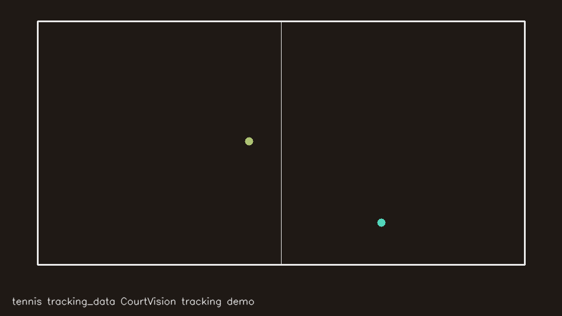

# Multi-Sport Tracking Evidence

First-day evidence from the multi-sport tracking program (2026-08-31). Every
game below ran through a real sport adapter on an RTX 3090 and was scored by a
shared, sport-blind quality harness
([tracking_harness.py](../../../scripts/platformkit/tracking_harness.py)) —
pass/fail against per-sport thresholds, never eyeballed. Demos are rendered
**purely from our tracking coordinates** (no broadcast imagery).

## Demo

Real US Open match, players tracked to court coordinates via court-line
homography ([adapter](../../../domains/tennis/tracking/adapter.py)):

## Day-1 scoreboard (11 real games, 6 leagues)

| League | Games scored | Best result | Known gap (tracked honestly) |
|---|---|---|---|
| WNBA | 2 | **PASS** — ball 85.9%, coverage 80.2% (1080p) | low-bitrate game failed coverage |
| NBA | 1 | ball 62.6% at 720p60 (vs ~30% on legacy 360p corpus) | 1080p source search open |
| Tennis | 2+ | players clean on all metrics | ball detector pending (stub emits nothing rather than fake data) |
| Soccer | 1 | first run complete | homography stability below threshold — fix in progress |
| NPB | 1 | pitch-view classifier + coverage passed first try | scale stability below threshold |
| KBO | 1 | pitch-view classifier + coverage passed first try | scale stability below threshold |

The headline: ball-tracking validity scales with source resolution
(~30% at 360p, ~63% at 720p60, 86–93% at 1080p) — measured, not assumed.

## Method, in one paragraph

Footage in → sport adapter (detection, homography to court/field coordinates,
identity tracking) → normalized tracking table → harness QualityReport
(coverage, continuity, ball validity, temporal stability, bounds) → external
cross-check against official box scores where available. Failures are recorded
verbatim in the report ledger; a sport ships only after 10 games clear its
thresholds. No wagering-performance claims are made from any of this; see
[JOB_EVIDENCE_PACKET](../../JOB_EVIDENCE_PACKET.md) for claim discipline.

*Auto-generated pages with per-game reports will replace this summary as the
corpus grows.*
