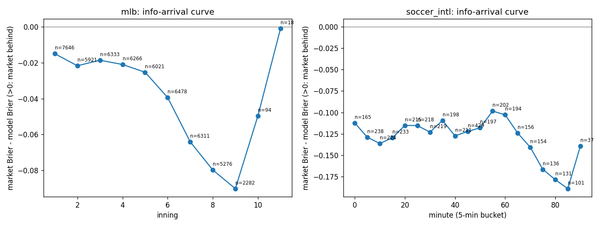
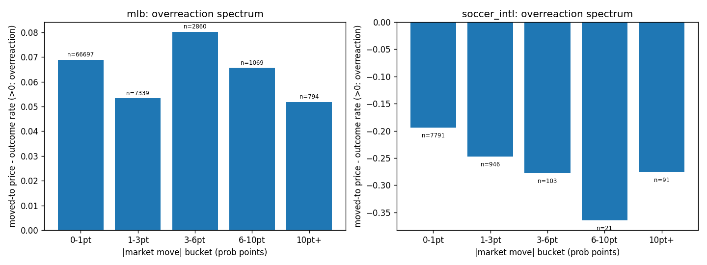
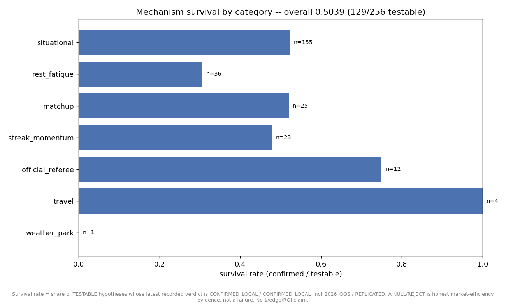
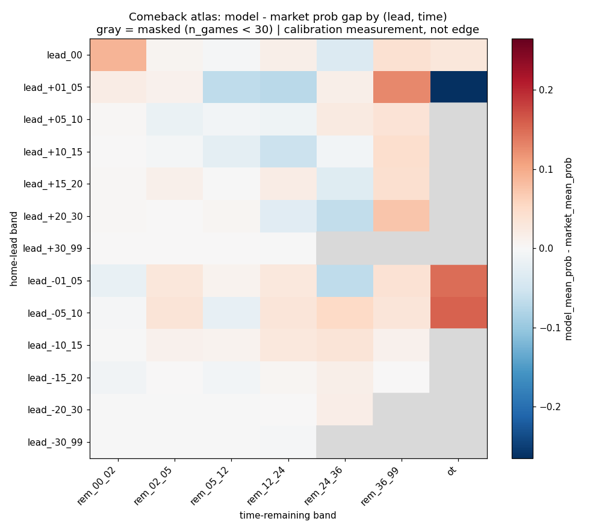
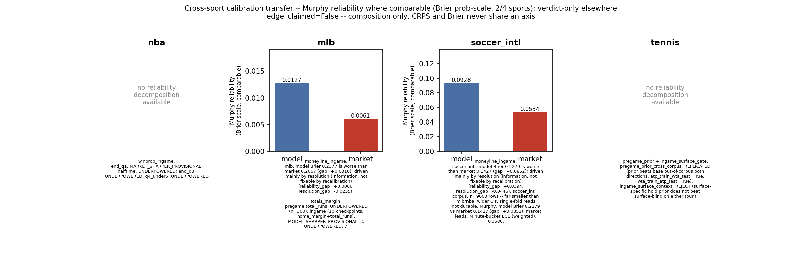

# Novel Analytics -- Uniquely Auditable Measurements

> Every number below is copied verbatim from a JSON artifact written by a showcase module
> that ran once against local data on disk. Nothing here is re-derived from memory. The single
> truth-source for any figure is [docs/JOB_EVIDENCE_PACKET.md](../JOB_EVIDENCE_PACKET.md). The
> product is a **calibrated** predictor, not an edge product -- an honest REJECT or null is a
> success, and where a live market matches or beats us that is stated plainly, in numbers.

---

## The claim (and what it is *not*)

The honest claim on this page is **not** "no one else can measure these." Every method below
already exists in the literature, and each analytic ships with a prior-art receipt that says so
-- two verdicts of **INCREMENTAL**, one **ALREADY_DONE_ON_CORE_METHOD**, and one **N/A**
(an internal hygiene artifact that borrows no novelty). The word "novel" here means one thing
only: **uniquely auditable**.

What is uniquely auditable is the *combination* -- each measurement is (a) run across the
multi-sport corpora this system actually holds (NBA, MLB, soccer, tennis), (b) preregistration-
and mask-gated so thin buckets can never masquerade as findings, (c) provenance-stamped to a
JSON you can open and a module you can re-run to the same number, and (d) shipped **with its own
honest prior-art verdict**, including the ones that say "this is not our method." The market
beats our in-game model at nearly every checkpoint below, and this page says so before it says
anything else. That spread of honest verdicts -- not a novelty claim -- is the transferable
thing. No entry claims "first ever"; each carries the receipt that would refute it.

All five modules live in `scripts/platformkit/analytics_showcase/`, each cross-referenced in
[docs/ANALYTICS_CATALOG.md](../ANALYTICS_CATALOG.md). Every one ran once on 2026-07-22.

---

## 1. Market information-arrival curve -- how fast price absorbs realized game state

Source: `scripts/platformkit/analytics_showcase/out/info_arrival_curve.json`, over
`data/cache/ingame_grade_joined/{mlb,soccer_intl}`.

**What it measures:** per game-time checkpoint (MLB inning, soccer 5-minute bucket), the Brier
score of our in-game model, the live market, and a naive score-difference-only logistic
baseline, all joined against the actual outcome. `market_minus_model_brier` negative means the
market is sharper than our model at that checkpoint. Leak-free.

**Numbers (verbatim):**
- MLB, inning 1: n=7,646 -- model 0.2582, market 0.2432, naive 0.2464, `market_minus_model` **-0.015**.
- MLB, inning 9: n=2,282 -- model 0.2515, market 0.1613, naive 0.2391, `market_minus_model` **-0.0902**.
- soccer_intl, kickoff (0'): n=165 -- model 0.2264, market 0.1143, naive 0.2136, gap **-0.1122**.
- soccer_intl, 85': n=101 -- model 0.4585, market 0.2694, naive 0.177, gap **-0.1891**.
- The gap is **negative at every checkpoint in both sports, and it widens late** -- MLB from
  -0.015 (inning 1) to -0.0902 (inning 9); soccer from -0.1122 (kickoff) to -0.1891 (85').

**Prior-art receipt -- verdict: INCREMENTAL** (verbatim from the artifact's `novelty` block):

> Closest prior work: arXiv 2606.07811 (~Jun 2026), 'When Do Markets Fully Process Public
> Information? Evidence from Real-Time Prediction Markets' -- Kalshi/NBA, contract-minute market
> vs state-only-model vs outcome join, 409,512 rows, finds 0.64-for-one contemporaneous
> absorption of a 1-minute state move.
>
> How ours differs: Same core instrument (paired model/market/outcome Brier by game-time
> checkpoint). Ours applies it to MLB (inning) and soccer_intl (5-min bucket) corpora we
> actually hold, with a naive score-only baseline included for context. Not a new method -- do
> not claim first-ever.

Also surfaced in the prior-art check as adjacent work: the market-calibrated accelerated
failure time in-play football model (arXiv 2605.16066); Wunderlich & Memmert, *Scientific
Reports* (s41598-021-03157-3); and the classic Croxson/Reade result that ~99% of Betfair goal
reactions settle within two minutes.

**Reproduce:** `python scripts/platformkit/analytics_showcase/info_arrival_curve.py`

**Honest reading:** this is a straight confirmation that the live market absorbs game state
faster than our current in-game model does, and the gap grows through the game rather than
closing. No edge, no ROI -- a calibration-gap measurement, and the gap is against us.

## 2. Market over/underreaction spectrum -- moved-to price vs the outcome it predicts

Source: `scripts/platformkit/analytics_showcase/out/market_overreaction.json`, over the same
`data/cache/ingame_grade_joined/{mlb,soccer_intl}` corpora.

**What it measures:** within each game, consecutive market-price moves are bucketed by `|delta|`
into five magnitude bands (0-1 / 1-3 / 3-6 / 6-10 / 10+ probability points), and per band the
mean moved-to price is compared against the mean subsequent outcome rate. Positive
`moved_to_minus_outcome` = the market overshot; negative = it undershot.

**Numbers (verbatim):**
- MLB: `moved_to_minus_outcome` is consistently **positive**, **+0.0518 to +0.0801** across all
  five bands (n from 66,697 in the 0-1pt band down to 794 in 10pt+). No size-dependent spectrum
  -- flat-positive at every move size.
- soccer_intl: consistently **negative**, **-0.1945 to -0.3648**, growing more negative in the
  larger bands (the 6-10pt band has n=21 and 10pt+ has n=91 -- thin).

**Prior-art receipt -- verdict: INCREMENTAL** (verbatim from the artifact's `novelty` block):

> Closest prior work: Moskowitz (2021, Journal of Finance), 'Asset Pricing and Sports Betting'
> -- cross-sport (NBA/NFL/MLB/NHL/soccer) magnitude-bucketed price-move-vs-outcome test, ~50%
> open-to-close reversion. Choi & Hui (2014, JEBO) run the in-play soccer version, event-
> triggered by goals, finding underreaction to moderate surprises and overreaction to extreme
> ones.
>
> How ours differs: Same bucketed-move-vs-outcome instrument, applied at consecutive-row (not
> event-triggered) grain in-game, to MLB + soccer_intl corpora we hold. Not a new method -- do
> not claim first-ever.

Also surfaced in the prior-art check: "The reaction to news in live betting" (arXiv 2108.00821)
and the EJOR (2023) in-play match-dynamics study.

**Reproduce:** `python scripts/platformkit/analytics_showcase/market_overreaction.py`

**Honest reading:** this reproduces a directional-bias check, **not** the over/underreaction
"spectrum" the prior work names -- Choi & Hui's flip from underreaction-at-moderate to
overreaction-at-extreme does not appear (MLB is flat-positive, soccer is flat-to-worsening-
negative). The likely reason, stated in the output and not tested here: raw moved-to price vs
eventual outcome conflates market bias with our win-probability convention and vig; a clean
replication would need de-vigged prices and an outcome-rate-conditional-on-price-level control.

## 3. Mechanism survival scoreboard -- how many of our own hypotheses live past the gate

Source: `scripts/platformkit/analytics_showcase/out/mechanism_survival.json`, over
`domains/*/knowledge/validation_ledger.jsonl` across four sports.

**What it measures:** survival rate = the share of **testable** hypotheses whose latest recorded
verdict is CONFIRMED_LOCAL / CONFIRMED_LOCAL_incl_2026_OOS / REPLICATED. A NULL / REJECT is
counted as honest market-efficiency evidence, not a failure; NOT_TESTABLE rows are held out of
the denominator, never silently passed.

**Numbers (verbatim):**
- Overall: **287 rows**, **256 testable** (31 not-testable, **10.8%**), survival =
  **50.4%** (129 / 256).
- By sport: basketball_nba **56.0%** (42/75), mlb **39.7%** (31/78), soccer **51.8%** (29/56),
  tennis **54.6%** (24/44). A stray 3-row `"nba"` label distinct from `"basketball_nba"` also
  appears, 100% (3/3), flagged as-is rather than corrected.
- By category: official_referee **75.0%** (9/12, small n), travel **100%** (4/4), matchup
  **52.0%** (13/25), situational **52.3%** (81/155, the catch-all bucket), streak_momentum
  **47.8%** (11/23), rest_fatigue **30.6%** (11/36, the lowest substantive category),
  weather_park **0%** (0/1, n=1).

**Prior-art receipt -- verdict: N/A** (verbatim from the artifact's `novelty` block):

> N/A -- this is an internal measurement-hygiene artifact (a scoreboard over our own hypothesis
> ledger), not a market-facing analytic method. No prior-art search performed; the closest
> prior-art notes on file are for the market information-arrival curve (INCREMENTAL vs arXiv
> 2606.07811) and the over/underreaction spectrum (INCREMENTAL vs Moskowitz 2021 / Choi & Hui
> 2014) -- neither of those covers a hypothesis-survival scoreboard, so this artifact carries no
> borrowed novelty claim of its own.

**Reproduce:** `python scripts/platformkit/analytics_showcase/mechanism_survival.py`
(add `--check` for the built-in self-check).

**Honest reading:** about half of our tested mechanisms survive, and that is the point. A
system that reports a ~50% survival rate on its own hypotheses -- with rest/fatigue the weakest
family at 31% and the largest bucket (situational, n=155) at 52% -- is measuring its own reject
rate honestly, not curating a wall of confirmations.

## 4. Comeback atlas -- NBA in-play win probability reshaped into a lead x time grid

Source: `scripts/platformkit/analytics_showcase/out/comeback_atlas.json`, over
`data/cache/calibration_grid/nba_reliability_map.json` (built from `nba_checkpoints_full.parquet`).

**What it measures:** the NBA in-play reliability map reshaped into a 2D atlas of lead band x
time-remaining band. Each cell carries the model mean win-prob, the market (Polymarket in-play,
same tick as the score state), and the realized outcome frequency. `can_price` is a
preregistered gate: n_games >= 30 AND model_n >= 10 AND |model - outcome| <= 0.06; any cell
failing it returns `can_price=false` with the specific reason, never a guess. Aggregates are
tick-weighted, stated rather than hidden.

**Numbers (verbatim):**
- **84 state buckets**, **7** below the n >= 30-games mask, **77** unmasked.
- Worst unmasked model-vs-market gaps:
  - `lead_+01_05 | OT`: model 0.7113 vs market 0.9763 vs outcome 0.983, gap **-0.265** (`can_price=false`).
  - `lead_-05_10 | OT`: model 0.1613 vs market 0.0054 vs outcome 0.0104, gap **+0.1559** (`false`).
  - `lead_-01_05 | OT`: model 0.1814 vs market 0.0336 vs outcome 0.0347, gap **+0.1478** (`false`).
  - `lead_+01_05 | rem_36_99` (early, >36 min left): model 0.7312 vs market 0.603 vs outcome 0.6097, gap **+0.1282** (`false`).
  - `lead_00 | rem_00_02` (tied, final 2 min): model 0.5042 vs market 0.4145 vs outcome 0.4452, gap **+0.0897** (`can_price=true`).

**Prior-art receipt -- verdict: INCREMENTAL** (verbatim from the artifact's `novelty` block):

> Closest prior work: arXiv 2606.07811 (~Jun 2026), 'When Do Markets Fully Process Public
> Information? Evidence from Real-Time Prediction Markets' -- Kalshi/NBA contract-minute join of
> market price, a state-only model, and terminal outcome; measures how fully the market has
> absorbed realized game state.
>
> How ours differs: Same three-way (model, market, outcome) join, reshaped into a 2D lead x
> time-remaining atlas instead of a single time-checkpoint curve, off our own held reliability-
> map corpus (nba_checkpoints_full.parquet via calibration_grid.nba_grid). Not a new method --
> do not claim first-ever.

**Reproduce:** `python scripts/platformkit/analytics_showcase/comeback_atlas.py`

**Honest reading:** the atlas exposes exactly where our model breaks. In overtime tight-lead
states the market and the realized outcome agree at ~0.98 while our model says 0.71 (gap
-0.265) -- our model is badly miscalibrated there, and the `can_price` gate correctly refuses to
price those cells. This is a calibration atlas that names its own worst buckets, not an edge map.

## 5. Kernel transfer -- one calibration axis composed across four sports, comparability-gated

Source: `scripts/platformkit/analytics_showcase/out/kernel_transfer.json`, composed verbatim
from `out/murphy_decomposition.json`, `out/soccer_calibration_pack.json`, `out/tennis_showcase.json`,
and the CRPS benchmark receipts. Nothing recomputed.

**What it measures:** the Murphy reliability component (Brier = reliability - resolution +
uncertainty) composed across NBA, MLB, soccer, and tennis in-game markets -- but only where the
axis is actually shared. A CRPS distributional score and a Brier-means-only benchmark are never
coerced onto the reliability axis; each non-comparable row carries the reason instead.

**Numbers (verbatim):**
- 5 rows. Only **2 of 4 sports** have a Murphy reliability component measured against the market:
  mlb `reliability_gap` **0.00664**, soccer_intl **0.039414**.
- mlb moneyline_ingame: model Brier **0.2377** vs market **0.2067** (gap **+0.0310**), driven
  mainly by resolution (information, not fixable by recalibration), n=78,986.
- soccer_intl moneyline_ingame: model **0.2279** vs market **0.1427** (gap **+0.0852**), n=9,003.
- Sign agrees (model less reliable than market in both): **True**. Magnitude differs by **~5.9x**.
- nba (per-checkpoint Brier means only, no 10-bin decomposition) and tennis (model-vs-model
  gates, no market side) are verdict text only -- never forced onto the reliability axis.

**Prior-art receipt -- verdict: ALREADY_DONE_ON_CORE_METHOD** (verbatim from the artifact's `novelty` block):

> The decomposition (Brier = reliability - resolution + uncertainty) is the classical Murphy
> (1973) forecast-verification partition -- textbook standard, already implemented verbatim by
> murphy_decomposition.py in this repo. This file adds no new decomposition math, only a cross-
> sport composition with an explicit comparability gate. No external prior-art search was run
> specifically for that composition/gate -- do not read this as 'first ever'; it is simply
> unverified against literature, so nothing beyond internal composition is claimed.
>
> Closest known prior work: Murphy, A.H. (1973), 'A New Vector Partition of the Probability
> Score', Journal of Applied Meteorology 12(4):595-600 -- the reliability/resolution/uncertainty
> split this repo's murphy_decomposition.py already implements.

**Reproduce:** `python scripts/platformkit/analytics_showcase/kernel_transfer.py`

**Honest reading:** the one honestly comparable cross-sport number says our in-game model is
less reliable than the market in both sports where the axis exists, by a factor that differs
~5.9x between them. The output states plainly that **n=2 sports is not enough to call this a
general cross-sport pattern** -- it is a same-direction coincidence worth re-checking if a third
sport gets a market-side decomposition, not a claim.

---

## Why this matters

Five measurements, five honest verdicts: two INCREMENTAL, one ALREADY_DONE_ON_CORE_METHOD, one
N/A internal-hygiene artifact, and -- across all of them -- a market that is sharper than our
in-game model at nearly every checkpoint. None of that is a novelty claim, and that is the
whole point. The field has these instruments; what this system adds is that each one runs across
the multi-sport corpora we actually hold, behind preregistered masks that keep thin buckets from
becoming findings, writes a provenance-stamped JSON you can re-run to the same number, and ships
**with the prior-art receipt that would refute any "first-ever" boast.** The transferable skill
is not a new metric -- it is measurements built so the honest reading is the only available one,
and so the ones that lose to the market say so in numbers. Full per-analytic caveats live in
[docs/ANALYTICS_CATALOG.md](../ANALYTICS_CATALOG.md); the truth-source for every figure is
[docs/JOB_EVIDENCE_PACKET.md](../JOB_EVIDENCE_PACKET.md).

---
<!-- nav-footer -->
**Navigate:** [Up: full doc map](../INDEX.md) - [Home](../../README.md) - [Glossary](../GLOSSARY.md)
