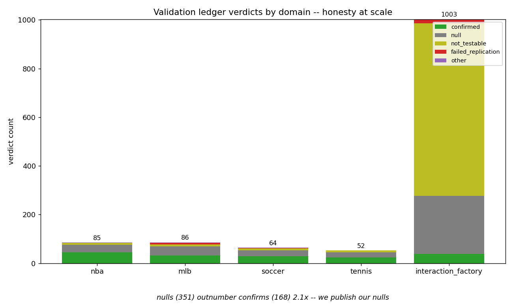
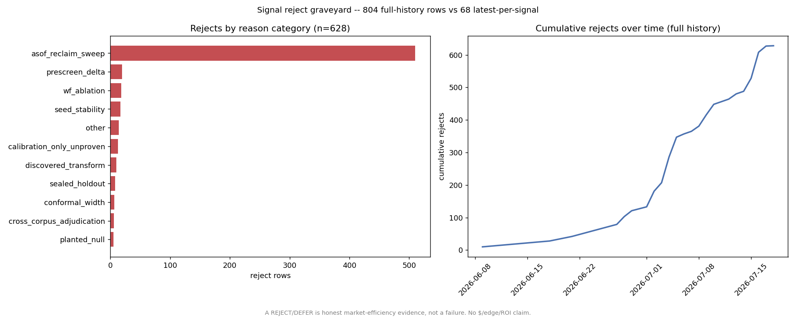

# The Retraction Story -- I built the instruments that refuted my own headline numbers

> The most transparent sports forecaster you can audit -- every prediction pre-registered,
> every number gated, including the ones that refuted me. The single truth-source for any
> figure below is [docs/JOB_EVIDENCE_PACKET.md](../JOB_EVIDENCE_PACKET.md); the retracted
> numbers appear here only inside explicit retraction framing, exactly as the packet handles
> them.

---

## The claim

The same person who built this system also built the instruments that refuted his own
flagship numbers -- and documented the negative results in writing rather than quietly
deleting them. The product is a **calibrated** predictor, not a betting-edge product. The
strongest signal in the repo is not any metric; it is the self-refutation trail.

---

## The story, told concretely

Four headline numbers looked good until my own harnesses took them apart.

**The pregame ROI headline was a market-follow artifact.** An early grader reported a large
positive walk-forward ROI against real closing lines. Reading the grader line-by-line
showed why it was fiction: it chose bet direction from `devig(over_odds, under_odds)` -- the
market's own devigged lean -- and **never read the model** (the eval CSV had no prediction
column). It priced every bet at a flat -110 that real books do not offer, and its filters
were tuned in-sample on the same file. It was betting the market's favorite and calling the
result a model edge. At real odds the model's own number is about -2.00%, i.e.
break-even-minus-vig. (The retracted figure -- `+18.38%` -- is quoted only in
JOB_EVIDENCE_PACKET section 4, as a documented artifact.)

**The end-of-Q3 win-probability number had a Q4 feature leak.** The famous end-of-Q3 Brier
(`0.119`, retracted; see JOB_EVIDENCE_PACKET) was both leak-inflated and mis-sourced: two
features were computed from fourth-quarter data, so the model that predicts Q4 was peeking
at Q4, and the cited source file actually reported a different number. The **honest,
leak-free walk-forward end-of-Q3 Brier is ~0.141** after removing the two Q4-derived
features; a controlled A/B showed the leak inflated it by ~4% relative. This is framed as a
leak I caught in my own pipeline, not as a competitive number.

**A 0.79-vs-0.06 overfit was hard-corrected.** A grid search on the steals/blocks prop
models reported a training R^2 of ~0.79 that collapsed to ~0.06 on a leak-free holdout --
textbook leakage. The corrective regularization is hard-coded so it takes precedence over
the stale tuned parameters, so the mistake cannot silently reappear
(`src/prediction/prop_cv_split.py`).

**The assists edge was retracted 2026-07-21.** The strongest surviving candidate -- an
apparent assists ROI edge -- was regime-dependent (it broke in the playoffs) and is now
superseded. Under the no-edge rail, **no dollar/ROI edge is claimed anywhere.** The
historical measurement remains in the gate artifacts only as a record of the stress-testing
methodology.

The through-line: against real closing lines the market is efficient, the model is
break-even-minus-vig, and every candidate edge -- including my strongest -- was rejected or
retracted by my own gates. That is the honest, correct result for an efficient market, and I
have the harnesses that prove it.

---

## Receipts -- each retraction traced to the artifact that proves it

| Retraction | What was wrong | Proof artifact | Honest replacement |
|---|---|---|---|
| Pregame ROI headline | Grader bet the market's devigged lean, never read the model, flat -110 fiction, in-sample-tuned filters | `gate1_full_analysis.json` (model's own unfiltered number: -2.00%); grader read line-by-line in JOB_EVIDENCE_PACKET s3/s4 | "Roughly break-even-minus-vig vs real closing lines" |
| End-of-Q3 win-prob Brier | Two Q4-derived features leaked; also mis-sourced | Leak-free walk-forward re-run; controlled A/B (~4% relative inflation); JOB_EVIDENCE_PACKET s3 "In-game win-probability Brier" | "Leak-free walk-forward end-of-Q3 Brier ~0.141" |
| Prop-model overfit (STL/BLK) | Leaky grid search: train R^2 ~0.79 vs leak-free holdout ~0.06 | `src/prediction/prop_cv_split.py` (documents the gap; hard-codes corrective regularization) | "Caught and hard-corrected a leakage-driven overfit" |
| Assists ROI edge (retracted 2026-07-21) | Regime-dependent; broke in the playoffs | `gate1_full_analysis.json` (historical record only); JOB_EVIDENCE_PACKET s3 "Betting edge" | No $/ROI edge claimed anywhere |
| In-play ROI / hit-rate ceiling | Graded against an L5 line proxy, not real closes | Retracted figures quoted only in JOB_EVIDENCE_PACKET s4 | "Model-quality ceiling on a soft proxy, never realized edge" |
| Aggregate CLV figure | Circular -- computed on the model-unused, devig-direction corpus | JOB_EVIDENCE_PACKET s4; full-season backtest shows CLV ~= 0 vs real closes | "Real closing-line CLV can't be measured yet; I built the methodology that will" |

The market-efficiency result these retractions leave standing is recorded in
[docs/MARKET_EFFICIENCY_PROOF.md](../MARKET_EFFICIENCY_PROOF.md): the leak-free OOS model
MATCHES the Shin-devigged close within noise on team-strength markets (NBA moneyline Brier
0.1735 vs 0.1672, n=372; MLB moneyline 0.2429 vs 0.2390, n=13,992), and every candidate
signal was REJECTED across >=2 independent corpora.

---

## The honest-rejects trail, visualized

The self-refutation is not confined to the four headline retractions above -- it is the
default outcome across every sport's validation ledger.



*Figure: verdict mix in every sport's validation ledger. Nulls (351) outnumber confirms
(168) by 2.1x across the four domain ledgers (NBA, MLB, soccer, tennis). The
`interaction_factory` ledger is shown as its own bar (1,003 rows, 709 of them
not-testable) rather than folded into that ratio, since it is a different-scale source. The
point of the exhibit is the ratio itself -- the system logs and keeps its honest rejects
instead of hiding them. Data:
[`scripts/platformkit/analytics_showcase/out/honesty_exhibit.json`](../../scripts/platformkit/analytics_showcase/out/honesty_exhibit.json).*



*Figure: the reject ledger over time. 804 total recorded verdict rows in full history resolve
to just 68 distinct (sport, signal) pairs still sitting on a reject-family verdict at their
latest test -- roughly a 12:1 gap, because the same signals are re-tested by repeated
asof-reclaim sweeps (510 of 627 REJECT rows) rather than being 627 distinct dead ideas. The
68 is the honest "how many ideas are actually buried" number; the JSON discloses the gap
explicitly in its `history_vs_latest_disclosure` field. A REJECT is market-efficiency
evidence, not a failure, and no dollar/edge/ROI is claimed. Data:
[`scripts/platformkit/analytics_showcase/out/reject_graveyard.json`](../../scripts/platformkit/analytics_showcase/out/reject_graveyard.json).*

---

## Reproduce on a fresh clone

Fresh-clone reproducibility was fixed 2026-07-20 (commit `eb95e13b8`). Before that,
`verify_production_mae.py` crashed on an 85-vs-129 feature-shape mismatch and
`verify_winprob.py` failed reading an uncommitted cache. Now:

```
# Production-model chronological holdout MAEs (exits nonzero on >0.02 drift)
python scripts/verify_production_mae.py
```

This scores each stat on its `_meta.json` train-time feature list and reproduces the public
lead numbers -- **chronological holdout** (last-20%-by-date, 20,354 player-game rows): PTS
MAE **4.83**, REB 1.92, AST **1.39**, FG3M 0.89, STL 0.71, BLK 0.44, TOV 0.89. (Do not pair
these with the internal walk-forward OOF numbers -- PTS 4.58, BLK 0.515 on ~51K rows/stat --
which are a different, gitignored measurement; label each to its source.)

```
# Market-efficiency scoreboard (recorded canonical table; <60s)
python -m scripts.platformkit.edge_hunt_scoreboard

# Pregame MATCH baselines via the committed fixture (proves the pipeline end-to-end)
python -m scripts.platformkit.beat_the_close_scoreboard --corpus tests/fixtures/proof
```

On a fresh clone the private corpora are absent, so the live re-run prints
`VALIDATION_PENDING` and falls back to the recorded canonical table -- it never fabricates a
number. `verify_winprob.py` falls back to a committed metrics copy when `data/` is absent.

---

## Why this matters to an employer

Anyone can report a number that looks good. The hire signal is the validation rigor that
catches when a good-looking number is wrong -- walk-forward CV with assertion-level leak
guards, truncation-invariance tests, a multi-corpus acceptance gate -- and the discipline to
write down the negative result instead of shipping the hype. I build ambitious systems and
then build the instruments to disprove my own claims. Here is exactly what works, and
exactly what did not survive.

---
<!-- nav-footer -->
**Navigate:** [Up: full doc map](../INDEX.md) - [Home](../../README.md) - [Glossary](../GLOSSARY.md)
