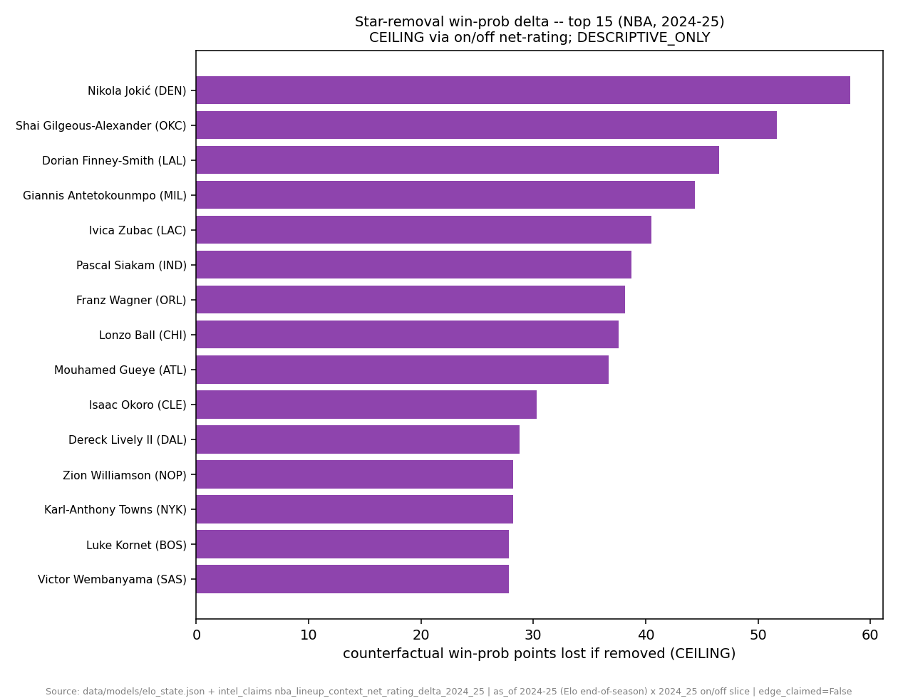
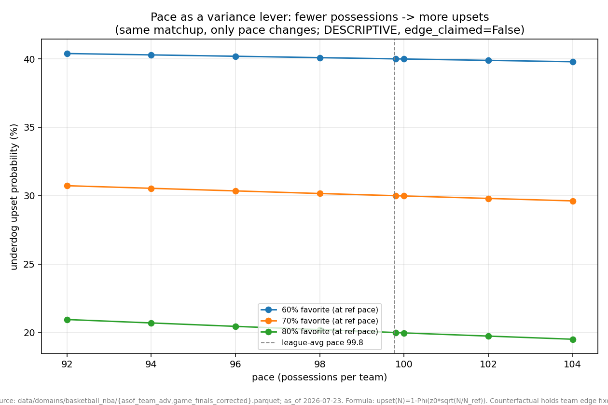
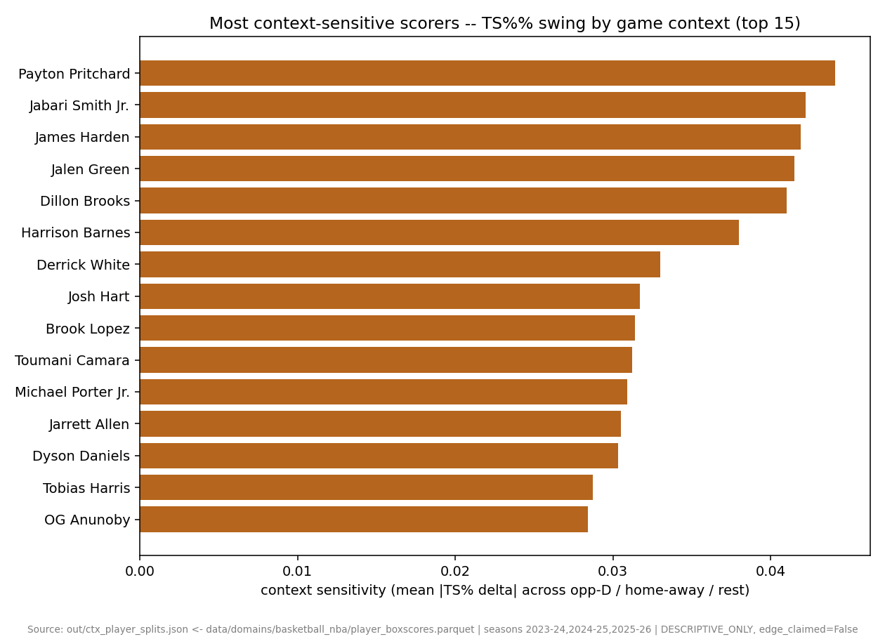
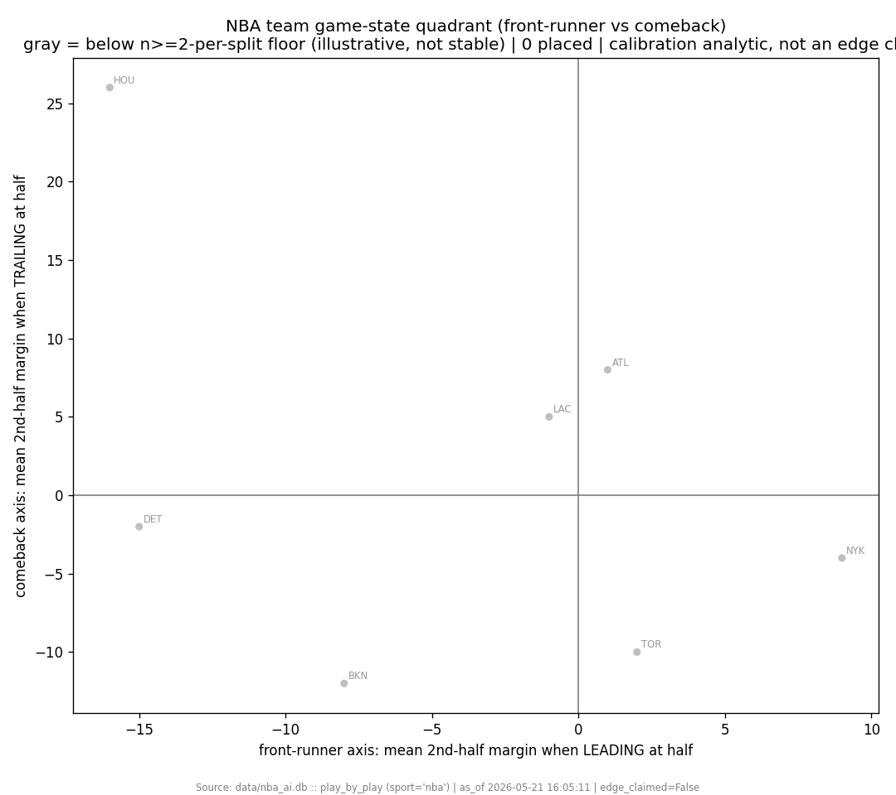
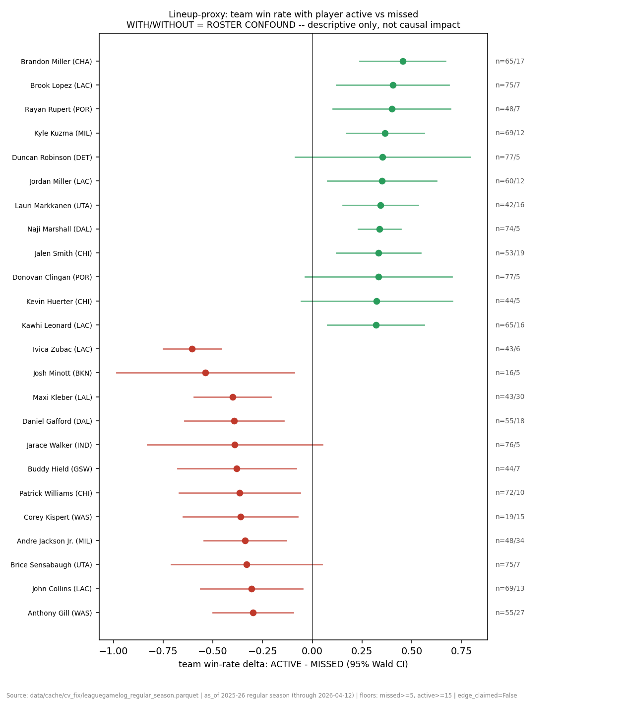
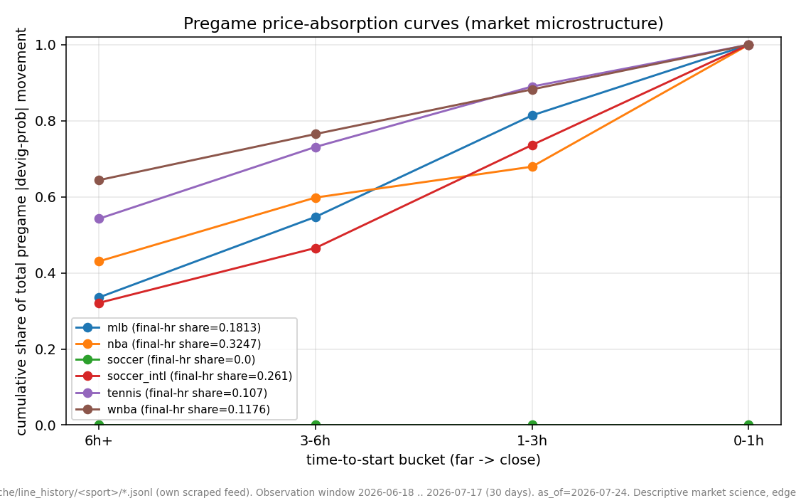
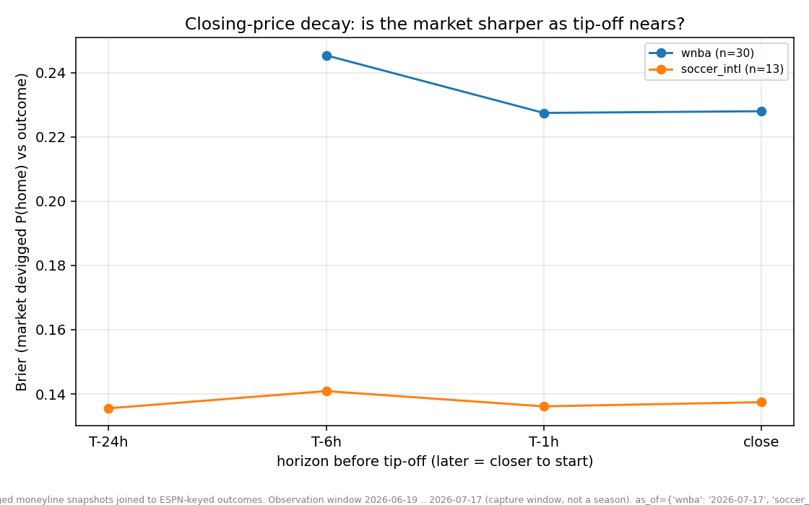
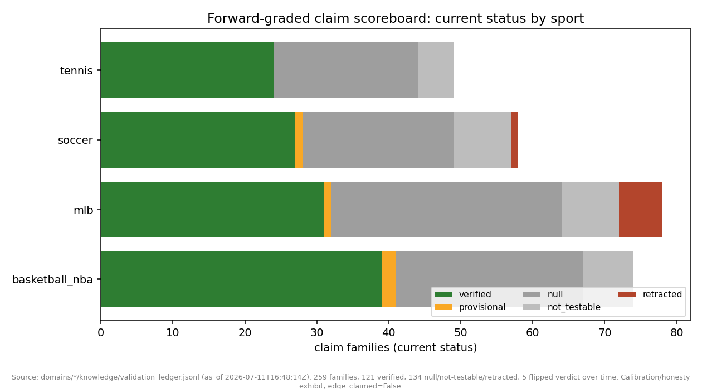
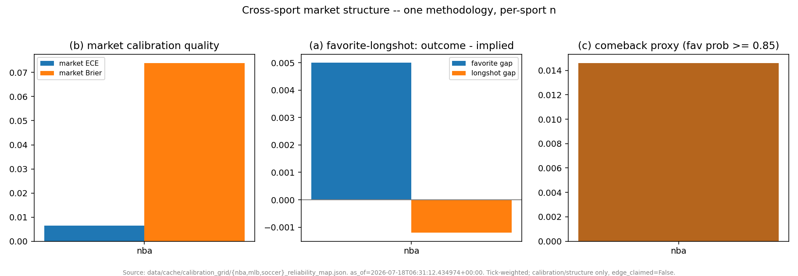
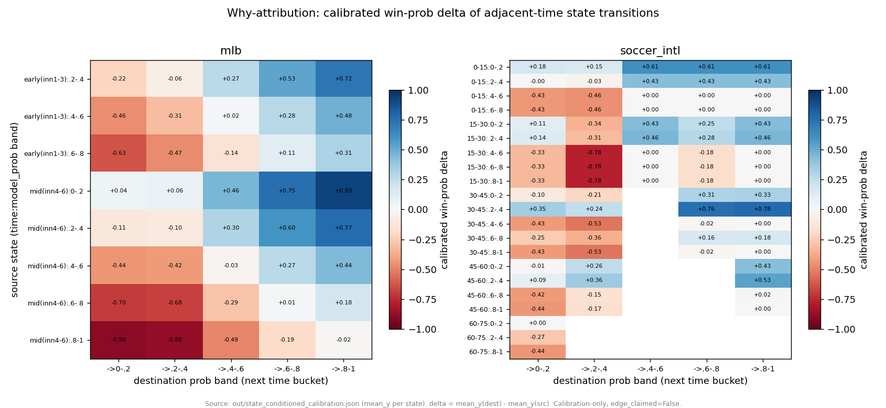

# True intelligence -- counterfactual, context, microstructure, forward-graded, cross-sport

> The other evidence pages ask *how well calibrated are we*. This wave asks the questions a
> scout, a trader, or a skeptic actually asks: **what if** this player were gone, **why** did the
> win-prob move, **when** does the market do its work, **who** grades the graders, and does the
> **same method** survive across four sports. Every number below is copied verbatim from a
> committed `out/*.json` under
> [`scripts/platformkit/analytics_showcase/out/`](../../scripts/platformkit/analytics_showcase/out/);
> every module carries `edge_claimed: false` in its own metadata. Nothing here is a dollar / ROI
> / edge claim -- these are **calibration and intelligence** analytics, and the honest
> `not_buildable` / `underpowered` / roster-confounded verdicts are displayed as prominently as
> the wins, because that is the whole point.

Truth-source for any figure: [docs/JOB_EVIDENCE_PACKET.md](../JOB_EVIDENCE_PACKET.md). Reproduce
the whole wave with `python scripts/platformkit/analytics_showcase/check_all.py` (per-file
`--check`, never the full pytest suite).

---

## 1. Counterfactual -- what if the star were gone?

**How many pregame win-prob points is each team's top player worth?** Take the player's on/off
net-rating, convert it to Elo with a single frozen constant, subtract it from the team's Elo, and
re-price through the repo's own Elo->probability curve against a league-average opponent on a
neutral floor.

Source: [`out/cf_star_removal.json`](../../scripts/platformkit/analytics_showcase/out/cf_star_removal.json)
(`as_of` 2024-25 Elo x 2024_25 on/off slice), from `data/models/elo_state.json` and the
`nba_lineup_context` claim store.

| Team | Player | p(win) with | p(win) without | delta win-prob |
|---|---|---|---|---|
| DEN | Nikola Jokic | 0.634 | 0.0517 | **+0.5822** |
| OKC | Shai Gilgeous-Alexander | 0.7829 | 0.2658 | +0.5171 |
| LAL | Dorian Finney-Smith | 0.6232 | 0.1576 | +0.4656 |

30/30 teams ranked, `no_unmatched`.

> **Honest ceiling (stamped in every row):** on/off net-rating is a **roster-confounded**
> full-lineup on-vs-off swing, *not* controlled for teammates / opponent / coach-trust /
> garbage-time -- so it **overstates** marginal individual value. The net-rating->Elo conversion
> (25.33 Elo per net-rating point) is a **declared frozen constant anchored to HFA, not fit**.
> `label: DESCRIPTIVE_ONLY`, `edge_claimed: false`. This is a CEILING, not a causal or predictive
> claim.

### Counterfactual -- pace as a variance lever

Same *what-if* framing, different knob. Model the final margin as a sum of ~N possessions
(`margin ~ N(N*delta_pp, 2*N*v_pp)`); the favorite's win z-score scales as `sqrt(N)`, so fewer
possessions widen the underdog's tail. Parameterized from real NBA pace + margin data
(`n_ref=99.77` possessions, `margin_std=15.89`, `pace_n=7340`).

Source: [`out/cf_pace_variance.json`](../../scripts/platformkit/analytics_showcase/out/cf_pace_variance.json).

For a 70%-at-reference-pace favorite, upset probability across the real pace range:

| pace | 92.0 | 96.0 | 99.8 (ref) | 102.2 (p95) | 104.0 |
|---|---|---|---|---|---|
| upset prob | 0.3073 | 0.3035 | 0.3000 | ~0.2974 | 0.2962 |

**Pace is a modest lever:** the underdog gains only ~+1.1 points of upset probability moving from
the fast end to the slow end of the league's actual pace range. A discrete-possession Monte Carlo
matched the closed-form within **0.0042** absolute. `edge_claimed: false`; the v_pp anchor
slightly overstates pure within-game per-possession variance (it conflates matchup dispersion) but
cancels in the headline formula.

---

## 2. Context-conditioned -- the same number, split by situation

A player's or team's average is context-blind. These three split it.

### Player TS% by opponent defense / home-away / rest

Top-50 minute players, TS% within each context cell, `context_sensitivity_score` = mean absolute
TS% delta across the three dimensions. 77,744 player-game rows, seasons 2023-24 / 2024-25 /
2025-26. Cells with n<10 marked insufficient and dropped.

Source: [`out/ctx_player_splits.json`](../../scripts/platformkit/analytics_showcase/out/ctx_player_splits.json).

Most context-sensitive scorers: **Payton Pritchard 0.0441**, Jabari Smith Jr. 0.0422, James Harden
0.0419. `label: DESCRIPTIVE_ONLY` -- a split, not a matchup projection.

### Team game-states -- and an honest not_buildable

Front-runner (2nd-half margin when leading at half) vs comeback (2nd-half margin when trailing),
per team.

Source: [`out/ctx_team_states.json`](../../scripts/platformkit/analytics_showcase/out/ctx_team_states.json)
(`data/nba_ai.db :: play_by_play`, n_games=26).

> **not_buildable at the per-team grain:** `0` of 26 teams meet the `n>=2-per-split` floor (games
> both led *and* trailed at half) from this 26-game corpus. Per-team front-runner/comeback
> separation is **masked, not fabricated**.

The league-level statistic *is* buildable, so it becomes the headline: **2nd-half-on-halftime
margin slope = 0.2885** (pearson r=0.2266, n=52 team-games; mean 2H margin +1.346 when leading,
-1.346 when trailing). Slope > 0 means halftime leads **mildly persist** rather than strongly
revert. Descriptive stat, not an edge claim.

### Lineup proxy -- with/without, roster confound declared

Team win rate with a player **active** vs **missed**, inside the player's own tenure window, with
a Wald 95% CI on the difference. RAPM-free.

Source: [`out/ctx_lineup_proxy.json`](../../scripts/platformkit/analytics_showcase/out/ctx_lineup_proxy.json)
(`leaguegamelog_regular_season.parquet`, 2025-26, 408 qualified players).

Top proxy help: **Brandon Miller (CHA) +0.4543** (win rate 0.6308 active / 0.1765 missed, n_active
65 / n_missed 17). Largest proxy drop: Ivica Zubac (LAC) -0.6047 (n_missed only 6). Distribution
mean +0.0087.

> **Roster confound, declared on every row:** WITH/WITHOUT is **not** a causal player-impact
> estimate. Why a player missed is entangled with injury clustering, rest scheduling, blowout
> pulls, and a different replacement lineup -- none controlled for. The CI (Brandon Miller
> +/-0.2159) does **not** exclude a much smaller effect. `DESCRIPTIVE_ONLY`.

---

## 3. Market microstructure -- when does the market do its work?

Built entirely from **our own scraped line history** (`data/cache/line_history/<sport>/*.jsonl`),
not a vendor feed.

### Where pregame movement lands

Per-series consecutive-snapshot |devigged prob| movement, bucketed by minutes-to-tip.

Source: [`out/micro_absorption.json`](../../scripts/platformkit/analytics_showcase/out/micro_absorption.json).

- **NBA final-hour movement share = 0.3247** (n=182,054 move pairs) -- nearly a third of pregame
  price movement lands in the last hour before tip.
- **MLB final-hour share = 0.1813** (n=1,307,128 move pairs).
- **kbo, npb: `insufficient_data`** -- fewer than the MIN_MOVES=20 floor of pregame move pairs.
  Reported as a status, not smoothed over.

`descriptive_only: true`, `edge_claimed: false`. A cadence/dispersion exhibit, not a signal.

### Does the price sharpen toward the close?

Consensus devigged market P(home) scored (Brier / log-loss) at T-24h / T-6h / T-1h / close.

Source: [`out/micro_closing_decay.json`](../../scripts/platformkit/analytics_showcase/out/micro_closing_decay.json).

- **WNBA paired comparison:** Brier T-6h **0.2356** -> close **0.2347** (delta=**+0.0009**, n=25 shared games).
- **soccer_intl: paired comparison is UNDERPOWERED:** Brier T-24h **0.1355** -> close **0.1568** (delta=**-0.0213**, n=7 shared games).
- **nba / mlb / soccer / tennis / kbo / npb: `not_joinable`** -- no line_history <-> settled-outcome
  join available in this capture. Stated per sport with a reason, never guessed.

Single capture window -- provisional, not durable.

---

## 4. Forward-graded -- who grades the graders?

The post-publication track record of **every claim family** (sport x hypothesis) across the four
validation ledgers: verdict history over time, current status, and whether a family ever flipped.

Source: [`out/fwd_claim_scoreboard.json`](../../scripts/platformkit/analytics_showcase/out/fwd_claim_scoreboard.json)
(259 families, 287 ledger rows, `as_of` 2026-07-11).

| status | count |
|---|---|
| verified | 121 |
| null | 99 |
| not_testable | 28 |
| retracted | 7 |
| provisional | 4 |

**121 verified vs 134 null-or-worse.** The honest **nulls-per-confirm ratio = 1.107** -- the
system produces *more* nulls, not-testables, and retractions than confirms, and keeps every one of
them in the ledger. **5 families flipped verdict** over their history and are flagged as such.

> The product **is** the self-grading. From the artifact's own `story` field: *"a system that only
> ever confirmed would not be credible."* Per-sport the nulls are distributed too -- e.g. MLB
> carries 32 null and 6 retracted alongside 31 verified.

---

## 5. Cross-sport -- one method, four sports, honest n

Two analytics apply a **single methodology across sports** and let the per-sport sample size
decide what survives.

### Structure map (favorite-longshot gap, market ECE, comeback rate)

Source: [`out/xsport_structure.json`](../../scripts/platformkit/analytics_showcase/out/xsport_structure.json)
(per-bucket floor n_games>=30, tick-weighted).

| sport | status | n_games | market ECE | fav gap | dog gap | comeback rate |
|---|---|---|---|---|---|---|
| NBA | ok | 1593 | 0.0064 | +0.005 | -0.0012 | 0.0146 |
| MLB | **not_buildable** | -- | -- | -- | -- | -- |
| soccer | **not_buildable** | -- | -- | -- | -- | -- |
| tennis | **not_buildable** | -- | -- | -- | -- | -- |

**Only NBA clears the floor:** market ECE=0.0064 over 1,593 games, favorite-longshot-consistent
(favorites realize +0.005 above implied, longshots -0.001). MLB and soccer had **no bucket** with
`market_mean_prob` and `n_games>=30`; tennis has **no reliability map** on disk. All three are
returned `not_buildable` with a reason -- never guessed.

### Why-attribution (in-game move decomposition)

Every in-game win-prob move decomposes into the adjacent-time state transition it crossed
(calibrated win-prob delta = mean_y(dest) - mean_y(src), buckets with n>=30).

Source: [`out/why_attribution.json`](../../scripts/platformkit/analytics_showcase/out/why_attribution.json).

- Buckets exist for **mlb** and **soccer_intl** only; **NBA is skipped** (no qualifying
  transitions in the source `state_conditioned_calibration.json`).
- Largest calibrated drop: **soccer_intl** 15-30min `.4-.6` -> 30-45min `.2-.4` = **-0.7683**
  (min support n=120). Its mirror is the largest gain (+0.7683).

A decomposition of moves that **already happened**, not a predictor. `edge_claimed: false`.

---

## Declared floors and honest verdicts (read this section first if you read nothing else)

Every module in this wave declares its sample floors up front and reports what falls below them,
rather than smoothing it away:

| Module | Declared floor | What the floor caught |
|---|---|---|
| `ctx_team_states` | n>=2 per led/trailed split | **0/26 teams buildable** at per-team grain -> fell back to league slope 0.2885 |
| `xsport_structure` | per-bucket n_games>=30 | **MLB / soccer / tennis all not_buildable**; only NBA (n=1593) survived |
| `micro_closing_decay` | per-bucket n>=20; join required | **6 of 7 sports not_joinable**; soccer_intl UNDERPOWERED (n=13); only WNBA (n=30) usable |
| `micro_absorption` | MIN_MOVES=20 pregame pairs | **kbo / npb insufficient_data** |
| `why_attribution` | bucket n>=30 | **NBA skipped**; only mlb + soccer_intl have buckets |
| `ctx_player_splits` | cell n>=10 player-games | sub-floor cells dropped; players with <2 usable dims scored null |
| `ctx_lineup_proxy` | min_active / min_missed | roster confound declared per row; CIs published (Brandon Miller +/-0.2159) |
| `cf_star_removal` | source pre-floored (min_on>=500, n_games>=30) | CEILING label + roster-confound caveat on every row |
| `cf_pace_variance` | real-data params; MC cross-check | v_pp anchor overstatement disclosed; MC matched formula within 0.0042 |
| `fwd_claim_scoreboard` | ledger status = last entry | 134 null-or-worse vs 121 verified kept in the open; 5 flips flagged |

**Honesty rail (applies to every number on this page):** all prediction figures are calibration /
sharpness (Brier / ECE / TS% / win-prob delta), never a dollar edge. Retracted measurement
artifacts appear only inside [JOB_EVIDENCE_PACKET.md](../JOB_EVIDENCE_PACKET.md), never as a live
result here. Accuracy is not edge; the market is efficient; we match or honestly trail the close.

---
<!-- nav-footer -->
**Navigate:** [Up: full doc map](../INDEX.md) - [Home](../../README.md) - [Glossary](../GLOSSARY.md) - [Evidence hub](README.md)
